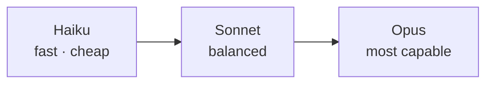

<LevelBadge level="beginner" />

Anthropic offers a family of models at different capability/cost/speed points. Choosing well is mostly about matching the model to the job — and not overpaying for capability you don't need.

## The current models

<ModelTable />

## Try it: which model fits?

Answer three questions and get a starting recommendation:

<ModelPicker />

## The mental model: a capability ladder

- **Start with Sonnet.** It's the default workhorse — strong reasoning and coding at a sensible cost. Most tasks should begin here.
- **Move up to Opus** only when Sonnet struggles and quality matters more than cost (hard reasoning, tricky agents, gnarly code).
- **Drop to Haiku** for high-volume, latency-sensitive, or simple work (classification, extraction, routing, cheap sub-agents).

## How to actually choose

1. **Default to Sonnet** and ship.
2. **Hitting a quality ceiling?** Try Opus on the hard subset only.
3. **Cost or latency hurting?** See if Haiku is good enough for that step.
4. **Mix models.** Use Haiku for cheap pre/post-processing and Sonnet/Opus for the hard core. This "model tiering" is one of the biggest cost levers — see [Cost & Latency](/docs/foundations/cost-and-latency).

:::tip Don't pick from benchmarks alone
Public benchmarks are a starting hint, not a verdict for *your* task. Run a tiny [eval](/docs/foundations/evals) on a handful of your real inputs across two models — it takes minutes and beats guessing.
:::

## Looking up the exact model ID

Always pass the current API model ID (e.g. in your `messages.create` call). Get it from the [models table above](/docs/whats-new/models-and-pricing) or the official models page — and prefer reading it from config over hard-coding it in many places, so model upgrades are a one-line change.

## Next

- [Tokens, Context & Pricing](/docs/api/tokens-and-pricing)
- [Your First API Call](/docs/api/first-call)
- [Current Models & Pricing](/docs/whats-new/models-and-pricing)
