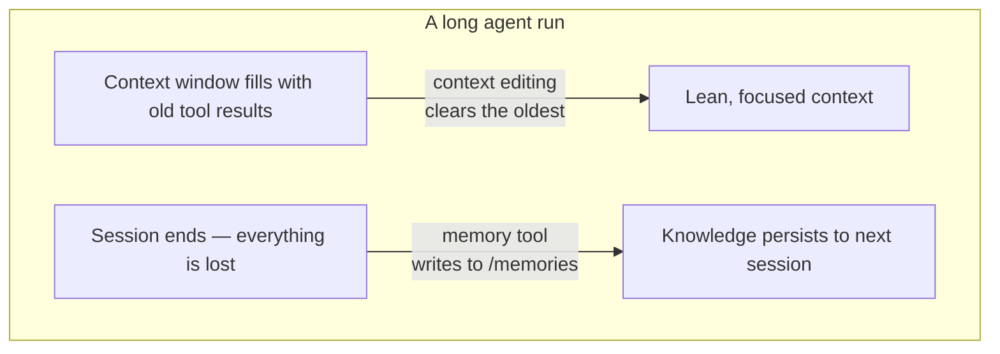

import Tabs from '@theme/Tabs';
import TabItem from '@theme/TabItem';

<LevelBadge level="advanced" />

<VerifyNote lastVerified="2026-06-26" source="https://platform.claude.com/docs/en/agents-and-tools/tool-use/memory-tool">
Both features are in beta. Tool type strings, beta header, defaults, and reported benchmark gains change — confirm in the official memory-tool and context-editing docs before building on them.
</VerifyNote>

A long-running agent has two enemies: it **forgets** what it learned the moment the conversation ends, and its context window **fills up** with stale tool output until it overflows. Anthropic ships one primitive for each — the **memory tool** (persistence) and **context editing** (pruning) — and they are designed to be used together.

<Callout type="objectives" items={["What the memory tool is — a client-side file store at /memories that you implement, not Anthropic", "The six commands your handler must answer: view, create, str_replace, insert, delete, rename", "Why path-traversal validation is non-negotiable when you wire it up", "How context editing auto-clears old tool results once the context crosses a token threshold", "How to combine both under one beta header, and the gotchas with caching and ordering"]} />

## Two problems, two tools



Keep the two ideas separate in your head:

- **Memory tool** = *persistence across sessions*. Claude reads and writes files; **you** store them.
- **Context editing** = *pruning within a session*. The API drops stale tool results from the prompt before it reaches Claude.

This page pairs with [Prompt Caching](/docs/api/prompt-caching) and the [token economy](/docs/power-user/token-economy) for the cost side, and with [Context Engineering](/docs/frontiers/context-engineering) and [long-running agent harnesses](/docs/frontiers/long-running-agent-harnesses) for the *why*.

<Flashcards title="Memory & context vocabulary" cards={[{front:"Memory tool","back":"A client-side tool (type memory_20250818) that lets Claude create/read/update/delete files in a /memories directory. You implement the storage backend."},{front:"/memories","back":"The single directory all memory operations are confined to. Every path must be validated to stay inside it."},{front:"Context editing","back":"A server-side strategy that clears old tool results from the prompt once a token threshold is crossed — the full history still lives on your client."},{front:"clear_tool_uses_20250919","back":"The context-editing strategy that removes the oldest tool results, replacing them with a placeholder so Claude knows they were pruned."},{front:"Compaction","back":"A separate server-side feature that summarizes the whole conversation near the context limit — complementary to client-side context editing."}]} />

## The memory tool is a tool *you* implement

This trips people up: enabling the memory tool does **not** give you Anthropic-hosted storage. It is a **client-side** tool. Claude emits tool calls like `view` or `create`; your application executes them against whatever backend you choose — local files, a database, encrypted blobs, cloud storage — and returns the result. You own where the bytes live (which is also why it is [Zero-Data-Retention](/docs/foundations/privacy)-eligible).

When the tool is enabled, Anthropic injects a system instruction telling Claude to **check its memory directory before doing anything else**, and to record progress as it works so nothing is lost if the context resets.

### Step 1 — enable the tool

Add the tool to your request. The type string is the dated version `memory_20250818`.

<Tabs groupId="lang">
<TabItem value="python" label="Python">

```python
import anthropic

client = anthropic.Anthropic()

message = client.messages.create(
    model="claude-opus-4-8",
    max_tokens=2048,
    messages=[{"role": "user", "content": "Help me respond to this support ticket."}],
    tools=[{"type": "memory_20250818", "name": "memory"}],
)

print(message)
```

</TabItem>
<TabItem value="typescript" label="TypeScript">

```typescript
import Anthropic from "@anthropic-ai/sdk";

const anthropic = new Anthropic();

const message = await anthropic.messages.create({
  model: "claude-opus-4-8",
  max_tokens: 2048,
  messages: [{ role: "user", content: "Help me respond to this support ticket." }],
  tools: [{ type: "memory_20250818", name: "memory" }],
});

console.log(message);
```

</TabItem>
</Tabs>

The official SDKs ship memory helpers so you don't hand-roll the tool interface — subclass `BetaAbstractMemoryTool` (Python, C#), use `betaMemoryTool` (TypeScript), or implement `BetaMemoryToolHandler` (Java). They hand you a clean hook where you plug in your storage.

### Step 2 — answer the six commands

Your handler must implement these. The strings Claude expects back are specific — match them so the model interprets results correctly.

<Steps items={[{title: "view", body: "List a directory (files up to 2 levels deep, with human-readable sizes) or return a file's contents with 1-indexed line numbers. Optional view_range to read a slice."},{title: "create", body: "Write a new file from file_text. Error if it already exists rather than silently overwriting."},{title: "str_replace", body: "Replace an exact old_str with new_str. Refuse if old_str is missing, or appears more than once (ambiguous) — report the line numbers."},{title: "insert", body: "Insert insert_text at insert_line. Validate the line is within [0, n_lines]."},{title: "delete", body: "Remove a file, or a directory and its contents recursively."},{title: "rename", body: "Move/rename a path. Refuse if the destination already exists — never clobber."}]} />

A real `view` of the directory returns something like this — note the literal header and tab-separated sizes, which the model is trained to parse:

```text
Here're the files and directories up to 2 levels deep in /memories, excluding hidden items and node_modules:
4.0K	/memories
1.5K	/memories/customer_service_guidelines.xml
2.0K	/memories/refund_policies.xml
```

### Step 3 — lock down paths (do not skip this)

The memory tool lets a model emit arbitrary path strings. A poisoned conversation or prompt-injection payload can try to escape `/memories` and read or clobber files elsewhere on your box. Treat every incoming path as hostile.

<Callout type="warning" items={["Reject any path that does not resolve to inside /memories.","Canonicalize before checking — in Python, Path(p).resolve() then verify .relative_to(memories_root) does not raise.","Block ../, ..\\, and URL-encoded traversal like %2e%2e%2f.","Cap file sizes and read length so a runaway agent can't exhaust disk or blow up the next prompt."]} />

This validator is the whole ballgame — pin it and test it before anything else ships:

<PromptCard title="Path-traversal guard (Python)">{`from pathlib import Path

MEMORY_ROOT = Path("/srv/agent/memories").resolve()

def safe_path(requested: str) -> Path:
    # Map the model's /memories/... onto your real root, then prove containment.
    rel = requested.removeprefix("/memories").lstrip("/")
    candidate = (MEMORY_ROOT / rel).resolve()
    candidate.relative_to(MEMORY_ROOT)  # raises ValueError if it escaped
    return candidate`}</PromptCard>

## Context editing keeps the window from overflowing

Memory solves *forgetting*. The opposite problem — a context window stuffed with old `tool_result` blocks from 40 web searches ago — is what **context editing** solves. Once the prompt crosses a token threshold, the API clears the **oldest** tool results (replacing them with a short placeholder so Claude knows they were removed) before the prompt is sent to the model. Your client keeps the full, unedited history; only what reaches the model is trimmed.

It rides on a beta header:

```text
anthropic-beta: context-management-2025-06-27
```

You configure it with a `context_management.edits` array. The main strategy is `clear_tool_uses_20250919`:

<Tabs groupId="lang">
<TabItem value="python" label="Python">

```python
message = client.beta.messages.create(
    model="claude-opus-4-8",
    max_tokens=2048,
    betas=["context-management-2025-06-27"],
    messages=[...],
    tools=[{"type": "memory_20250818", "name": "memory"}],
    context_management={
        "edits": [
            {
                "type": "clear_tool_uses_20250919",
                "trigger": {"type": "input_tokens", "value": 30000},  # start clearing past 30k
                "keep": {"type": "tool_uses", "value": 3},            # always keep the last 3
                "clear_at_least": {"type": "input_tokens", "value": 5000},
                "exclude_tools": ["memory"],                          # never clear memory calls
                "clear_tool_inputs": False,                           # keep the call args, drop results
            }
        ]
    },
)
```

</TabItem>
<TabItem value="typescript" label="TypeScript">

```typescript
const message = await anthropic.beta.messages.create({
  model: "claude-opus-4-8",
  max_tokens: 2048,
  betas: ["context-management-2025-06-27"],
  messages: [...],
  tools: [{ type: "memory_20250818", name: "memory" }],
  context_management: {
    edits: [
      {
        type: "clear_tool_uses_20250919",
        trigger: { type: "input_tokens", value: 30000 },
        keep: { type: "tool_uses", value: 3 },
        clear_at_least: { type: "input_tokens", value: 5000 },
        exclude_tools: ["memory"],
        clear_tool_inputs: false,
      },
    ],
  },
});
```

</TabItem>
</Tabs>

What the knobs mean:

| Parameter | Default | What it controls |
|-----------|---------|------------------|
| `trigger` | 100,000 input tokens | When clearing kicks in |
| `keep` | 3 tool uses | How many recent tool use/result pairs are always preserved |
| `clear_at_least` | none | Minimum tokens freed per activation — use it so a cache invalidation is actually worth it |
| `exclude_tools` | none | Tools never cleared (e.g. `memory`, `web_search`) |
| `clear_tool_inputs` | `false` | Whether to also drop the tool *call args*, not just the result |

The response tells you what it did, under `context_management.applied_edits` — e.g. `cleared_tool_uses` and `cleared_input_tokens` — so you can log how much was reclaimed.

There is a sibling strategy, `clear_thinking_20251015`, that prunes old [extended-thinking](/docs/api/thinking-and-effort) blocks. If you use both, **list `clear_thinking_20251015` first** in the `edits` array.

<Callout type="tip" items={["Clearing tool results invalidates any prompt-cache prefix at the clear point — pair it with clear_at_least so you only pay that invalidation when you're freeing a meaningful chunk.","exclude_tools: [\"memory\"] is the usual move: you want the agent's own notes to persist, not get swept away with stale search results.","Context editing (client-side trim) and compaction (server-side summarization) are different features — for very long runs you can layer both."]} />

## Why pair them — the numbers

Used together, the two features let an agent run far past a single context window: context editing keeps the live window lean, and whatever matters gets written to memory before it would be cleared. Anthropic reports that combining memory with context editing gave a **39% improvement** on an agentic-search evaluation, and that context editing alone cut token use by **84%** in a 100-turn web-search test.

<VerifyNote lastVerified="2026-06-26" source="https://www.anthropic.com/news/context-management">
These percentages are Anthropic's own benchmark figures and reflect specific eval setups — treat them as directional, not guarantees for your workload. Confirm in the context-management announcement.
</VerifyNote>

## A pattern that works: the multi-session project log

The cleanest use of memory is bootstrapping it deliberately instead of writing files ad hoc:

<Steps items={[{title: "Initializer session", body: "Before any real work, write a progress log, a feature checklist, and a note pointing to any startup script the project needs."},{title: "Each later session opens by reading those files", body: "It recovers full project state in seconds — no need to re-explore the codebase or retrace decisions."},{title: "Each session closes by updating the log", body: "Record what got done and what's next, so the next session has an accurate starting point."},{title: "One feature at a time, verified", body: "Only mark a feature complete after end-to-end verification — not just after the code is written — so the log stays trustworthy."}]} />

## Test your understanding

<Quiz questions={[{q:"Where does memory-tool data actually get stored?",options:["On Anthropic's servers, managed for you","In your own infrastructure — the tool is client-side and you implement the backend","In the model's weights","In the prompt cache"],answer:1,explain:"The memory tool is client-side. Claude emits tool calls; your app executes them against storage you control, confined to /memories."},{q:"What does context editing's clear_tool_uses_20250919 strategy remove?",options:["The system prompt","The most recent tool results","The oldest tool results once a token threshold is crossed","All user messages"],answer:2,explain:"It clears the oldest tool results first, after the trigger threshold, while keeping the most recent ones (default: last 3) and leaving the full history on your client."},{q:"Why must you validate every path the memory tool receives?",options:["To save disk space","To prevent directory-traversal escapes out of /memories via inputs like ../","To speed up the model","Because Anthropic rejects long paths"],answer:1,explain:"A malicious or injected path could try to read or overwrite files outside /memories. Canonicalize the path and prove it stays inside the memory root before acting."}]} />

## Sources & further reading

- [Memory tool — Claude API docs](https://platform.claude.com/docs/en/agents-and-tools/tool-use/memory-tool) — tool type `memory_20250818`, the six commands, and security guidance.
- [Context editing — Claude API docs](https://platform.claude.com/docs/en/build-with-claude/context-editing) — the `context-management-2025-06-27` beta, strategy fields, and defaults.
- [Managing context on the Claude Developer Platform](https://www.anthropic.com/news/context-management) — the announcement with the 39% / 84% benchmark figures.
- [Effective context engineering for AI agents](https://www.anthropic.com/engineering/effective-context-engineering-for-ai-agents) — the just-in-time retrieval pattern memory is built for.
- [Effective harnesses for long-running agents](https://www.anthropic.com/engineering/effective-harnesses-for-long-running-agents) — the multi-session project-log case study.
- Related on AILmanac: [Context Engineering](/docs/frontiers/context-engineering) · [Long-running agent harnesses](/docs/frontiers/long-running-agent-harnesses) · [Prompt Caching](/docs/api/prompt-caching) · [Tool Use](/docs/api/tool-use)
