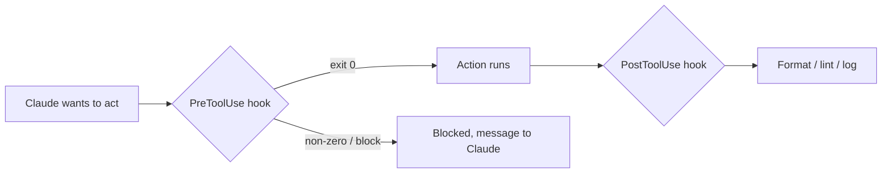

<LevelBadge level="advanced" />

<VerifyNote lastVerified="2026-06-23" source="https://code.claude.com/docs/en/hooks">
The exact hook event names, the stdin payload, and the blocking protocol evolve — confirm against the official hooks docs before relying on a specific event or field.
</VerifyNote>

Hooks are **shell commands Claude Code runs automatically** at defined points in its lifecycle. Where [permissions](/docs/claude-code/permissions) decide *whether* an action is allowed, hooks let *you* run deterministic logic around it — formatting, validation, logging, gates. They're how you make behaviour guaranteed instead of "please remember to."

<Callout type="objectives" items={["When to reach for a hook instead of an instruction or a permission", "How a hook is wired up: event, matcher, and the JSON payload on stdin", "The two ways a hook blocks an action — exit code 2 vs JSON on stdout", "The good practices and common mistakes that separate fast, safe hooks from sluggish, silent ones"]} />

## When to reach for a hook

Reach for a hook when you want a behaviour to be *guaranteed*, not merely requested. Each common job maps to a lifecycle event:

- **Auto-format / lint** after every file edit (`PostToolUse`).
- **Block** an action that violates a rule before it runs (`PreToolUse`).
- **Notify or log** when a session ends or a task finishes (`Stop`).
- **Inject context** at session start.

<Flashcards title="Hook events at a glance" cards={[{front: "PreToolUse", back: "Fires before an action runs. Use it to block or gate — e.g. refuse a destructive command before it executes."}, {front: "PostToolUse", back: "Fires after a matching action. Use it to format, lint, or log what just changed."}, {front: "Stop", back: "Fires when a session ends or a task finishes. Use it to notify or log."}, {front: "Session start", back: "Fires at the beginning of a session. Use it to inject context."}]} />

## How they work

You register hooks in [`settings.json`](/docs/claude-code/settings), matching an **event** (and often a tool matcher). When the event fires, Claude runs your command, passing a **JSON payload on stdin** (the tool name, its inputs, the session). Your command's exit code and output decide what happens next.

<Steps items={[{title: "Match an event", body: "Register the hook in settings.json under the lifecycle event you care about — for example PostToolUse."}, {title: "Narrow with a matcher", body: "Add a tool matcher so the hook only fires on relevant tools, e.g. matcher \"Edit|Write\" for file edits."}, {title: "Read the payload from stdin", body: "When the event fires, Claude runs your command and pipes a JSON payload on stdin — the tool name, its inputs, the session."}, {title: "Decide what happens next", body: "Your command's exit code and output determine the outcome: let the action proceed, run your logic, or block it."}]} />

```json
{
  "hooks": {
    "PostToolUse": [
      {
        "matcher": "Edit|Write",
        "hooks": [
          { "type": "command", "command": "jq -r '.tool_input.file_path' | xargs npx prettier --write" }
        ]
      }
    ]
  }
}
```

The hook above reads the edited file's path out of the stdin JSON (`.tool_input.file_path`) and formats it. Don't assume an env var holds the path — **read it from stdin.** Useful path placeholders like `${CLAUDE_PROJECT_DIR}` *are* available for locating scripts.

## How a hook blocks

Two ways, depending on the event:

- **Exit code 2** — the hook fails the action and whatever it wrote to **stderr** becomes the message Claude sees. Simple and works for command hooks.
- **JSON on stdout (exit 0)** — return a structured decision. For `PreToolUse`, that's a `permissionDecision` of `deny`; for `PostToolUse`/`Stop`/etc. it's `{"decision": "block", "reason": "…"}`.

The script below is a `PreToolUse` hook on the Bash tool. Read it top to bottom: it pulls the command out of stdin, and if it looks destructive, writes a reason to stderr and exits 2 to block.

```bash
#!/usr/bin/env bash
# PreToolUse hook on the Bash tool: refuse to delete things.
command=$(jq -r '.tool_input.command' < /dev/stdin)
if [[ "$command" == rm\ * || "$command" == *"rm -rf"* ]]; then
  echo "Blocked: destructive 'rm' is not allowed by policy." >&2
  exit 2
fi
exit 0
```

## The mental model

A `PreToolUse` hook runs *before* the action and can block it; a `PostToolUse` hook runs *after* it succeeds and reacts to the result.



## Good practices

- **Keep hooks fast and idempotent** — they run a lot.
- **Fail loud on real problems**, but don't block on cosmetic issues.
- **Treat hook output as feedback to Claude** — a clear message helps it self-correct.
- Hooks run with your shell's privileges — review any hook you didn't write ([Reviewing Third-Party Code](/docs/security/reviewing-third-party-code)).

## Common mistakes

- **Reading the file path from an env var.** The path lives in the stdin JSON (`.tool_input.file_path`), not in `$CLAUDE_FILE_PATH`. Pipe stdin through `jq`.
- **Silent blocks.** If a `PreToolUse` hook exits 2 with nothing on stderr, Claude is blocked but doesn't know *why* and can't adapt. Always write a clear reason.
- **Slow hooks.** A `PostToolUse` hook runs after *every* matching edit. A 3-second linter makes the whole session feel sluggish — keep hooks fast and, ideally, only act on what changed.
- **Over-broad matchers.** `matcher: ".*"` fires on every tool. Narrow with an exact name, an `Edit|Write` list, or the per-handler `if` field (e.g. `"if": "Bash(git push *)"`).
- **Trusting hooks you didn't write.** A hook runs arbitrary shell with your privileges. Review any hook from a plugin or template first — see [Reviewing Third-Party Code](/docs/security/reviewing-third-party-code).

<Callout type="warning" items={["A hook runs arbitrary shell with your privileges — never wire up a hook from a plugin or template without reading it first."]} />

Copy-paste starters are in [Hooks & settings.json Recipes](/docs/templates/hooks-settings).

<PromptCard title="Auto-format edited files (PostToolUse on Edit|Write)">{`{
  "hooks": {
    "PostToolUse": [
      {
        "matcher": "Edit|Write",
        "hooks": [
          { "type": "command", "command": "jq -r '.tool_input.file_path' | xargs npx prettier --write" }
        ]
      }
    ]
  }
}`}</PromptCard>

<Quiz title="Check yourself" questions={[{q: "Where does a hook find the path of the file that was just edited?", options: ["In the $CLAUDE_FILE_PATH environment variable", "In the JSON payload on stdin, at .tool_input.file_path", "In a command-line argument passed by Claude"], answer: 1, explain: "The path lives in the stdin JSON (.tool_input.file_path), not in an env var. Pipe stdin through jq to read it."}, {q: "A PreToolUse hook exits with code 2. What happens?", options: ["The action is allowed and stdout is logged", "The action is blocked, and whatever the hook wrote to stderr becomes the message Claude sees", "Claude ignores the result because exit 2 is reserved"], answer: 1, explain: "Exit code 2 fails the action; stderr becomes the message Claude sees. Always write a clear reason so Claude can adapt."}, {q: "Why is matcher \".*\" considered a common mistake?", options: ["It is invalid JSON and breaks settings.json", "It fires on every tool, so the hook runs far more than intended — narrow it with an exact name, an Edit|Write list, or the if field", "It only matches the Bash tool"], answer: 1, explain: "An over-broad matcher fires on every tool. Narrow it to keep hooks fast and targeted."}]} />

<Callout type="takeaways" items={["Hooks make behaviour guaranteed, not requested — they run deterministic logic around actions that permissions only allow or deny.", "Register a hook in settings.json against an event plus a matcher; Claude pipes a JSON payload on stdin and reads your exit code and output.", "Read the file path from stdin (.tool_input.file_path) — not from an env var.", "Block with exit code 2 (stderr becomes the message) or with structured JSON on stdout (exit 0); always include a clear reason.", "Keep hooks fast, idempotent, and narrowly matched — and review any hook you didn't write, since it runs with your shell's privileges."]} />

## Next

- [settings.json](/docs/claude-code/settings) · [Permissions](/docs/claude-code/permissions)
- [Skills](/docs/claude-code/skills) — expertise vs automation
- [Hardening Autonomous Runs](/docs/security/hardening-autonomous-runs)
