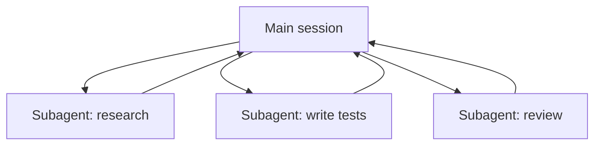

<LevelBadge level="advanced" />

<VerifyNote lastVerified="2026-06-23" source="https://code.claude.com/docs/en/sub-agents">
Subagent frontmatter fields, the built-in agent roster, and the `/agents` interface change over time — confirm in the official docs.
</VerifyNote>

<Callout type="objectives" items={["What a subagent is — a separate Claude with its own context window and a scoped toolset","The three reasons to delegate: protect context, specialize, and parallelize","The built-in agents Claude already delegates to: Explore, Plan, General-purpose","How to define your own subagent in .claude/agents/ and why description + tools are the two load-bearing fields","When NOT to parallelize, and how this connects to API agents and fleet-scale workflows"]} />

A **subagent** is a separate Claude instance with its **own context window** and a **scoped set of tools**, that your main session delegates a chunk of work to. It reports back a result, not its whole transcript — so the main session stays focused and uncluttered.

## Why delegate

Three jobs, one tool. Keep these in mind every time you reach for a subagent:

- **Protect the main context.** A research dive or a big file sweep can burn thousands of tokens; do it in a subagent and only the conclusion returns.
- **Specialize.** Give a subagent a tailored system prompt and only the tools it needs (e.g. a read-only reviewer).
- **Parallelize.** Run independent subtasks at once — e.g. explore three modules simultaneously.

## The built-ins you already have

Before you define your own, know that Claude Code ships with subagents it delegates to automatically:

| Built-in | What it does |
| --- | --- |
| **Explore** | A fast, read-only agent (runs on a cheaper model) for searching and understanding a codebase without touching it. |
| **Plan** | Gathers context during plan mode so research stays out of the main, read-only conversation. |
| **General-purpose** | A full-tool agent for complex, multi-step work that mixes exploration and changes. |

You rarely invoke these by name; Claude reaches for them when a task fits. Custom subagents are for the workers *you* keep re-creating with the same instructions.

## Defining your own

A subagent is a Markdown file with YAML frontmatter (the body becomes its system prompt). Only `name` and `description` are required; everything else is optional. Store it per-project in `.claude/agents/` (check it into git so the team shares it) or per-user in `~/.claude/agents/`. Create one with the `/agents` command or by hand.

<Steps items={[{title: "Pick a location", body: "Per-project in .claude/agents/ (commit it so the team shares it) or per-user in ~/.claude/agents/."},{title: "Create the file", body: "Use the /agents command, or write a Markdown file with YAML frontmatter by hand."},{title: "Set the required fields", body: "Only name and description are required. Everything else is optional."},{title: "Write the body as the system prompt", body: "The Markdown body below the frontmatter becomes the subagent's system prompt."},{title: "Scope the tools", body: "Add a tools allowlist so the subagent can only do what its job requires."}]} />

A starter `code-reviewer` subagent:

<PromptCard title="code-reviewer subagent (.claude/agents/code-reviewer.md)">{`---
name: code-reviewer
description: Expert code reviewer. Use proactively after code changes.
tools: Read, Glob, Grep
model: sonnet
---

You are a senior reviewer. Read the changed files, then report only
high-confidence issues: correctness bugs, security risks, and missing
tests. For each, show the file:line, the problem, and a concrete fix.
Do not restate what the code does. Never edit files.`}</PromptCard>

Two things make a subagent good:

- **The `description` is the routing signal.** Claude reads it to decide *when* to delegate, so write it like a trigger — "Use proactively after code changes" pulls it in automatically; a vague "helps with code" won't. This is the single highest-leverage line in the file.
- **Scope tools tightly.** The `tools` field is an allowlist (or use `disallowedTools` as a denylist). A reviewer that can only `Read, Glob, Grep` *cannot* accidentally edit your code — the restriction is a guarantee, not a hint. Omit `tools` and the subagent inherits everything the main session has.

## Worked example: a parallel review fan-out

You finished a feature touching three modules and want a fast, independent check of each. In your main session:

<PromptCard title="Fan out three reviewers at once">{`Review the changes in auth/, billing/, and api/ — use the code-reviewer subagent on each, in parallel.`}</PromptCard>

Claude spawns three `code-reviewer` instances at once. Each reads only its module, burns its own context on the file contents, and returns a short findings list. Your main session never sees the raw diffs — only three tidy reports — and the whole thing finishes in roughly the time of the slowest single review instead of the sum of all three. Because the reviewer is read-only, three agents working at once can't collide on a write.

## When NOT to parallelize

<Callout type="warning" items={["Dependent steps must be sequential — don't fan out work where step B needs step A's output.","Shared file writes can conflict; isolate them (see Git Worktrees) or serialize.","Coordination overhead can exceed the benefit for small tasks. Delegate when the subtask is sizeable and independent."]} />

For isolating conflicting writes, see [Git Worktrees](/docs/claude-code/worktrees).

## Subagent vs the API/SDK "agents"

This page is about Claude Code's built-in delegation. Building your *own* agents programmatically is [Building Agents on the API](/docs/api/building-agents). The mental model — a goal, a tool loop, isolated context — is the same.

## Common mistakes

<Flashcards title="Pitfalls — flip each card for the fix" cards={[{front: "A vague description", back: "If it doesn't say WHEN to use the subagent, Claude won't delegate at the right moment (or won't delegate at all). Lead with \"Use when…\" / \"Use proactively after…\"."},{front: "Leaving tools wide open", back: "A subagent meant to review shouldn't be able to write. An allowlist turns intent into a guarantee."},{front: "Expecting shared memory", back: "A subagent gets its description, its system prompt, and the task you hand it — not your main conversation. Pass the context it needs in the delegation."},{front: "Fanning out dependent work", back: "Parallelism only helps for independent subtasks; if B needs A's output, run them in sequence."}]} />

## When a few agents isn't enough

Delegating a handful of subagents per turn is this page's bread and butter. When a task needs **dozens or hundreds** of agents — a codebase-wide sweep, a 500-file migration, research cross-checked across many sources — the orchestration outgrows a single context window. That's what [Dynamic Workflows & ultracode](/docs/claude-code/dynamic-workflows) are for: Claude writes a script that holds the plan, and a runtime fans the agents out in the background.

<Quiz title="Check yourself" questions={[{q: "Which field in a subagent's frontmatter is the routing signal Claude reads to decide WHEN to delegate?", options: ["name", "description", "model"], answer: 1, explain: "The description is the single highest-leverage line — Claude reads it to decide when to delegate. Write it like a trigger, e.g. \"Use proactively after code changes\"."}, {q: "A reviewer subagent is given tools: Read, Glob, Grep. What does that allowlist guarantee?", options: ["It runs on a cheaper model", "It cannot accidentally edit your code", "It inherits the main session's tools"], answer: 1, explain: "The tools field is an allowlist, so a reviewer limited to Read, Glob, Grep cannot write — the restriction is a guarantee, not a hint. Omitting tools would instead inherit everything."}, {q: "When does parallelizing subagents NOT help?", options: ["When subtasks are independent and sizeable", "When step B needs step A's output", "When each agent reads a different module"], answer: 1, explain: "Dependent steps must run sequentially. Parallelism only helps for independent subtasks; if B needs A's output, run them in sequence."}]} />

<Callout type="takeaways" items={["A subagent is a separate Claude with its own context window and scoped tools; it returns a result, not its transcript.","Delegate to protect the main context, to specialize, or to parallelize independent work.","Claude already ships Explore, Plan, and General-purpose built-ins and reaches for them automatically.","name and description are the only required frontmatter fields — and description is the routing signal that decides when Claude delegates.","A tools allowlist turns intent into a guarantee; only fan out independent subtasks, and isolate shared writes."]} />

## Next

- [Dynamic Workflows & ultracode](/docs/claude-code/dynamic-workflows) — orchestrate subagents at fleet scale
- [Design a Multi-Subagent Workflow (walkthrough)](/docs/walkthroughs/multi-subagent-workflow)
- [Context Management](/docs/claude-code/context-management)
- [Git Worktrees](/docs/claude-code/worktrees)
