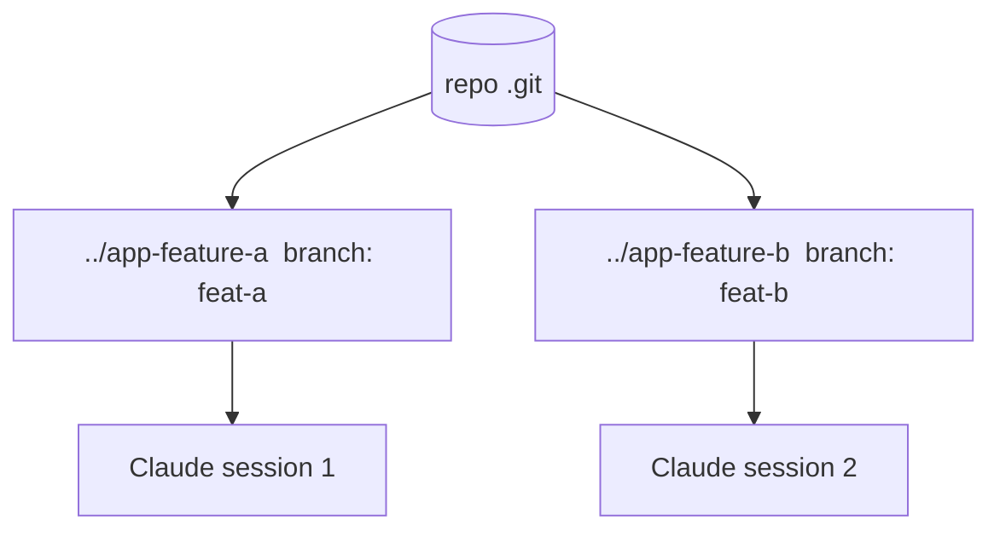

<LevelBadge level="advanced" />

<Callout type="objectives" items={["What a git worktree is — one repo, multiple working directories, each on its own branch","The exact problem it solves: stopping parallel Claude sessions from colliding on the same files","The four commands to add, list, and remove worktrees","When the technique earns its keep — and the three pitfalls that bite at merge-time","How worktrees compose with subagents: parallelism across sessions vs within one"]} />

A **git worktree** lets one repository have **multiple working directories**, each checked out to a different branch. Pair that with Claude Code and you can run **several sessions in parallel** on the same project — each editing its own files, with no collisions.

## The problem it solves

If two Claude sessions edit the same working directory at once, they trip over each other's changes. Worktrees give each session its **own directory and branch**, so parallel work stays isolated until you merge.

## The basics

Four commands carry the whole workflow: add a worktree (new dir + new branch), list what exists, and remove one when you're done.

<Steps items={[{title: "Add a worktree for a feature", body: "From your repo, git worktree add ../app-feature-a -b feat-a creates a new directory AND a new branch in one shot."},{title: "Add another for a fix", body: "git worktree add ../app-fix-123 -b fix-123 — a second isolated dir/branch, side by side with the first."},{title: "See what you have", body: "git worktree list shows every working directory and the branch it's on."},{title: "Clean up when done", body: "git worktree remove ../app-feature-a tears down a worktree so stale dirs don't accumulate."}]} />

<PromptCard title="The four-command workflow">{`# from your repo
git worktree add ../app-feature-a -b feat-a   # new dir + new branch
git worktree add ../app-fix-123 -b fix-123
git worktree list
# when done with one:
git worktree remove ../app-feature-a`}</PromptCard>

Open a Claude Code session in each worktree directory and let them work independently.

## When it's worth it

- **Parallel features/fixes** you want to progress at once.
- **A long task running** in one worktree while you keep working in another.
- **Risky experiments** isolated from your main checkout.

## Pitfalls

<Callout type="warning" items={["Watch the merge-back: branches will eventually merge — conflicts surface then, not during. Keep worktrees focused and short-lived.","Don't run stateful, shared resources (one dev DB, one port) from two worktrees without separating them.","Clean up with git worktree remove so stale dirs don't accumulate."]} />

## Worktrees vs subagents

Two different axes of parallelism — they don't compete, they stack.

| | What it parallelizes | Isolation |
| --- | --- | --- |
| **[Subagents](/docs/claude-code/subagents)** | Work *within* one session (delegation) | Isolated context |
| **Worktrees** | Work *across* sessions on disk | Isolated branches/files |

They compose well: a session in a worktree can itself spawn subagents.

<Callout type="tip" items={["Use a worktree when you need two Claude sessions touching the same repo at once; use a subagent when one session needs to offload a chunk of work into isolated context."]} />

<Quiz title="Check yourself" questions={[{q: "What does a git worktree give you?", options: ["Multiple branches in a single working directory", "Multiple working directories for one repo, each on its own branch", "A backup copy of your .git folder"], answer: 1, explain: "A git worktree lets one repository have multiple working directories, each checked out to a different branch — so parallel sessions don't collide."}, {q: "Which command creates a new directory AND a new branch in one step?", options: ["git worktree list", "git worktree add ../app-feature-a -b feat-a", "git worktree remove ../app-feature-a"], answer: 1, explain: "git worktree add ../app-feature-a -b feat-a creates the new directory and the new branch together. list shows existing worktrees; remove tears one down."}, {q: "When do merge conflicts from parallel worktrees actually surface?", options: ["Continuously while both sessions edit", "At merge-back time, not during", "Never, because branches are isolated"], answer: 1, explain: "Branches stay isolated while you work, so conflicts don't appear during — they surface at merge-back. Keep worktrees focused and short-lived to limit them."}, {q: "How do worktrees and subagents relate?", options: ["They're the same feature with two names", "Worktrees parallelize across sessions on disk; subagents parallelize within one session — and they compose", "You must pick one; using both breaks isolation"], answer: 1, explain: "Subagents are parallelism within one session (isolated context); worktrees are parallelism across sessions on disk (isolated branches/files). A session in a worktree can itself spawn subagents."}]} />

<Callout type="takeaways" items={["A git worktree = one repo, multiple working directories, each on its own branch — the basis for collision-free parallel Claude sessions.","Two sessions on one working directory trip over each other; a worktree per session keeps files and branches isolated until you merge.","git worktree add ../dir -b branch creates dir + branch; list shows them; remove cleans up.","Worth it for parallel features/fixes, long-running tasks alongside other work, and isolated risky experiments.","Beware the merge-back, don't share stateful resources (DB, port) across worktrees, and always clean up — and remember worktrees compose with subagents."]} />

## Next

- [Subagents & Parallel Agents](/docs/claude-code/subagents)
- [Headless Mode & the Agent SDK](/docs/claude-code/headless-and-agent-sdk)
- [Context Management](/docs/claude-code/context-management)
