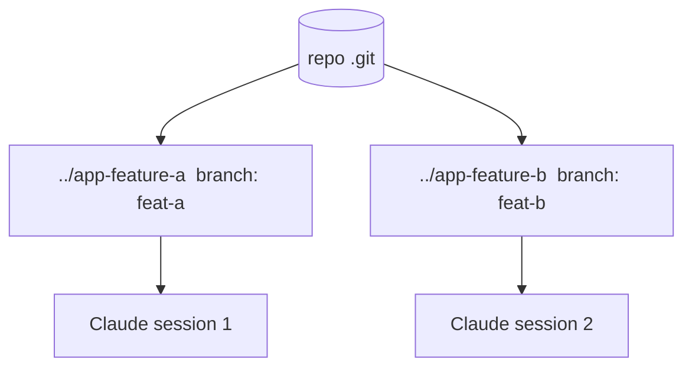

<LevelBadge level="advanced" />

A **git worktree** lets one repository have **multiple working directories**, each checked out to a different branch. Pair that with Claude Code and you can run **several sessions in parallel** on the same project — each editing its own files, with no collisions.

## The problem it solves

If two Claude sessions edit the same working directory at once, they trip over each other's changes. Worktrees give each session its **own directory and branch**, so parallel work stays isolated until you merge.



## The basics

```bash
# from your repo
git worktree add ../app-feature-a -b feat-a   # new dir + new branch
git worktree add ../app-fix-123 -b fix-123
git worktree list
# when done with one:
git worktree remove ../app-feature-a
```

Open a Claude Code session in each worktree directory and let them work independently.

## When it's worth it

- **Parallel features/fixes** you want to progress at once.
- **A long task running** in one worktree while you keep working in another.
- **Risky experiments** isolated from your main checkout.

## Pitfalls

:::warning Watch the merge-back
- Branches will eventually **merge** — conflicts surface then, not during. Keep worktrees focused and short-lived.
- Don't run **stateful, shared resources** (one dev DB, one port) from two worktrees without separating them.
- Clean up with `git worktree remove` so stale dirs don't accumulate.
:::

## Worktrees vs subagents

- **[Subagents](/docs/claude-code/subagents)** = parallelism *within* one session (delegation, isolated context).
- **Worktrees** = parallelism *across* sessions on disk (isolated branches/files). They compose well: a session in a worktree can itself spawn subagents.

## Next

- [Subagents & Parallel Agents](/docs/claude-code/subagents)
- [Headless Mode & the Agent SDK](/docs/claude-code/headless-and-agent-sdk)
- [Context Management](/docs/claude-code/context-management)
