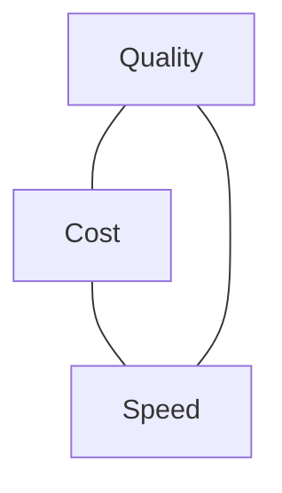

<LevelBadge level="intermediate" />

Quality, cost, and speed pull against each other. You can't max all three at once — but you *can* spend each where it matters and save everywhere else.

## The triangle

A bigger model is smarter but slower and pricier; a smaller one is fast and cheap but less capable. Good engineering is **routing each task to the right point** on this triangle.

## The biggest levers (roughly in order)

1. **Right-size the model.** Don't run Opus for classification. Start with Sonnet, drop to Haiku for simple/high-volume steps, reserve Opus for the hard parts — [Choosing a Model](/docs/api/choosing-a-model).
2. **Model tiering / cascades.** Use a cheap model first; escalate to a stronger one only when needed (e.g. low-confidence cases).
3. **[Prompt caching](/docs/api/prompt-caching).** Reuse a stable prompt prefix across calls — big savings for repeated system prompts, RAG context, or agent tool catalogs.
4. **Trim input tokens.** Send only what matters; [RAG](/docs/foundations/rag) beats stuffing the whole knowledge base. Shorter inputs = cheaper *and* often better.
5. **Cap output** with sensible `max_tokens` and tight format instructions.
6. **Batch** offline work where latency doesn't matter.

## Latency-specific wins

- **Stream** responses so users see output immediately — huge for *perceived* speed even when total time is unchanged ([Streaming](/docs/api/streaming)).
- **Parallelize** independent sub-calls.
- **Cache** repeated work; precompute where you can.
- Pick a **smaller model** for the interactive path; do heavy lifting async.

## Don't optimize blind

Measure first: where are the tokens and the seconds actually going? Then optimize the biggest line item. And re-check quality with [evals](/docs/foundations/evals) after any cost cut — a cheaper setup that's wrong isn't cheaper.

## Next

- [Choosing a Claude Model](/docs/api/choosing-a-model)
- [Prompt Caching & Cost Optimization](/docs/api/prompt-caching)
- [Tokens, Context & Pricing](/docs/api/tokens-and-pricing)
