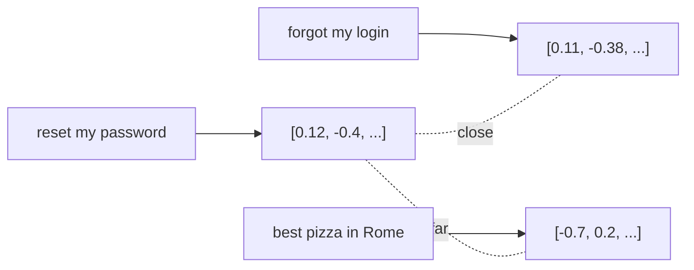

<LevelBadge level="intermediate" />

An **embedding** turns a piece of text into a list of numbers (a **vector**) that captures its *meaning*. Texts with similar meaning get vectors that are close together — even if they share no words. That's the trick behind **semantic search** and [RAG](/docs/foundations/rag).

## The intuition

Imagine every sentence placed as a point in a huge multi-dimensional space, arranged so that **similar meanings sit near each other**. "How do I reset my password?" lands near "I forgot my login," far from "best pizza in Rome."

## Semantic vs keyword search

- **Keyword search** matches literal words ("password" finds "password").
- **Semantic search** matches *meaning* — "I can't sign in" finds the password-reset doc even without the word "password."

Best results often **combine** both (hybrid search).

## How a vector search works

1. **Embed** your documents (usually split into **chunks**) and store the vectors in a **vector database**.
2. At query time, **embed the query**.
3. Find the **nearest** vectors (by cosine similarity / distance).
4. Return those chunks — typically to feed into [RAG](/docs/foundations/rag).

## Practical notes

- **Chunking matters.** Too big = noisy matches; too small = lost context. Tune it.
- **Use one embedding model consistently** — vectors from different models aren't comparable.
- **Metadata + filters** (date, source, type) make retrieval far more precise.
- A vector DB isn't always needed — for small corpora, a simple in-memory search is fine.

## Next

- [Retrieval-Augmented Generation (RAG)](/docs/foundations/rag)
- [Fine-tuning vs Prompting vs RAG](/docs/foundations/finetune-vs-prompt-vs-rag)
- [Hallucinations & How to Reduce Them](/docs/foundations/hallucinations)
