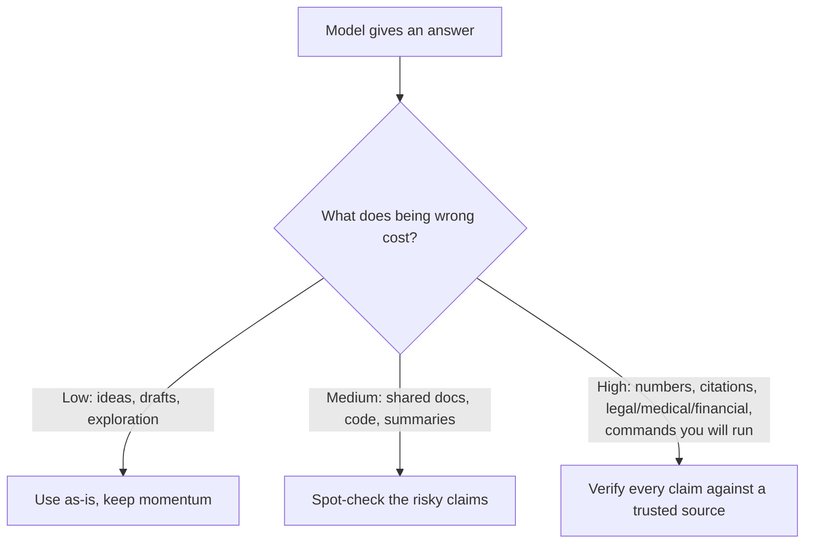

<LevelBadge level="intermediate" />

<Callout type="objectives" items={["Understand WHY models fabricate confident, well-formed answers", "Recognize the 5 high-risk zones where you should be most skeptical", "Apply a 6-part toolkit to drastically reduce hallucinations", "Use one copy-paste anti-hallucination prompt that grounds, gives an out, and forces citations", "Adopt the mindset that matches verification effort to the cost of being wrong"]} />

A **hallucination** is when a model states something false with complete confidence. It's not lying and not broken — it's the flip side of how LLMs work: they generate *plausible* text, and plausible isn't always true (see [What Is an LLM?](/docs/foundations/what-is-an-llm)). You can't prompt this away entirely, but you can drastically reduce it and catch the rest.

## Why it happens

The model predicts a likely continuation. When it doesn't "know" something, the *most likely-looking* continuation is often a confident, well-formed — and wrong — answer. There's no built-in "I'm unsure" signal unless you create room for one.

<Callout type="tip" items={["The fix for most hallucinations is to deliberately create room for uncertainty — give the model permission to say it doesn't know."]} />

## The high-risk zones

Be most skeptical when output involves:

- **Citations, quotes, and references** — fabricated papers, fake URLs, misattributed quotes.
- **Specific numbers, dates, and stats** — plausible but invented figures.
- **Niche or very recent facts** — beyond what the model reliably learned.
- **APIs and library details** — methods or parameters that don't exist.
- **People and legal/medical specifics** — high stakes, easy to get subtly wrong.

## The reduction toolkit

Stack these — each one helps:

<Steps items={[
  {title: "Ground it in sources", body: "Paste the source text and say \"answer only from the text above; if it's not there, say so.\" This is the core idea behind RAG (/docs/foundations/rag)."},
  {title: "Give it an out", body: "Explicitly allow \"If you're not sure, say 'I don't know'\" — it dramatically reduces confident guessing."},
  {title: "Ask for reasoning and citations", body: "\"Quote the exact sentence that supports each claim.\" Unsupported claims become obvious."},
  {title: "Lower the creativity", body: "For factual tasks where the model exposes a temperature control, turn it down (see Sampling Controls at /docs/foundations/sampling-controls)."},
  {title: "Use tools", body: "For math, current data, or lookups, give the model a calculator/search/tool (/docs/api/tool-use) instead of trusting recall."},
  {title: "Cross-check", body: "Ask the same question two ways, or have a second pass critique the first."}
]} />

## A copy-paste anti-hallucination prompt

Most of the toolkit above collapses into one reusable wrapper. Paste your source where shown and ask your question — it grounds the answer, gives the model an out, and forces citations in a single shot:

<PromptCard title="Anti-hallucination wrapper">{`You answer ONLY from the SOURCE below.
Rules:
- If the answer is not in the SOURCE, reply exactly: "Not stated in the source."
- After every claim, quote the exact sentence from the SOURCE that supports it.
- Do not add outside knowledge, estimates, or assumptions.

SOURCE:
"""
[paste the document, transcript, or data here]
"""

QUESTION: [your question]`}</PromptCard>

Why it works: the "Not stated in the source" escape hatch removes the pressure to guess, and the quote-the-sentence rule makes any unsupported claim impossible to hide. Drop the SOURCE block when you genuinely want the model's own knowledge — but then verification is back on you.

## The mindset that actually protects you

<Callout type="warning" items={["No prompt makes output 100% reliable. For anything consequential — a number in a report, a citation, a command you'll run, a medical/legal/financial detail — check it against a trusted source. Treat AI as a fast first draft, not a final authority. This is the heart of Responsible Use (/docs/security/responsible-use)."]} />

A simple rule: **the cost of being wrong sets the amount of verification.** Brainstorming? Trust freely. Publishing a statistic? Verify every time.

<Callout type="takeaways" items={["Hallucinations are a byproduct of plausibility-based generation, not a bug you can fully prompt away.", "Be most skeptical with citations, numbers/dates, niche or recent facts, API details, and people/legal/medical specifics.", "Stack the toolkit: ground in sources, give an out, demand citations, lower temperature, use tools, cross-check.", "One wrapper prompt grounds + gives an out + forces citations in a single shot.", "Match verification effort to the cost of being wrong — trust freely when cheap, verify every claim when consequential."]} />

<Quiz title="Check yourself" questions={[
  {
    q: "Why do models hallucinate?",
    options: [
      "They are deliberately lying to the user",
      "They predict the most plausible-looking continuation, which isn't always true",
      "They are broken and need to be retrained",
      "They always run out of memory mid-answer"
    ],
    answer: 1,
    explain: "Hallucination is the flip side of how LLMs work: they generate plausible text, and plausible isn't always true. When the model doesn't know something, the most likely-looking continuation is often confident, well-formed, and wrong."
  },
  {
    q: "Which of these is a high-risk zone where you should be most skeptical?",
    options: [
      "Open-ended brainstorming for ideas",
      "Rephrasing a sentence you already wrote",
      "Specific numbers, dates, and statistics",
      "Asking for a simple definition you can sanity-check"
    ],
    answer: 2,
    explain: "Specific numbers, dates, and stats are a high-risk zone — they can be plausible but invented. Other high-risk zones include citations/quotes, niche or recent facts, API details, and people/legal/medical specifics."
  },
  {
    q: "What is the single most direct effect of giving the model an explicit out like \"If you're not sure, say 'I don't know'\"?",
    options: [
      "It makes the model faster",
      "It dramatically reduces confident guessing",
      "It increases the temperature automatically",
      "It connects the model to live search"
    ],
    answer: 1,
    explain: "Explicitly allowing the model to say it doesn't know removes the pressure to produce a confident guess, which dramatically reduces hallucinated answers."
  },
  {
    q: "What rule decides how much verification an answer needs?",
    options: [
      "The length of the answer",
      "The model's stated confidence level",
      "The cost of being wrong",
      "How long the prompt took to write"
    ],
    answer: 2,
    explain: "The cost of being wrong sets the amount of verification. Brainstorming? Trust freely. Publishing a statistic? Verify every time."
  },
  {
    q: "In the anti-hallucination wrapper prompt, what makes any unsupported claim impossible to hide?",
    options: [
      "Lowering the temperature to zero",
      "The rule to quote the exact supporting sentence from the SOURCE after every claim",
      "Asking the question twice",
      "Removing the SOURCE block"
    ],
    answer: 1,
    explain: "The quote-the-sentence rule forces the model to back each claim with an exact sentence from the SOURCE, so any claim that isn't actually supported becomes obvious. The \"Not stated in the source\" escape hatch removes the pressure to guess."
  }
]} />

## Next

- [Retrieval-Augmented Generation (RAG)](/docs/foundations/rag)
- [Evaluating AI Quality (Evals)](/docs/foundations/evals)
- [Responsible Use, Ethics & Verification](/docs/security/responsible-use)
