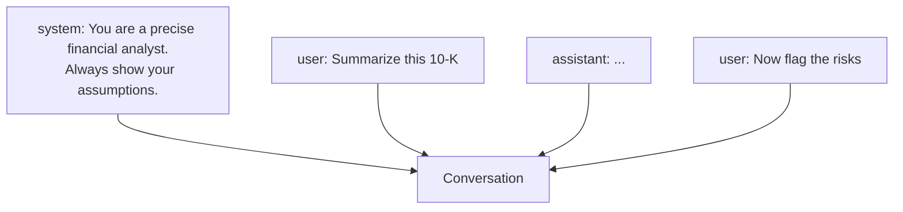

<LevelBadge level="beginner" />

Every AI conversation is built from **messages**, and each message has a **role**. Understanding the three roles explains how to steer the model — and why some instructions stick while others don't.

## The three roles

- **System** — top-level setup for the whole conversation: who the model should be, the rules, the format. Set once, applies throughout.
- **User** — that's you: your questions and inputs, turn by turn.
- **Assistant** — the model's replies. (You can also *put words in the assistant's mouth* as examples — see [few-shot](/docs/prompting/few-shot).)

## Why the system prompt is your most powerful lever

The system message frames **everything that follows**. It's where you set the model's role, standards, tone, and hard rules — and the model weights it heavily. If you want consistent behavior across a whole conversation (or app), put it here, not buried in a user turn.

In practice:
- **Chat apps:** your account [custom instructions](/docs/claude-app/custom-instructions) act as a personal system prompt.
- **Claude Code:** [CLAUDE.md](/docs/claude-code/claude-md) plays this role for your project.
- **The API:** the [`system` parameter](/docs/api/first-call).

Same idea, three surfaces.

## Practical tips

- **Be specific in the system prompt** about role, rules, and output format — it's the highest-leverage place to do it.
- **Keep user turns focused** on the actual task; don't re-paste the rules every turn.
- **Conflicting instructions?** A later, explicit user instruction can override a vague system one — be consistent to avoid surprises ([Troubleshooting](/docs/contribute/troubleshooting)).

## Next

- [Prompting Basics](/docs/prompting/basics)
- [Custom Instructions & Styles](/docs/claude-app/custom-instructions)
- [Tokens, Context & Memory](/docs/foundations/tokens-and-context)
