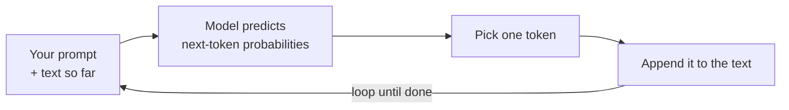

<LevelBadge level="beginner" />

A **Large Language Model** (LLM) — the technology behind Claude — does one deceptively simple thing: it reads text and **predicts what comes next**, one chunk at a time. That's it. Everything else emerges from doing that astonishingly well.

## The one-sentence mental model

> An LLM is a very sophisticated autocomplete that has read an enormous amount of text and learned the patterns of how language — and the ideas inside it — tend to continue.

When you ask a question, the model isn't "looking up" an answer. It's generating the most plausible continuation of your text, token by token (see [Tokens & Context](/docs/foundations/tokens-and-context)). Plausible continuations of a good question are usually good answers — which is why this works at all.

## One token at a time

The whole engine is a loop: read everything so far, predict the next chunk, append it, repeat.

Each step only ever predicts **one** token, then feeds the slightly longer text back in. The model has no plan for the whole answer up front — coherence emerges from doing this prediction extremely well, thousands of times. How the "pick one token" step behaves (greedy vs. a bit random) is what [sampling controls](/docs/foundations/sampling-controls) like temperature adjust.

## Why this explains its strengths

Because it learned patterns across writing, code, and reasoning, an LLM can fluidly **write, summarize, translate, explain, and code** — tasks that are all "continue this text sensibly." Give it a clear setup and it produces a strong continuation. That's why [prompting](/docs/prompting/basics) matters so much: you're shaping the start of the text it continues.

## Why this explains its quirks

The same mechanism explains the rough edges:

- **It can be confidently wrong.** A fluent-sounding continuation isn't always a true one — that's [hallucination](/docs/foundations/hallucinations).
- **It doesn't truly "know" today's facts** unless you provide them or it has a tool to look them up.
- **It has no memory** between conversations unless you give it some.

## What an LLM is **not**

:::warning Adjust your expectations and you'll get better results
- ❌ **Not a database or search engine.** It generates, it doesn't retrieve verified records.
- ❌ **Not a calculator.** It can reason about math but isn't guaranteed exact — give it tools for that.
- ❌ **Not a person.** No feelings, intentions, or continuous memory. It's a powerful text engine.
:::

Treat it as a brilliant, fast, well-read assistant that occasionally misremembers — and **verify** what matters.

## Next

- [Tokens, Context & Memory](/docs/foundations/tokens-and-context)
- [Hallucinations & How to Reduce Them](/docs/foundations/hallucinations)
- [Prompting Basics](/docs/prompting/basics)
