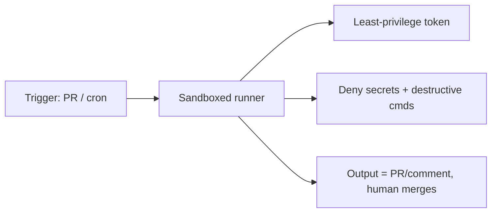

<LevelBadge level="advanced" />

Running Claude [headless](/docs/claude-code/headless-and-agent-sdk) or on a [schedule](/docs/claude-code/background-tasks) — in CI, a cron job, a pre-commit hook — removes the human who'd normally catch a bad action. That convenience is exactly why these runs need the tightest guardrails.

## The risks unique to unattended runs

- **No one to say "no"** to a risky tool call in the moment.
- **Ambient credentials.** CI often has powerful tokens (deploy, package registry, cloud). An agent there inherits them.
- **Untrusted inputs.** A run triggered by a PR or an issue may process attacker-authored content ([injection](/docs/security/prompt-injection)).

## A hardening checklist

- **Deny secrets explicitly.** Block reading `.env`, key files, and credential paths via [permission deny rules](/docs/claude-code/permissions). Don't rely on the model to avoid them.
- **Never use bypass/yolo mode on a machine with real access.** Reserve "skip all prompts" for disposable sandboxes.
- **Scope the token.** Give the run a least-privilege token (read-only where possible), not your full-access credentials.
- **Sandbox & ephemeral.** Run in a container that's destroyed after; no persistent access to production.
- **Allowlist commands and domains.** Permit your test/lint/build commands; deny networked or destructive ones.
- **Cap it.** Max iterations, time budget, token/cost budget — so a loop or a manipulated agent can't run away.
- **Make outputs reviewable, not auto-applied.** Prefer "open a PR / post a comment" over "push to main." A human merges.

## Example: a safe CI reviewer

A PR-review bot should: check out the code read-only, have **no** deploy/secret access, run in a container, and **comment** its findings — never modify protected branches. See the [PR-review walkthrough](/docs/walkthroughs/pr-review-action).

## Next

- [Permissions & Permission Modes](/docs/claude-code/permissions)
- [Securing Agents & Tools](/docs/security/securing-agents)
- [Headless Mode & the Agent SDK](/docs/claude-code/headless-and-agent-sdk)
