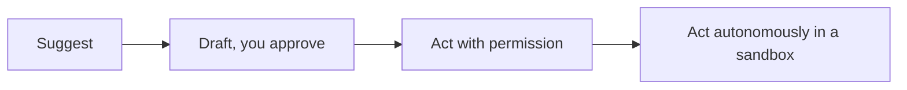

<LevelBadge level="all" />

Getting the most out of AI includes using it *responsibly*. This page is short, practical, and applies to everyone — beginner to builder.

## The verification mindset

The single most important habit: **match your verification to the stakes.**

| Stakes | Example | How much to verify |
|---|---|---|
| Low | Brainstorming, rough drafts | Trust freely, skim |
| Medium | A work email, a summary | Read it, sanity-check facts |
| High | Published stats, code you'll run, legal/medical/financial | Verify every claim against a trusted source |

AI is a fast first draft, never a final authority — see [Hallucinations](/docs/foundations/hallucinations).

## The autonomy ladder

Give AI more independence only as trust is earned:

Start with "propose, I approve" ([Plan Mode](/docs/claude-code/plan-mode)); reserve full autonomy for low-risk, sandboxed, reversible work ([Hardening Autonomous Runs](/docs/security/hardening-autonomous-runs)).

## Privacy & data

- Don't paste secrets, credentials, or others' personal data into a tool you haven't vetted.
- Know your provider's data-handling and training policy before sharing sensitive material — see [Privacy & Data Handling](/docs/foundations/privacy).
- For regulated or confidential data, use the appropriate enterprise/controlled settings.

## Bias, fairness, and limits

Models reflect patterns in their training data, which can carry **bias**. Be especially careful when AI output influences decisions about people (hiring, lending, moderation). Keep a human accountable for consequential decisions, and treat AI as an aid to judgment, not a replacement for it.

## Don't outsource your thinking

:::tip Use AI to think better, not less
The best users stay engaged — they question outputs, learn from them, and own the result. For studying, that means the [teach-back loop](/docs/playbooks/learning), not copy-paste. You are accountable for what you ship with AI's help.
:::

## Security, briefly

If AI ever reads untrusted content (web pages, emails, documents) or takes actions, you inherit a security model. Read [Prompt Injection](/docs/security/prompt-injection) and [Securing Agents](/docs/security/securing-agents).

## Next

- [Prompt Injection Explained](/docs/security/prompt-injection)
- [Hallucinations & How to Reduce Them](/docs/foundations/hallucinations)
- [Privacy & Data Handling](/docs/foundations/privacy)
