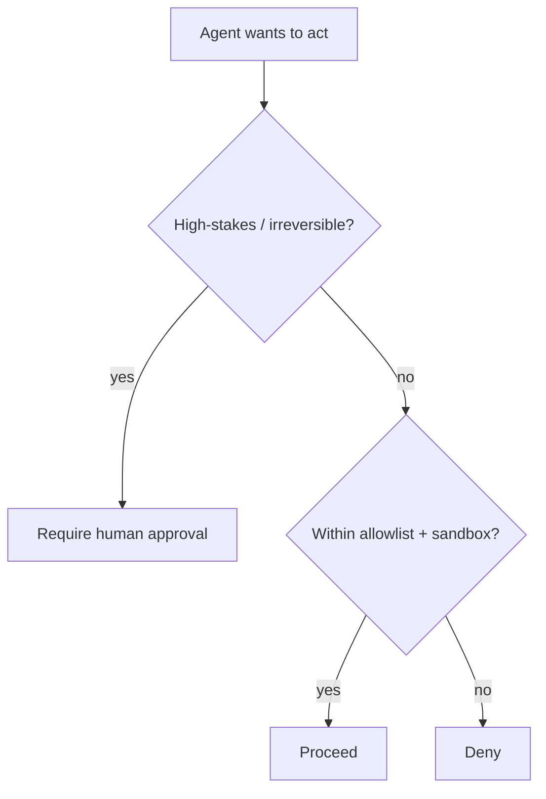

<LevelBadge level="advanced" />

The moment an AI can **take actions** (call tools, run code, hit APIs), it inherits a security model. The goal isn't to make the model un-trickable — it's to make sure that **even if it's tricked, it can't do much harm**.

## The core principle: least privilege

Give an agent the **minimum** access its job requires, nothing more.

- A doc-summarizer needs **read**, not write or network.
- A reviewer needs to read code and post a comment — not push or deploy.
- Scope tools, API keys, and file access per-task. A narrowly-scoped agent that gets [injected](/docs/security/prompt-injection) can only do narrow damage.

## The confused-deputy problem

An agent often acts **with your authority** (your tokens, your sessions). If attacker-controlled input steers it, the attacker borrows your privileges — a "confused deputy." Defense: don't hand the agent ambient authority it doesn't need, and require explicit, scoped credentials for sensitive tools.

## Defense layers

1. **Sandbox** code execution and file access — containers, ephemeral dirs, no access to the broader system or secrets.
2. **Allowlist** the dangerous surface: which commands, which domains, which paths. Deny the rest. (In Claude Code, that's [permissions](/docs/claude-code/permissions).)
3. **Human-in-the-loop** for irreversible or high-stakes actions: send money, email, delete, deploy, change production config.
4. **Separate trust zones.** Don't let one agent simultaneously hold secrets, read untrusted content, and make arbitrary outbound calls.
5. **Log and review** what tools the agent actually called.

## Tools have schemas — validate them

Tool inputs the model produces can be wrong or manipulated. **Validate** arguments before executing, and **return errors as results** so the agent recovers instead of retrying blindly.

## Next

- [Prompt Injection Explained](/docs/security/prompt-injection)
- [Hardening Autonomous Runs](/docs/security/hardening-autonomous-runs)
- [Reviewing Third-Party Code](/docs/security/reviewing-third-party-code)
