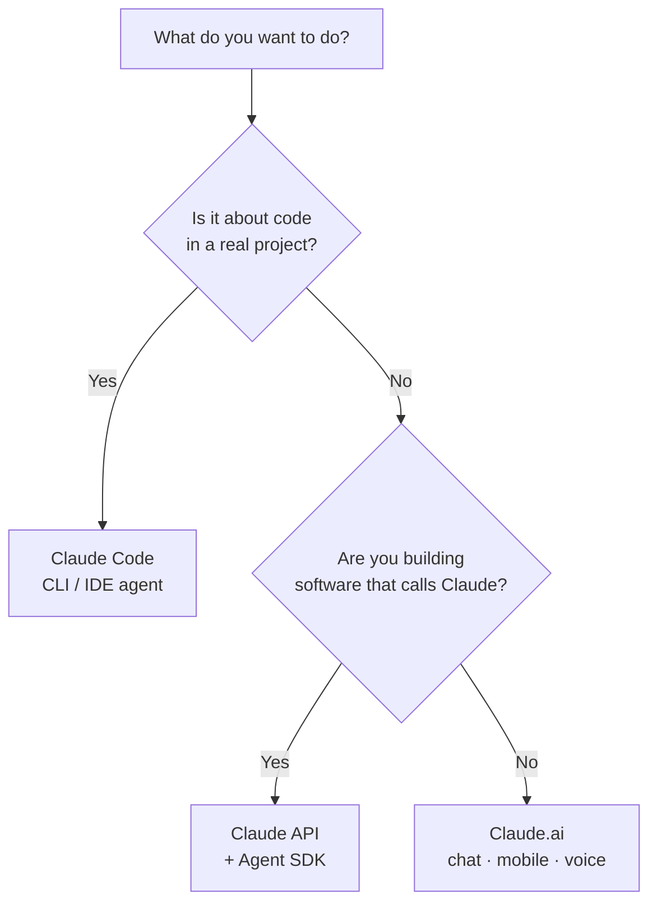

<LevelBadge level="beginner" />

"Claude" comes in a few flavors. Pick by **what you're trying to do**, not by which you've heard of.

## The 30-second decision

## Claude.ai — the chat apps

**For:** writing, research, analysis, learning, planning, everyday questions. **Who:** everyone, no setup.

You also get it on **mobile** ([iOS/Android](/docs/claude-app/mobile)) and by **[voice](/docs/claude-app/voice-mode)** — great for capturing ideas on the go. Power it up with [Projects](/docs/claude-app/projects), [custom instructions](/docs/claude-app/custom-instructions), and [Artifacts](/docs/claude-app/artifacts). → Start at [Getting Started with Claude.ai](/docs/claude-app/getting-started).

## Claude Code — the agentic coding tool

**For:** working *in a codebase* — reading, editing, running commands, fixing tests. **Who:** developers (and the technically curious). It acts on your files with your permission. → [What Claude Code Is](/docs/claude-code/what-is-claude-code).

## The API & Agent SDK — build Claude into your own software

**For:** apps, automations, and agents that call Claude programmatically. **Who:** developers shipping a product or pipeline. → [Your First API Call](/docs/api/first-call).

## They work together

These aren't rival products — most people graduate across them:

| You want to… | Use |
|---|---|
| Draft an email, summarize a PDF, brainstorm | Claude.ai (or voice/mobile) |
| Refactor a module, add tests, fix a bug | Claude Code |
| Add an AI feature to *your* app | The API / Agent SDK |

:::tip Not sure? Start with chat
[Claude.ai](/docs/claude-app/getting-started) needs zero setup and teaches you how Claude "thinks." The skills transfer everywhere else.
:::

## Next

- [Your First 5 Minutes](/docs/start-here/your-first-5-minutes)
- [Learning Paths](/docs/start-here/learning-paths)
- [Choosing a Claude Model](/docs/api/choosing-a-model) (once you're building)
