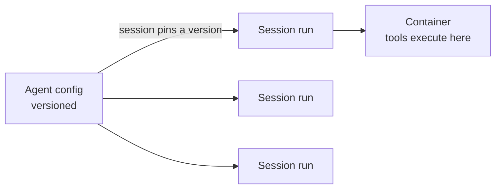

<LevelBadge level="advanced" />

<VerifyNote lastVerified="2026-06-26" source="https://docs.anthropic.com/en/docs/agents-and-tools">
تتغيّر قدرات الوكيل المُدار وتوافره — فالـ API في مرحلة beta. تحقّق من نقاط النهاية وأسماء الحقول والوصول في الوثائق الرسمية قبل البناء عليها.
</VerifyNote>

<Callout type="objectives" items={["افهم ما الذي تتولّاه عنك حلقة وكيل مُدارة (مُستضافة من Anthropic)", "افصِل بين الكائنين الأساسيين: Agent مُصدّر مقابل Session لكل تشغيل", "احقن الأسرار بأمان عبر الخزائن (Vaults) — دون أن يراها النموذج أبدًا", "ضَع وكيلًا على جدول cron عبر النشر المُجدوَل (Scheduled Deployments) — بلا مُجدوِل تستضيفه", "اعرف متى يتفوّق المُدار على حلقة مخصّصة، والضوابط التي تظل سارية"]} />

إذا كان [بناء حلقة الوكيل الخاصة بك](/docs/api/building-agents) بنية تحتية أكثر مما ترغب في امتلاكه، فإن الوكيل **المُدار** (المُستضاف من Anthropic) يُشغّل الحلقة نيابةً عنك — لتركّز على *مهمّة* الوكيل، لا على سباكة الجلسات وإعادة المحاولات والحالة والجدولة.

## الكائنان: Agent مقابل Session

هذا هو النموذج الذهني الذي يتعلّق به كل ما عداه. وهما منفصلان عن قصد.

- الـ **Agent** هو *إعداد دائم ومُصدّر* — النموذج، ومُوجّه النظام، والأدوات، وخوادم MCP، والمهارات. تنشئه مرّة واحدة. وكل تحديث يُنشئ نسخة جديدة غير قابلة للتغيير.
- الـ **Session** هي *نسخة تشغيل* — تنفيذ واحد يشير إلى وكيل عبر مُعرّفه (ID). يعيش الإعداد على الوكيل، لا على الجلسة أبدًا.

<Callout type="tip">
تُثبّت الجلسات (**pin**) على نسخة الوكيل التي أُنشئت بها: تحتفظ الجلسات الجارية بنسختها، وتحصل الجلسات الجديدة على الأحدث. هكذا تُطلق تغييرات الإعداد دون كسر العمل الجاري.
</Callout>

## ما الذي يمنحك إياه "المُدار"

بدلًا من تجميع الحلقة واستضافتها يدويًا، تحصل على لبنات بناء مُستضافة:

- **الجلسات (Sessions)** — تشغيلات دائمة تنشئها لكل تنفيذ وتستأنفها؛ تبث الأحداث عبر SSE.
- **البيئات (Environments)** — بنية تحتية للحاويات، إمّا `cloud` (مُستضافة من Anthropic) أو `self_hosted` (تُنفَّذ الأدوات داخل VPC الخاص بك). حاوية واحدة لكل جلسة هي مساحة عمل الوكيل.
- **مخازن الذاكرة (Memory stores)** — حالة دائمة عبر الجلسات، مع إصدار وتنقيح (redaction)، دون أن توصِّل قاعدة بيانات.
- **الخزائن (Vaults)** — أسرار لمصادقة MCP وخدمات أخرى.
- **النشر المُجدوَل (Scheduled deployments)** — وكلاء يعملون على جدول cron، دون إشراف.

<PromptCard title="أنشئ وكيلًا (إعداد مُصدّر)، ثم شغّل جلسة مقابله">{`# 1. Create the agent once
POST /v1/agents        -> returns $AGENT_ID
# 2. Each execution is a session pinned to that agent
POST /v1/sessions      { "agent": "$AGENT_ID" }`}</PromptCard>

## الخزائن (Vaults): أسرار لا يراها النموذج أبدًا

غالبًا ما يحتاج وكيل مستقل إلى مفتاح API — لكن يجب ألا يقرأه *النموذج* أبدًا. تُستبدَل بيانات اعتماد الخزينة (`mcp_oauth`, `static_bearer`, `environment_variable`) عند الخروج (egress): تُحقَن بيانة اعتماد من نوع `environment_variable` في الصندوق الرملي (sandbox) وقت التنفيذ، وتظل *غير مرئية أبدًا* للنموذج.

<Callout type="warning">
هذا هو النمط الآمن لمنح وكيل وصولًا قويًا. لا تلصق المفاتيح في مُوجّه النظام أو في رسالة — فهي تصبح جزءًا من السياق الذي يمكن للنموذج (ولسجلّاتك) رؤيته. ضعها في خزينة.
</Callout>

## النشر المُجدوَل: وكيل على cron

يربط الـ **deployment** جدول cron بوكيل. عندما يُطلِق الجدول، يبدأ جلسة جديدة ويُكمل مهمّته — بلا مُجدوِل تبنيه أو تستضيفه. ممتاز لمزامنة بيانات ليلية، أو فحص امتثال أسبوعي، أو ملخّص يومي.

<Steps items={[
  {title: "عرّف الجدول", body: "POST /v1/deployments مع agent و environment_id و initial_events (يجب أن تتضمّن user.message)، و schedule: تعبير cron بنمط POSIX إضافةً إلى منطقة زمنية IANA."},
  {title: "كل إطلاق = تشغيل", body: "تُنشئ كل محاولة تشغيل سجلّ تشغيل (ببادئة drun_). يحمل النجاح session_id؛ ويحمل الفشل error.type (مثل environment_archived، session_rate_limited). اعرض قائمة التشغيلات عبر GET /v1/deployment_runs?deployment_id=..."},
  {title: "تحكّم في دورة الحياة", body: "الإيقاف المؤقت (Pause) يكبح الإطلاقات المستقبلية (تظل التشغيلات اليدوية تعمل)؛ وإلغاء الإيقاف (unpause) يستأنف عند الحدوث التالي ولا يعوّض الإطلاقات الفائتة؛ والأرشفة (archive) نهائية."},
  {title: "أطلِق عند الطلب", body: "POST /v1/deployments/{id}/run يبدأ جلسة فورًا — حتى أثناء الإيقاف المؤقت — مع trigger_context.type: manual."}
]} />

<PromptCard title="فحص امتثال أسبوعي، أيام الجمعة الساعة 20:00 بتوقيت نيويورك">{`POST /v1/deployments
{
  "name": "Weekly compliance scan",
  "agent": "$AGENT_ID",
  "environment_id": "$ENVIRONMENT_ID",
  "initial_events": [
    {"type": "user.message", "content": [{"type": "text", "text": "Run the compliance scan and summarize findings."}]}
  ],
  "schedule": {"type": "cron", "expression": "0 20 * * 5", "timezone": "America/New_York"}
}`}</PromptCard>

<Callout type="tip">
صيغة cron هي `minute hour day-of-month month day-of-week`، بدقّة على مستوى الدقيقة. يستخدم التوقيت الصيفي (DST) دلالات ساعة الحائط: وقت لا يوجد عند التقديم الربيعي يُتخطّى؛ ووقت يحدث مرّتين عند الإرجاع الخريفي يُطلِق مرّتين. اختر منطقة زمنية وساعة تتجنّب هذه الحواف لأي شيء حسّاس.
</Callout>

## متى تختار المُدار مقابل المخصّص

| اختر **المُدار** عندما… | اختر **حلقة مخصّصة / SDK** عندما… |
|---|---|
| تريد الاستضافة والحالة والجدولة والأسرار مُدارةً | تحتاج إلى تحكّم كامل في الحلقة والأدوات |
| تُنشئ نموذجًا أوليًا بسرعة | لديك متطلبات بنية تحتية/امتثال مخصّصة صارمة |
| بساطة العمليات أهم من التحكّم | تدمج بعمق في حزمتك الخاصة |

إنه طيف — استدعاء واحد ← سير عمل ← وكيل مخصّص (SDK) ← مُدار. ابدأ ببساطة بقدر ما تسمح به المهمّة؛ وارتقِ فقط عند الحاجة.

## تظل الضوابط نفسها سارية

مُستضافًا أو لا، يظل الوكيل المستقل يتّخذ إجراءات. حافظ على **أقل قدر من الامتيازات**، و**تكلفة/تكرارات محدودة**، و**موافقة بشرية للخطوات الخطرة** — راجع [تأمين الوكلاء](/docs/security/securing-agents) و[تقوية التشغيلات المستقلة](/docs/security/hardening-autonomous-runs).

<Callout type="takeaways" items={["يتولّى الوكلاء المُدارون الحلقة والجلسات والبيئات والذاكرة والخزائن والجدولة لتركّز على المهمّة", "الـ Agent إعداد مُصدّر؛ والـ Session تشغيل واحد يُثبّت على نسخة — الإعداد يعيش على الوكيل لا على الجلسة", "تُحقَن بيانات اعتماد الخزينة من نوع environment_variable عند التنفيذ وتظل غير مرئية أبدًا للنموذج — الطريقة الآمنة لمنح وكيل أسرارًا", "النشر المُجدوَل هو تعبير cron + منطقة زمنية IANA؛ كل إطلاق يُنشئ تشغيلًا، وإلغاء الإيقاف لا يعوّض الإطلاقات الفائتة", "يقع المُدار في الطرف المُستضاف من استدعاء واحد ← سير عمل ← مخصّص ← مُدار؛ وتظل ضوابط الاستقلالية سارية"]} />

## اختبر نفسك

<Quiz title="اختبر نفسك" questions={[
  {
    q: "ما الفرق بين الـ Agent والـ Session؟",
    options: [
      "هما اسمان لنفس الكائن",
      "الـ Agent إعداد مُصدّر؛ والـ Session تنفيذ تشغيل واحد يُثبّت على نسخة وكيل",
      "تحمل الـ Session النموذج ومُوجّه النظام؛ والـ Agent مجرد مُعرّف",
      "يُشغّل الـ Agent الأدوات؛ وتُخزّن الـ Session الأسرار"
    ],
    answer: 1,
    explain: "الـ Agent هو الإعداد الدائم المُصدّر (النموذج، المُوجّه، الأدوات، MCP، المهارات). والـ Session نسخة لكل تنفيذ تشير إلى الوكيل وتُثبّت على نسخته عند الإنشاء."
  },
  {
    q: "كيف ينبغي أن تمنح وكيلًا مُدارًا مفتاح API يحتاجه؟",
    options: [
      "ضعه في مُوجّه النظام ليتمكّن الوكيل من قراءته",
      "مرّره في رسالة المستخدم الأولى للجلسة",
      "خزّنه كبيانة اعتماد خزينة، تُحقَن عند التنفيذ وتظل غير مرئية أبدًا للنموذج",
      "ضعه مباشرةً داخل تعريف الأداة"
    ],
    answer: 2,
    explain: "تُستبدَل بيانات اعتماد الخزينة (مثل نوع environment_variable) عند الخروج وتظل غير مرئية أبدًا للنموذج — أما المفاتيح في المُوجّه أو في رسالة فتصبح جزءًا من السياق المرئي."
  },
  {
    q: "أُوقف نشر مُجدوَل مؤقتًا لمدة يومين ثم أُلغي إيقافه. ماذا يحدث للإطلاقات التي كانت ستُطلِق أثناء الإيقاف؟",
    options: [
      "تُعوَّض — يُنفَّذ كل تشغيل فائت عند إلغاء الإيقاف",
      "لا تُعوَّض؛ يستأنف النشر ببساطة عند الحدوث المُجدوَل التالي",
      "يُؤرشَف النشر تلقائيًا",
      "تُصفّ كل التشغيلات الفائتة وتُشغَّل بفارق دقيقة واحدة"
    ],
    answer: 1,
    explain: "يستأنف إلغاء الإيقاف عند الحدوث التالي ولا يعوّض الإطلاقات الفائتة. (لا يزال بإمكانك فرض تشغيل في أي وقت عبر الإطلاق اليدوي، حتى أثناء الإيقاف المؤقت.)"
  }
]} />

## التالي

- [بناء الوكلاء على الـ API](/docs/api/building-agents)
- [Cowork وفِرق الوكلاء](/docs/api/cowork-and-agent-teams)
- [وضع Headless والـ Agent SDK](/docs/claude-code/headless-and-agent-sdk)
- [تأمين الوكلاء](/docs/security/securing-agents)
