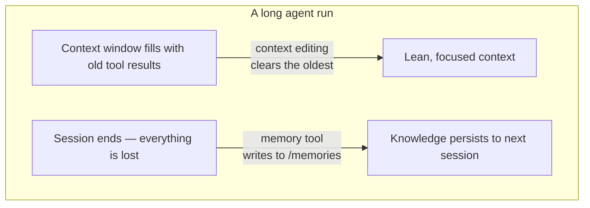

import Tabs from '@theme/Tabs';
import TabItem from '@theme/TabItem';

<LevelBadge level="advanced" />

<VerifyNote lastVerified="2026-06-26" source="https://platform.claude.com/docs/en/agents-and-tools/tool-use/memory-tool">
كلتا الميزتين في مرحلة بيتا. سلاسل نوع الأداة، ورأس بيتا، والقيم الافتراضية، ومكاسب المعايير المرجعية المُبلَّغ عنها تتغير — تأكد منها في وثائق memory-tool و context-editing الرسمية قبل البناء عليها.
</VerifyNote>

للوكيل طويل التشغيل عدوّان: فهو **ينسى** ما تعلّمه لحظة انتهاء المحادثة، وتمتلئ نافذة سياقه **حتى الفيض** بمخرجات الأدوات القديمة. تقدّم Anthropic بدائية واحدة لكلٍّ منهما — **أداة memory** (الاستمرارية) و**تحرير السياق** (التقليم) — وهما مصمَّمتان لاستخدامهما معًا.

<Callout type="objectives" items={["ما هي أداة memory — مخزن ملفات من جانب العميل عند /memories تنفّذه أنت، وليست Anthropic", "الأوامر الستة التي يجب أن يجيب عنها معالجك: view و create و str_replace و insert و delete و rename", "لماذا يُعدّ التحقق من اجتياز المسار غير قابل للتفاوض عند توصيله", "كيف يمسح تحرير السياق نتائج الأدوات القديمة تلقائيًا بمجرد تجاوز السياق عتبة الرموز", "كيف تجمع بين الاثنتين تحت رأس بيتا واحد، والمطبّات المتعلقة بالتخزين المؤقت والترتيب"]} />

## مشكلتان، أداتان



أبقِ الفكرتين منفصلتين في ذهنك:

- **أداة memory** = *الاستمرارية عبر الجلسات*. يقرأ Claude الملفات ويكتبها؛ **أنت** تخزّنها.
- **تحرير السياق** = *التقليم داخل الجلسة*. تُسقِط واجهة API نتائج الأدوات القديمة من المُطالبة قبل أن تصل إلى Claude.

تترافق هذه الصفحة مع [Prompt Caching](/docs/api/prompt-caching) و[اقتصاد الرموز](/docs/power-user/token-economy) لجانب التكلفة، ومع [هندسة السياق](/docs/frontiers/context-engineering) و[تجهيزات الوكلاء طويلة التشغيل](/docs/frontiers/long-running-agent-harnesses) لمعرفة *السبب*.

<Flashcards title="مفردات الذاكرة والسياق" cards={[{front:"أداة memory","back":"أداة من جانب العميل (نوع memory_20250818) تتيح لـ Claude إنشاء/قراءة/تحديث/حذف الملفات في دليل /memories. أنت تنفّذ خلفية التخزين."},{front:"/memories","back":"الدليل الوحيد الذي تُحصر فيه جميع عمليات الذاكرة. يجب التحقق من كل مسار ليبقى داخله."},{front:"تحرير السياق","back":"استراتيجية من جانب الخادم تمسح نتائج الأدوات القديمة من المُطالبة بمجرد تجاوز عتبة الرموز — يبقى التاريخ الكامل على عميلك."},{front:"clear_tool_uses_20250919","back":"استراتيجية تحرير السياق التي تزيل أقدم نتائج الأدوات، مستبدلةً إياها بعنصر نائب حتى يعرف Claude أنها قُلِّمت."},{front:"الضغط (Compaction)","back":"ميزة منفصلة من جانب الخادم تلخّص المحادثة بأكملها قرب حد السياق — مكمّلة لتحرير السياق من جانب العميل."}]} />

## أداة memory هي أداة تنفّذها *أنت*

هذا ما يربك الناس: تفعيل أداة memory **لا** يمنحك تخزينًا مستضافًا من Anthropic. إنها أداة **من جانب العميل**. يُصدِر Claude استدعاءات أدوات مثل `view` أو `create`؛ ينفّذها تطبيقك مقابل أي خلفية تختارها — ملفات محلية، قاعدة بيانات، كتل مشفّرة، تخزين سحابي — ويعيد النتيجة. أنت تملك مكان وجود البايتات (وهذا أيضًا سبب أهليتها لـ [Zero-Data-Retention](/docs/foundations/privacy)).

عند تفعيل الأداة، تحقن Anthropic تعليمة نظام تخبر Claude بأن **يتحقق من دليل ذاكرته قبل القيام بأي شيء آخر**، وأن يسجّل التقدم أثناء عمله حتى لا يُفقَد شيء إذا أُعيد ضبط السياق.

### الخطوة 1 — تفعيل الأداة

أضِف الأداة إلى طلبك. سلسلة النوع هي الإصدار المؤرّخ `memory_20250818`.

<Tabs groupId="lang">
<TabItem value="python" label="Python">

```python
import anthropic

client = anthropic.Anthropic()

message = client.messages.create(
    model="claude-opus-4-8",
    max_tokens=2048,
    messages=[{"role": "user", "content": "Help me respond to this support ticket."}],
    tools=[{"type": "memory_20250818", "name": "memory"}],
)

print(message)
```

</TabItem>
<TabItem value="typescript" label="TypeScript">

```typescript
import Anthropic from "@anthropic-ai/sdk";

const anthropic = new Anthropic();

const message = await anthropic.messages.create({
  model: "claude-opus-4-8",
  max_tokens: 2048,
  messages: [{ role: "user", content: "Help me respond to this support ticket." }],
  tools: [{ type: "memory_20250818", name: "memory" }],
});

console.log(message);
```

</TabItem>
</Tabs>

تشحن حِزَم SDK الرسمية مساعِدات للذاكرة حتى لا تصوغ واجهة الأداة يدويًا — اشتق من `BetaAbstractMemoryTool` (Python و C#)، أو استخدم `betaMemoryTool` (TypeScript)، أو نفّذ `BetaMemoryToolHandler` (Java). إنها تمنحك خطافًا نظيفًا تُدخِل فيه تخزينك.

### الخطوة 2 — الإجابة عن الأوامر الستة

يجب أن ينفّذ معالجك هذه الأوامر. السلاسل التي يتوقعها Claude مرة أخرى محددة — طابِقها حتى يفسّر النموذج النتائج بشكل صحيح.

<Steps items={[{title: "view", body: "أدرِج دليلًا (ملفات حتى مستويين عمقًا، مع أحجام قابلة للقراءة البشرية) أو أعِد محتويات ملف مع أرقام أسطر مفهرسة من 1. خيار view_range لقراءة شريحة."},{title: "create", body: "اكتب ملفًا جديدًا من file_text. أصدِر خطأً إذا كان موجودًا بالفعل بدلًا من الكتابة فوقه بصمت."},{title: "str_replace", body: "استبدِل old_str مطابقًا تمامًا بـ new_str. ارفض إن كان old_str مفقودًا، أو يظهر أكثر من مرة (غامض) — وأبلِغ عن أرقام الأسطر."},{title: "insert", body: "أدرِج insert_text عند insert_line. تحقق من أن السطر ضمن [0, n_lines]."},{title: "delete", body: "أزِل ملفًا، أو دليلًا ومحتوياته تكراريًا."},{title: "rename", body: "انقل/أعِد تسمية مسار. ارفض إن كانت الوجهة موجودة بالفعل — لا تكتب فوقها أبدًا."}]} />

تُعيد عملية `view` حقيقية للدليل شيئًا كهذا — لاحظ الترويسة الحرفية والأحجام المفصولة بعلامات جدولة، التي دُرِّب النموذج على تحليلها:

```text
Here're the files and directories up to 2 levels deep in /memories, excluding hidden items and node_modules:
4.0K	/memories
1.5K	/memories/customer_service_guidelines.xml
2.0K	/memories/refund_policies.xml
```

### الخطوة 3 — أحكِم قفل المسارات (لا تتخطَّ هذا)

تتيح أداة memory للنموذج إصدار سلاسل مسارات اعتباطية. يمكن لمحادثة مسمومة أو حمولة حقن مُطالبة أن تحاول الإفلات من `/memories` لقراءة ملفات في مكان آخر على جهازك أو الكتابة فوقها. عامِل كل مسار وارد على أنه عدائي.

<Callout type="warning" items={["ارفض أي مسار لا يُحَلّ إلى داخل /memories.","عيّر المسار إلى صورته القانونية قبل التحقق — في Python، Path(p).resolve() ثم تحقق من أن .relative_to(memories_root) لا تطرح استثناءً.","احظر ../ و ..\\ والاجتياز المُشفَّر بـ URL مثل %2e%2e%2f.","ضع سقفًا لأحجام الملفات وطول القراءة حتى لا يستنزف وكيل جامح القرص أو يُفجِّر المُطالبة التالية."]} />

هذا المُحقِّق هو اللعبة كلها — ثبّته واختبره قبل شحن أي شيء آخر:

<PromptCard title="حارس اجتياز المسار (Python)">{`from pathlib import Path

MEMORY_ROOT = Path("/srv/agent/memories").resolve()

def safe_path(requested: str) -> Path:
    # Map the model's /memories/... onto your real root, then prove containment.
    rel = requested.removeprefix("/memories").lstrip("/")
    candidate = (MEMORY_ROOT / rel).resolve()
    candidate.relative_to(MEMORY_ROOT)  # raises ValueError if it escaped
    return candidate`}</PromptCard>

## يحفظ تحرير السياق النافذة من الفيض

تحلّ الذاكرة مشكلة *النسيان*. المشكلة المعاكسة — نافذة سياق محشوّة بكتل `tool_result` قديمة من 40 بحثًا على الويب مضى — هي ما يحلّه **تحرير السياق**. بمجرد تجاوز المُطالبة عتبة الرموز، تمسح واجهة API **أقدم** نتائج الأدوات (مستبدلةً إياها بعنصر نائب قصير حتى يعرف Claude أنها أُزيلت) قبل إرسال المُطالبة إلى النموذج. يحتفظ عميلك بالتاريخ الكامل غير المُحرَّر؛ ويُقلَّم فقط ما يصل إلى النموذج.

تعتمد على رأس بيتا:

```text
anthropic-beta: context-management-2025-06-27
```

تضبطها بمصفوفة `context_management.edits`. الاستراتيجية الرئيسية هي `clear_tool_uses_20250919`:

<Tabs groupId="lang">
<TabItem value="python" label="Python">

```python
message = client.beta.messages.create(
    model="claude-opus-4-8",
    max_tokens=2048,
    betas=["context-management-2025-06-27"],
    messages=[...],
    tools=[{"type": "memory_20250818", "name": "memory"}],
    context_management={
        "edits": [
            {
                "type": "clear_tool_uses_20250919",
                "trigger": {"type": "input_tokens", "value": 30000},  # start clearing past 30k
                "keep": {"type": "tool_uses", "value": 3},            # always keep the last 3
                "clear_at_least": {"type": "input_tokens", "value": 5000},
                "exclude_tools": ["memory"],                          # never clear memory calls
                "clear_tool_inputs": False,                           # keep the call args, drop results
            }
        ]
    },
)
```

</TabItem>
<TabItem value="typescript" label="TypeScript">

```typescript
const message = await anthropic.beta.messages.create({
  model: "claude-opus-4-8",
  max_tokens: 2048,
  betas: ["context-management-2025-06-27"],
  messages: [...],
  tools: [{ type: "memory_20250818", name: "memory" }],
  context_management: {
    edits: [
      {
        type: "clear_tool_uses_20250919",
        trigger: { type: "input_tokens", value: 30000 },
        keep: { type: "tool_uses", value: 3 },
        clear_at_least: { type: "input_tokens", value: 5000 },
        exclude_tools: ["memory"],
        clear_tool_inputs: false,
      },
    ],
  },
});
```

</TabItem>
</Tabs>

ماذا تعني المقابض:

| المعامل | الافتراضي | ما يتحكم فيه |
|-----------|---------|------------------|
| `trigger` | 100,000 رمز إدخال | متى يبدأ المسح |
| `keep` | 3 استخدامات أدوات | كم عدد أزواج استخدام/نتيجة الأدوات الحديثة المحفوظة دائمًا |
| `clear_at_least` | لا شيء | الحد الأدنى للرموز المُحرَّرة لكل تفعيل — استخدمه حتى يكون إبطال التخزين المؤقت مجديًا فعلًا |
| `exclude_tools` | لا شيء | الأدوات التي لا تُمسح أبدًا (مثل `memory` و `web_search`) |
| `clear_tool_inputs` | `false` | ما إذا كان يجب أيضًا إسقاط *وسائط استدعاء* الأداة، وليس النتيجة فقط |

تخبرك الاستجابة بما فعلته، ضمن `context_management.applied_edits` — مثل `cleared_tool_uses` و `cleared_input_tokens` — حتى تتمكن من تسجيل كم استُعيد.

هناك استراتيجية شقيقة، `clear_thinking_20251015`، تقلّم كتل [التفكير الموسّع](/docs/api/thinking-and-effort) القديمة. إذا استخدمت الاثنتين، **أدرِج `clear_thinking_20251015` أولًا** في مصفوفة `edits`.

<Callout type="tip" items={["يبطل مسح نتائج الأدوات أي بادئة تخزين مؤقت للمُطالبة عند نقطة المسح — اقرنه بـ clear_at_least حتى لا تدفع ثمن ذلك الإبطال إلا عند تحرير قدر ذي معنى.","exclude_tools: [\"memory\"] هي الخطوة المعتادة: تريد أن تستمر ملاحظات الوكيل الخاصة، لا أن تُكنَس مع نتائج البحث القديمة.","تحرير السياق (تقليم من جانب العميل) والضغط (تلخيص من جانب الخادم) ميزتان مختلفتان — للتشغيلات الطويلة جدًا يمكنك تطبيق الاثنتين معًا."]} />

## لماذا تقرنهما — الأرقام

عند استخدامهما معًا، تتيح الميزتان للوكيل التشغيل إلى ما هو أبعد بكثير من نافذة سياق واحدة: يبقي تحرير السياق النافذة الحية رشيقة، ويُكتَب كل ما يهم إلى الذاكرة قبل أن يُمسح. تُفيد Anthropic بأن الجمع بين الذاكرة وتحرير السياق أعطى **تحسنًا بنسبة 39%** على تقييم بحث وكيلي، وأن تحرير السياق وحده قلّل استخدام الرموز بنسبة **84%** في اختبار بحث ويب من 100 دور.

<VerifyNote lastVerified="2026-06-26" source="https://www.anthropic.com/news/context-management">
هذه النسب المئوية هي أرقام معايير Anthropic المرجعية الخاصة وتعكس إعدادات تقييم محددة — عاملها كاتجاهات، لا ضمانات لعبء عملك. تأكد منها في إعلان context-management.
</VerifyNote>

## نمط يعمل: سجل المشروع متعدد الجلسات

أنظف استخدام للذاكرة هو تمهيدها بشكل متعمّد بدلًا من كتابة الملفات بشكل عشوائي:

<Steps items={[{title: "جلسة التهيئة", body: "قبل أي عمل حقيقي، اكتب سجل تقدم، وقائمة تحقق للميزات، وملاحظة تشير إلى أي سكربت بدء يحتاجه المشروع."},{title: "تبدأ كل جلسة لاحقة بقراءة تلك الملفات", body: "تستعيد حالة المشروع الكاملة في ثوانٍ — دون الحاجة إلى إعادة استكشاف قاعدة الشيفرة أو تتبّع القرارات."},{title: "تُختتم كل جلسة بتحديث السجل", body: "سجّل ما أُنجِز وما هو التالي، حتى يكون لدى الجلسة التالية نقطة انطلاق دقيقة."},{title: "ميزة واحدة في كل مرة، مُتحقَّق منها", body: "لا تضع علامة على ميزة كمكتملة إلا بعد التحقق الشامل من البداية إلى النهاية — لا بمجرد كتابة الشيفرة — حتى يبقى السجل جديرًا بالثقة."}]} />

## اختبر فهمك

<Quiz questions={[{q:"أين تُخزَّن بيانات أداة memory فعليًا؟",options:["على خوادم Anthropic، مُدارة لأجلك","في بنيتك التحتية الخاصة — الأداة من جانب العميل وأنت تنفّذ الخلفية","في أوزان النموذج","في التخزين المؤقت للمُطالبة"],answer:1,explain:"أداة memory من جانب العميل. يُصدِر Claude استدعاءات الأدوات؛ ينفّذها تطبيقك مقابل تخزين تتحكم فيه، محصورًا في /memories."},{q:"ماذا تزيل استراتيجية clear_tool_uses_20250919 الخاصة بتحرير السياق؟",options:["مُطالبة النظام","أحدث نتائج الأدوات","أقدم نتائج الأدوات بمجرد تجاوز عتبة الرموز","جميع رسائل المستخدم"],answer:2,explain:"تمسح أقدم نتائج الأدوات أولًا، بعد عتبة المُشغِّل، مع الاحتفاظ بأحدثها (الافتراضي: آخر 3) وترك التاريخ الكامل على عميلك."},{q:"لماذا يجب أن تتحقق من كل مسار تتلقاه أداة memory؟",options:["لتوفير مساحة القرص","لمنع الإفلات باجتياز الدليل خارج /memories عبر مدخلات مثل ../","لتسريع النموذج","لأن Anthropic ترفض المسارات الطويلة"],answer:1,explain:"يمكن لمسار خبيث أو محقون أن يحاول قراءة أو الكتابة فوق ملفات خارج /memories. عيّر المسار إلى صورته القانونية وأثبِت أنه يبقى داخل جذر الذاكرة قبل التصرف."}]} />

## المصادر وقراءات إضافية

- [أداة memory — وثائق Claude API](https://platform.claude.com/docs/en/agents-and-tools/tool-use/memory-tool) — نوع الأداة `memory_20250818`، والأوامر الستة، وإرشادات الأمان.
- [تحرير السياق — وثائق Claude API](https://platform.claude.com/docs/en/build-with-claude/context-editing) — بيتا `context-management-2025-06-27`، وحقول الاستراتيجية، والقيم الافتراضية.
- [إدارة السياق على منصة مطوّري Claude](https://www.anthropic.com/news/context-management) — الإعلان مع أرقام المعايير المرجعية 39% / 84%.
- [هندسة السياق الفعّالة لوكلاء الذكاء الاصطناعي](https://www.anthropic.com/engineering/effective-context-engineering-for-ai-agents) — نمط الاسترجاع في الوقت المناسب الذي بُنيت الذاكرة لأجله.
- [تجهيزات فعّالة للوكلاء طويلة التشغيل](https://www.anthropic.com/engineering/effective-harnesses-for-long-running-agents) — دراسة حالة سجل المشروع متعدد الجلسات.
- ذات صلة على AILmanac: [هندسة السياق](/docs/frontiers/context-engineering) · [تجهيزات الوكلاء طويلة التشغيل](/docs/frontiers/long-running-agent-harnesses) · [Prompt Caching](/docs/api/prompt-caching) · [Tool Use](/docs/api/tool-use)
