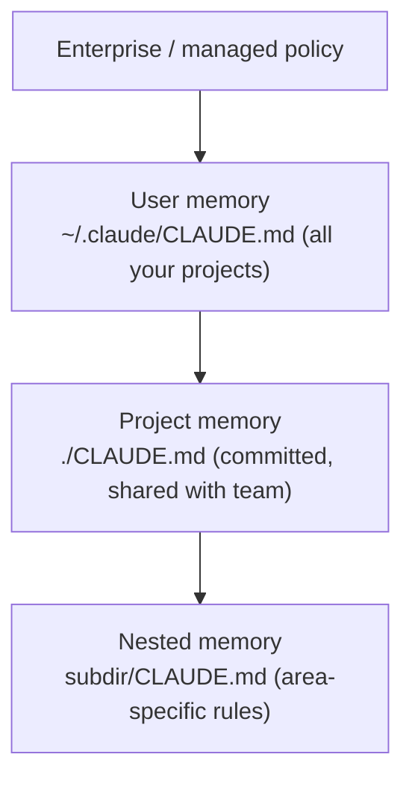

<LevelBadge level="beginner" />

<VerifyNote lastVerified="2026-06-20" source="https://code.claude.com/docs/en/memory">
يمكن أن تتغير مواقع ملفات الذاكرة وصياغة الاستيراد — تأكد من التفاصيل المحددة في وثائق ذاكرة Claude Code الرسمية.
</VerifyNote>

إذا كنت ستفعل **شيئًا واحدًا** لتحسين [Claude Code](/docs/claude-code/what-is-claude-code)، فافعل هذا. `CLAUDE.md` هو ملف نصي عادي يقرؤه Claude في بداية كل جلسة — الإحاطة الدائمة لمشروعك.

<Callout type="objectives" items={["لماذا يُعد CLAUDE.md الإعداد الأعلى أثرًا في Claude Code", "كيف يدمج التسلسل الهرمي للذاكرة من العام إلى الخاص بالمشروع", "كيف تولّد ملف انطلاق باستخدام /init ثم تختصره", "ما الذي ينتمي إلى CLAUDE.md — وما الذي يجب إبقاؤه خارجه", "كيف تتيح لك الاستيرادات @imports الإشارة إلى المستندات دون تكرارها"]} />

## لماذا هو الإعداد الأعلى أثرًا

بدونه، تشرح مشروعك من جديد في كل جلسة ("نحن نستخدم pnpm، الاختبارات في `__tests__`، لا تلمس `/generated`…"). به، يعرف Claude ذلك مسبقًا. التعليمات الجيدة هنا تحسّن *كل* تفاعل مستقبلي دفعةً واحدة.

## التسلسل الهرمي للذاكرة

يقرأ Claude Code الذاكرة من عدة أماكن ويدمجها، بترتيب يتدرج تقريبًا من الأكثر عمومية إلى الأكثر تحديدًا:

- **ذاكرة المستخدم** — تفضيلاتك الشخصية عبر كل مشروع.
- **ذاكرة المشروع** (`./CLAUDE.md`، مُودَع في المستودع) — كيف يعمل *هذا* المستودع. مشتركة مع فريقك.
- **المتداخلة** — ضع ملف `CLAUDE.md` في مجلد فرعي لقواعد تنطبق هناك فقط.

<Flashcards title="اعرف طبقات ذاكرتك" cards={[{front: "ذاكرة المستخدم", back: "~/.claude/CLAUDE.md — تفضيلاتك الشخصية التي تنطبق عبر كل مشروع."}, {front: "ذاكرة المشروع", back: "./CLAUDE.md — مُودَع ومشترك مع الفريق؛ يصف كيف يعمل هذا المستودع."}, {front: "الذاكرة المتداخلة", back: "subdir/CLAUDE.md — قواعد خاصة بمنطقة معينة تنطبق فقط داخل ذلك المجلد الفرعي."}, {front: "سياسة المؤسسة / المُدارة", back: "الطبقة الأكثر عمومية؛ سياسة على مستوى المؤسسة تعلو فوق ذاكرة المستخدم لديك."}]} />

## ولّد نقطة انطلاق

<Steps items={[{title: "شغّل /init في المشروع", body: "يفحص Claude الشيفرة ويصوغ لك ملف CLAUDE.md تلقائيًا."}, {title: "اختصره بالتحرير", body: "المسودة نقطة انطلاق، لا خط النهاية. اختصرها إلى ما هو صحيح ومفيد."}, {title: "استعِر قالبًا", body: "خذ نقطة انطلاق جاهزة من صفحة قوالب CLAUDE.md وكيّفها مع مستودعك."}]} />

<PromptCard title="ولّد مسودة CLAUDE.md">{`/init`}</PromptCard>

احصل على نقطة انطلاق جاهزة من [قوالب CLAUDE.md](/docs/templates/claude-md).

## ماذا تضع فيه

- ما هو المشروع، في جملتين.
- المكدّس التقني وكيفية **التشغيل / الاختبار / الفحص (lint)**.
- الأعراف التي لا يستطيع Claude استنتاجها (التسمية، البنية، أسلوب الـ commit).
- **الحواجز الواقية**: "شغّل الاختبارات قبل إعلان الانتهاء"، "لا تحرّر `/vendor` أبدًا"، "لا تودِع الأسرار أبدًا".

## ماذا لا تضع فيه

<Callout type="warning" items={["يتبع Claude ملف CLAUDE.md حرفيًا — التعليمات القديمة أو الغامضة أو المتمنّاة تضرّ فعليًا.", "صِف كيف يعمل المشروع فعليًا اليوم؛ القصير والصادق يتفوق على الطويل والطموح.", "تجنّب المستندات الكبيرة الملصوقة (استخدم @imports بدلًا منها)، والأسرار، والقواعد التي لا تتبعها فعلًا.", "راجعه دوريًا ليبقى دقيقًا مع تطور المشروع."]} />

## الاستيرادات

اسحب المستندات الموجودة بدلًا من تكرارها — مثلًا أشِر إلى دليل التنسيق الخاص بك عبر استيراد `@path/to/file` ليكون هناك مصدر موثوق واحد. راجع [وثائق الذاكرة الرسمية](https://code.claude.com/docs/en/memory) للصياغة المحددة.

<Callout type="tip" items={["مصدر موثوق واحد: أشِر إلى ملف عبر @imports بدلًا من لصق محتوياته داخل CLAUDE.md.", "إذا كان المستند موجودًا بالفعل، اربطه — لا تنسخه. النسخ تتقادم مع الوقت."]} />

## اختبر نفسك

<Quiz title="اختبر نفسك" questions={[{q: "أي ملف يقرؤه Claude Code في بداية كل جلسة بوصفه الإحاطة الدائمة لمشروعك؟", options: ["README.md", "CLAUDE.md", "package.json"], answer: 1, explain: "CLAUDE.md هو ملف الذاكرة النصي الذي يقرؤه Claude في بداية كل جلسة."}, {q: "ماذا يفعل تشغيل /init في مشروع؟", options: ["يُودِع CLAUDE.md في مستودع فريقك", "يصوغ ملف CLAUDE.md عبر فحص الشيفرة، ثم تختصره أنت", "يحذف ملفات الذاكرة القديمة"], answer: 1, explain: "يصوغ /init ملف CLAUDE.md ابتدائيًا من الشيفرة — المسودة نقطة انطلاق، لذا تختصرها بعد ذلك."}, {q: "ما الطريقة الموصى بها لتضمين مستند كبير موجود مثل دليل التنسيق؟", options: ["لصق المستند كاملًا داخل CLAUDE.md", "الإشارة إليه عبر استيراد @path/to/file", "تخزينه كسرّ (secret)"], answer: 1, explain: "استخدم @imports للإشارة إلى الملف ليكون هناك مصدر موثوق واحد بدلًا من نسخة مكررة تتقادم."}]} />

<Callout type="takeaways" items={["CLAUDE.md هو الإعداد الأعلى أثرًا: يحسّن كل جلسة مستقبلية دفعةً واحدة.", "تُدمج الذاكرة من العام إلى الخاص: سياسة المؤسسة، ثم ملفات CLAUDE.md للمستخدم والمشروع والمتداخلة.", "ابدأ بـ /init، ثم اختصر المسودة إلى ما هو صحيح فعلًا.", "ضمّن ملخص المشروع، وأوامر التشغيل/الاختبار/الفحص، والأعراف، والحواجز الواقية.", "أبقِه قصيرًا وصادقًا — استخدم @imports للمستندات الكبيرة، ولا تودِع الأسرار أبدًا."]} />

## التالي

- [وضع التخطيط](/docs/claude-code/plan-mode) — أول تغييرات آمنة
- [الأذونات والأوضاع](/docs/claude-code/permissions) — ما الذي يُسمح لـ Claude بفعله دون إشراف
- [الدليل التطبيقي: تخصيص Claude Code لمستودع حقيقي](/docs/walkthroughs/customize-claude-code)
