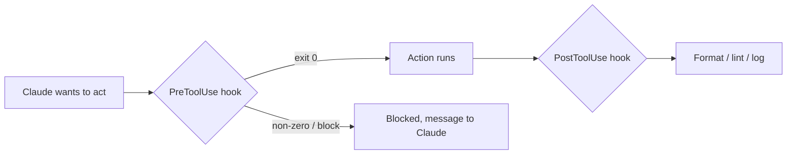

<LevelBadge level="advanced" />

<VerifyNote lastVerified="2026-06-23" source="https://code.claude.com/docs/en/hooks">
أسماء أحداث الخطافات الدقيقة، وحمولة stdin، وبروتوكول الحجب تتطور — تأكد منها مقابل وثائق الخطافات الرسمية قبل الاعتماد على حدث أو حقل محدد.
</VerifyNote>

الخطافات (Hooks) هي **أوامر صدفة (shell) يشغّلها Claude Code تلقائيًا** عند نقاط محددة في دورة حياته. وحيث تقرر [الأذونات](/docs/claude-code/permissions) *ما إذا كان* الإجراء مسموحًا، تتيح لك الخطافات *أنت* تشغيل منطق حتمي حوله — تنسيق، وتحقق، وتسجيل، وبوابات. إنها الطريقة التي تجعل بها السلوك مضمونًا بدلًا من "من فضلك تذكّر أن تفعل".

<Callout type="objectives" items={["متى تلجأ إلى خطاف بدلًا من تعليمة أو إذن", "كيف يُربط الخطاف: الحدث، والمطابِق (matcher)، وحمولة JSON على stdin", "الطريقتان اللتان يحجب بهما الخطاف إجراءً — رمز الخروج 2 مقابل JSON على stdout", "الممارسات الجيدة والأخطاء الشائعة التي تفصل الخطافات السريعة الآمنة عن البطيئة الصامتة"]} />

## متى تلجأ إلى خطاف

الجأ إلى خطاف حين تريد أن يكون السلوك *مضمونًا*، لا مجرد مطلوب. كل مهمة شائعة تتطابق مع حدث في دورة الحياة:

- **تنسيق / فحص تلقائي** بعد كل تعديل ملف (`PostToolUse`).
- **حجب** إجراء يخالف قاعدة قبل تشغيله (`PreToolUse`).
- **إشعار أو تسجيل** عند انتهاء جلسة أو إنجاز مهمة (`Stop`).
- **حقن سياق** عند بدء الجلسة.

<Flashcards title="أحداث الخطافات في لمحة" cards={[{front: "PreToolUse", back: "يُطلق قبل تشغيل الإجراء. استخدمه للحجب أو وضع بوابة — مثلًا رفض أمر مدمّر قبل أن يُنفَّذ."}, {front: "PostToolUse", back: "يُطلق بعد إجراء مطابِق. استخدمه لتنسيق أو فحص أو تسجيل ما تغيّر للتو."}, {front: "Stop", back: "يُطلق عند انتهاء جلسة أو إنجاز مهمة. استخدمه للإشعار أو التسجيل."}, {front: "بدء الجلسة", back: "يُطلق عند بداية الجلسة. استخدمه لحقن السياق."}]} />

## كيف تعمل

تسجّل الخطافات في [`settings.json`](/docs/claude-code/settings)، مطابقًا **حدثًا** (وغالبًا مطابِق أداة). عندما يُطلق الحدث، يشغّل Claude أمرك، ممرِّرًا **حمولة JSON على stdin** (اسم الأداة ومدخلاتها والجلسة). رمز خروج أمرك ومخرجاته يقرران ما يحدث بعد ذلك.

<Steps items={[{title: "طابِق حدثًا", body: "سجّل الخطاف في settings.json تحت حدث دورة الحياة الذي يهمّك — على سبيل المثال PostToolUse."}, {title: "ضيّق النطاق بمطابِق", body: "أضف مطابِق أداة بحيث يُطلق الخطاف على الأدوات ذات الصلة فقط، مثل المطابِق \"Edit|Write\" لتعديلات الملفات."}, {title: "اقرأ الحمولة من stdin", body: "عندما يُطلق الحدث، يشغّل Claude أمرك ويضخّ حمولة JSON على stdin — اسم الأداة ومدخلاتها والجلسة."}, {title: "قرّر ما يحدث بعد ذلك", body: "رمز خروج أمرك ومخرجاته يحدّدان النتيجة: السماح للإجراء بالمضي، أو تشغيل منطقك، أو حجبه."}]} />

```json
{
  "hooks": {
    "PostToolUse": [
      {
        "matcher": "Edit|Write",
        "hooks": [
          { "type": "command", "command": "jq -r '.tool_input.file_path' | xargs npx prettier --write" }
        ]
      }
    ]
  }
}
```

الخطاف أعلاه يقرأ مسار الملف المعدَّل من JSON الخاص بـ stdin (`.tool_input.file_path`) وينسّقه. لا تفترض أن متغير بيئة يحمل المسار — **اقرأه من stdin.** عناصر نائبة مفيدة للمسارات مثل `${CLAUDE_PROJECT_DIR}` *متوفرة* لتحديد مواقع السكربتات.

## كيف يحجب الخطاف

طريقتان، حسب الحدث:

- **رمز الخروج 2** — يُفشل الخطاف الإجراء، وما كتبه إلى **stderr** يصبح الرسالة التي يراها Claude. بسيط ويعمل مع خطافات الأوامر.
- **JSON على stdout (خروج 0)** — أعِد قرارًا منظمًا. بالنسبة لـ `PreToolUse`، يكون ذلك `permissionDecision` بقيمة `deny`؛ وبالنسبة لـ `PostToolUse`/`Stop`/إلخ يكون `{"decision": "block", "reason": "…"}`.

السكربت أدناه هو خطاف `PreToolUse` على أداة Bash. اقرأه من الأعلى إلى الأسفل: يسحب الأمر من stdin، وإذا بدا مدمّرًا، يكتب سببًا إلى stderr ويخرج بالرمز 2 للحجب.

```bash
#!/usr/bin/env bash
# PreToolUse hook on the Bash tool: refuse to delete things.
command=$(jq -r '.tool_input.command' < /dev/stdin)
if [[ "$command" == rm\ * || "$command" == *"rm -rf"* ]]; then
  echo "Blocked: destructive 'rm' is not allowed by policy." >&2
  exit 2
fi
exit 0
```

## النموذج الذهني

خطاف `PreToolUse` يعمل *قبل* الإجراء ويمكنه حجبه؛ وخطاف `PostToolUse` يعمل *بعد* نجاحه ويتفاعل مع النتيجة.



## ممارسات جيدة

- **اجعل الخطافات سريعة ومتكافئة الأثر (idempotent)** — فهي تعمل كثيرًا.
- **افشل بصوت عالٍ عند المشكلات الحقيقية**، لكن لا تحجب على المسائل التجميلية.
- **عامل مخرجات الخطاف كملاحظات لـ Claude** — رسالة واضحة تساعده على التصحيح الذاتي.
- تعمل الخطافات بصلاحيات صدفتك — راجع أي خطاف لم تكتبه أنت ([مراجعة شيفرة الطرف الثالث](/docs/security/reviewing-third-party-code)).

## أخطاء شائعة

- **قراءة مسار الملف من متغير بيئة.** المسار موجود في JSON الخاص بـ stdin (`.tool_input.file_path`)، لا في `$CLAUDE_FILE_PATH`. مرّر stdin عبر `jq`.
- **حجب صامت.** إذا خرج خطاف `PreToolUse` بالرمز 2 دون شيء على stderr، فإن Claude محجوب لكنه لا يعرف *لماذا* ولا يستطيع التكيف. اكتب دائمًا سببًا واضحًا.
- **خطافات بطيئة.** يعمل خطاف `PostToolUse` بعد *كل* تعديل مطابق. مدقّق فحص يستغرق 3 ثوانٍ يجعل الجلسة كلها تبدو بطيئة — اجعل الخطافات سريعة، ومن الأفضل أن تعمل فقط على ما تغيّر.
- **مطابِقات واسعة أكثر من اللازم.** `matcher: ".*"` يُطلق على كل أداة. ضيّق بنطاق باسم دقيق، أو قائمة `Edit|Write`، أو حقل `if` لكل معالج (مثلًا `"if": "Bash(git push *)"`).
- **الوثوق بخطافات لم تكتبها.** يشغّل الخطاف صدفة تعسفية بصلاحياتك. راجع أي خطاف من إضافة أو قالب أولًا — انظر [مراجعة شيفرة الطرف الثالث](/docs/security/reviewing-third-party-code).

<Callout type="warning" items={["يشغّل الخطاف صدفة تعسفية بصلاحياتك — لا تربط أبدًا خطافًا من إضافة أو قالب دون قراءته أولًا."]} />

نقاط انطلاق جاهزة للنسخ واللصق في [وصفات الخطافات و settings.json](/docs/templates/hooks-settings).

<PromptCard title="تنسيق الملفات المعدَّلة تلقائيًا (PostToolUse على Edit|Write)">{`{
  "hooks": {
    "PostToolUse": [
      {
        "matcher": "Edit|Write",
        "hooks": [
          { "type": "command", "command": "jq -r '.tool_input.file_path' | xargs npx prettier --write" }
        ]
      }
    ]
  }
}`}</PromptCard>

<Quiz title="اختبر نفسك" questions={[{q: "أين يجد الخطاف مسار الملف الذي عُدِّل للتو؟", options: ["في متغير البيئة $CLAUDE_FILE_PATH", "في حمولة JSON على stdin، عند .tool_input.file_path", "في وسيط سطر أوامر يمرّره Claude"], answer: 1, explain: "المسار موجود في JSON الخاص بـ stdin (.tool_input.file_path)، لا في متغير بيئة. مرّر stdin عبر jq لقراءته."}, {q: "خطاف PreToolUse يخرج بالرمز 2. ماذا يحدث؟", options: ["يُسمح بالإجراء ويُسجَّل stdout", "يُحجب الإجراء، وما كتبه الخطاف إلى stderr يصبح الرسالة التي يراها Claude", "يتجاهل Claude النتيجة لأن الخروج 2 محجوز"], answer: 1, explain: "رمز الخروج 2 يُفشل الإجراء؛ ويصبح stderr الرسالة التي يراها Claude. اكتب دائمًا سببًا واضحًا حتى يتمكن Claude من التكيف."}, {q: "لماذا يُعدّ المطابِق \".*\" خطأً شائعًا؟", options: ["إنه JSON غير صالح ويكسر settings.json", "يُطلق على كل أداة، فيعمل الخطاف أكثر بكثير مما هو مقصود — ضيّقه باسم دقيق، أو قائمة Edit|Write، أو حقل if", "يطابق أداة Bash فقط"], answer: 1, explain: "المطابِق واسع النطاق يُطلق على كل أداة. ضيّقه لإبقاء الخطافات سريعة ومحدَّدة الهدف."}]} />

<Callout type="takeaways" items={["الخطافات تجعل السلوك مضمونًا، لا مطلوبًا — فهي تشغّل منطقًا حتميًا حول الإجراءات التي تكتفي الأذونات بالسماح بها أو رفضها.", "سجّل خطافًا في settings.json مقابل حدث إلى جانب مطابِق؛ يضخّ Claude حمولة JSON على stdin ويقرأ رمز خروجك ومخرجاتك.", "اقرأ مسار الملف من stdin (.tool_input.file_path) — لا من متغير بيئة.", "احجب برمز الخروج 2 (يصبح stderr الرسالة) أو بـ JSON منظم على stdout (خروج 0)؛ وأدرج دائمًا سببًا واضحًا.", "اجعل الخطافات سريعة ومتكافئة الأثر ومطابَقة بدقة — وراجع أي خطاف لم تكتبه، فهو يعمل بصلاحيات صدفتك."]} />

## التالي

- [settings.json](/docs/claude-code/settings) · [الأذونات](/docs/claude-code/permissions)
- [المهارات (Skills)](/docs/claude-code/skills) — الخبرة مقابل الأتمتة
- [تحصين عمليات التشغيل الذاتية](/docs/security/hardening-autonomous-runs)
