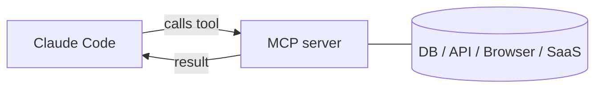

<LevelBadge level="advanced" />

<VerifyNote lastVerified="2026-06-23" source="https://code.claude.com/docs/en/mcp">
أوامر `claude mcp` ونطاقات الإعداد ووسائط النقل تتطور باستمرار — تأكد منها في وثائق MCP الرسمية لـ Claude Code وعلى modelcontextprotocol.io.
</VerifyNote>

**بروتوكول سياق النموذج (MCP)** هو معيار مفتوح لربط الذكاء الاصطناعي بالأدوات والبيانات الخارجية. يكشف **خادم MCP** عن قدرات معينة (الاستعلام من قاعدة بيانات، فتح طلب سحب على GitHub، قيادة متصفح)؛ ويتصل به Claude Code ويستطيع **استدعاء تلك الأدوات** أثناء الجلسة. إنها الطريقة التي تمدّ بها Claude إلى ما وراء نظام ملفاتك وصدفتك.

<Callout type="objectives" items={["اشرح ما هو خادم MCP وكيف يستدعي Claude Code أدواته", "ميّز بين وسيطتي النقل: stdio المحلية مقابل HTTP/SSE البعيدة", "أضف خادمًا باستخدام claude mcp add واقرأ ملف JSON الذي يكتبه", "اختر النطاق الصحيح (محلي، مشروع، مستخدم) لتحديد من يرى الخادم", "اربط قاعدة بيانات حقيقية بـ Claude من البداية حتى النهاية", "تجنّب أفخاخ الأمان والإعداد التي يقع فيها معظم الناس"]} />

## الشكل العام



تعلن عن الخوادم التي يجوز لـ Claude استخدامها؛ وينشر كل خادم مجموعة من الأدوات مع مخططاتها (schemas)؛ ويختارها Claude ويستدعيها مثل أي أداة أخرى.

<Flashcards title="مفردات MCP" cards={[{front: "بروتوكول سياق النموذج (MCP)", back: "معيار مفتوح لربط الذكاء الاصطناعي بالأدوات والبيانات الخارجية."}, {front: "خادم MCP", back: "برنامج يكشف عن قدرات — الاستعلام من قاعدة بيانات، فتح طلب سحب على GitHub، قيادة متصفح — في صورة أدوات قابلة للاستدعاء."}, {front: "أداة", back: "قدرة ينشرها خادم MCP مع مخطط (schema)؛ يختارها Claude ويستدعيها مثل أي أداة أخرى."}, {front: "وسيطة النقل", back: "كيف يصل Claude إلى الخادم: stdio (عملية محلية) أو HTTP/SSE البعيدة (مستضافة، وغالبًا مع OAuth)."}, {front: "النطاق", back: "من يرى الخادم: محلي (أنت، هذا المشروع)، مشروع (الفريق المُلتزَم بالمستودع)، أو مستخدم (أنت، في كل مكان)."}]} />

## وسائط النقل

هناك طريقتان يصل بهما Claude إلى الخادم. اختر حسب المكان الذي يعمل فيه الخادم.

- **stdio** — عملية محلية يطلقها Claude (رائعة للأدوات/الـ CLIs المحلية).
- **عن بُعد (HTTP/SSE)** — خادم مستضاف، غالبًا مع OAuth.

## إعداد الخوادم

أسرع طريق هو أمر `claude mcp add` — فهو يكتب الإعداد نيابةً عنك. اتبع هذا التسلسل للانتقال من الصفر إلى خادم متصل.

<Steps items={[{title: "أضف خادم stdio محليًا", body: "شغّل claude mcp add — كل ما يأتي بعد -- هو أمر التشغيل الذي يُنفّذه Claude نيابةً عنك."}, {title: "أو أضف خادم HTTP بعيدًا", body: "مرّر --transport http ونطاقًا، ثم عنوان URL للخادم. الخوادم البعيدة غالبًا ما تكون مستضافة وتستخدم OAuth."}, {title: "اطّلع على ما هو متصل", body: "شغّل claude mcp list لعرض الخوادم المُعدّة وحالة اتصالها."}, {title: "افحص وصادِق", body: "استخدم /mcp داخل الجلسة لفحص أدوات الخادم والمصادقة على الخوادم البعيدة."}]} />

<PromptCard title="أضف خادم stdio محليًا">{`# A local stdio server (everything after -- is the launch command)
claude mcp add github -- npx -y @modelcontextprotocol/server-github`}</PromptCard>

<PromptCard title="أضف خادم HTTP بعيدًا (مشترك مع المشروع)">{`# A remote HTTP server, shared with everyone on the project
claude mcp add --transport http --scope project linear https://mcp.linear.app/mcp`}</PromptCard>

تحت الغطاء، هذا مجرد JSON. الخادم ذو النطاق **project** يستقر في ملف `.mcp.json` في جذر المستودع — أدرجه في نظام التحكم بالإصدارات فيحصل فريقك كله على الأدوات نفسها:

```json
{
  "mcpServers": {
    "github": { "command": "npx", "args": ["-y", "@modelcontextprotocol/server-github"] }
  }
}
```

### النطاق يحدّد من يرى الخادم

| النطاق | يوجد في | استخدمه لـ |
|---|---|---|
| `local` (الافتراضي) | إعداداتك الشخصية، هذا المشروع فقط | التجارب الشخصية، الأسرار |
| `project` | `.mcp.json` في المستودع (مُلتزَم به) | الأدوات التي ينبغي أن يتشاركها الفريق كله |
| `user` | إعداداتك الشخصية، كل المشاريع | الخوادم التي تريدها في كل مكان |

شغّل `claude mcp list` لمعرفة ما هو متصل، و`/mcp` داخل الجلسة لفحص الأدوات والمصادقة على الخوادم البعيدة. راجع [إعداد MCP وهياكل الخوادم](/docs/templates/mcp-config) لنقاط بدء جاهزة للنسخ واللصق.

## مثال عملي: امنح Claude قاعدة بياناتك

لنفترض أنك تريد أن يجيب Claude عن الأسئلة بالاعتماد على قاعدة Postgres محلية بدلاً من أن تلصق أنت نتائج الاستعلامات. أضف الخادم (بنطاق المشروع، حتى يرثه زملاؤك):

<PromptCard title="أضف خادم Postgres بنطاق المشروع">{`claude mcp add --scope project db -- npx -y @modelcontextprotocol/server-postgres "postgresql://localhost/app"`}</PromptCard>

الآن يمكنك في الجلسة أن تطرح السؤال بلغة طبيعية وتترك Claude يقوم بحلقة الاستعلام نيابةً عنك:

<PromptCard title="اطرح سؤالًا على قاعدة البيانات">{`How many users signed up last week? Check the DB.`}</PromptCard>

يستدعي Claude أداة `query` الخاصة بالخادم، ويستعيد الصفوف، ويُجيب — دون حلقة نسخ ولصق. ولأنه بنطاق المشروع، فإن أي زميل يسحب المستودع يحصل على القدرة نفسها لحظة فتحه Claude Code. أبقِ سلسلة الاتصال للقراءة فقط إن كنت تريد عمليات القراءة فحسب.

## الثقة والأمان

<Callout type="warning" items={["خادم MCP يشغّل شيفرة ويمكنه قراءة البيانات واتخاذ إجراءات — لا تتصل إلا بالخوادم التي تثق بها.", "امنح كل خادم أقل صلاحية يحتاجها.", "أي محتوى خارجي يعيده الخادم قد يحمل حقن المطالبات (prompt injection).", "راجع خوادم الطرف الثالث قبل الاتصال بها."]} />

:::warning عامِل خوادم MCP كتثبيت برنامج
يشغّل خادم MCP شيفرة ويمكنه قراءة البيانات واتخاذ إجراءات. لا تتصل إلا بالخوادم التي تثق بها، وامنحها **أقل صلاحية** لازمة، وتذكّر أن أي محتوى خارجي تعيده قد يحمل [حقن المطالبات (prompt injection)](/docs/security/prompt-injection). راجع خوادم الطرف الثالث أولًا — انظر [مراجعة شيفرة الطرف الثالث](/docs/security/reviewing-third-party-code).
:::

## MCP في التطبيقات أيضًا

يشغّل MCP أيضًا **الموصلات (Connectors)** في تطبيقات Claude — المعيار نفسه، سطح مختلف. انظر [الموصلات (MCP) في التطبيقات](/docs/claude-app/connectors)، وبالنسبة للـ API، [MCP والاتصال بالأدوات](/docs/api/mcp).

## الأخطاء الشائعة

- **النطاق الخاطئ.** الخادم المُضاف بنطاق `local` لن يظهر للزملاء؛ وما أردته لنفسك فقط لا ينبغي الالتزام به بنطاق `project`. اختر بقصد ووعي.
- **خوادم كثيرة جدًا، أدوات كثيرة جدًا.** يضيف كل خادم متصل مخططات أدواته إلى السياق. اتصل بما تحتاجه المهمة، لا بكامل فهرسك.
- **اتصالات مُفرطة الصلاحيات.** امنح خادم قاعدة البيانات دورًا للقراءة فقط ما لم يكن Claude بحاجة فعلية للكتابة. يجعل MCP القدرات حقيقية — فقلّص نطاقها.
- **نسيان خطر الحقن.** أي شيء يعيده الخادم (صفحة ويب، نص مشكلة، صف بيانات) هو نص غير موثوق قد يحمل [حقن المطالبات (prompt injection)](/docs/security/prompt-injection). لا تربط خادمًا قويًا قادرًا على الكتابة بجوار خادم غير موثوق قادر على القراءة دون تفكير متأنٍّ.

<Quiz title="اختبر نفسك" questions={[{q: "أيُّ وسيطة نقل هي عملية محلية يطلقها Claude بنفسه؟", options: ["HTTP/SSE البعيدة", "stdio", "OAuth"], answer: 1, explain: "stdio هي عملية محلية يطلقها Claude — مثالية للأدوات المحلية والـ CLIs. أما HTTP/SSE البعيدة فهي خادم مستضاف، غالبًا مع OAuth."}, {q: "أين يُكتب الخادم ذو نطاق المشروع، وما الفائدة؟", options: ["في إعداداتك الشخصية؛ أنت وحدك تراه", "في ملف .mcp.json في جذر المستودع؛ أدرجه في نظام التحكم بالإصدارات فيحصل الفريق كله على الأدوات نفسها", "في ذاكرة تخزين عامة مخفية؛ لا أحد يستطيع تحريرها"], answer: 1, explain: "نطاق المشروع يستقر في ملف .mcp.json مُلتزَم به في جذر المستودع، فيرث الزملاء الذين يسحبون المستودع الأدوات نفسها."}, {q: "لماذا تُبقي اتصال قاعدة البيانات للقراءة فقط عندما يحتاج Claude إلى القراءة فحسب؟", options: ["لأنه يجعل الاستعلامات تعمل أسرع", "أقل الصلاحيات — يجعل MCP القدرات حقيقية، فلا تمنح صلاحية الكتابة ما لم تكن لازمة فعلًا", "القراءة فقط مطلوبة بحكم البروتوكول"], answer: 1, explain: "امنح الخوادم أقل صلاحية تحتاجها. يجعل MCP القدرات حقيقية، لذا فإن دور القراءة فقط يتجنّب عمليات الكتابة غير المقصودة."}]} />

<Callout type="takeaways" items={["MCP معيار مفتوح؛ ويكشف خادم MCP عن أدوات يستدعيها Claude Code مثل أي أداة أخرى.", "وسيطتا نقل: stdio المحلية (عملية يطلقها Claude) وHTTP/SSE البعيدة (مستضافة، غالبًا مع OAuth).", "claude mcp add يكتب الإعداد نيابةً عنك؛ وتحت الغطاء هو JSON، ونطاق المشروع يقيم في ملف .mcp.json مُلتزَم به.", "النطاق يتحكم في الظهور: محلي (أنت، هذا المشروع)، مشروع (مُلتزَم به للفريق)، مستخدم (أنت، في كل مكان).", "عامِل الخوادم كتثبيت برنامج: الثقة، وأقل الصلاحيات، والحذر من حقن المطالبات في أي شيء تعيده."]} />

## التالي

- [ابنِ واربط خادم MCP الأول (دليل تطبيقي)](/docs/walkthroughs/first-mcp-server)
- [إعداد MCP وهياكل الخوادم](/docs/templates/mcp-config)
- [تأمين الوكلاء والأدوات](/docs/security/securing-agents)
