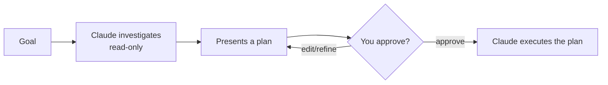

<LevelBadge level="beginner" />

<Callout type="objectives" items={["شرح ما يفعله وضع التخطيط ولماذا هو قرائي فقط", "تحديد متى تخطط أولًا ومتى يمكنك تخطّيه", "السير عبر حلقة التحقيق-الاقتراح-الموافقة-التنفيذ", "التمييز بين وضع التخطيط والأذونات واستخدامهما معًا"]} />

<VerifyNote lastVerified="2026-06-20" source="https://code.claude.com/docs/en">
طريقة دخولك إلى وضع التخطيط (اختصار/علم) قد تتغير بين الإصدارات — راجع وثائق Claude Code الرسمية.
</VerifyNote>

## الفكرة الأساسية

تخيّل أنك تسلّم مقاولًا مفاتيح منزلك، مقابل أن تطلب منه أولًا أن يتجوّل ويكتب *ما الذي* سيغيّره. وضع التخطيط هو الجولة.

يجعل **وضع التخطيط** Claude Code **قرائيًا فقط**: يمكنه استكشاف قاعدة شيفرتك، وتشغيل عمليات البحث، والاستدلال — لكنه **لن يحرّر الملفات أو يشغّل أوامر مغيّرة للحالة**. بل ينتج خطة وينتظر موافقتك.

<Callout type="tip" items={["القرائي فقط يعني أن Claude يفكّر لكنه لا يتصرّف — لا تعديلات على الملفات، ولا أوامر مغيّرة للحالة، حتى تقول له ابدأ."]} />

## لماذا هي أكثر الطرق أمانًا للبدء

لأي شيء كبير أو محفوف بالمخاطر أو غير مألوف، تريد أن ترى *ما الذي* ينوي Claude فعله قبل أن يمسّ مستودعك. يفصل وضع التخطيط **التفكير** عن **التنفيذ**:

المكسب: تكتشف الافتراضات الخاطئة *قبل* أن تصبح شيفرة خاطئة.

## متى تستخدمه

<Callout type="tip" items={["دائمًا للتغييرات الكبيرة أو متعددة الملفات، أو عمليات النقل (migrations)، أو إعادة الهيكلة (refactors)", "عند العمل في قاعدة شيفرة لا تعرفها بالكامل بعد", "عندما تريد خطة قابلة للمراجعة لمشاركتها مع زميل"]} />

بالنسبة للتعديلات الصغيرة الواضحة يمكنك تخطّيه — لكن عند الشك، خطّط أولًا.

## كيف يعمل عمليًا

اتبع الحلقة. كل خطوة تستحق التالية — لا ينتقل Claude إلى التحرير إلا *بعد* موافقتك.

<Steps items={[{title: "ادخل وضع التخطيط واذكر هدفك", body: "انتقل إلى الوضع القرائي فقط، ثم صف ما تريد تحقيقه."}, {title: "يحقّق Claude", body: "يقرأ الملفات ذات الصلة ويطرح أسئلة توضيحية."}, {title: "يعيد Claude خطة خطوة بخطوة", body: "الملفات المراد تغييرها، والنهج، وكيفية التحقق من النتيجة."}, {title: "توافق أو تنقّح", body: "لا ينتقل Claude إلى إجراء التغييرات إلا بعد الموافقة."}]} />

### جرّبه بنفسك

انسخ هذا في جلسة تخطيط حقيقية وشاهد الحلقة تتكشّف:

<PromptCard title="ابدأ جلسة تخطيط">{`I want to migrate our auth from sessions to JWT. Stay in Plan Mode: investigate the current setup, ask anything you need, then propose a step-by-step plan with files to change and how to verify — don't edit anything yet.`}</PromptCard>

:::tip اقرنه بـ CLAUDE.md
يجعل [CLAUDE.md](/docs/claude-code/claude-md) الجيد الخطط أكثر دقة — يخطط Claude وأعرافك وحواجزك الواقية حاضرة في ذهنه بالفعل.
:::

## وضع التخطيط مقابل الأذونات

التباس كلاسيكي. إنهما يحلّان مشكلتين مختلفتين ويعملان معًا:

- **وضع التخطيط** = "حقّق واقترح، لا تتصرف بعد." (هذه الصفحة.)
- **[الأذونات](/docs/claude-code/permissions)** = بمجرد التصرف، *أي* الإجراءات مسموح بها دون سؤال.

فكّر فيه على أنه **هل تتصرف الآن** (وضع التخطيط) مقابل **أي الإجراءات مسموح بها بمجرد التصرف** (الأذونات).

<Flashcards cards={[{front: "في أي حالة يضع وضع التخطيط Claude Code؟", back: "قرائي فقط — يمكنه الاستكشاف والبحث والاستدلال، لكنه لن يحرّر الملفات أو يشغّل أوامر مغيّرة للحالة حتى توافق."}, {front: "ما هي حلقة وضع التخطيط؟", back: "التحقيق (قرائي فقط) ← تقديم خطة ← توافق أو تنقّح ← ينفّذ Claude."}, {front: "متى ينبغي أن تلجأ إلى وضع التخطيط؟", back: "افتراضيًا للعمل الكبير أو المحفوف بالمخاطر أو غير المألوف (تغييرات متعددة الملفات، عمليات نقل، إعادة هيكلة، قواعد شيفرة غير معروفة). تخطّاه فقط للتعديلات الصغيرة الواضحة."}, {front: "وضع التخطيط مقابل الأذونات؟", back: "يحكم وضع التخطيط ما إذا كنت ستتصرف الآن؛ وتحكم الأذونات أي الإجراءات مسموح بها بمجرد التصرف."}]} />

<Callout type="takeaways" items={["وضع التخطيط قرائي فقط: يستكشف Claude ويقترح لكنه لا يحرّر أو يشغّل أوامر مغيّرة للحالة أبدًا حتى توافق", "استخدمه افتراضيًا للعمل الكبير أو المحفوف بالمخاطر أو غير المألوف؛ تخطّاه فقط للتعديلات الصغيرة الواضحة", "الحلقة هي التحقيق ثم الاقتراح ثم الموافقة/التنقيح ثم التنفيذ", "يحكم وضع التخطيط ما إذا كنت ستتصرف الآن؛ وتحكم الأذونات أي الإجراءات مسموح بها بمجرد التصرف"]} />

<Quiz title="اختبر نفسك" questions={[{q: "ماذا يستطيع Claude Code أن يفعل أثناء وجوده في وضع التخطيط؟", options: ["تحرير الملفات وتشغيل أي أمر", "الاستكشاف والبحث والاستدلال — لكن دون تحرير الملفات أو تشغيل أوامر مغيّرة للحالة", "الإجابة عن الأسئلة فقط، دون أي وصول إلى الملفات على الإطلاق"], answer: 1, explain: "وضع التخطيط قرائي فقط: يمكن لـ Claude استكشاف قاعدة الشيفرة وتشغيل عمليات البحث والاستدلال، لكنه لن يحرّر الملفات أو يشغّل أوامر مغيّرة للحالة."}, {q: "متى ينبغي أن تلجأ إلى وضع التخطيط؟", options: ["فقط لإصلاح أخطاء طباعية من سطر واحد", "للتغييرات الكبيرة أو متعددة الملفات، أو عمليات النقل، أو إعادة الهيكلة، أو قواعد الشيفرة غير المألوفة", "أبدًا — فهو يبطّئك فحسب"], answer: 1, explain: "استخدمه دائمًا للتغييرات الكبيرة أو متعددة الملفات، أو عمليات النقل، أو إعادة الهيكلة، وعند العمل في قاعدة شيفرة لا تعرفها بالكامل بعد. أما التعديلات الصغيرة الواضحة فيمكن تخطّيه فيها."}, {q: "ما هو الترتيب الصحيح لحلقة وضع التخطيط؟", options: ["التنفيذ، ثم التحقيق، ثم الموافقة", "التحقيق (قرائي فقط)، تقديم خطة، توافق أو تنقّح، ثم ينفّذ Claude", "الموافقة أولًا، ثم يحقّق Claude ويحرّر"], answer: 1, explain: "يحقّق Claude بوضع قرائي فقط، ويقدّم خطة، فتوافق أو تنقّح، وعندئذٍ فقط ينتقل إلى تنفيذ الخطة."}, {q: "بماذا يختلف وضع التخطيط عن الأذونات؟", options: ["إنهما اسمان لنفس الميزة", "وضع التخطيط = حقّق واقترح، لا تتصرف بعد؛ الأذونات = بمجرد التصرف، أي الإجراءات مسموح بها دون سؤال", "تقرّر الأذونات ما إذا كنت ستخطّط؛ ويقرّر وضع التخطيط أي الملفات يجب تحريرها"], answer: 1, explain: "يفصل وضع التخطيط التفكير عن التنفيذ. وتتحكم الأذونات في أي الإجراءات مسموح بها دون سؤال بمجرد أن يبدأ Claude بالتصرف. وهما يعملان معًا."}]} />

## التالي

- [الأذونات وأوضاع الأذونات](/docs/claude-code/permissions)
- [إدارة السياق](/docs/claude-code/context-management) — أبقِ الجلسات الطويلة فعّالة
- [الدليل التطبيقي: تخصيص Claude Code لمستودع حقيقي](/docs/walkthroughs/customize-claude-code)
