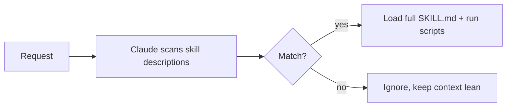

<LevelBadge level="advanced" />

<VerifyNote lastVerified="2026-06-23" source="https://code.claude.com/docs/en/skills">
تخطيط ملف المهارة، والكشف التدريجي، وأين تعمل المهارات (Claude Code، Claude.ai، Cowork) كلها في تطور مستمر — تأكد من ذلك في وثائق المهارات الرسمية.
</VerifyNote>

<Callout type="objectives" items={["تعريف ما هي المهارة وكيف تختلف عن حشو كل شيء داخل CLAUDE.md", "قراءة وكتابة ملف SKILL.md — الواجهة الأمامية إضافةً إلى التعليمات — وفهم لماذا يكون الوصف هو المُحفّز", "شرح الكشف التدريجي ولماذا يتيح توسّع مهارات كثيرة دون إثقال السياق", "معرفة الأماكن الثلاثة التي تقيم فيها المهارات: شخصية، ومشروع، ومُحزّمة داخل إضافة", "الاختيار الصحيح بين المهارة، وأمر الشرطة المائلة، والوكيل الفرعي، وMCP", "تجنّب الأخطاء الأربعة الشائعة التي تمنع المهارات من التحفّز"]} />

تُحزّم **المهارة** خبرة — تعليمات إضافةً إلى سكربتات وموارد اختيارية — يحمّلها Claude **فقط عندما تكون ذات صلة**. فبدلًا من حشو كل شيء داخل [CLAUDE.md](/docs/claude-code/claude-md)، تمنح Claude مكتبة من القدرات يسحبها عند الطلب.

## التشريح

المهارة هي مجلد به ملف `SKILL.md`: واجهة أمامية YAML + تعليمات.

```markdown
---
name: pdf-forms
description: Use when the user needs to fill, read, or generate PDF forms.
---

# PDF Forms
Steps and rules for working with PDF forms…
(optionally reference scripts/ or resources/ in this folder)
```

<Callout type="tip" items={["الوصف هو المُحفّز — يقرؤه Claude ليقرر متى يفعّل المهارة. اكتبه على هيئة \"Use when…\"، محددًا بما يكفي ليُحمَّل في الوقت الصحيح ولا يُحمَّل في غيره."]} />

## الكشف التدريجي (لماذا تتوسع المهارات)

لا يحمّل Claude المتن الكامل لكل مهارة مقدمًا — بل يرى `name` + `description` الخفيفين، ولا يسحب التعليمات الكاملة (ويشغّل السكربتات) إلا عندما يطابق طلب ما. هذا يبقي السياق خفيفًا حتى مع تثبيت مهارات كثيرة.



## أين تقيم

<Steps items={[{title:"شخصية", body:"‎~/.claude/skills/<name>/SKILL.md — تبقى ملكك، ومتاحة عبر كل مشاريعك."},{title:"مشروع (قابلة للمشاركة)", body:"‎.claude/skills/<name>/SKILL.md — أدرجها في git فيحصل الفريق كله على القدرة."},{title:"مُحزّمة داخل إضافة", body:"احزم المهارات داخل إضافة لتوزيعها على الفريق. راجع الإضافات والأسواق."}]} />

يأتي AILmanac مزوّدًا بـ [7 حزم مهارات جاهزة](/docs/templates/skills) — انسخ واحدة لتجربتها.

## مثال عملي: مهارة تُحفّز نفسها

أنشئ `~/.claude/skills/release-notes/SKILL.md`:

```markdown
---
name: release-notes
description: Use when the user asks to write release notes or a changelog from git history.
---

# Release Notes
1. Run `git log <last-tag>..HEAD --oneline` to get the commits.
2. Group them into Features / Fixes / Breaking changes.
3. Write user-facing notes — what changed for *users*, not commit messages.
4. Output Markdown ready to paste into a GitHub release.
```

لاحقًا تكتب الموجّه أدناه. لم يكن لدى Claude هذه الخطوات في السياق إطلاقًا — لكن الطلب يطابق حقل `description`، فيسحب `SKILL.md` الكامل، ويشغّل `git log`، وينتج ملاحظات مجمَّعة. لم تستدعِ شيئًا بالاسم؛ **الوصف هو الذي قام بالتوجيه**. أضف ملف `scripts/` في المجلد نفسه فتستطيع المهارة تشغيله كجزء من الخطوة 1.

<PromptCard title="حفّز المهارة بالنية — دون الحاجة إلى اسم">{`Draft release notes since v1.4.`}</PromptCard>

## المهارة مقابل الأمر مقابل الوكيل الفرعي مقابل MCP

| الأداة | ما هي | أنت أم Claude يُحفّز |
|---|---|---|
| [أمر الشرطة المائلة](/docs/claude-code/slash-commands) | موجّه محفوظ | **أنت** تستدعيه |
| **المهارة** | خبرة عند الطلب + سكربتات | **Claude** يحمّلها عند الصلة |
| [الوكيل الفرعي](/docs/claude-code/subagents) | وكيل مُفوَّض له سياقه الخاص | Claude يفوّض |
| [MCP](/docs/claude-code/mcp) | اتصال بأدوات/بيانات خارجية | يوفّر أدوات للاستدعاء |

<Callout type="takeaways" items={["تريد إطلاقه عند الطلب ← أمر شرطة مائلة.", "ينبغي أن يعرف Claude الإجراء ويطبّقه عند الصلة ← مهارة.", "ينبغي أن يحدث العمل في سياق منفصل ← وكيل فرعي.", "تحتاج إلى الوصول إلى نظام خارجي ← MCP."]} />

## أخطاء شائعة

<Callout type="warning" items={["وصف لا يُحفّز. \"Helps with PDFs\" غامض جدًا؛ أما \"Use when the user needs to fill, read, or generate PDF forms\" فيخبر Claude بالضبط متى يحمّله. الوصف هو آلية التفعيل بأكملها — اكتبه للمطابقة، لا للبشر.", "وضع كل شيء في CLAUDE.md بدلًا من ذلك. يُحمَّل CLAUDE.md في كل جلسة ويكلّف سياقًا دائمًا؛ أما المهارة فتُحمَّل فقط عند الصلة. انقل الإجراءات الظرفية إلى مهارات واحتفظ بـ CLAUDE.md لقواعد المشروع الصحيحة دائمًا.", "مهارة عملاقة واحدة. مهارات صغيرة كثيرة موصوفة بدقة توجِّه أفضل من مهارة واحدة شاملة — الكشف التدريجي لا يفيد إلا إذا كان كل وصف محددًا.", "نسيان أنها قابلة للمشاركة. مهارة مشروع في .claude/skills/ مُدرَجة في git تمنح الفريق كله القدرة؛ أما المهارة الشخصية في ~/.claude/skills/ فتبقى لك."]} />

## مراجعة المصطلحات

<Flashcards cards={[{front:"ما هي المهارة؟", back:"مجلد به ملف SKILL.md يحزّم تعليمات إضافةً إلى سكربتات وموارد اختيارية، يحمّلها Claude فقط عندما تكون ذات صلة."},{front:"ما هو مُحفّز المهارة؟", back:"حقل description — يقرؤه Claude ليقرر متى يفعّل المهارة. اكتبه على هيئة \"Use when…\"، محددًا بما يكفي ليُحمَّل في الوقت الصحيح ولا يُحمَّل في غيره."},{front:"ما هو الكشف التدريجي؟", back:"يرى Claude name + description الخفيفين فقط مقدمًا، ولا يسحب SKILL.md الكامل (ويشغّل السكربتات) إلا عندما يطابق طلب ما — مما يبقي السياق خفيفًا حتى مع مهارات كثيرة."},{front:"موقع المهارة الشخصية مقابل مهارة المشروع؟", back:"شخصية: ~/.claude/skills/<name>/SKILL.md (تبقى ملكك). مشروع: .claude/skills/<name>/SKILL.md (أدرجها في git لمشاركتها مع الفريق)."},{front:"المهارة مقابل أمر الشرطة المائلة؟", back:"أنت تستدعي أمر الشرطة المائلة عند الطلب؛ بينما يحمّل Claude المهارة تلقائيًا عندما يطابق الطلب وصفها."},{front:"المهارة مقابل CLAUDE.md؟", back:"يُحمَّل CLAUDE.md في كل جلسة ويكلّف سياقًا دائمًا؛ أما المهارة فتُحمَّل فقط عند الصلة. احتفظ بالقواعد الصحيحة دائمًا في CLAUDE.md، والإجراءات الظرفية في المهارات."}]} />

## اختبر نفسك

<Quiz title="اختبر نفسك" questions={[{q:"في ملف SKILL.md، ما الذي يقرر فعليًا متى يفعّل Claude المهارة؟", options:["اسم المجلد","حقل description في الواجهة الأمامية","العنوان الأول في المتن","الاستدعاء اليدوي من المستخدم"], answer:1, explain:"الوصف هو المُحفّز — يقرؤه Claude ليقرر متى يفعّل المهارة. اكتبه على هيئة \"Use when…\"، محددًا بما يكفي ليُحمَّل في الوقت الصحيح."},{q:"ما هو الكشف التدريجي؟", options:["يحمّل Claude المتن الكامل لكل مهارة مقدمًا","يرى Claude name + description فقط، ولا يحمّل SKILL.md الكامل إلا عندما يطابق طلب ما","تكشف المهارات خطواتها سطرًا سطرًا للمستخدم","يُحمَّل CLAUDE.md تدريجيًا عبر الجلسة"], answer:1, explain:"يعني الكشف التدريجي أن Claude يرى name + description الخفيفين ولا يسحب التعليمات الكاملة (ويشغّل السكربتات) إلا عندما يطابق طلب ما — مما يبقي السياق خفيفًا حتى مع تثبيت مهارات كثيرة."},{q:"تريد أن يحصل الفريق كله على قدرة عبر git. أين تضع المهارة؟", options:["‎~/.claude/skills/<name>/SKILL.md","‎/etc/claude/skills/","‎.claude/skills/<name>/SKILL.md مُدرَجة في git","داخل CLAUDE.md"], answer:2, explain:"مهارة مشروع في .claude/skills/ مُدرَجة في git تمنح الفريق كله القدرة؛ أما المهارة الشخصية في ~/.claude/skills/ فتبقى لك."},{q:"تريد إطلاق شيء بنفسك، عند الطلب، بالاسم. أي أداة تناسبك؟", options:["المهارة","أمر الشرطة المائلة","الوكيل الفرعي","MCP"], answer:1, explain:"قاعدة عامة: تريد إطلاقه عند الطلب ← أمر شرطة مائلة. تحميل Claude إجراءً عند الصلة ← مهارة؛ سياق منفصل ← وكيل فرعي؛ الوصول إلى نظام خارجي ← MCP."},{q:"لماذا تفضّل مهارة على وضع إجراء ظرفي في CLAUDE.md؟", options:["لا يمكن أن يحتوي CLAUDE.md على إجراءات","يُحمَّل CLAUDE.md في كل جلسة ويكلّف سياقًا دائمًا، بينما تُحمَّل المهارة فقط عند الصلة","تعمل المهارات أسرع من CLAUDE.md","لا يمكن مشاركة CLAUDE.md عبر git"], answer:1, explain:"يُحمَّل CLAUDE.md في كل جلسة ويكلّف سياقًا دائمًا؛ أما المهارة فتُحمَّل فقط عند الصلة. انقل الإجراءات الظرفية إلى مهارات واحتفظ بـ CLAUDE.md لقواعد المشروع الصحيحة دائمًا."}]} />

## التالي

- [اكتب أول مهارة لك (شرح تفصيلي)](/docs/walkthroughs/first-skill)
- [قوالب SKILL.md](/docs/templates/skills)
- [الإضافات والأسواق](/docs/claude-code/plugins-marketplaces)
