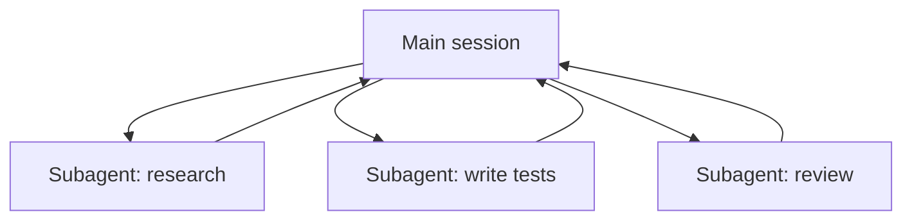

<LevelBadge level="advanced" />

<VerifyNote lastVerified="2026-06-23" source="https://code.claude.com/docs/en/sub-agents">
حقول الواجهة الأمامية للوكيل الفرعي، ومجموعة الوكلاء المدمجة، وواجهة `/agents` تتغير بمرور الوقت — تأكد من ذلك في الوثائق الرسمية.
</VerifyNote>

<Callout type="objectives" items={["ما هو الوكيل الفرعي — نسخة منفصلة من Claude لها نافذة سياق خاصة بها ومجموعة أدوات محددة النطاق","الأسباب الثلاثة للتفويض: حماية السياق، والتخصص، والتوازي","الوكلاء المدمجون الذين يفوّض إليهم Claude بالفعل: Explore وPlan وGeneral-purpose","كيف تعرّف وكيلك الفرعي الخاص في ‎.claude/agents/‎ ولماذا يكون الوصف description والأدوات tools هما الحقلان الحاملان","متى لا توازي، وكيف يرتبط هذا بوكلاء API وأسير العمل بحجم الأساطيل"]} />

**الوكيل الفرعي** هو نسخة منفصلة من Claude لها **نافذة سياق خاصة بها** و**مجموعة أدوات محددة النطاق**، تفوّض إليها جلستك الرئيسية جزءًا من العمل. وهو يبلّغ عن نتيجة، لا عن نصّه الكامل — لذا تبقى الجلسة الرئيسية مركّزة وغير مزدحمة.

## لماذا التفويض

ثلاث وظائف، أداة واحدة. ضع هذه في الحسبان في كل مرة تلجأ فيها إلى وكيل فرعي:

- **احمِ السياق الرئيسي.** يمكن أن يستهلك بحث معمّق أو مسح ملفات كبير آلاف الرموز؛ نفّذه في وكيل فرعي ولن يعود إلا الاستنتاج.
- **التخصص.** امنح الوكيل الفرعي موجّه نظام مخصصًا والأدوات التي يحتاجها فقط (مثلًا مراجِع للقراءة فقط).
- **التوازي.** نفّذ مهام فرعية مستقلة في آن واحد — مثلًا استكشف ثلاث وحدات في وقت واحد.

## المدمجون الذين تملكهم بالفعل

قبل أن تعرّف وكلاءك الخاصين، اعلم أن Claude Code يأتي مزوّدًا بوكلاء فرعيين يفوّض إليهم تلقائيًا:

| المدمج | ما يفعله |
| --- | --- |
| **Explore** | وكيل سريع للقراءة فقط (يعمل على نموذج أرخص) للبحث وفهم قاعدة الشيفرة دون المساس بها. |
| **Plan** | يجمع السياق أثناء وضع التخطيط بحيث يبقى البحث خارج المحادثة الرئيسية المخصصة للقراءة فقط. |
| **General-purpose** | وكيل كامل الأدوات للعمل المعقّد متعدد الخطوات الذي يمزج بين الاستكشاف والتغييرات. |

نادرًا ما تستدعي هؤلاء بالاسم؛ يلجأ Claude إليهم عندما تناسبهم مهمة. الوكلاء الفرعيون المخصصون مخصصون للعمّال الذين تعيد *أنت* إنشاءهم بالتعليمات نفسها.

## تعريف وكلائك الخاصين

الوكيل الفرعي هو ملف Markdown به واجهة أمامية YAML (يصبح المتن موجّه نظامه). فقط `name` و`description` مطلوبان؛ وكل شيء آخر اختياري. خزّنه لكل مشروع في `.claude/agents/` (أدرجه في git ليشاركه الفريق) أو لكل مستخدم في `~/.claude/agents/`. أنشئ واحدًا بأمر `/agents` أو يدويًا.

<Steps items={[{title: "اختر موقعًا", body: "لكل مشروع في ‎.claude/agents/‎ (أدرجه في git ليشاركه الفريق) أو لكل مستخدم في ‎~/.claude/agents/‎."},{title: "أنشئ الملف", body: "استخدم أمر ‎/agents‎، أو اكتب ملف Markdown بواجهة أمامية YAML يدويًا."},{title: "اضبط الحقول المطلوبة", body: "فقط name وdescription مطلوبان. وكل شيء آخر اختياري."},{title: "اكتب المتن بوصفه موجّه النظام", body: "متن Markdown أسفل الواجهة الأمامية يصبح موجّه نظام الوكيل الفرعي."},{title: "حدّد نطاق الأدوات", body: "أضف قائمة سماح للأدوات بحيث لا يستطيع الوكيل الفرعي إلا ما تتطلبه وظيفته."}]} />

وكيل فرعي مبدئي باسم `code-reviewer`:

<PromptCard title="الوكيل الفرعي code-reviewer (‎.claude/agents/code-reviewer.md‎)">{`---
name: code-reviewer
description: Expert code reviewer. Use proactively after code changes.
tools: Read, Glob, Grep
model: sonnet
---

You are a senior reviewer. Read the changed files, then report only
high-confidence issues: correctness bugs, security risks, and missing
tests. For each, show the file:line, the problem, and a concrete fix.
Do not restate what the code does. Never edit files.`}</PromptCard>

شيئان يجعلان الوكيل الفرعي جيدًا:

- **حقل `description` هو إشارة التوجيه.** يقرؤه Claude ليقرر *متى* يفوّض، فاكتبه كمُحفّز — "Use proactively after code changes" يجلبه تلقائيًا؛ أما "helps with code" الغامضة فلا. هذا هو السطر الأعلى تأثيرًا في الملف.
- **حدّد نطاق الأدوات بإحكام.** حقل `tools` هو قائمة سماح (أو استخدم `disallowedTools` كقائمة منع). فالمراجِع الذي يستطيع فقط `Read, Glob, Grep` *لا يمكنه* تعديل شيفرتك بالخطأ — القيد ضمانة، لا تلميح. احذف `tools` فيرث الوكيل الفرعي كل ما تملكه الجلسة الرئيسية.

## مثال عملي: توزيع مراجعة متوازٍ

أنهيت ميزة تمسّ ثلاث وحدات وتريد فحصًا سريعًا ومستقلًا لكل منها. في جلستك الرئيسية:

<PromptCard title="وزّع ثلاثة مراجعين في آن واحد">{`Review the changes in auth/, billing/, and api/ — use the code-reviewer subagent on each, in parallel.`}</PromptCard>

يطلق Claude ثلاث نسخ من `code-reviewer` في آن واحد. تقرأ كل نسخة وحدتها فقط، وتستهلك سياقها الخاص على محتوى الملفات، وتعيد قائمة نتائج قصيرة. لا ترى جلستك الرئيسية الفروق الخام إطلاقًا — بل ثلاثة تقارير مرتبة فقط — وينتهي كل ذلك تقريبًا في زمن أبطأ نسخة مراجعة منفردة بدلًا من مجموع النسخ الثلاث. وبما أن المراجِع للقراءة فقط، فلا يمكن لثلاثة وكلاء يعملون في آن واحد أن يتصادموا على عملية كتابة.

## متى لا توازي

<Callout type="warning" items={["الخطوات المترابطة يجب أن تكون متسلسلة — لا توزّع عملًا تحتاج فيه الخطوة B إلى مخرجات الخطوة A.","عمليات الكتابة على ملفات مشتركة قد تتعارض؛ اعزلها (انظر أشجار عمل Git) أو سلسلها.","حِمل التنسيق قد يتجاوز الفائدة في المهام الصغيرة. فوّض عندما تكون المهمة الفرعية كبيرة ومستقلة."]} />

لعزل عمليات الكتابة المتعارضة، انظر [أشجار عمل Git](/docs/claude-code/worktrees).

## الوكيل الفرعي مقابل "الوكلاء" في API/SDK

تتناول هذه الصفحة التفويض المدمج في Claude Code. أما بناء وكلائك *الخاصين* برمجيًا فهو [بناء الوكلاء على API](/docs/api/building-agents). النموذج الذهني — هدف، وحلقة أدوات، وسياق معزول — هو نفسه.

## أخطاء شائعة

<Flashcards title="المزالق — اقلب كل بطاقة لرؤية الحل" cards={[{front: "وصف غامض", back: "إن لم يذكر متى يُستخدم الوكيل الفرعي، فلن يفوّض Claude في اللحظة الصحيحة (أو لن يفوّض إطلاقًا). ابدأ بـ \"Use when…\" / \"Use proactively after…\"."},{front: "ترك الأدوات مفتوحة على مصراعيها", back: "الوكيل الفرعي المخصص للمراجعة ينبغي ألا يستطيع الكتابة. قائمة السماح تحوّل النية إلى ضمانة."},{front: "توقّع ذاكرة مشتركة", back: "يحصل الوكيل الفرعي على وصفه، وموجّه نظامه، والمهمة التي تسلّمها إياه — لا محادثتك الرئيسية. مرّر السياق الذي يحتاجه ضمن التفويض."},{front: "توزيع عمل مترابط", back: "التوازي لا يفيد إلا في المهام الفرعية المستقلة؛ إذا احتاجت B إلى مخرجات A، فنفّذهما بالتسلسل."}]} />

## عندما لا يكفي بضعة وكلاء

تفويض حفنة من الوكلاء الفرعيين في كل دور هو خبز هذه الصفحة وزبدتها. عندما تحتاج مهمة إلى **عشرات أو مئات** الوكلاء — مسح يشمل قاعدة الشيفرة كاملة، أو ترحيل 500 ملف، أو بحث يُدقَّق عبر مصادر كثيرة — فإن التنسيق يفوق طاقة نافذة سياق واحدة. لذلك وُجدت [أسير العمل الديناميكي وultracode](/docs/claude-code/dynamic-workflows): يكتب Claude سكربتًا يحمل الخطة، ويوزّع وقت التشغيل الوكلاء في الخلفية.

<Quiz title="اختبر نفسك" questions={[{q: "أي حقل في الواجهة الأمامية للوكيل الفرعي هو إشارة التوجيه التي يقرؤها Claude ليقرر متى يفوّض؟", options: ["name", "description", "model"], answer: 1, explain: "الوصف description هو السطر الأعلى تأثيرًا — يقرؤه Claude ليقرر متى يفوّض. اكتبه كمُحفّز، مثل \"Use proactively after code changes\"."}, {q: "وكيل فرعي للمراجعة أُعطي tools: Read, Glob, Grep. ماذا تضمن قائمة السماح هذه؟", options: ["أنه يعمل على نموذج أرخص", "أنه لا يمكنه تعديل شيفرتك بالخطأ", "أنه يرث أدوات الجلسة الرئيسية"], answer: 1, explain: "حقل tools هو قائمة سماح، لذا فالمراجِع المحدود بـ Read, Glob, Grep لا يمكنه الكتابة — القيد ضمانة، لا تلميح. حذف tools يؤدي بدلًا من ذلك إلى وراثة كل شيء."}, {q: "متى لا يفيد توازي الوكلاء الفرعيين؟", options: ["عندما تكون المهام الفرعية مستقلة وكبيرة", "عندما تحتاج الخطوة B إلى مخرجات الخطوة A", "عندما يقرأ كل وكيل وحدة مختلفة"], answer: 1, explain: "الخطوات المترابطة يجب أن تُنفّذ بالتسلسل. التوازي لا يفيد إلا في المهام الفرعية المستقلة؛ إذا احتاجت B إلى مخرجات A، فنفّذهما بالتسلسل."}]} />

<Callout type="takeaways" items={["الوكيل الفرعي نسخة منفصلة من Claude لها نافذة سياق خاصة بها وأدوات محددة النطاق؛ وهو يعيد نتيجة، لا نصّه.","فوّض لحماية السياق الرئيسي، أو للتخصص، أو لتوازي العمل المستقل.","يأتي Claude بالفعل بالمدمجين Explore وPlan وGeneral-purpose ويلجأ إليهم تلقائيًا.","name وdescription هما الحقلان الوحيدان المطلوبان في الواجهة الأمامية — وdescription هو إشارة التوجيه التي تقرر متى يفوّض Claude.","قائمة سماح الأدوات تحوّل النية إلى ضمانة؛ ووزّع المهام الفرعية المستقلة فقط، واعزل عمليات الكتابة المشتركة."]} />

## التالي

- [أسير العمل الديناميكي وultracode](/docs/claude-code/dynamic-workflows) — نسّق الوكلاء الفرعيين بحجم الأساطيل
- [صمّم سير عمل متعدد الوكلاء الفرعيين (شرح تفصيلي)](/docs/walkthroughs/multi-subagent-workflow)
- [إدارة السياق](/docs/claude-code/context-management)
- [أشجار عمل Git](/docs/claude-code/worktrees)
