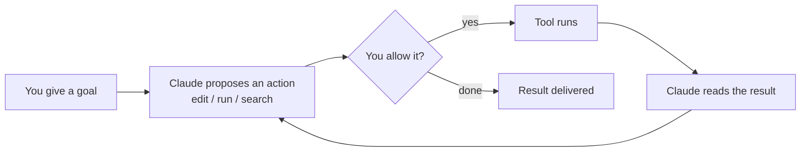

<LevelBadge level="beginner" />

<VerifyNote lastVerified="2026-06-20" source="https://code.claude.com/docs/en/overview">
تتغير أوامر التثبيت ومجموعة الميزات المحددة بشكل متكرر. اعتبر وثائق Claude Code الرسمية المصدر الموثوق للإعداد.
</VerifyNote>

<Callout type="objectives" items={["اشرح ما الذي يجعل Claude Code وكيليًا، وليس مجرد نافذة دردشة", "تخيّل الحلقة الوكيلة: هدف، إجراء، إذن، مراقبة، تكرار", "سمِّ الأسطح التي يعمل عليها Claude Code وكيف تنتقل الإعدادات معك", "رتّب الأشياء التي تضبطها حسب الأثر، بدءًا من CLAUDE.md", "اسلك خطوات أول جلسة آمنة باستخدام وضع التخطيط"]} />

**Claude Code** هو أداة البرمجة *الوكيلة* من Anthropic. بخلاف نافذة الدردشة، يمكنه فعليًا أن **ينجز أشياء في مشروعك**: قراءة الملفات وتحريرها، وتنفيذ أوامر الصدفة (shell)، والبحث في قاعدة الشيفرة، واستدعاء الأدوات الخارجية — كل ذلك بإذنك.

## النموذج الذهني: حلقة وكيلة

هذه هي الفكرة الواحدة التي تجعل كل شيء آخر مفهومًا. تقدّم هدفًا بلغة بسيطة ("أضف اختبارات لوحدة المصادقة وأصلح ما يفشل"). يقوم Claude بـ**التخطيط والتنفيذ ومراقبة النتيجة والتكرار** حتى يتحقق الهدف. تبقى أنت المتحكم عبر [الأذونات](/docs/claude-code) و[وضع التخطيط](/docs/claude-code).

<Callout type="tip" items={["لا تتقدّم الحلقة إلا عند الإجراءات التي تسمح بها. لا شيء يُحرَّر أو يُنفَّذ دون المرور عبر بوابة الإذن تلك — وهذا بالضبط سبب أهمية الأقسام التالية."]} />

## أين يمكنك تشغيله

نفس Claude Code يتبعك عبر الأسطح — فهو **يشارك إعداداتك وخطافاتك (hooks) وأذوناتك** أينما عملت.

- **الطرفية (CLI)** — السطح الأصلي؛ يعمل في أي صدفة (shell).
- **إضافات الـ IDE** — VS Code و JetBrains، مع عرض الفروقات (diffs) المضمّنة.
- **سطح المكتب والويب** — ويشارك إعداداتك وخطافاتك وأذوناتك عبر جميع الأسطح.

## ما الذي ستضبطه (بترتيب تقريبي للأثر)

فكّر في هذا كسلّم: أتقن الدرجات العليا أولًا، ثم أضف الميزات القوية فقط عندما تظهر حاجة فعلية.

<Steps items={[{title: "CLAUDE.md", body: "تعليمات المشروع الدائمة. أعلى أثر، وأقل جهد — ابدأ من هنا."}, {title: "وضع التخطيط", body: "التحقيق والاقتراح قبل تنفيذ أي تعديلات."}, {title: "الأذونات", body: "قرّر ما الذي يُسمح لـ Claude بفعله دون سؤال."}, {title: "settings.json", body: "نظام الإعداد الكامل الكامن تحت كل شيء."}, {title: "الميزات القوية", body: "الأوامر المائلة، والخطافات، والمهارات، والوكلاء الفرعيون، وخوادم MCP — تُضاف طبقة فوق طبقة حسب حاجتك."}]} />

كل درجة ترتبط بدرسها الخاص: [CLAUDE.md](/docs/claude-code)، و[وضع التخطيط](/docs/claude-code)، و[الأذونات](/docs/claude-code)، و[settings.json](/docs/claude-code)، و[الأوامر المائلة](/docs/claude-code)، و[الخطافات](/docs/claude-code)، و[المهارات](/docs/claude-code)، و[الوكلاء الفرعيون](/docs/claude-code)، و[خوادم MCP](/docs/claude-code).

## جلستك الأولى (الشكل العام لها)

<Steps items={[{title: "ثبّت وصادِق", body: "راجع الوثائق الرسمية للأوامر الحالية."}, {title: "افتح مشروعًا", body: "انتقل بـ cd إلى مشروع وابدأ Claude Code."}, {title: "ولّد ملف CLAUDE.md مبدئيًا", body: "شغّل /init لتوليد هيكل تعليمات مشروعك."}, {title: "اطلب شيئًا صغيرًا وملموسًا", body: "جرّب: اشرح كيف يعمل التوجيه في هذا التطبيق."}, {title: "أجرِ تغييرًا في وضع التخطيط أولًا", body: "راجع الخطة المقترحة، ثم دعها تُنفَّذ."}]} />

أمران يستحقان الحفظ من تلك الجلسة الأولى:

<PromptCard title="توليد هيكل تعليمات المشروع">{`/init`}</PromptCard>

<PromptCard title="طلب أول آمن للقراءة فقط">{`Explain how routing works in this app.`}</PromptCard>

للحصول على أوامر التثبيت والمصادقة الحالية، راجع [الوثائق الرسمية](https://code.claude.com/docs/en/overview).

<Callout type="tip" items={["ابدأ بالوضع القرائي فقط. لمهمتك الفعلية الأولى، استخدم وضع التخطيط — يحقق Claude ويعرض عليك خطة دون أن يمسّ الملفات. إنها أكثر الطرق أمانًا لبناء الثقة."]} />

## المصطلحات الأساسية في لمحة

<Flashcards title="مفردات Claude Code" cards={[{front: "أداة وكيلة", back: "أداة تتخذ إجراءات في مشروعك — تقرأ/تحرّر الملفات، وتنفّذ الأوامر، وتبحث في الشيفرة، وتستدعي أدوات خارجية — وليست مجرد نافذة دردشة."}, {front: "حلقة وكيلة", back: "هدف بلغة بسيطة، ثم يخطط Claude وينفّذ ويراقب النتيجة ويكرر حتى يتحقق الهدف."}, {front: "وضع التخطيط", back: "يحقق Claude ويقترح خطة قبل تنفيذ أي تعديلات — أكثر الطرق أمانًا للبدء."}, {front: "CLAUDE.md", back: "تعليمات المشروع الدائمة. أعلى أثر، وأقل جهد؛ تُولَّد عبر /init."}, {front: "الأذونات", back: "بوابة التحكم: ما الذي يُسمح لـ Claude بفعله دون أن يسألك أولًا."}]} />

<Quiz title="اختبر نفسك" questions={[{q: "ما الذي يجعل Claude Code مختلفًا عن نافذة الدردشة؟", options: ["إنه يكتب إجابات أطول", "يمكنه اتخاذ إجراءات في مشروعك — تحرير الملفات، وتنفيذ الأوامر، والبحث في الشيفرة — بإذنك", "إنه يعمل في الطرفية فقط"], answer: 1, explain: "Claude Code وكيلي: فهو يتصرف في مشروعك (قراءة/تحرير الملفات، وتنفيذ أوامر الصدفة، والبحث، واستدعاء الأدوات)، كل ذلك بإذنك."}, {q: "في الحلقة الوكيلة، ماذا يحدث مباشرة بعد أن يقترح Claude إجراءً؟", options: ["تُنفَّذ الأداة تلقائيًا", "تقرّر أنت ما إذا كنت ستسمح به", "تُسلَّم النتيجة"], answer: 1, explain: "كل إجراء مقترح يمرّ عبر بوابة إذن — لا تُنفَّذ الأداة إلا إذا سمحت بها."}, {q: "أي خطوة إعداد لها أعلى أثر بأقل جهد؟", options: ["خوادم MCP", "الخطافات", "CLAUDE.md"], answer: 2, explain: "CLAUDE.md — تعليمات المشروع الدائمة — مُدرَجة أولًا لأن لها أعلى أثر بأقل جهد."}]} />

<Callout type="takeaways" items={["Claude Code وكيلي: يتصرف في مشروعك بإذنك، وليس مجرد دردشة.", "الحلقة هي: هدف، اقتراح، سماح، تنفيذ، مراقبة، تكرار — وأنت تتحكم بها عبر الأذونات ووضع التخطيط.", "يعمل في الطرفية، وفي VS Code/JetBrains، وعلى سطح المكتب والويب، مشاركًا الإعدادات والخطافات والأذونات عبر الأسطح.", "اضبط حسب الأثر: CLAUDE.md أولًا، ثم وضع التخطيط، والأذونات، وsettings.json، ثم الميزات القوية.", "ابدأ أول جلسة بالوضع القرائي فقط في وضع التخطيط لبناء الثقة قبل السماح بتنفيذ التعديلات."]} />

## التالي

- أعلى إعداد من حيث الأثر ← [CLAUDE.md وملفات الذاكرة](/docs/claude-code)
- نفّذه من البداية إلى النهاية ← [الدليل التطبيقي: تخصيص Claude Code لمستودع حقيقي](/docs/walkthroughs)
- ابنِ أتمتاتك الخاصة ← [القوالب والوصفات](/docs/templates)
