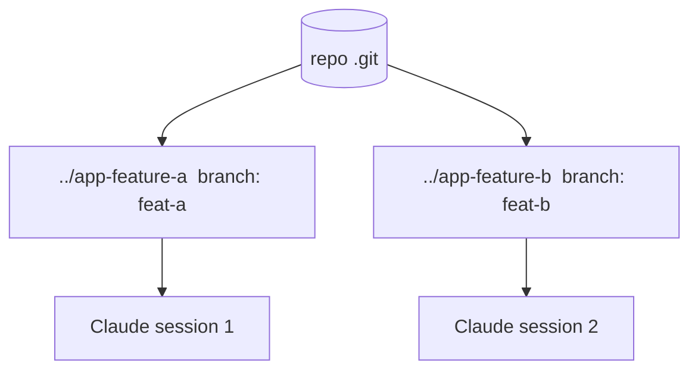

<LevelBadge level="advanced" />

<Callout type="objectives" items={["ما هي شجرة عمل git — مستودع واحد، عدة أدلة عمل، كل منها على فرعه الخاص","المشكلة المحددة التي تحلها: منع جلسات Claude المتوازية من التصادم على الملفات نفسها","الأوامر الأربعة لإضافة أشجار العمل وعرضها وإزالتها","متى تستحق هذه التقنية العناء — والمزالق الثلاثة التي تلدغ عند الدمج","كيف تتكامل أشجار العمل مع الوكلاء الفرعيين: التوازي عبر الجلسات مقابل التوازي داخل جلسة واحدة"]} />

تتيح **شجرة عمل git (git worktree)** لمستودع واحد أن يمتلك **عدة أدلة عمل**، كل منها مسحوب (checked out) إلى فرع مختلف. اقرن ذلك بـ Claude Code وسيمكنك تشغيل **عدة جلسات بالتوازي** على المشروع نفسه — كل جلسة تحرّر ملفاتها الخاصة، دون أي تصادمات.

## المشكلة التي يحلها

إذا حرّرت جلستا Claude دليل العمل نفسه في الوقت ذاته، فسوف تتعثر كل منهما بتغييرات الأخرى. تمنح أشجار العمل كل جلسة **دليلها وفرعها الخاص**، فيبقى العمل المتوازي معزولًا حتى تدمجه.

## الأساسيات

تحمل أربعة أوامر سير العمل بأكمله: أضف شجرة عمل (دليل جديد + فرع جديد)، اعرض ما هو موجود، وأزل واحدة عند الانتهاء.

<Steps items={[{title: "أضف شجرة عمل لميزة", body: "من مستودعك، ينشئ الأمر git worktree add ../app-feature-a -b feat-a دليلًا جديدًا وفرعًا جديدًا دفعةً واحدة."},{title: "أضف أخرى لإصلاح", body: "git worktree add ../app-fix-123 -b fix-123 — دليل/فرع معزول ثانٍ، جنبًا إلى جنب مع الأول."},{title: "اعرض ما لديك", body: "يعرض git worktree list كل دليل عمل والفرع الموجود عليه."},{title: "نظّف عند الانتهاء", body: "يفكّك git worktree remove ../app-feature-a شجرة عمل حتى لا تتراكم الأدلة القديمة."}]} />

<PromptCard title="سير العمل ذو الأوامر الأربعة">{`# from your repo
git worktree add ../app-feature-a -b feat-a   # new dir + new branch
git worktree add ../app-fix-123 -b fix-123
git worktree list
# when done with one:
git worktree remove ../app-feature-a`}</PromptCard>

افتح جلسة Claude Code في كل دليل شجرة عمل ودعها تعمل باستقلالية.

## متى يستحق الأمر العناء

- **ميزات/إصلاحات متوازية** تريد إحراز تقدم فيها دفعةً واحدة.
- **مهمة طويلة تعمل** في شجرة عمل بينما تواصل العمل في أخرى.
- **تجارب محفوفة بالمخاطر** معزولة عن نسختك الرئيسية المسحوبة.

## المزالق

<Callout type="warning" items={["انتبه للدمج العكسي: ستُدمج الفروع في النهاية حتمًا — وعندئذٍ تظهر التعارضات، لا أثناء العمل. أبقِ أشجار العمل مركّزة وقصيرة العمر.","لا تشغّل موارد ذات حالة ومشتركة (قاعدة بيانات تطوير واحدة، منفذ واحد) من شجرتي عمل دون فصلها.","نظّف بـ git worktree remove حتى لا تتراكم الأدلة القديمة."]} />

## أشجار العمل مقابل الوكلاء الفرعيين

محوران مختلفان للتوازي — لا يتنافسان، بل يتراكمان.

| | ما الذي يوازيه | العزل |
| --- | --- | --- |
| **[الوكلاء الفرعيون (Subagents)](/docs/claude-code/subagents)** | العمل *داخل* جلسة واحدة (تفويض) | سياق معزول |
| **أشجار العمل** | العمل *عبر* الجلسات على القرص | فروع/ملفات معزولة |

وهما يتكاملان جيدًا: جلسة داخل شجرة عمل يمكنها بدورها أن تُنشئ وكلاء فرعيين.

<Callout type="tip" items={["استخدم شجرة عمل عندما تحتاج إلى جلستَي Claude تلمسان المستودع نفسه في وقت واحد؛ واستخدم وكيلًا فرعيًا عندما تحتاج جلسة واحدة إلى نقل جزء من العمل إلى سياق معزول."]} />

<Quiz title="اختبر نفسك" questions={[{q: "ماذا تمنحك شجرة عمل git؟", options: ["عدة فروع في دليل عمل واحد", "عدة أدلة عمل لمستودع واحد، كل منها على فرعه الخاص", "نسخة احتياطية من مجلد .git الخاص بك"], answer: 1, explain: "تتيح شجرة عمل git لمستودع واحد أن يمتلك عدة أدلة عمل، كل منها مسحوب إلى فرع مختلف — فلا تتصادم الجلسات المتوازية."}, {q: "أي أمر ينشئ دليلًا جديدًا وفرعًا جديدًا في خطوة واحدة؟", options: ["git worktree list", "git worktree add ../app-feature-a -b feat-a", "git worktree remove ../app-feature-a"], answer: 1, explain: "ينشئ git worktree add ../app-feature-a -b feat-a الدليل الجديد والفرع الجديد معًا. أما list فيعرض أشجار العمل الموجودة؛ وremove يفكّك واحدة."}, {q: "متى تظهر تعارضات الدمج الناتجة عن أشجار العمل المتوازية فعليًا؟", options: ["باستمرار أثناء تحرير الجلستَين", "عند الدمج العكسي، لا أثناء العمل", "أبدًا، لأن الفروع معزولة"], answer: 1, explain: "تبقى الفروع معزولة أثناء عملك، فلا تظهر التعارضات أثناءه — بل تظهر عند الدمج العكسي. أبقِ أشجار العمل مركّزة وقصيرة العمر للحدّ منها."}, {q: "كيف ترتبط أشجار العمل بالوكلاء الفرعيين؟", options: ["هما الميزة نفسها باسمين", "أشجار العمل توازٍ عبر الجلسات على القرص؛ والوكلاء الفرعيون توازٍ داخل جلسة واحدة — وهما يتكاملان", "يجب أن تختار واحدًا؛ واستخدامهما معًا يكسر العزل"], answer: 1, explain: "الوكلاء الفرعيون توازٍ داخل جلسة واحدة (سياق معزول)؛ وأشجار العمل توازٍ عبر الجلسات على القرص (فروع/ملفات معزولة). وجلسة داخل شجرة عمل يمكنها بدورها أن تُنشئ وكلاء فرعيين."}]} />

<Callout type="takeaways" items={["شجرة عمل git = مستودع واحد، عدة أدلة عمل، كل منها على فرعه الخاص — وهي الأساس لجلسات Claude متوازية خالية من التصادم.","تتعثر جلستان على دليل عمل واحد كل منهما بالأخرى؛ أما شجرة عمل لكل جلسة فتُبقي الملفات والفروع معزولة حتى تدمج.","ينشئ git worktree add ../dir -b branch الدليل + الفرع؛ ويعرضها list؛ وينظّف remove.","يستحق الأمر العناء للميزات/الإصلاحات المتوازية، والمهام طويلة الأمد إلى جانب عمل آخر، والتجارب المحفوفة بالمخاطر المعزولة.","احذر الدمج العكسي، ولا تشارك موارد ذات حالة (قاعدة بيانات، منفذ) عبر أشجار العمل، ونظّف دائمًا — وتذكّر أن أشجار العمل تتكامل مع الوكلاء الفرعيين."]} />

## التالي

- [الوكلاء الفرعيون والوكلاء المتوازون](/docs/claude-code/subagents)
- [الوضع بلا واجهة (Headless) وحزمة تطوير الوكلاء (Agent SDK)](/docs/claude-code/headless-and-agent-sdk)
- [إدارة السياق](/docs/claude-code/context-management)
