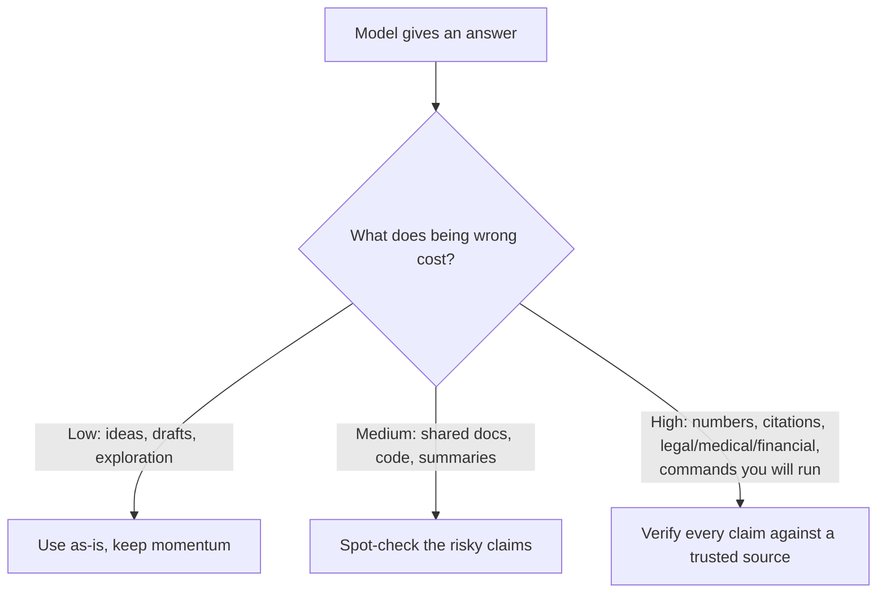

<LevelBadge level="intermediate" />

<Callout type="objectives" items={["افهم لماذا تختلق النماذج إجابات واثقة وحسنة الصياغة", "تعرّف على المناطق الخمس عالية الخطورة التي ينبغي أن تكون فيها أكثر تشككًا", "طبّق مجموعة أدوات من ستة أجزاء للحدّ بشكل كبير من الهلوسات", "استخدم مطالبة واحدة جاهزة للنسخ واللصق لمكافحة الهلوسة تُثبّت الإجابة، وتمنح مخرجًا، وتفرض الاستشهادات", "تبنَّ العقلية التي تجعل جهد التحقق متناسبًا مع تكلفة الخطأ"]} />

**الهلوسة** هي عندما يذكر النموذج شيئًا خاطئًا بثقة تامة. إنه لا يكذب وليس معطلًا — بل هذا هو الوجه الآخر لطريقة عمل نماذج LLM: فهي تولّد نصًا *معقولًا*، والمعقول ليس صحيحًا دائمًا (انظر [ما هو نموذج LLM؟](/docs/foundations/what-is-an-llm)). لا يمكنك التخلص من هذا بالكامل عبر المطالبات، لكن يمكنك الحدّ منه بشكل كبير والتقاط ما تبقّى.

## لماذا يحدث ذلك

يتنبأ النموذج باستمرارٍ محتمل للنص. وعندما لا "يعرف" شيئًا ما، فإن الاستمرار *الأكثر اقترابًا من المظهر المحتمل* يكون غالبًا إجابة واثقة وحسنة الصياغة — وخاطئة. لا توجد إشارة مدمجة تقول "أنا غير متأكد" ما لم تترك له مجالًا لذلك.

<Callout type="tip" items={["العلاج لمعظم الهلوسات هو أن تترك عن قصد مجالًا للشك — امنح النموذج إذنًا بأن يقول إنه لا يعرف."]} />

## المناطق عالية الخطورة

كن أكثر تشككًا عندما يتضمن المُخرَج:

- **الاستشهادات والاقتباسات والمراجع** — أوراق بحثية ملفقة، وروابط URL مزيفة، واقتباسات منسوبة لغير أصحابها.
- **الأرقام والتواريخ والإحصاءات المحددة** — أرقام معقولة لكنها مختلقة.
- **الحقائق المتخصصة أو الحديثة جدًا** — خارج نطاق ما تعلّمه النموذج بشكل موثوق.
- **تفاصيل واجهات APIs والمكتبات** — دوال أو معاملات غير موجودة.
- **التفاصيل المتعلقة بالأشخاص والشؤون القانونية/الطبية** — مخاطرها عالية، ومن السهل أن تأتي خاطئة بشكل دقيق وخفي.

## مجموعة أدوات الحدّ من الهلوسة

اجمع بينها — كل واحدة منها تساعد:

<Steps items={[
  {title: "ثبّتها في المصادر", body: "الصق النص المصدر وقل \"أجب فقط من النص أعلاه؛ وإن لم يكن موجودًا فيه، فقل ذلك.\" هذه هي الفكرة الجوهرية وراء RAG (/docs/foundations/rag)."},
  {title: "امنحه مخرجًا", body: "اسمح صراحةً بأن \"إذا لم تكن متأكدًا، فقل 'لا أعرف'\" — فهذا يقلّل بشكل كبير من التخمين الواثق."},
  {title: "اطلب التعليل والاستشهادات", body: "\"اقتبس الجملة بالضبط التي تدعم كل ادعاء.\" تصبح الادعاءات غير المدعومة واضحة."},
  {title: "اخفض مستوى الإبداع", body: "في المهام الواقعية حيثما يتيح النموذج التحكم في درجة الحرارة، اخفضها (انظر ضوابط أخذ العينات في /docs/foundations/sampling-controls)."},
  {title: "استخدم الأدوات", body: "للحسابات أو البيانات الحالية أو عمليات البحث، امنح النموذج آلة حاسبة/بحثًا/أداة (/docs/api/tool-use) بدلًا من الوثوق باستدعائه من الذاكرة."},
  {title: "تحقّق بشكل متقاطع", body: "اطرح السؤال نفسه بطريقتين، أو اجعل مرورًا ثانيًا ينتقد المرور الأول."}
]} />

## مطالبة جاهزة للنسخ واللصق لمكافحة الهلوسة

معظم مجموعة الأدوات أعلاه تنطوي في غلاف واحد قابل لإعادة الاستخدام. الصق مصدرك حيث هو مبيّن واطرح سؤالك — فهو يثبّت الإجابة، ويمنح النموذج مخرجًا، ويفرض الاستشهادات دفعة واحدة:

<PromptCard title="غلاف مكافحة الهلوسة">{`You answer ONLY from the SOURCE below.
Rules:
- If the answer is not in the SOURCE, reply exactly: "Not stated in the source."
- After every claim, quote the exact sentence from the SOURCE that supports it.
- Do not add outside knowledge, estimates, or assumptions.

SOURCE:
"""
[paste the document, transcript, or data here]
"""

QUESTION: [your question]`}</PromptCard>

لماذا ينجح هذا: إن مخرج الهروب "Not stated in the source" يزيل الضغط الدافع إلى التخمين، وقاعدة اقتباس-الجملة تجعل من المستحيل إخفاء أي ادعاء غير مدعوم. احذف كتلة المصدر (SOURCE) عندما تريد فعلًا معرفة النموذج الخاصة — لكن عندها يعود عبء التحقق إليك.

## العقلية التي تحميك فعلًا

<Callout type="warning" items={["لا توجد مطالبة تجعل المُخرَج موثوقًا بنسبة 100%. لأي شيء له عواقب — رقم في تقرير، أو استشهاد، أو أمر ستنفّذه، أو تفصيل طبي/قانوني/مالي — تحقق منه مقابل مصدر موثوق. تعامل مع الذكاء الاصطناعي كمسودة أولى سريعة، لا كمرجع نهائي. هذا هو جوهر الاستخدام المسؤول (/docs/security/responsible-use)."]} />

قاعدة بسيطة: **تكلفة الخطأ تحدد مقدار التحقق المطلوب.** عصف ذهني؟ ثق بحرية. نشر إحصائية؟ تحقّق في كل مرة.

<Callout type="takeaways" items={["الهلوسات نتيجة جانبية للتوليد القائم على المعقولية، وليست خللًا يمكنك التخلص منه بالكامل عبر المطالبات.", "كن أكثر تشككًا مع الاستشهادات والأرقام/التواريخ والحقائق المتخصصة أو الحديثة وتفاصيل واجهات API والتفاصيل المتعلقة بالأشخاص والشؤون القانونية/الطبية.", "اجمع بين أدوات المجموعة: ثبّتها في المصادر، وامنح مخرجًا، واطلب الاستشهادات، واخفض درجة الحرارة، واستخدم الأدوات، وتحقّق بشكل متقاطع.", "مطالبة غلاف واحدة تثبّت + تمنح مخرجًا + تفرض الاستشهادات دفعة واحدة.", "اجعل جهد التحقق متناسبًا مع تكلفة الخطأ — ثق بحرية عندما تكون التكلفة منخفضة، وتحقّق من كل ادعاء عندما تكون له عواقب."]} />

<Quiz title="اختبر نفسك" questions={[
  {
    q: "لماذا تهلوس النماذج؟",
    options: [
      "إنها تكذب على المستخدم عن قصد",
      "إنها تتنبأ بالاستمرار الأكثر اقترابًا من المظهر المعقول، وهو ليس صحيحًا دائمًا",
      "إنها معطلة وتحتاج إلى إعادة تدريب",
      "إنها تنفد دائمًا من الذاكرة في منتصف الإجابة"
    ],
    answer: 1,
    explain: "الهلوسة هي الوجه الآخر لطريقة عمل نماذج LLM: فهي تولّد نصًا معقولًا، والمعقول ليس صحيحًا دائمًا. وعندما لا يعرف النموذج شيئًا ما، فإن الاستمرار الأكثر اقترابًا من المظهر المحتمل يكون غالبًا واثقًا وحسن الصياغة وخاطئًا."
  },
  {
    q: "أي من هذه منطقة عالية الخطورة ينبغي أن تكون فيها أكثر تشككًا؟",
    options: [
      "العصف الذهني المفتوح بحثًا عن الأفكار",
      "إعادة صياغة جملة كتبتها أنت بالفعل",
      "الأرقام والتواريخ والإحصاءات المحددة",
      "طلب تعريف بسيط يمكنك التحقق من صحته بسهولة"
    ],
    answer: 2,
    explain: "الأرقام والتواريخ والإحصاءات المحددة منطقة عالية الخطورة — فقد تكون معقولة لكنها مختلقة. تشمل المناطق الأخرى عالية الخطورة الاستشهادات/الاقتباسات والحقائق المتخصصة أو الحديثة وتفاصيل واجهات API والتفاصيل المتعلقة بالأشخاص والشؤون القانونية/الطبية."
  },
  {
    q: "ما الأثر الأكثر مباشرة لمنح النموذج مخرجًا صريحًا مثل \"إذا لم تكن متأكدًا، فقل 'لا أعرف'\"؟",
    options: [
      "يجعل النموذج أسرع",
      "يقلّل بشكل كبير من التخمين الواثق",
      "يزيد درجة الحرارة تلقائيًا",
      "يربط النموذج بالبحث المباشر"
    ],
    answer: 1,
    explain: "السماح صراحةً للنموذج بأن يقول إنه لا يعرف يزيل الضغط الدافع إلى إنتاج تخمين واثق، وهو ما يقلّل بشكل كبير من الإجابات المهلوسة."
  },
  {
    q: "ما القاعدة التي تحدد مقدار التحقق الذي تحتاجه الإجابة؟",
    options: [
      "طول الإجابة",
      "مستوى الثقة الذي يصرّح به النموذج",
      "تكلفة الخطأ",
      "المدة التي استغرقها كتابة المطالبة"
    ],
    answer: 2,
    explain: "تكلفة الخطأ تحدد مقدار التحقق. عصف ذهني؟ ثق بحرية. نشر إحصائية؟ تحقّق في كل مرة."
  },
  {
    q: "في مطالبة غلاف مكافحة الهلوسة، ما الذي يجعل من المستحيل إخفاء أي ادعاء غير مدعوم؟",
    options: [
      "خفض درجة الحرارة إلى الصفر",
      "قاعدة اقتباس الجملة الداعمة بالضبط من المصدر (SOURCE) بعد كل ادعاء",
      "طرح السؤال مرتين",
      "حذف كتلة المصدر (SOURCE)"
    ],
    answer: 1,
    explain: "قاعدة اقتباس-الجملة تجبر النموذج على دعم كل ادعاء بجملة بالضبط من المصدر (SOURCE)، بحيث يصبح أي ادعاء غير مدعوم فعليًا واضحًا. ومخرج الهروب \"Not stated in the source\" يزيل الضغط الدافع إلى التخمين."
  }
]} />

## التالي

- [التوليد المعزّز بالاسترجاع (RAG)](/docs/foundations/rag)
- [تقييم جودة الذكاء الاصطناعي (Evals)](/docs/foundations/evals)
- [الاستخدام المسؤول والأخلاقيات والتحقق](/docs/security/responsible-use)
