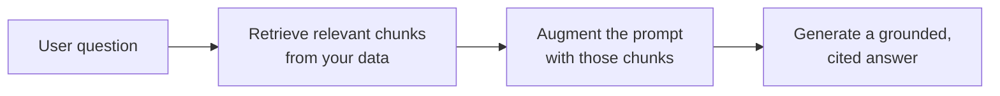

<LevelBadge level="intermediate" />

<Callout type="objectives" items={[
  "ما هو RAG وحلقة الاسترجاع-التعزيز-التوليد",
  "كيف تفهرس وتسترجع وتعزّز وتولّد مع الاستشهادات",
  "لماذا يتفوّق RAG على الضبط الدقيق لاحتياجات 'أجب عن مستنداتي'",
  "أنماط الفشل الخمسة التي تقتل جودة RAG",
  "مطالبة ربط جاهزة للنسخ تسدّ أكبر ثغرتين"
]} />

يجعل **RAG** النموذج يجيب عن أسئلة حول **بياناتك** — المستندات، أو قاعدة معرفة، أو قاعدة شيفرة — التي لم يُدرَّب عليها قط. الفكرة بسيطة: **استرجع** القطع ذات الصلة، ثم **عزّز** المطالبة بها، ثم **ولّد** إجابة مبنية على تلك القطع.

## الحلقة

<Steps items={[
  {title: "افهرس بياناتك", body: "قسّمها إلى مقاطع، وضمّنها (انظر /docs/foundations/embeddings)، وخزّنها في فهرس متجهي (و/أو فهرس كلمات مفتاحية)."},
  {title: "استرجع", body: "اسحب أعلى المقاطع صلةً بالسؤال."},
  {title: "عزّز", body: "ضع تلك المقاطع في المطالبة مع تعليمة مثل \"أجب فقط من السياق أدناه؛ وإن لم يكن موجودًا فيه، فقل ذلك.\""},
  {title: "ولّد", body: "أنتج الإجابة — والأفضل أن تستشهد بالمقطع الذي جاء منه كل ادّعاء."}
]} />

لخطوة التضمين في الفهرسة، انظر [التضمينات والبحث المتجهي](/docs/foundations/embeddings).

## لماذا RAG بدلًا من الضبط الدقيق؟

<Callout type="tip" items={[
  "حديث: تحدّث البيانات، لا النموذج",
  "قابل للتحقق: يوفّر استشهادات",
  "رخيص: أرخص بكثير من إعادة التدريب"
]} />

لمعظم احتياجات "أجب عن مستنداتي"، يكون RAG هو الأداة الأولى الصحيحة — انظر [الضبط الدقيق مقابل التوجيه مقابل RAG](/docs/foundations/finetune-vs-prompt-vs-rag).

## أنماط الفشل (حيث تموت جودة RAG)

<Callout type="warning" items={[
  "استرجاع سيئ = إجابة سيئة. إذا لم يُسترجع المقطع الصحيح، فلن يستطيع النموذج استخدامه. معظم مشكلات 'RAG مخطئ' هي مشكلات استرجاع.",
  "التقطيع الخشن/الدقيق أكثر من اللازم يدمّر الصلة (انظر التضمينات).",
  "غياب تعليمة الربط: يمزج النموذج الحقائق المسترجعة بتخميناته الخاصة. أمره بالإجابة فقط من السياق والاعتراف بالثغرات.",
  "الحشو الزائد: تخفّف المقاطع غير ذات الصلة الإشارة وتستهلك توكنات. استرجع مقاطع قليلة عالية الجودة.",
  "غياب الاستشهادات: لا يمكنك التحقّق، فلا يمكنك الوثوق."
]} />

يعود فشل التقطيع إلى [التضمينات](/docs/foundations/embeddings)، والحشو الزائد يكلّف [توكنات](/docs/foundations/tokens-and-context).

<Callout type="tip" items={[
  "قيّم الاسترجاع على حدة: قِس 'هل استرجعنا المقطع الصحيح؟' بمعزل عن 'هل أجاب النموذج جيدًا؟' فهذا يحدّد موقع المشكلة بسرعة. انظر التقييمات (/docs/foundations/evals)."
]} />

## للنسخ: مطالبة ربط

أعلى إصلاح أثرًا هو تعليمة الربط. ضع مقاطعك المسترجعة في قالب كهذا — فهو يجبر النموذج على الإجابة *فقط* من السياق، والاستشهاد بكل ادّعاء، والاعتراف بالثغرات بدلًا من التخمين:

<PromptCard title="مطالبة الربط">{`You are answering strictly from the context below.

Rules:
- Use ONLY the context to answer. Do not use outside knowledge.
- Cite the source after each claim, like [chunk 2].
- If the answer is not in the context, reply exactly:
  "I don't have that in the provided sources."
- Quote numbers and names verbatim — never paraphrase a figure.

Context:
[chunk 1] ...
[chunk 2] ...
[chunk 3] ...

Question: <the user's question>`}</PromptCard>

اقرنها بـ *بضعة* مقاطع عالية الجودة (وليس كل ما استرجعته) فتسدّ أكبر ثغرتين دفعةً واحدة: المزج الهلوسي والإجابات غير القابلة للتحقق. ثم [قيّم](/docs/foundations/evals) الاسترجاع والتوليد على حدة لتعرف أيّ نصف عليك ضبطه.

## أتقن المصطلحات

<Flashcards cards={[
  {front: "RAG", back: "استرجع القطع ذات الصلة من بياناتك، عزّز المطالبة بها، ثم ولّد إجابة مبنية على تلك القطع."},
  {front: "خطوة الفهرسة", back: "قسّم البيانات إلى مقاطع، وضمّنها، وخزّنها في فهرس متجهي و/أو فهرس كلمات مفتاحية."},
  {front: "خطوة التعزيز", back: "ضع المقاطع المسترجعة في المطالبة مع تعليمة ربط: أجب فقط من السياق، واعترف بالثغرات."},
  {front: "لماذا RAG بدلًا من الضبط الدقيق", back: "حديث (تحدّث البيانات لا النموذج)، يوفّر استشهادات، أرخص بكثير من إعادة التدريب."},
  {front: "نمط الفشل الأول في RAG", back: "الاسترجاع السيئ. إذا لم يُسترجع المقطع الصحيح، فلن يستطيع النموذج استخدامه — معظم مشكلات 'RAG مخطئ' هي مشكلات استرجاع."},
  {front: "تعليمة الربط", back: "أمر النموذج بالإجابة فقط من السياق، والاستشهاد بكل ادّعاء، وقول ذلك حين لا تكون الإجابة موجودة."}
]} />

<Quiz title="اختبر نفسك" questions={[
  {
    q: "ما الذي تعنيه الأحرف الثلاثة في RAG، بالترتيب؟",
    options: ["القراءة، التحليل، التوليد", "الاسترجاع، التعزيز، التوليد", "الترتيب، التجميع، التصنيف", "التقليص، الإلحاق، التوليد"],
    answer: 1,
    explain: "RAG = استرجع المقاطع ذات الصلة، عزّز المطالبة بها، ثم ولّد إجابة مبنية."
  },
  {
    q: "حين يكون 'RAG مخطئًا'، ما هي المشكلة الحقيقية في أغلب الأحيان؟",
    options: ["النموذج صغير جدًا", "الاسترجاع — لم يُسحب المقطع الصحيح", "عدد التوكنات قليل جدًا في نافذة السياق", "التضمينات مضبوطة دقيقًا بشكل خاطئ"],
    answer: 1,
    explain: "استرجاع سيئ = إجابة سيئة. إذا لم يُسترجع المقطع الصحيح، فلن يستطيع النموذج استخدامه. معظم مشكلات 'RAG مخطئ' هي مشكلات استرجاع."
  },
  {
    q: "لماذا يُفضَّل RAG عادةً على الضبط الدقيق لـ 'أجب عن مستنداتي'؟",
    options: ["يجعل النموذج أكبر", "يُبقي المعرفة حديثة، ويعطي استشهادات، وهو أرخص من إعادة التدريب", "يلغي الحاجة إلى أي مطالبة", "يضمن ألّا يهلوس النموذج أبدًا"],
    answer: 1,
    explain: "يُبقي RAG المعرفة حديثة (تحدّث البيانات، لا النموذج)، ويوفّر استشهادات، وهو أرخص بكثير من إعادة التدريب."
  },
  {
    q: "ما هو أعلى إصلاح أثرًا لوقف مزج النموذج بين الحقائق والتخمينات؟",
    options: ["استرجاع كل مقطع ممكن", "تعليمة ربط تجبر الإجابات على أن تكون من السياق فقط", "رفع درجة الحرارة", "تخطّي الاستشهادات لتوفير التوكنات"],
    answer: 1,
    explain: "تجبر تعليمة الربط النموذج على الإجابة فقط من السياق، والاستشهاد بكل ادّعاء، والاعتراف بالثغرات بدلًا من التخمين."
  },
  {
    q: "لماذا نقيّم الاسترجاع بمعزل عن التوليد؟",
    options: ["لأن مزوّد النموذج يشترط ذلك", "لأنه يحدّد موقع المشكلة بسرعة — فتعرف أيّ نصف عليك ضبطه", "لأنه يخفّض تكلفة التوكنات تلقائيًا", "لأنه لا يمكن قياس التوليد بطريقة أخرى"],
    answer: 1,
    explain: "قياس 'هل استرجعنا المقطع الصحيح؟' بمعزل عن 'هل أجاب النموذج جيدًا؟' يحدّد موقع المشكلة بسرعة ويخبرك بأيّ نصف عليك ضبطه."
  }
]} />

<Callout type="takeaways" items={[
  "RAG = استرجع المقاطع ذات الصلة، عزّز المطالبة، ولّد إجابة مبنية ومستشهَدة.",
  "افهرس (تقطيع + تضمين + تخزين)، استرجع أعلى المقاطع، عزّز بتعليمة ربط، ولّد مع الاستشهادات.",
  "فضّل RAG على الضبط الدقيق للأسئلة والأجوبة على المستندات: حديث، مستشهَد، أرخص.",
  "معظم حالات الفشل هي حالات فشل استرجاع — استرجع مقاطع قليلة عالية الجودة، وليس كل شيء.",
  "أضف دائمًا تعليمة ربط واستشهد؛ وقيّم الاسترجاع والتوليد على حدة."
]} />

## التالي

- [التضمينات والبحث المتجهي](/docs/foundations/embeddings)
- [الضبط الدقيق مقابل التوجيه مقابل RAG](/docs/foundations/finetune-vs-prompt-vs-rag)
- [دليل البحث والتركيب](/docs/playbooks/research)
