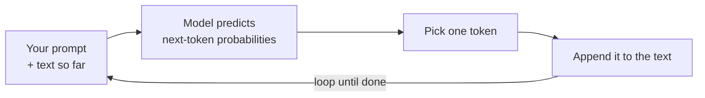

<LevelBadge level="beginner" />

يقوم **نموذج اللغة الكبير** (LLM) — التقنية التي يقوم عليها Claude — بشيء واحد يبدو بسيطًا بشكل خادع: فهو يقرأ النص و**يتنبأ بما يأتي بعده**، جزءًا تلو الآخر. هذا كل شيء. وكل ما عداه ينبثق من إتقان هذا الأمر بشكل مذهل.

<Callout
  type="objectives"
  items={[
    "استيعاب النموذج الذهني في جملة واحدة: نموذج اللغة الكبير هو إكمال تلقائي بالغ التطور",
    "رؤية كيف يبني النموذج إجابةً توكنًا تلو الآخر، في حلقة متكررة",
    "فهم لماذا تفسّر هذه الآلية كلًّا من نقاط قوته وغرائبه",
    "معرفة ما الذي لا يكونه نموذج اللغة الكبير — وكيف يغيّر ذلك طريقة استخدامك له"
  ]}
/>

## النموذج الذهني في جملة واحدة

> نموذج اللغة الكبير هو إكمال تلقائي بالغ التطور قرأ كمًّا هائلًا من النصوص وتعلّم أنماط الطريقة التي تميل بها اللغة — والأفكار الكامنة داخلها — إلى الاستمرار.

عندما تطرح سؤالًا، لا يقوم النموذج "بالبحث" عن إجابة. بل يولّد الاستمرار الأكثر معقولية لنصك، توكنًا تلو الآخر (انظر [التوكنات والسياق](/docs/foundations/tokens-and-context)). والاستمرارات المعقولة لسؤال جيد تكون عادةً إجابات جيدة — ولهذا ينجح هذا الأمر من الأساس.

:::tip تشبيه: لوحة مفاتيح تنبؤية على المنشّطات
فكّر في الإكمال التلقائي على هاتفك الذي يقترح الكلمة التالية. الآن تخيّل أنه قرأ معظم الكتب والمقالات والأكواد على الإنترنت — واقترح ليس الكلمة التالية فحسب، بل مقالًا كاملًا أو ترجمة أو برنامجًا يناسب السياق. هذا هو الحدس الكامن وراء نموذج اللغة الكبير.
:::

## توكن واحد في كل مرة

المحرّك بأكمله عبارة عن حلقة: اقرأ كل ما سبق، تنبّأ بالجزء التالي، أضِفه، كرّر.

<Steps
  items={[
    {title: "اقرأ", body: "يستوعب النموذج طلبك بالإضافة إلى كل ما تم توليده حتى الآن ككتلة نصية واحدة."},
    {title: "تنبّأ", body: "يحسب احتمالات ما يمكن أن يكون عليه التوكن التالي."},
    {title: "اختر", body: "يختار توكنًا واحدًا. وما إذا كان هذا الاختيار حتميًا أم عشوائيًا بعض الشيء هو ما تضبطه ضوابط أخذ العيّنات (sampling) مثل درجة الحرارة (temperature)."},
    {title: "أضِف وكرّر", body: "يُضاف التوكن المختار إلى النص، ويعود النص الأطول قليلًا إلى الإدخال — في حلقة متكررة حتى تكتمل الإجابة."}
  ]}
/>

في كل خطوة يتنبأ النموذج بتوكن **واحد** فقط، ثم يعيد إدخال النص الأطول قليلًا. ليس لدى النموذج خطة للإجابة بأكملها منذ البداية — فالتماسك ينبثق من أداء هذا التنبؤ ببراعة فائقة، آلاف المرات. وطريقة سلوك خطوة "اختر توكنًا واحدًا" (جشعة greedy مقابل عشوائية بعض الشيء) هي ما تضبطه [ضوابط أخذ العيّنات](/docs/foundations/sampling-controls) مثل درجة الحرارة.

## لماذا يفسّر هذا نقاط قوته

نظرًا لأنه تعلّم أنماطًا عبر الكتابة والبرمجة والاستدلال، يستطيع نموذج اللغة الكبير أن **يكتب ويلخّص ويترجم ويشرح ويبرمج** بسلاسة — وهي مهام جميعها من نوع "أكمل هذا النص بشكل منطقي". أعطه إعدادًا واضحًا فيُنتج استمرارًا قويًا. لهذا يكون [التوجيه (Prompting)](/docs/prompting/basics) بهذه الأهمية: فأنت تشكّل بداية النص الذي سيُكمله.

## لماذا يفسّر هذا غرائبه

الآلية ذاتها تفسّر الجوانب غير المثالية:

- **قد يكون مخطئًا بثقة تامة.** فالاستمرار الذي يبدو سلسًا ليس دائمًا صحيحًا — وهذا ما يُسمى [الهلوسة](/docs/foundations/hallucinations).
- **لا "يعرف" حقًا حقائق اليوم** ما لم تزوّده بها أو تكن لديه أداة للبحث عنها.
- **ليست لديه ذاكرة** بين المحادثات ما لم تمنحه بعضها.

## ما الذي **ليس** نموذج اللغة الكبير

:::warning عدّل توقعاتك لتحصل على نتائج أفضل
- ❌ **ليس قاعدة بيانات أو محرك بحث.** فهو يولّد ولا يسترجع سجلات موثّقة.
- ❌ **ليس آلة حاسبة.** يمكنه الاستدلال حول الرياضيات لكنه ليس مضمون الدقة — زوّده بأدوات لذلك.
- ❌ **ليس شخصًا.** لا مشاعر ولا نوايا ولا ذاكرة مستمرة. إنه محرك نصوص قوي.
:::

تعامل معه كمساعد عبقري وسريع وواسع الاطّلاع يخطئ في تذكّر الأمور أحيانًا — و**تحقّق** مما يهم.

## المصطلحات الأساسية

<Flashcards
  title="راجع المفاهيم الجوهرية"
  cards={[
    {front: "نموذج اللغة الكبير (LLM)", back: "التقنية التي يقوم عليها Claude. يقرأ النص ويتنبأ بما يأتي بعده، جزءًا تلو الآخر."},
    {front: "التنبؤ بالتوكن التالي", back: "الحلقة الجوهرية: اقرأ النص حتى الآن، تنبّأ بالتوكن التالي، أضِفه، كرّر حتى الانتهاء."},
    {front: "التوكن", back: "جزء النص الذي يتنبأ به النموذج في كل خطوة. لا يتنبأ النموذج إلا بتوكن واحد في كل مرة."},
    {front: "الهلوسة", back: "استمرار يبدو سلسًا لكنه ليس صحيحًا في الواقع — أثر جانبي للتوليد، لا للاسترجاع."},
    {front: "أخذ العيّنات / درجة الحرارة", back: "يضبط طريقة سلوك خطوة 'اختر توكنًا واحدًا' — جشعة مقابل عشوائية بعض الشيء."}
  ]}
/>

<Callout
  type="takeaways"
  items={[
    "نموذج اللغة الكبير هو إكمال تلقائي بالغ التطور — فهو يتنبأ بالتوكن التالي، ولا يبحث عن إجابة",
    "ينبثق التماسك من تشغيل حلقة التنبؤ تلك توكنًا تلو الآخر، آلاف المرات",
    "الآلية ذاتها تفسّر نقاط قوته (الكتابة والتلخيص والترجمة والشرح والبرمجة) وغرائبه (الخطأ بثقة، غياب الحقائق الحيّة، انعدام الذاكرة)",
    "إنه ليس قاعدة بيانات ولا آلة حاسبة ولا شخصًا — تحقّق مما يهم"
  ]}
/>

## اختبر نفسك

<Quiz
  title="اختبر نفسك"
  questions={[
    {
      q: "ما الذي يفعله نموذج اللغة الكبير في جوهره عندما تطرح عليه سؤالًا؟",
      options: [
        "يبحث عن الإجابة في قاعدة بيانات من الحقائق الموثّقة",
        "يولّد الاستمرار الأكثر معقولية لنصك، توكنًا تلو الآخر",
        "يبحث في الويب الحيّ عن أحدث إجابة"
      ],
      answer: 1,
      explain: "نموذج اللغة الكبير لا يبحث عن أي شيء — بل يولّد الاستمرار الأكثر معقولية لنصك، توكنًا تلو الآخر."
    },
    {
      q: "لماذا قد يكون نموذج اللغة الكبير مخطئًا بثقة تامة؟",
      options: [
        "الاستمرار الذي يبدو سلسًا ليس دائمًا صحيحًا — وهذا ما يُسمى الهلوسة",
        "تنفد ذاكرته في منتصف الإجابة",
        "يرفض الإجابة عن الأسئلة التي لا يعرفها"
      ],
      answer: 0,
      explain: "إنه يولّد نصًا يبدو معقولًا بدلًا من استرجاع سجلات موثّقة، لذا قد يكون الاستمرار السلس خاطئًا — وهذا ما يُسمى الهلوسة."
    },
    {
      q: "أي عبارة عن نموذج اللغة الكبير صحيحة؟",
      options: [
        "هو محرك بحث يسترجع سجلات موثّقة",
        "هو آلة حاسبة مضمونة الدقة",
        "ليس شخصًا وليست لديه ذاكرة مستمرة بين المحادثات ما لم تمنحه بعضها"
      ],
      answer: 2,
      explain: "نموذج اللغة الكبير محرك نصوص قوي — لا قاعدة بيانات ولا آلة حاسبة ولا شخص. ليست لديه ذاكرة بين المحادثات ما لم تزوّده بها."
    }
  ]}
/>

## التالي

- [التوكنات والسياق والذاكرة](/docs/foundations/tokens-and-context)
- [الهلوسة وكيفية الحد منها](/docs/foundations/hallucinations)
- [أساسيات التوجيه (Prompting)](/docs/prompting/basics)
