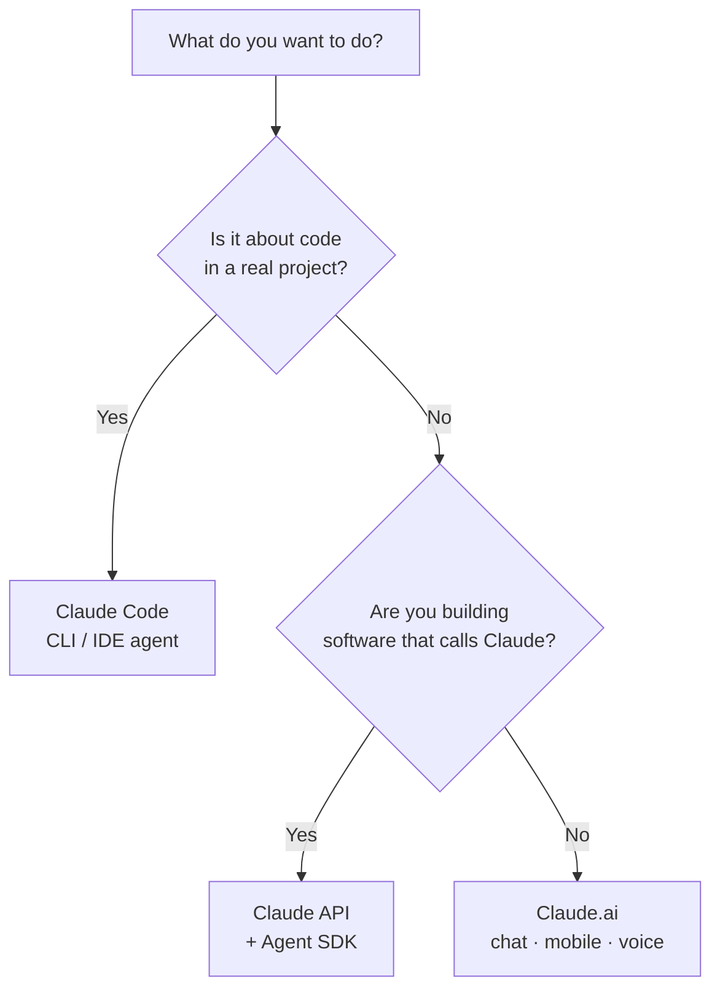

<LevelBadge level="beginner" />

يأتي "Claude" بعدة نكهات. اختر بناءً على **ما تحاول فعله**، وليس بناءً على ما سمعت عنه.

<Callout type="objectives" items={[
  "طابِق هدفك مع واجهة Claude المناسبة: الدردشة، أو Claude Code، أو واجهة API",
  "اعرف متى يناسب الهاتف والصوت الصورة",
  "افهم كيف تعمل الواجهات الثلاث معًا كلما تقدّمت في مستواك",
  "احصل على فكرة سريعة عن النموذج الذي تلجأ إليه بمجرد أن تبدأ في البناء"
]} />

## القرار في 30 ثانية

## الواجهات الثلاث في لمحة

| الواجهة | الأفضل لـ | لِمَن | ابدأ من هنا |
|---|---|---|---|
| **Claude.ai** | الكتابة، والبحث، والتحليل، والتعلّم، والتخطيط، والأسئلة اليومية | الجميع، بلا أي إعداد | [البدء مع Claude.ai](/docs/claude-app/getting-started) |
| **Claude Code** | العمل *داخل قاعدة شيفرة* — القراءة، والتحرير، وتشغيل الأوامر، وإصلاح الاختبارات | المطورون (والفضوليون تقنيًا) | [ما هو Claude Code](/docs/claude-code/what-is-claude-code) |
| **API وAgent SDK** | التطبيقات، والأتمتة، والوكلاء الذين يستدعون Claude برمجيًا | المطورون الذين يطلقون منتجًا أو خط معالجة | [أول استدعاء لك لواجهة API](/docs/api/first-call) |

### Claude.ai — تطبيقات الدردشة

Claude.ai هو نقطة الانطلاق بلا أي إعداد للجميع. وتحصل عليه أيضًا على **الهاتف** ([iOS/Android](/docs/claude-app/mobile)) وعبر **[الصوت](/docs/claude-app/voice-mode)** — رائع لالتقاط الأفكار أثناء التنقل. عزّز قدراته بـ[المشاريع](/docs/claude-app/projects)، و[التعليمات المخصصة](/docs/claude-app/custom-instructions)، و[الأدوات (Artifacts)](/docs/claude-app/artifacts).

### Claude Code — أداة البرمجة الوكيلة (agentic)

يعمل Claude Code *داخل* مشروعك. فهو يقرأ، ويحرّر، ويشغّل الأوامر، ويصلح الاختبارات — متصرّفًا على ملفاتك بإذنك.

### واجهة API وAgent SDK — ابنِ Claude داخل برمجياتك الخاصة

تتيح واجهة API وAgent SDK لبرمجياتك الخاصة استدعاء Claude برمجيًا، حتى تتمكن من إطلاق ميزات الذكاء الاصطناعي، والأتمتة، والوكلاء.

## إنها تعمل معًا

هذه ليست منتجات متنافسة — معظم الناس يتدرجون عبرها:

| تريد أن… | استخدم |
|---|---|
| تصوغ بريدًا إلكترونيًا، تلخّص ملف PDF، تعصف ذهنيًا | Claude.ai (أو الصوت/الهاتف) |
| تعيد هيكلة وحدة برمجية، تضيف اختبارات، تصلح خللًا | Claude Code |
| تضيف ميزة ذكاء اصطناعي إلى تطبيقك *أنت* | واجهة API / Agent SDK |

:::tip لست متأكدًا؟ ابدأ بالدردشة
[Claude.ai](/docs/claude-app/getting-started) لا يحتاج أي إعداد ويعلّمك كيف "يفكّر" Claude. تنتقل هذه المهارات إلى كل مكان آخر.
:::

## أي نموذج، بمجرد أن تبدأ في البناء؟

اختيار *الواجهة* هو الخطوة الأولى. عندما تنتقل إلى Claude Code أو واجهة API، فإنك تختار أيضًا *نموذجًا* — Haiku أو Sonnet أو Opus. أجب عن ثلاثة أسئلة سريعة، وسيقترح عليك هذا المُحدِّد نقطة بداية:

<ModelPicker />

:::note لا تثبّت الأسماء في الشيفرة
تتغير تشكيلات النماذج وأسعارها. تحقق دائمًا من معرّفات النماذج الحالية في صفحة [اختيار نموذج Claude](/docs/api/choosing-a-model) قبل أن تطلق منتجك.
:::

## اختبر نفسك

<Quiz title="اختبر نفسك" questions={[
  {
    q: "تريد صياغة بريد إلكتروني وتلخيص ملف PDF — بلا أي إعداد. أي واجهة؟",
    options: ["Claude Code", "Claude.ai (الدردشة / الهاتف / الصوت)", "واجهة API وAgent SDK"],
    answer: 1,
    explain: "Claude.ai هي واجهة الدردشة بلا أي إعداد للكتابة والبحث والأسئلة اليومية — متاحة على الويب والهاتف وعبر الصوت."
  },
  {
    q: "تحتاج إلى إعادة هيكلة وحدة برمجية وإصلاح اختبارات فاشلة داخل مشروع حقيقي. أي واجهة؟",
    options: ["Claude.ai", "Claude Code", "واجهة API وAgent SDK"],
    answer: 1,
    explain: "يعمل Claude Code داخل قاعدة شيفرتك — يقرأ، ويحرّر، ويشغّل الأوامر، ويصلح الاختبارات بإذنك."
  },
  {
    q: "أين ينبغي أن تتحقق من أسماء النماذج وأسعارها الحالية؟",
    options: ["هذه الصفحة", "صفحة اختيار نموذج Claude", "مخطط Mermaid أعلاه"],
    answer: 1,
    explain: "تتغير تشكيلات النماذج، لذا لا تثبّتها هذه الصفحة في الشيفرة — راجع صفحة اختيار نموذج Claude للحصول على المعرّفات والأسعار الحالية."
  }
]} />

<Callout type="takeaways" items={[
  "Claude.ai: دردشة بلا أي إعداد للكتابة والبحث والعمل اليومي — وأيضًا على الهاتف وعبر الصوت",
  "Claude Code: وكيل يتصرّف داخل قاعدة شيفرتك",
  "واجهة API وAgent SDK: ابنِ Claude داخل برمجياتك الخاصة",
  "إنها تتكامل — معظم الناس يبدؤون بالدردشة ثم يتدرجون إلى Code وواجهة API",
  "اختر نموذجًا (Haiku / Sonnet / Opus) فقط بمجرد أن تبدأ في البناء، وتحقق من المعرّفات الحالية قبل الإطلاق"
]} />

## التالي

- [أول 5 دقائق لك](/docs/start-here/your-first-5-minutes)
- [مسارات التعلّم](/docs/start-here/learning-paths)
- [اختيار نموذج Claude](/docs/api/choosing-a-model) (بمجرد أن تبدأ في البناء)
