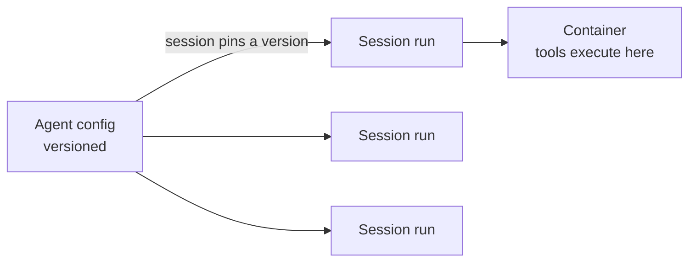

<LevelBadge level="advanced" />

<VerifyNote lastVerified="2026-06-26" source="https://docs.anthropic.com/en/docs/agents-and-tools">
Funktionen und Verfügbarkeit verwalteter Agenten ändern sich — die API befindet sich in der Beta-Phase. Bestätige Endpunkte, Feldnamen und Zugang in der offiziellen Dokumentation, bevor du darauf aufbaust.
</VerifyNote>

<Callout type="objectives" items={["Verstehen, was eine verwaltete (von Anthropic gehostete) Agent-Schleife für dich übernimmt", "Die zwei Kernobjekte trennen: ein versionierter Agent vs. eine Session pro Lauf", "Geheimnisse sicher mit Vaults einschleusen — ohne dass das Modell sie jemals sieht", "Einen Agenten mit geplanten Deployments auf einen cron-Zeitplan setzen — kein Scheduler zu hosten", "Wissen, wann verwaltet eine eigene Schleife schlägt, und welche Schutzmaßnahmen weiterhin gelten"]} />

Wenn [eine eigene Agent-Schleife zu bauen](/docs/api/building-agents) mehr Infrastruktur ist, als du besitzen möchtest, führt ein **verwalteter** (von Anthropic gehosteter) Agent die Schleife für dich aus — damit du dich auf die *Aufgabe* des Agenten konzentrierst, nicht auf Session-Verkabelung, Wiederholungsversuche, Zustand und Zeitplanung.

## Die zwei Objekte: Agent vs. Session

Das ist das mentale Modell, an dem alles andere hängt. Sie sind absichtlich getrennt.

- Ein **Agent** ist eine *persistente, versionierte Konfiguration* — Modell, System-Prompt, Tools, MCP-Server und Skills. Du erstellst ihn einmal. Jede Aktualisierung erzeugt eine neue unveränderliche Version.
- Eine **Session** ist eine *Laufzeitinstanz* — eine Ausführung, die per ID auf einen Agenten verweist. Die Konfiguration liegt beim Agenten, niemals bei der Session.

<Callout type="tip">
Sessions **heften** sich an die Agent-Version, mit der sie erstellt wurden: laufende Sessions behalten ihre Version, neue Sessions erhalten die neueste. So lieferst du Konfigurationsänderungen aus, ohne laufende Arbeit zu unterbrechen.
</Callout>

## Was "verwaltet" dir bringt

Anstatt die Schleife selbst zu bauen und zu hosten, erhältst du gehostete Bausteine:

- **Sessions** — persistente Läufe, die du pro Ausführung erstellst und wieder aufnimmst; Events werden über SSE gestreamt.
- **Umgebungen** — Container-Infrastruktur, entweder `cloud` (von Anthropic gehostet) oder `self_hosted` (Tools werden in deiner eigenen VPC ausgeführt). Ein Container pro Session ist der Arbeitsbereich des Agenten.
- **Speicher (Memory stores)** — persistenter Zustand über Sessions hinweg, mit Versionierung und Redaktion, ohne dass du eine Datenbank verkabeln musst.
- **Vaults** — Geheimnisse für MCP-Authentifizierung und andere Dienste.
- **Geplante Deployments** — Agenten, die unbeaufsichtigt auf einem cron-Zeitplan laufen.

<PromptCard title="Einen Agenten erstellen (versionierte Konfiguration), dann eine Session dagegen ausführen">{`# 1. Create the agent once
POST /v1/agents        -> returns $AGENT_ID
# 2. Each execution is a session pinned to that agent
POST /v1/sessions      { "agent": "$AGENT_ID" }`}</PromptCard>

## Vaults: Geheimnisse, die das Modell nie sieht

Ein autonomer Agent benötigt oft einen API-Schlüssel — aber das *Modell* sollte ihn niemals lesen. Vault-Anmeldedaten (`mcp_oauth`, `static_bearer`, `environment_variable`) werden beim Ausgang (Egress) ersetzt: eine `environment_variable`-Anmeldedatei wird zur Ausführungszeit in die Sandbox injiziert und ist für das Modell *niemals sichtbar*.

<Callout type="warning">
Dies ist das sichere Muster, um einem Agenten mächtigen Zugriff zu geben. Füge keine Schlüssel in den System-Prompt oder eine Nachricht ein — sie werden Teil des Kontexts, den das Modell (und deine Logs) sehen kann. Lege sie in einen Vault.
</Callout>

## Geplante Deployments: ein Agent auf einem cron

Ein **Deployment** hängt einen cron-Zeitplan an einen Agenten. Wenn der Zeitplan auslöst, startet er eine frische Session und erledigt seine Aufgabe — kein Scheduler, den du bauen oder hosten musst. Gut für eine nächtliche Datensynchronisation, einen wöchentlichen Compliance-Scan oder eine tägliche Zusammenfassung.

<Steps items={[
  {title: "Den Zeitplan definieren", body: "POST /v1/deployments mit agent, environment_id, initial_events (muss eine user.message enthalten) und einem schedule: ein POSIX-cron-Ausdruck plus eine IANA-Zeitzone."},
  {title: "Jede Auslösung = ein Lauf", body: "Jeder Auslöseversuch erstellt einen Lauf-Datensatz (drun_-Präfix). Erfolg trägt eine session_id; Fehlschlag trägt einen error.type (z. B. environment_archived, session_rate_limited). Läufe auflisten über GET /v1/deployment_runs?deployment_id=..."},
  {title: "Den Lebenszyklus steuern", body: "Pause unterdrückt zukünftige Auslösungen (manuelle Läufe funktionieren weiterhin); unpause nimmt beim nächsten Vorkommen wieder auf und holt verpasste Auslösungen NICHT nach; archive ist endgültig."},
  {title: "Bei Bedarf auslösen", body: "POST /v1/deployments/{id}/run startet sofort eine Session — sogar im pausierten Zustand — mit trigger_context.type: manual."}
]} />

<PromptCard title="Ein wöchentlicher Compliance-Scan, freitags um 20:00 Uhr New Yorker Zeit">{`POST /v1/deployments
{
  "name": "Weekly compliance scan",
  "agent": "$AGENT_ID",
  "environment_id": "$ENVIRONMENT_ID",
  "initial_events": [
    {"type": "user.message", "content": [{"type": "text", "text": "Run the compliance scan and summarize findings."}]}
  ],
  "schedule": {"type": "cron", "expression": "0 20 * * 5", "timezone": "America/New_York"}
}`}</PromptCard>

<Callout type="tip">
Cron ist `minute hour day-of-month month day-of-week`, mit Granularität auf Minutenebene. Sommer-/Winterzeit (DST) verwendet Wanduhr-Semantik: eine Zeit, die bei der Umstellung auf Sommerzeit nicht existiert, wird übersprungen; eine Zeit, die bei der Umstellung auf Winterzeit zweimal vorkommt, löst zweimal aus. Wähle eine Zeitzone und eine Stunde, die diese Grenzfälle für alles Sensible vermeidet.
</Callout>

## Wann verwaltet vs. eigene Lösung wählen

| Wähle **verwaltet**, wenn… | Wähle eine **eigene Schleife / SDK**, wenn… |
|---|---|
| Du Hosting, Zustand, Zeitplanung und Geheimnisse erledigt haben möchtest | Du volle Kontrolle über die Schleife und Tools brauchst |
| Du schnell prototypisierst | Du strenge eigene Infrastruktur-/Compliance-Anforderungen hast |
| Betriebliche Einfachheit wichtiger ist als Kontrolle | Du dich tief in deinen eigenen Stack einbettest |

Es ist ein Spektrum — einzelner Aufruf → Workflow → eigener Agent (SDK) → verwaltet. Beginne so einfach, wie es die Aufgabe erlaubt; gehe nur höher, wenn du es brauchst.

## Dieselben Schutzmaßnahmen gelten

Gehostet oder nicht, ein autonomer Agent führt weiterhin Aktionen aus. Halte **geringste Rechte (least privilege)**, **begrenzte Kosten/Iterationen** und **menschliche Freigabe für riskante Schritte** ein — siehe [Agenten absichern](/docs/security/securing-agents) und [Autonome Läufe härten](/docs/security/hardening-autonomous-runs).

<Callout type="takeaways" items={["Verwaltete Agenten übergeben Schleife, Sessions, Umgebungen, Speicher, Vaults und Zeitplanung, damit du dich auf die Aufgabe konzentrierst", "Ein Agent ist versionierte Konfiguration; eine Session ist ein Lauf, der sich an eine Version heftet — die Konfiguration liegt beim Agenten, nicht bei der Session", "Vault-environment_variable-Anmeldedaten werden zur Ausführungszeit injiziert und sind für das Modell nie sichtbar — der sichere Weg, einem Agenten Geheimnisse zu geben", "Ein geplantes Deployment ist ein cron-Ausdruck + IANA-Zeitzone; jede Auslösung erstellt einen Lauf, und unpause holt verpasste Auslösungen nicht nach", "Verwaltet sitzt am gehosteten Ende von einzelner Aufruf -> Workflow -> eigene Lösung -> verwaltet; die Autonomie-Schutzmaßnahmen gelten weiterhin"]} />

## Überprüfe dich selbst

<Quiz title="Überprüfe dich selbst" questions={[
  {
    q: "Was ist der Unterschied zwischen einem Agenten und einer Session?",
    options: [
      "Sie sind zwei Namen für dasselbe Objekt",
      "Ein Agent ist versionierte Konfiguration; eine Session ist eine Laufzeit-Ausführung, die sich an eine Agent-Version heftet",
      "Eine Session enthält das Modell und den System-Prompt; ein Agent ist nur eine ID",
      "Ein Agent führt die Tools aus; eine Session speichert Geheimnisse"
    ],
    answer: 1,
    explain: "Ein Agent ist die persistente, versionierte Konfiguration (Modell, Prompt, Tools, MCP, Skills). Eine Session ist eine Instanz pro Ausführung, die auf den Agenten verweist und sich bei der Erstellung an dessen Version heftet."
  },
  {
    q: "Wie solltest du einem verwalteten Agenten einen API-Schlüssel geben, den er benötigt?",
    options: [
      "Ihn in den System-Prompt legen, damit der Agent ihn lesen kann",
      "Ihn in der ersten Benutzernachricht der Session übergeben",
      "Ihn als Vault-Anmeldedatei speichern, zur Ausführungszeit injiziert und für das Modell nie sichtbar",
      "Ihn fest in die Tool-Definition kodieren"
    ],
    answer: 2,
    explain: "Vault-Anmeldedaten (z. B. ein environment_variable-Typ) werden beim Ausgang ersetzt und sind für das Modell nie sichtbar — Schlüssel im Prompt oder in einer Nachricht werden Teil des sichtbaren Kontexts."
  },
  {
    q: "Ein geplantes Deployment wurde für zwei Tage pausiert und dann wieder aktiviert. Was passiert mit den Auslösungen, die während der Pause stattgefunden hätten?",
    options: [
      "Sie werden nachgeholt — jeder verpasste Lauf wird beim Reaktivieren ausgeführt",
      "Sie werden nicht nachgeholt; das Deployment nimmt einfach beim nächsten geplanten Vorkommen wieder auf",
      "Das Deployment wird automatisch archiviert",
      "Alle verpassten Läufe werden in eine Warteschlange gestellt und im Abstand von einer Minute ausgeführt"
    ],
    answer: 1,
    explain: "Unpause nimmt beim nächsten Vorkommen wieder auf und holt verpasste Auslösungen nicht nach. (Du kannst jederzeit mit dem manuellen Auslöser einen Lauf erzwingen, sogar im pausierten Zustand.)"
  }
]} />

## Weiter

- [Agenten auf der API bauen](/docs/api/building-agents)
- [Cowork & Agententeams](/docs/api/cowork-and-agent-teams)
- [Headless-Modus & das Agent SDK](/docs/claude-code/headless-and-agent-sdk)
- [Agenten absichern](/docs/security/securing-agents)
