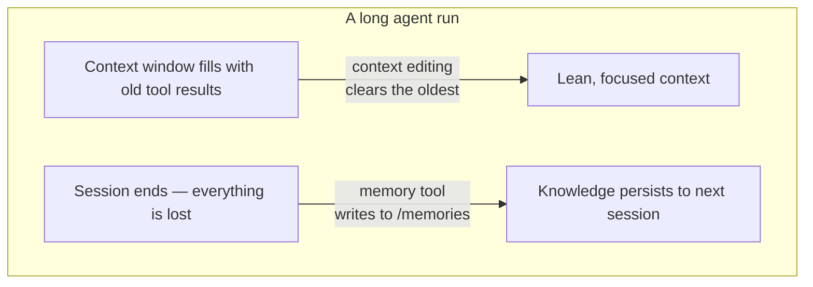

import Tabs from '@theme/Tabs';
import TabItem from '@theme/TabItem';

<LevelBadge level="advanced" />

<VerifyNote lastVerified="2026-06-26" source="https://platform.claude.com/docs/en/agents-and-tools/tool-use/memory-tool">
Beide Funktionen befinden sich in der Beta-Phase. Tool-Type-Strings, Beta-Header, Standardwerte und die gemeldeten Benchmark-Gewinne ändern sich — überprüfe dies in der offiziellen memory-tool- und context-editing-Dokumentation, bevor du darauf aufbaust.
</VerifyNote>

Ein langlaufender Agent hat zwei Feinde: Er **vergisst** in dem Moment, in dem das Gespräch endet, was er gelernt hat, und sein Kontextfenster **füllt sich** mit veralteter Tool-Ausgabe, bis es überläuft. Anthropic liefert für jedes Problem ein Primitiv — das **memory tool** (Persistenz) und **Context Editing** (Beschneidung) — und sie sind dafür gedacht, gemeinsam genutzt zu werden.

<Callout type="objectives" items={["Was das memory tool ist — ein clientseitiger Dateispeicher unter /memories, den du implementierst, nicht Anthropic", "Die sechs Befehle, die dein Handler beantworten muss: view, create, str_replace, insert, delete, rename", "Warum die Validierung gegen Path-Traversal nicht verhandelbar ist, wenn du es einbindest", "Wie Context Editing alte Tool-Ergebnisse automatisch löscht, sobald der Kontext einen Token-Schwellenwert überschreitet", "Wie man beides unter einem Beta-Header kombiniert, und die Fallstricke bei Caching und Reihenfolge"]} />

## Zwei Probleme, zwei Tools



Halte die beiden Ideen in deinem Kopf getrennt:

- **memory tool** = *Persistenz über Sitzungen hinweg*. Claude liest und schreibt Dateien; **du** speicherst sie.
- **Context Editing** = *Beschneidung innerhalb einer Sitzung*. Die API entfernt veraltete Tool-Ergebnisse aus dem Prompt, bevor er Claude erreicht.

Diese Seite ergänzt [Prompt Caching](/docs/api/prompt-caching) und die [Token-Ökonomie](/docs/power-user/token-economy) für die Kostenseite sowie [Context Engineering](/docs/frontiers/context-engineering) und [Harnesses für langlaufende Agenten](/docs/frontiers/long-running-agent-harnesses) für das *Warum*.

<Flashcards title="Memory- & Kontext-Vokabular" cards={[{front:"memory tool","back":"Ein clientseitiges Tool (type memory_20250818), das Claude erlaubt, Dateien in einem /memories-Verzeichnis zu erstellen/lesen/aktualisieren/löschen. Du implementierst das Speicher-Backend."},{front:"/memories","back":"Das einzige Verzeichnis, auf das alle Memory-Operationen beschränkt sind. Jeder Pfad muss validiert werden, damit er darin bleibt."},{front:"Context Editing","back":"Eine serverseitige Strategie, die alte Tool-Ergebnisse aus dem Prompt löscht, sobald ein Token-Schwellenwert überschritten wird — die vollständige Historie lebt weiterhin auf deinem Client."},{front:"clear_tool_uses_20250919","back":"Die Context-Editing-Strategie, die die ältesten Tool-Ergebnisse entfernt und sie durch einen Platzhalter ersetzt, damit Claude weiß, dass sie beschnitten wurden."},{front:"Compaction","back":"Eine separate serverseitige Funktion, die das gesamte Gespräch nahe der Kontextgrenze zusammenfasst — ergänzend zum clientseitigen Context Editing."}]} />

## Das memory tool ist ein Tool, das *du* implementierst

Das verwirrt die Leute: Das Aktivieren des memory tool gibt dir **nicht** einen von Anthropic gehosteten Speicher. Es ist ein **clientseitiges** Tool. Claude gibt Tool-Aufrufe wie `view` oder `create` aus; deine Anwendung führt sie gegen ein beliebiges Backend deiner Wahl aus — lokale Dateien, eine Datenbank, verschlüsselte Blobs, Cloud-Speicher — und gibt das Ergebnis zurück. Du bestimmst, wo die Bytes liegen (was auch der Grund ist, warum es [Zero-Data-Retention](/docs/foundations/privacy)-fähig ist).

Wenn das Tool aktiviert ist, fügt Anthropic eine Systemanweisung ein, die Claude anweist, **vor allem anderen sein Memory-Verzeichnis zu prüfen** und den Fortschritt während der Arbeit aufzuzeichnen, sodass nichts verloren geht, falls der Kontext zurückgesetzt wird.

### Schritt 1 — das Tool aktivieren

Füge das Tool zu deiner Anfrage hinzu. Der Type-String ist die datierte Version `memory_20250818`.

<Tabs groupId="lang">
<TabItem value="python" label="Python">

```python
import anthropic

client = anthropic.Anthropic()

message = client.messages.create(
    model="claude-opus-4-8",
    max_tokens=2048,
    messages=[{"role": "user", "content": "Help me respond to this support ticket."}],
    tools=[{"type": "memory_20250818", "name": "memory"}],
)

print(message)
```

</TabItem>
<TabItem value="typescript" label="TypeScript">

```typescript
import Anthropic from "@anthropic-ai/sdk";

const anthropic = new Anthropic();

const message = await anthropic.messages.create({
  model: "claude-opus-4-8",
  max_tokens: 2048,
  messages: [{ role: "user", content: "Help me respond to this support ticket." }],
  tools: [{ type: "memory_20250818", name: "memory" }],
});

console.log(message);
```

</TabItem>
</Tabs>

Die offiziellen SDKs liefern Memory-Helfer mit, damit du die Tool-Schnittstelle nicht selbst zusammenbauen musst — leite `BetaAbstractMemoryTool` ab (Python, C#), verwende `betaMemoryTool` (TypeScript) oder implementiere `BetaMemoryToolHandler` (Java). Sie geben dir einen sauberen Hook, an dem du deinen Speicher einklinkst.

### Schritt 2 — die sechs Befehle beantworten

Dein Handler muss diese implementieren. Die Strings, die Claude zurückerwartet, sind spezifisch — passe sie an, damit das Modell die Ergebnisse korrekt interpretiert.

<Steps items={[{title: "view", body: "Liste ein Verzeichnis auf (Dateien bis zu 2 Ebenen tief, mit menschenlesbaren Größen) oder gib den Inhalt einer Datei mit 1-indizierten Zeilennummern zurück. Optionales view_range, um einen Ausschnitt zu lesen."},{title: "create", body: "Schreibe eine neue Datei aus file_text. Gib einen Fehler aus, wenn sie bereits existiert, statt sie stillschweigend zu überschreiben."},{title: "str_replace", body: "Ersetze einen exakten old_str durch new_str. Verweigere, wenn old_str fehlt oder mehr als einmal vorkommt (mehrdeutig) — gib die Zeilennummern an."},{title: "insert", body: "Füge insert_text bei insert_line ein. Validiere, dass die Zeile innerhalb von [0, n_lines] liegt."},{title: "delete", body: "Entferne eine Datei oder ein Verzeichnis und dessen Inhalt rekursiv."},{title: "rename", body: "Verschiebe/benenne einen Pfad um. Verweigere, wenn das Ziel bereits existiert — überschreibe niemals."}]} />

Ein echtes `view` des Verzeichnisses gibt etwa Folgendes zurück — beachte den wörtlichen Header und die tabulatorgetrennten Größen, die das Modell zu parsen trainiert ist:

```text
Here're the files and directories up to 2 levels deep in /memories, excluding hidden items and node_modules:
4.0K	/memories
1.5K	/memories/customer_service_guidelines.xml
2.0K	/memories/refund_policies.xml
```

### Schritt 3 — Pfade absichern (überspringe das nicht)

Das memory tool erlaubt einem Modell, beliebige Pfad-Strings auszugeben. Ein vergiftetes Gespräch oder eine Prompt-Injection-Payload kann versuchen, aus `/memories` auszubrechen und Dateien an anderer Stelle auf deinem System zu lesen oder zu überschreiben. Behandle jeden eingehenden Pfad als feindselig.

<Callout type="warning" items={["Weise jeden Pfad ab, der nicht innerhalb von /memories aufgelöst wird.","Kanonisiere vor der Prüfung — in Python Path(p).resolve() und prüfe dann, dass .relative_to(memories_root) keine Ausnahme auslöst.","Blockiere ../, ..\\ und URL-kodierte Traversal wie %2e%2e%2f.","Begrenze Dateigrößen und Lese-Länge, damit ein außer Kontrolle geratener Agent nicht die Festplatte erschöpfen oder den nächsten Prompt sprengen kann."]} />

Dieser Validator ist das ganze Spiel — fixiere und teste ihn, bevor irgendetwas anderes ausgeliefert wird:

<PromptCard title="Path-Traversal-Schutz (Python)">{`from pathlib import Path

MEMORY_ROOT = Path("/srv/agent/memories").resolve()

def safe_path(requested: str) -> Path:
    # Map the model's /memories/... onto your real root, then prove containment.
    rel = requested.removeprefix("/memories").lstrip("/")
    candidate = (MEMORY_ROOT / rel).resolve()
    candidate.relative_to(MEMORY_ROOT)  # raises ValueError if it escaped
    return candidate`}</PromptCard>

## Context Editing verhindert das Überlaufen des Fensters

Memory löst das *Vergessen*. Das gegenteilige Problem — ein Kontextfenster, vollgestopft mit alten `tool_result`-Blöcken aus 40 Web-Suchen zuvor — ist das, was **Context Editing** löst. Sobald der Prompt einen Token-Schwellenwert überschreitet, löscht die API die **ältesten** Tool-Ergebnisse (und ersetzt sie durch einen kurzen Platzhalter, damit Claude weiß, dass sie entfernt wurden), bevor der Prompt an das Modell gesendet wird. Dein Client behält die vollständige, unbearbeitete Historie; nur das, was das Modell erreicht, wird gekürzt.

Es läuft über einen Beta-Header:

```text
anthropic-beta: context-management-2025-06-27
```

Du konfigurierst es mit einem `context_management.edits`-Array. Die Hauptstrategie ist `clear_tool_uses_20250919`:

<Tabs groupId="lang">
<TabItem value="python" label="Python">

```python
message = client.beta.messages.create(
    model="claude-opus-4-8",
    max_tokens=2048,
    betas=["context-management-2025-06-27"],
    messages=[...],
    tools=[{"type": "memory_20250818", "name": "memory"}],
    context_management={
        "edits": [
            {
                "type": "clear_tool_uses_20250919",
                "trigger": {"type": "input_tokens", "value": 30000},  # start clearing past 30k
                "keep": {"type": "tool_uses", "value": 3},            # always keep the last 3
                "clear_at_least": {"type": "input_tokens", "value": 5000},
                "exclude_tools": ["memory"],                          # never clear memory calls
                "clear_tool_inputs": False,                           # keep the call args, drop results
            }
        ]
    },
)
```

</TabItem>
<TabItem value="typescript" label="TypeScript">

```typescript
const message = await anthropic.beta.messages.create({
  model: "claude-opus-4-8",
  max_tokens: 2048,
  betas: ["context-management-2025-06-27"],
  messages: [...],
  tools: [{ type: "memory_20250818", name: "memory" }],
  context_management: {
    edits: [
      {
        type: "clear_tool_uses_20250919",
        trigger: { type: "input_tokens", value: 30000 },
        keep: { type: "tool_uses", value: 3 },
        clear_at_least: { type: "input_tokens", value: 5000 },
        exclude_tools: ["memory"],
        clear_tool_inputs: false,
      },
    ],
  },
});
```

</TabItem>
</Tabs>

Was die Stellschrauben bedeuten:

| Parameter | Standard | Was es steuert |
|-----------|---------|------------------|
| `trigger` | 100.000 Input-Tokens | Wann das Löschen einsetzt |
| `keep` | 3 Tool-Verwendungen | Wie viele aktuelle Tool-Verwendungs-/Ergebnis-Paare immer erhalten bleiben |
| `clear_at_least` | keiner | Mindestanzahl pro Aktivierung freigegebener Tokens — verwende es, damit eine Cache-Invalidierung sich tatsächlich lohnt |
| `exclude_tools` | keine | Tools, die nie gelöscht werden (z. B. `memory`, `web_search`) |
| `clear_tool_inputs` | `false` | Ob auch die Tool-*Aufrufargumente* verworfen werden, nicht nur das Ergebnis |

Die Antwort sagt dir unter `context_management.applied_edits`, was sie getan hat — z. B. `cleared_tool_uses` und `cleared_input_tokens` — sodass du protokollieren kannst, wie viel zurückgewonnen wurde.

Es gibt eine Schwesterstrategie, `clear_thinking_20251015`, die alte [Extended-Thinking](/docs/api/thinking-and-effort)-Blöcke beschneidet. Wenn du beide verwendest, **liste `clear_thinking_20251015` zuerst** im `edits`-Array auf.

<Callout type="tip" items={["Das Löschen von Tool-Ergebnissen invalidiert jeden Prompt-Cache-Präfix am Löschpunkt — kombiniere es mit clear_at_least, damit du diese Invalidierung nur bezahlst, wenn du einen nennenswerten Block freigibst.","exclude_tools: [\"memory\"] ist der übliche Zug: Du willst, dass die eigenen Notizen des Agenten bestehen bleiben und nicht mit veralteten Suchergebnissen weggefegt werden.","Context Editing (clientseitige Kürzung) und Compaction (serverseitige Zusammenfassung) sind unterschiedliche Funktionen — bei sehr langen Läufen kannst du beide schichten."]} />

## Warum man sie kombiniert — die Zahlen

Gemeinsam genutzt lassen die beiden Funktionen einen Agenten weit über ein einzelnes Kontextfenster hinaus laufen: Context Editing hält das aktive Fenster schlank, und alles Wichtige wird ins Memory geschrieben, bevor es gelöscht würde. Anthropic berichtet, dass die Kombination von Memory mit Context Editing eine **Verbesserung um 39 %** bei einer agentischen Such-Evaluation brachte und dass Context Editing allein die Token-Nutzung um **84 %** in einem 100-Runden-Web-Such-Test senkte.

<VerifyNote lastVerified="2026-06-26" source="https://www.anthropic.com/news/context-management">
Diese Prozentsätze sind Anthropics eigene Benchmark-Zahlen und spiegeln spezifische Eval-Setups wider — behandle sie als richtungsweisend, nicht als Garantien für deine Arbeitslast. Überprüfe dies in der Context-Management-Ankündigung.
</VerifyNote>

## Ein Muster, das funktioniert: das Mehrsitzungs-Projektprotokoll

Der sauberste Einsatz von Memory besteht darin, es bewusst zu initialisieren, statt Dateien ad hoc zu schreiben:

<Steps items={[{title: "Initialisierungssitzung", body: "Schreibe vor jeder echten Arbeit ein Fortschrittsprotokoll, eine Feature-Checkliste und einen Hinweis auf ein Startup-Skript, das das Projekt benötigt."},{title: "Jede spätere Sitzung beginnt mit dem Lesen dieser Dateien", body: "Sie stellt den vollständigen Projektzustand in Sekunden wieder her — kein erneutes Erkunden der Codebasis oder Nachvollziehen von Entscheidungen nötig."},{title: "Jede Sitzung endet mit der Aktualisierung des Protokolls", body: "Halte fest, was erledigt wurde und was als Nächstes ansteht, damit die nächste Sitzung einen präzisen Ausgangspunkt hat."},{title: "Ein Feature nach dem anderen, verifiziert", body: "Markiere ein Feature erst nach End-to-End-Verifizierung als abgeschlossen — nicht nur, nachdem der Code geschrieben ist — damit das Protokoll vertrauenswürdig bleibt."}]} />

## Teste dein Verständnis

<Quiz questions={[{q:"Wo werden die Daten des memory tool tatsächlich gespeichert?",options:["Auf Anthropics Servern, für dich verwaltet","In deiner eigenen Infrastruktur — das Tool ist clientseitig und du implementierst das Backend","In den Gewichten des Modells","Im Prompt-Cache"],answer:1,explain:"Das memory tool ist clientseitig. Claude gibt Tool-Aufrufe aus; deine App führt sie gegen einen von dir kontrollierten Speicher aus, beschränkt auf /memories."},{q:"Was entfernt die clear_tool_uses_20250919-Strategie von Context Editing?",options:["Den System-Prompt","Die aktuellsten Tool-Ergebnisse","Die ältesten Tool-Ergebnisse, sobald ein Token-Schwellenwert überschritten wird","Alle Benutzernachrichten"],answer:2,explain:"Es löscht zuerst die ältesten Tool-Ergebnisse, nach dem Trigger-Schwellenwert, während die aktuellsten erhalten bleiben (Standard: letzte 3) und die vollständige Historie auf deinem Client verbleibt."},{q:"Warum musst du jeden Pfad validieren, den das memory tool empfängt?",options:["Um Festplattenspeicher zu sparen","Um Directory-Traversal-Ausbrüche aus /memories über Eingaben wie ../ zu verhindern","Um das Modell zu beschleunigen","Weil Anthropic lange Pfade ablehnt"],answer:1,explain:"Ein bösartiger oder injizierter Pfad könnte versuchen, Dateien außerhalb von /memories zu lesen oder zu überschreiben. Kanonisiere den Pfad und beweise, dass er innerhalb des Memory-Roots bleibt, bevor du handelst."}]} />

## Quellen & weiterführende Lektüre

- [Memory tool — Claude API-Dokumentation](https://platform.claude.com/docs/en/agents-and-tools/tool-use/memory-tool) — Tool-Type `memory_20250818`, die sechs Befehle und Sicherheitshinweise.
- [Context Editing — Claude API-Dokumentation](https://platform.claude.com/docs/en/build-with-claude/context-editing) — die `context-management-2025-06-27`-Beta, Strategiefelder und Standardwerte.
- [Kontextverwaltung auf der Claude Developer Platform](https://www.anthropic.com/news/context-management) — die Ankündigung mit den Benchmark-Zahlen 39 % / 84 %.
- [Effektives Context Engineering für KI-Agenten](https://www.anthropic.com/engineering/effective-context-engineering-for-ai-agents) — das Just-in-Time-Retrieval-Muster, für das Memory gebaut ist.
- [Effektive Harnesses für langlaufende Agenten](https://www.anthropic.com/engineering/effective-harnesses-for-long-running-agents) — die Fallstudie zum Mehrsitzungs-Projektprotokoll.
- Verwandt auf AILmanac: [Context Engineering](/docs/frontiers/context-engineering) · [Harnesses für langlaufende Agenten](/docs/frontiers/long-running-agent-harnesses) · [Prompt Caching](/docs/api/prompt-caching) · [Tool Use](/docs/api/tool-use)
