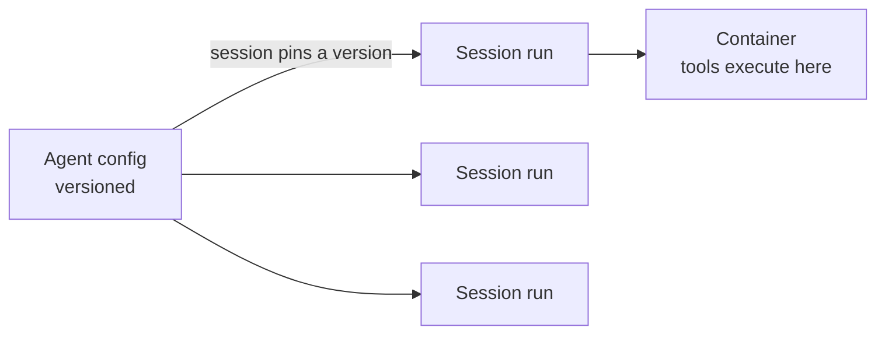

<LevelBadge level="advanced" />

<VerifyNote lastVerified="2026-06-26" source="https://docs.anthropic.com/en/docs/agents-and-tools">
Las capacidades y la disponibilidad de los agentes gestionados cambian: la API está en beta. Confirma los endpoints, los nombres de campos y el acceso en la documentación oficial antes de construir sobre ella.
</VerifyNote>

<Callout type="objectives" items={["Entender qué te delega un bucle de agente gestionado (alojado por Anthropic)", "Separar los dos objetos centrales: un Agent versionado frente a una Session por ejecución", "Inyectar secretos de forma segura con Vaults — sin que el modelo los vea nunca", "Poner un agente en una programación cron con Despliegues programados — sin scheduler que alojar", "Saber cuándo el modo gestionado supera a un bucle personalizado, y las salvaguardas que siguen aplicando"]} />

Si [construir tu propio bucle de agente](/docs/api/building-agents) es más infraestructura de la que quieres gestionar, un agente **gestionado** (alojado por Anthropic) ejecuta el bucle por ti — para que te centres en el *trabajo* del agente, no en la fontanería de sesiones, los reintentos, el estado y la programación.

## Los dos objetos: Agent frente a Session

Este es el modelo mental del que cuelga todo lo demás. Están separados a propósito.

- Un **Agent** es una *configuración persistida y versionada* — modelo, system prompt, herramientas, servidores MCP y skills. Lo creas una vez. Cada actualización crea una nueva versión inmutable.
- Una **Session** es una *instancia en tiempo de ejecución* — una ejecución que apunta a un agente por ID. La configuración vive en el agente, nunca en la sesión.

<Callout type="tip">
Las sesiones se **fijan** (pin) a la versión del agente con la que se crearon: las sesiones en ejecución conservan su versión, las nuevas sesiones obtienen la última. Así es como despliegas cambios de configuración sin romper el trabajo en curso.
</Callout>

## Qué te aporta lo "gestionado"

En lugar de montar y alojar el bucle a mano, obtienes bloques de construcción alojados:

- **Sessions** — ejecuciones persistentes que creas por ejecución y reanudas; transmiten eventos por SSE.
- **Environments** — infraestructura de contenedores, ya sea `cloud` (alojado por Anthropic) o `self_hosted` (las herramientas se ejecutan en tu propia VPC). Un contenedor por sesión es el espacio de trabajo del agente.
- **Memory stores** — estado persistente entre sesiones, con versionado y redacción, sin que tengas que cablear una base de datos.
- **Vaults** — secretos para la autenticación MCP y otros servicios.
- **Scheduled deployments** — agentes que se ejecutan en una programación cron, sin supervisión.

<PromptCard title="Crea un agente (configuración versionada), luego ejecuta una sesión contra él">{`# 1. Create the agent once
POST /v1/agents        -> returns $AGENT_ID
# 2. Each execution is a session pinned to that agent
POST /v1/sessions      { "agent": "$AGENT_ID" }`}</PromptCard>

## Vaults: secretos que el modelo nunca ve

Un agente autónomo a menudo necesita una clave de API — pero el *modelo* nunca debería leerla. Las credenciales de vault (`mcp_oauth`, `static_bearer`, `environment_variable`) se sustituyen en la salida (egress): una credencial `environment_variable` se inyecta en el sandbox en tiempo de ejecución y *nunca es visible* para el modelo.

<Callout type="warning">
Este es el patrón seguro para dar a un agente un acceso potente. No pegues claves en el system prompt ni en un mensaje — pasan a formar parte del contexto que el modelo (y tus logs) pueden ver. Ponlas en un vault.
</Callout>

## Despliegues programados: un agente en un cron

Un **deployment** adjunta una programación cron a un agente. Cuando la programación se dispara, inicia una sesión nueva y completa su tarea — sin scheduler que tengas que construir ni alojar. Bueno para una sincronización de datos nocturna, un escaneo de cumplimiento semanal o un resumen diario.

<Steps items={[
  {title: "Define la programación", body: "POST /v1/deployments con agent, environment_id, initial_events (debe incluir un user.message) y un schedule: una expresión cron POSIX más una zona horaria IANA."},
  {title: "Cada disparo = una ejecución", body: "Cada intento de disparo crea un registro de ejecución (prefijo drun_). El éxito lleva un session_id; el fallo lleva un error.type (p. ej. environment_archived, session_rate_limited). Lista las ejecuciones con GET /v1/deployment_runs?deployment_id=..."},
  {title: "Controla el ciclo de vida", body: "Pausar suprime los disparos futuros (las ejecuciones manuales siguen funcionando); reanudar continúa en la siguiente ocurrencia y NO recupera los disparos perdidos; archivar es terminal."},
  {title: "Dispara bajo demanda", body: "POST /v1/deployments/{id}/run inicia una sesión de inmediato — incluso en pausa — con trigger_context.type: manual."}
]} />

<PromptCard title="Un escaneo de cumplimiento semanal, los viernes a las 20:00 hora de Nueva York">{`POST /v1/deployments
{
  "name": "Weekly compliance scan",
  "agent": "$AGENT_ID",
  "environment_id": "$ENVIRONMENT_ID",
  "initial_events": [
    {"type": "user.message", "content": [{"type": "text", "text": "Run the compliance scan and summarize findings."}]}
  ],
  "schedule": {"type": "cron", "expression": "0 20 * * 5", "timezone": "America/New_York"}
}`}</PromptCard>

<Callout type="tip">
El cron es `minute hour day-of-month month day-of-week`, con granularidad a nivel de minuto. El horario de verano (DST) usa semántica de reloj de pared: una hora que no existe al adelantar el reloj se omite; una hora que ocurre dos veces al retrasar el reloj se dispara dos veces. Elige una zona horaria y una hora que eviten esos bordes para cualquier cosa sensible.
</Callout>

## Cuándo elegir gestionado frente a personalizado

| Elige **gestionado** cuando… | Elige un **bucle personalizado / SDK** cuando… |
|---|---|
| Quieres que se gestionen el alojamiento, el estado, la programación y los secretos | Necesitas control total sobre el bucle y las herramientas |
| Estás prototipando rápido | Tienes necesidades estrictas de infraestructura/cumplimiento personalizadas |
| La simplicidad operativa importa más que el control | Estás integrando profundamente en tu propio stack |

Es un espectro — llamada única → workflow → agente personalizado (SDK) → gestionado. Empieza tan simple como permita la tarea; sube de nivel solo cuando lo necesites.

## Aplican las mismas salvaguardas

Gestionado o no, un agente autónomo sigue ejecutando acciones. Mantén el **mínimo privilegio**, el **coste/iteraciones acotados** y la **aprobación humana para los pasos arriesgados** — consulta [Asegurar agentes](/docs/security/securing-agents) y [Endurecer ejecuciones autónomas](/docs/security/hardening-autonomous-runs).

<Callout type="takeaways" items={["Los agentes gestionados delegan el bucle, las sesiones, los entornos, la memoria, los vaults y la programación para que te centres en el trabajo", "Un Agent es configuración versionada; una Session es una ejecución que se fija a una versión — la configuración vive en el agente, no en la sesión", "Las credenciales environment_variable de un vault se inyectan en tiempo de ejecución y nunca son visibles para el modelo — la forma segura de dar secretos a un agente", "Un despliegue programado es una expresión cron + zona horaria IANA; cada disparo crea una ejecución, y reanudar no recupera los disparos perdidos", "Lo gestionado está en el extremo alojado de llamada única -> workflow -> personalizado -> gestionado; las salvaguardas de autonomía siguen aplicando"]} />

## Comprueba lo aprendido

<Quiz title="Comprueba lo aprendido" questions={[
  {
    q: "¿Cuál es la diferencia entre un Agent y una Session?",
    options: [
      "Son dos nombres para el mismo objeto",
      "Un Agent es configuración versionada; una Session es una ejecución en tiempo de ejecución que se fija a una versión del agente",
      "Una Session contiene el modelo y el system prompt; un Agent es solo un ID",
      "Un Agent ejecuta las herramientas; una Session almacena los secretos"
    ],
    answer: 1,
    explain: "Un Agent es la configuración persistida y versionada (modelo, prompt, herramientas, MCP, skills). Una Session es una instancia por ejecución que referencia al agente y se fija a su versión en el momento de la creación."
  },
  {
    q: "¿Cómo deberías darle a un agente gestionado una clave de API que necesita?",
    options: [
      "Ponerla en el system prompt para que el agente pueda leerla",
      "Pasarla en el primer mensaje de usuario de la sesión",
      "Almacenarla como una credencial de vault, inyectada en tiempo de ejecución y nunca visible para el modelo",
      "Codificarla directamente en la definición de la herramienta"
    ],
    answer: 2,
    explain: "Las credenciales de vault (p. ej. un tipo environment_variable) se sustituyen en la salida y nunca son visibles para el modelo — las claves en el prompt o en un mensaje pasan a formar parte del contexto visible."
  },
  {
    q: "Un despliegue programado estuvo en pausa durante dos días y luego se reanudó. ¿Qué pasa con los disparos que se habrían producido durante la pausa?",
    options: [
      "Se recuperan — cada ejecución perdida se ejecuta al reanudar",
      "No se recuperan; el despliegue simplemente continúa en la siguiente ocurrencia programada",
      "El despliegue se archiva automáticamente",
      "Todas las ejecuciones perdidas se ponen en cola y se ejecutan con un minuto de diferencia"
    ],
    answer: 1,
    explain: "Reanudar continúa en la siguiente ocurrencia y no recupera los disparos perdidos. (Todavía puedes forzar una ejecución en cualquier momento con el disparo manual, incluso en pausa.)"
  }
]} />

## Siguiente

- [Construir agentes sobre la API](/docs/api/building-agents)
- [Cowork y equipos de agentes](/docs/api/cowork-and-agent-teams)
- [Modo headless y el Agent SDK](/docs/claude-code/headless-and-agent-sdk)
- [Asegurar agentes](/docs/security/securing-agents)
