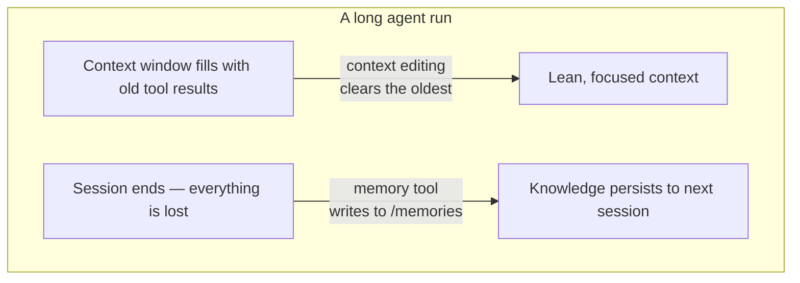

import Tabs from '@theme/Tabs';
import TabItem from '@theme/TabItem';

<LevelBadge level="advanced" />

<VerifyNote lastVerified="2026-06-26" source="https://platform.claude.com/docs/en/agents-and-tools/tool-use/memory-tool">
Ambas funciones están en beta. Las cadenas de tipo de herramienta, el encabezado beta, los valores predeterminados y las mejoras de benchmark reportadas cambian: confírmalo en la documentación oficial de memory-tool y context-editing antes de construir sobre ellas.
</VerifyNote>

Un agente de larga duración tiene dos enemigos: **olvida** lo que aprendió en el momento en que termina la conversación, y su ventana de contexto **se llena** de salida de herramientas obsoleta hasta que desborda. Anthropic ofrece una primitiva para cada uno — la **memory tool** (persistencia) y la **edición de contexto** (poda) — y están diseñadas para usarse juntas.

<Callout type="objectives" items={["Qué es la memory tool: un almacén de archivos del lado del cliente en /memories que implementas tú, no Anthropic", "Los seis comandos que tu handler debe responder: view, create, str_replace, insert, delete, rename", "Por qué la validación de path-traversal es innegociable cuando lo conectas", "Cómo la edición de contexto limpia automáticamente resultados de herramientas antiguos una vez que el contexto cruza un umbral de tokens", "Cómo combinar ambos bajo un único encabezado beta, y los detalles a vigilar con el cacheo y el orden"]} />

## Dos problemas, dos herramientas



Mantén las dos ideas separadas en tu cabeza:

- **Memory tool** = *persistencia entre sesiones*. Claude lee y escribe archivos; **tú** los almacenas.
- **Edición de contexto** = *poda dentro de una sesión*. La API descarta resultados de herramientas obsoletos del prompt antes de que lleguen a Claude.

Esta página se complementa con [Prompt Caching](/docs/api/prompt-caching) y la [economía de tokens](/docs/power-user/token-economy) para el lado de los costes, y con [Context Engineering](/docs/frontiers/context-engineering) y los [harnesses de agentes de larga duración](/docs/frontiers/long-running-agent-harnesses) para el *porqué*.

<Flashcards title="Vocabulario de memoria y contexto" cards={[{front:"Memory tool","back":"Una herramienta del lado del cliente (tipo memory_20250818) que permite a Claude crear/leer/actualizar/eliminar archivos en un directorio /memories. Tú implementas el backend de almacenamiento."},{front:"/memories","back":"El único directorio al que se confinan todas las operaciones de memoria. Cada ruta debe validarse para que permanezca dentro de él."},{front:"Edición de contexto","back":"Una estrategia del lado del servidor que limpia resultados de herramientas antiguos del prompt una vez que se cruza un umbral de tokens: el historial completo sigue viviendo en tu cliente."},{front:"clear_tool_uses_20250919","back":"La estrategia de edición de contexto que elimina los resultados de herramientas más antiguos, reemplazándolos con un marcador para que Claude sepa que fueron podados."},{front:"Compactación","back":"Una función separada del lado del servidor que resume toda la conversación cerca del límite de contexto: complementaria a la edición de contexto del lado del cliente."}]} />

## La memory tool es una herramienta que implementas *tú*

Esto confunde a la gente: habilitar la memory tool **no** te da almacenamiento alojado por Anthropic. Es una herramienta del **lado del cliente**. Claude emite llamadas de herramienta como `view` o `create`; tu aplicación las ejecuta contra el backend que elijas — archivos locales, una base de datos, blobs cifrados, almacenamiento en la nube — y devuelve el resultado. Tú controlas dónde viven los bytes (que es también por qué es apta para [Zero-Data-Retention](/docs/foundations/privacy)).

Cuando la herramienta está habilitada, Anthropic inyecta una instrucción de sistema que le indica a Claude que **revise su directorio de memoria antes de hacer cualquier otra cosa**, y que registre el progreso a medida que trabaja para que nada se pierda si el contexto se reinicia.

### Paso 1 — habilitar la herramienta

Añade la herramienta a tu solicitud. La cadena de tipo es la versión fechada `memory_20250818`.

<Tabs groupId="lang">
<TabItem value="python" label="Python">

```python
import anthropic

client = anthropic.Anthropic()

message = client.messages.create(
    model="claude-opus-4-8",
    max_tokens=2048,
    messages=[{"role": "user", "content": "Help me respond to this support ticket."}],
    tools=[{"type": "memory_20250818", "name": "memory"}],
)

print(message)
```

</TabItem>
<TabItem value="typescript" label="TypeScript">

```typescript
import Anthropic from "@anthropic-ai/sdk";

const anthropic = new Anthropic();

const message = await anthropic.messages.create({
  model: "claude-opus-4-8",
  max_tokens: 2048,
  messages: [{ role: "user", content: "Help me respond to this support ticket." }],
  tools: [{ type: "memory_20250818", name: "memory" }],
});

console.log(message);
```

</TabItem>
</Tabs>

Los SDK oficiales incluyen helpers de memoria para que no tengas que armar a mano la interfaz de la herramienta — extiende `BetaAbstractMemoryTool` (Python, C#), usa `betaMemoryTool` (TypeScript), o implementa `BetaMemoryToolHandler` (Java). Te dan un hook limpio donde conectas tu almacenamiento.

### Paso 2 — responder a los seis comandos

Tu handler debe implementar estos. Las cadenas que Claude espera de vuelta son específicas: hazlas coincidir para que el modelo interprete los resultados correctamente.

<Steps items={[{title: "view", body: "Lista un directorio (archivos hasta 2 niveles de profundidad, con tamaños legibles por humanos) o devuelve el contenido de un archivo con números de línea indexados desde 1. view_range opcional para leer un fragmento."},{title: "create", body: "Escribe un nuevo archivo a partir de file_text. Da error si ya existe en lugar de sobrescribir silenciosamente."},{title: "str_replace", body: "Reemplaza un old_str exacto por new_str. Rechaza si old_str falta, o aparece más de una vez (ambiguo): informa los números de línea."},{title: "insert", body: "Inserta insert_text en insert_line. Valida que la línea esté dentro de [0, n_lines]."},{title: "delete", body: "Elimina un archivo, o un directorio y su contenido de forma recursiva."},{title: "rename", body: "Mueve/renombra una ruta. Rechaza si el destino ya existe: nunca sobrescribas."}]} />

Un `view` real del directorio devuelve algo como esto — fíjate en el encabezado literal y los tamaños separados por tabulaciones, que el modelo está entrenado para analizar:

```text
Here're the files and directories up to 2 levels deep in /memories, excluding hidden items and node_modules:
4.0K	/memories
1.5K	/memories/customer_service_guidelines.xml
2.0K	/memories/refund_policies.xml
```

### Paso 3 — bloquear las rutas (no te saltes esto)

La memory tool permite que un modelo emita cadenas de ruta arbitrarias. Una conversación envenenada o un payload de inyección de prompts puede intentar escapar de `/memories` y leer o sobrescribir archivos en otra parte de tu máquina. Trata cada ruta entrante como hostil.

<Callout type="warning" items={["Rechaza cualquier ruta que no resuelva a un punto dentro de /memories.","Canonicaliza antes de comprobar: en Python, Path(p).resolve() y luego verifica que .relative_to(memories_root) no lance una excepción.","Bloquea ../, ..\\ y traversal codificado en URL como %2e%2e%2f.","Limita los tamaños de archivo y la longitud de lectura para que un agente descontrolado no pueda agotar el disco ni inflar el siguiente prompt."]} />

Este validador es lo que decide la partida: fíjalo y pruébalo antes de desplegar cualquier otra cosa:

<PromptCard title="Guard contra path-traversal (Python)">{`from pathlib import Path

MEMORY_ROOT = Path("/srv/agent/memories").resolve()

def safe_path(requested: str) -> Path:
    # Map the model's /memories/... onto your real root, then prove containment.
    rel = requested.removeprefix("/memories").lstrip("/")
    candidate = (MEMORY_ROOT / rel).resolve()
    candidate.relative_to(MEMORY_ROOT)  # raises ValueError if it escaped
    return candidate`}</PromptCard>

## La edición de contexto evita que la ventana desborde

La memoria resuelve el *olvido*. El problema opuesto — una ventana de contexto atiborrada de bloques `tool_result` antiguos de hace 40 búsquedas web — es lo que resuelve la **edición de contexto**. Una vez que el prompt cruza un umbral de tokens, la API limpia los resultados de herramientas **más antiguos** (reemplazándolos con un breve marcador para que Claude sepa que se eliminaron) antes de que el prompt se envíe al modelo. Tu cliente conserva el historial completo y sin editar; solo se recorta lo que llega al modelo.

Funciona sobre un encabezado beta:

```text
anthropic-beta: context-management-2025-06-27
```

Lo configuras con un array `context_management.edits`. La estrategia principal es `clear_tool_uses_20250919`:

<Tabs groupId="lang">
<TabItem value="python" label="Python">

```python
message = client.beta.messages.create(
    model="claude-opus-4-8",
    max_tokens=2048,
    betas=["context-management-2025-06-27"],
    messages=[...],
    tools=[{"type": "memory_20250818", "name": "memory"}],
    context_management={
        "edits": [
            {
                "type": "clear_tool_uses_20250919",
                "trigger": {"type": "input_tokens", "value": 30000},  # start clearing past 30k
                "keep": {"type": "tool_uses", "value": 3},            # always keep the last 3
                "clear_at_least": {"type": "input_tokens", "value": 5000},
                "exclude_tools": ["memory"],                          # never clear memory calls
                "clear_tool_inputs": False,                           # keep the call args, drop results
            }
        ]
    },
)
```

</TabItem>
<TabItem value="typescript" label="TypeScript">

```typescript
const message = await anthropic.beta.messages.create({
  model: "claude-opus-4-8",
  max_tokens: 2048,
  betas: ["context-management-2025-06-27"],
  messages: [...],
  tools: [{ type: "memory_20250818", name: "memory" }],
  context_management: {
    edits: [
      {
        type: "clear_tool_uses_20250919",
        trigger: { type: "input_tokens", value: 30000 },
        keep: { type: "tool_uses", value: 3 },
        clear_at_least: { type: "input_tokens", value: 5000 },
        exclude_tools: ["memory"],
        clear_tool_inputs: false,
      },
    ],
  },
});
```

</TabItem>
</Tabs>

Qué significan los parámetros:

| Parámetro | Predeterminado | Qué controla |
|-----------|---------|------------------|
| `trigger` | 100.000 tokens de entrada | Cuándo se activa la limpieza |
| `keep` | 3 usos de herramienta | Cuántos pares recientes de uso/resultado de herramienta se preservan siempre |
| `clear_at_least` | ninguno | Tokens mínimos liberados por activación: úsalo para que una invalidación de caché realmente valga la pena |
| `exclude_tools` | ninguno | Herramientas que nunca se limpian (p. ej. `memory`, `web_search`) |
| `clear_tool_inputs` | `false` | Si también descartar los *argumentos de la llamada* de la herramienta, no solo el resultado |

La respuesta te dice lo que hizo, bajo `context_management.applied_edits` — p. ej. `cleared_tool_uses` y `cleared_input_tokens` — para que puedas registrar cuánto se recuperó.

Existe una estrategia hermana, `clear_thinking_20251015`, que poda bloques antiguos de [extended-thinking](/docs/api/thinking-and-effort). Si usas ambas, **lista `clear_thinking_20251015` primero** en el array `edits`.

<Callout type="tip" items={["Limpiar resultados de herramientas invalida cualquier prefijo de prompt-cache en el punto de limpieza: combínalo con clear_at_least para pagar esa invalidación solo cuando estés liberando un fragmento significativo.","exclude_tools: [\"memory\"] es la jugada habitual: quieres que las notas propias del agente persistan, no que se barran junto con resultados de búsqueda obsoletos.","La edición de contexto (recorte del lado del cliente) y la compactación (resumen del lado del servidor) son funciones distintas: para ejecuciones muy largas puedes combinar ambas."]} />

## Por qué combinarlas — los números

Usadas juntas, las dos funciones permiten que un agente se ejecute mucho más allá de una sola ventana de contexto: la edición de contexto mantiene la ventana viva ligera, y todo lo que importa se escribe en memoria antes de que se limpiara. Anthropic reporta que combinar memoria con edición de contexto dio una **mejora del 39%** en una evaluación de búsqueda agéntica, y que la edición de contexto por sí sola redujo el uso de tokens en un **84%** en una prueba de búsqueda web de 100 turnos.

<VerifyNote lastVerified="2026-06-26" source="https://www.anthropic.com/news/context-management">
Estos porcentajes son las propias cifras de benchmark de Anthropic y reflejan configuraciones de evaluación específicas: trátalos como orientativos, no como garantías para tu carga de trabajo. Confírmalo en el anuncio de context-management.
</VerifyNote>

## Un patrón que funciona: el registro de proyecto multisesión

El uso más limpio de la memoria es inicializarla de forma deliberada en lugar de escribir archivos sobre la marcha:

<Steps items={[{title: "Sesión inicializadora", body: "Antes de cualquier trabajo real, escribe un registro de progreso, una lista de verificación de funciones y una nota que apunte a cualquier script de arranque que el proyecto necesite."},{title: "Cada sesión posterior abre leyendo esos archivos", body: "Recupera el estado completo del proyecto en segundos: sin necesidad de volver a explorar el código ni de rehacer decisiones."},{title: "Cada sesión cierra actualizando el registro", body: "Anota qué se hizo y qué sigue, para que la siguiente sesión tenga un punto de partida exacto."},{title: "Una función a la vez, verificada", body: "Marca una función como completa solo tras una verificación de extremo a extremo, no solo tras escribir el código, para que el registro siga siendo fiable."}]} />

## Pon a prueba tu comprensión

<Quiz questions={[{q:"¿Dónde se almacenan realmente los datos de la memory tool?",options:["En los servidores de Anthropic, gestionados por ti","En tu propia infraestructura: la herramienta es del lado del cliente y tú implementas el backend","En los pesos del modelo","En el prompt cache"],answer:1,explain:"La memory tool es del lado del cliente. Claude emite llamadas de herramienta; tu aplicación las ejecuta contra el almacenamiento que controlas, confinado a /memories."},{q:"¿Qué elimina la estrategia clear_tool_uses_20250919 de la edición de contexto?",options:["El prompt de sistema","Los resultados de herramientas más recientes","Los resultados de herramientas más antiguos una vez que se cruza un umbral de tokens","Todos los mensajes del usuario"],answer:2,explain:"Limpia primero los resultados de herramientas más antiguos, tras el umbral de trigger, conservando los más recientes (predeterminado: los últimos 3) y dejando el historial completo en tu cliente."},{q:"¿Por qué debes validar cada ruta que recibe la memory tool?",options:["Para ahorrar espacio en disco","Para evitar escapes de directory-traversal fuera de /memories mediante entradas como ../","Para acelerar el modelo","Porque Anthropic rechaza las rutas largas"],answer:1,explain:"Una ruta maliciosa o inyectada podría intentar leer o sobrescribir archivos fuera de /memories. Canonicaliza la ruta y demuestra que permanece dentro de la raíz de memoria antes de actuar."}]} />

## Fuentes y lecturas adicionales

- [Memory tool — documentación de la API de Claude](https://platform.claude.com/docs/en/agents-and-tools/tool-use/memory-tool) — tipo de herramienta `memory_20250818`, los seis comandos y la guía de seguridad.
- [Edición de contexto — documentación de la API de Claude](https://platform.claude.com/docs/en/build-with-claude/context-editing) — la beta `context-management-2025-06-27`, los campos de estrategia y los valores predeterminados.
- [Gestión del contexto en la Claude Developer Platform](https://www.anthropic.com/news/context-management) — el anuncio con las cifras de benchmark del 39% / 84%.
- [Ingeniería de contexto eficaz para agentes de IA](https://www.anthropic.com/engineering/effective-context-engineering-for-ai-agents) — el patrón de recuperación just-in-time para el que está hecha la memoria.
- [Harnesses eficaces para agentes de larga duración](https://www.anthropic.com/engineering/effective-harnesses-for-long-running-agents) — el caso de estudio del registro de proyecto multisesión.
- Relacionado en AILmanac: [Context Engineering](/docs/frontiers/context-engineering) · [Harnesses de agentes de larga duración](/docs/frontiers/long-running-agent-harnesses) · [Prompt Caching](/docs/api/prompt-caching) · [Tool Use](/docs/api/tool-use)
