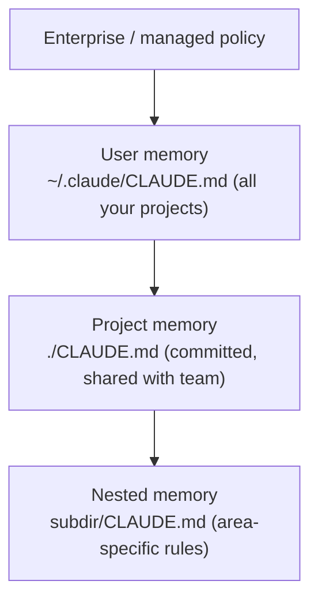

<LevelBadge level="beginner" />

<VerifyNote lastVerified="2026-06-20" source="https://code.claude.com/docs/en/memory">
Las ubicaciones de los archivos de memoria y la sintaxis de importación pueden cambiar — confirma los detalles en la documentación oficial de memoria de Claude Code.
</VerifyNote>

Si haces **una** sola cosa para mejorar [Claude Code](/docs/claude-code/what-is-claude-code), que sea esta. `CLAUDE.md` es un archivo de texto plano que Claude lee al inicio de cada sesión — el briefing permanente de tu proyecto.

<Callout type="objectives" items={["Por qué CLAUDE.md es el único ajuste de Claude Code de mayor impacto", "Cómo la jerarquía de memoria se combina desde lo global hasta lo específico del proyecto", "Cómo generar un archivo inicial con /init y recortarlo", "Qué pertenece a CLAUDE.md — y qué dejar fuera", "Cómo los @imports te permiten referenciar documentos sin duplicarlos"]} />

## Por qué es el ajuste de mayor impacto

Sin él, vuelves a explicar tu proyecto en cada sesión ("usamos pnpm, los tests están en `__tests__`, no toques `/generated`…"). Con él, Claude ya lo sabe. Unas buenas instrucciones aquí mejoran *cada* interacción futura de golpe.

## La jerarquía de memoria

Claude Code lee la memoria de varios sitios y los combina, aproximadamente de lo más global a lo más específico:

- **Memoria de usuario** — tus preferencias personales en todos los proyectos.
- **Memoria de proyecto** (`./CLAUDE.md`, en el control de versiones) — cómo funciona *este* repo. Se comparte con tu equipo.
- **Anidada** — coloca un `CLAUDE.md` en una subcarpeta para reglas que solo apliquen ahí.

<Flashcards title="Conoce tus capas de memoria" cards={[{front: "Memoria de usuario", back: "~/.claude/CLAUDE.md — tus preferencias personales que aplican en todos los proyectos."}, {front: "Memoria de proyecto", back: "./CLAUDE.md — en el control de versiones y compartida con el equipo; describe cómo funciona este repo."}, {front: "Memoria anidada", back: "subdir/CLAUDE.md — reglas específicas de un área que aplican solo dentro de esa subcarpeta."}, {front: "Enterprise / managed policy", back: "La capa más global; política a nivel de organización que se sitúa por encima de tu memoria de usuario."}]} />

## Genera un punto de partida

<Steps items={[{title: "Ejecuta /init en el proyecto", body: "Claude inspecciona el código y redacta un CLAUDE.md por ti automáticamente."}, {title: "Recórtalo", body: "El borrador es un punto de partida, no la meta final. Recórtalo a lo que es cierto y útil."}, {title: "Toma una plantilla", body: "Toma un punto de partida listo para usar de la página de Plantillas de CLAUDE.md y adáptalo a tu repo."}]} />

<PromptCard title="Genera un borrador de CLAUDE.md">{`/init`}</PromptCard>

Toma una plantilla lista para usar en [Plantillas de CLAUDE.md](/docs/templates/claude-md).

## Qué poner en él

- Qué es el proyecto, en dos frases.
- El stack tecnológico y cómo **ejecutar / testear / hacer lint**.
- Convenciones que Claude no puede inferir (nomenclatura, estructura, estilo de commits).
- **Salvaguardas**: "ejecuta los tests antes de declarar que está hecho", "nunca edites `/vendor`", "nunca hagas commit de secretos".

## Qué NO poner en él

<Callout type="warning" items={["Claude sigue CLAUDE.md al pie de la letra — las instrucciones obsoletas, vagas o aspiracionales perjudican activamente.", "Describe cómo funciona el proyecto realmente hoy; breve y veraz gana a largo y aspiracional.", "Evita documentos enormes pegados (usa @imports en su lugar), secretos y reglas que en realidad no sigues.", "Revísalo periódicamente para que se mantenga preciso a medida que el proyecto evoluciona."]} />

## Importaciones

Trae documentos existentes en lugar de duplicarlos — p. ej. referencia tu guía de estilo con una importación `@path/to/file` para que haya una única fuente de verdad. Consulta la [documentación oficial de memoria](https://code.claude.com/docs/en/memory) para la sintaxis exacta.

<Callout type="tip" items={["Una única fuente de verdad: referencia un archivo con @imports en lugar de pegar su contenido en CLAUDE.md.", "Si un documento ya existe, enlázalo — no lo copies. Las copias se quedan obsoletas."]} />

## Compruébate

<Quiz title="Compruébate" questions={[{q: "¿Qué archivo lee Claude Code al inicio de cada sesión como el briefing permanente de tu proyecto?", options: ["README.md", "CLAUDE.md", "package.json"], answer: 1, explain: "CLAUDE.md es el archivo de memoria en texto plano que Claude lee al inicio de cada sesión."}, {q: "¿Qué hace ejecutar /init en un proyecto?", options: ["Hace commit de CLAUDE.md al repo de tu equipo", "Redacta un CLAUDE.md inspeccionando el código, que luego recortas", "Elimina archivos de memoria obsoletos"], answer: 1, explain: "/init redacta un CLAUDE.md inicial a partir del código — el borrador es un punto de partida, así que lo recortas después."}, {q: "¿Cuál es la forma recomendada de incluir un documento grande existente, como una guía de estilo?", options: ["Pegar el documento entero en CLAUDE.md", "Referenciarlo con una importación @path/to/file", "Guardarlo como un secreto"], answer: 1, explain: "Usa @imports para apuntar al archivo y así tener una única fuente de verdad en lugar de una copia duplicada que se queda obsoleta."}]} />

<Callout type="takeaways" items={["CLAUDE.md es el ajuste de mayor impacto: mejora cada sesión futura de golpe.", "La memoria se combina de lo global a lo específico: política enterprise, luego archivos CLAUDE.md de usuario, de proyecto y anidados.", "Empieza con /init, luego recorta el borrador a lo que es realmente cierto.", "Incluye el resumen del proyecto, los comandos de ejecución/test/lint, las convenciones y las salvaguardas.", "Mantenlo breve y veraz — usa @imports para documentos grandes y nunca hagas commit de secretos."]} />

## Siguiente

- [Modo Plan](/docs/claude-code/plan-mode) — primeros cambios seguros
- [Permisos y modos](/docs/claude-code/permissions) — lo que Claude puede hacer sin supervisión
- [Tutorial: Personaliza Claude Code para un repo real](/docs/walkthroughs/customize-claude-code)
