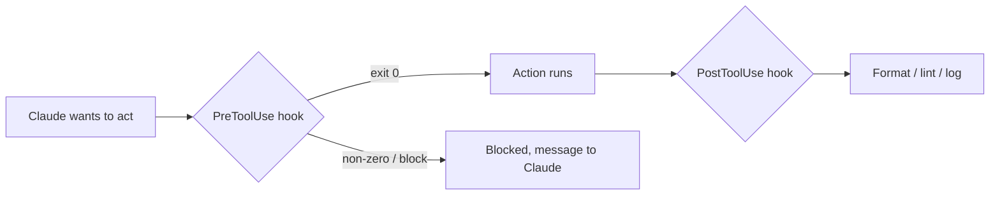

<LevelBadge level="advanced" />

<VerifyNote lastVerified="2026-06-23" source="https://code.claude.com/docs/en/hooks">
Los nombres exactos de los eventos de hook, el payload de stdin y el protocolo de bloqueo evolucionan: confírmalos con la documentación oficial de hooks antes de depender de un evento o campo concreto.
</VerifyNote>

Los hooks son **comandos de shell que Claude Code ejecuta automáticamente** en puntos definidos de su ciclo de vida. Donde los [permisos](/docs/claude-code/permissions) deciden *si* una acción está permitida, los hooks te dejan a *ti* ejecutar lógica determinista a su alrededor: formato, validación, registro, controles. Son la manera de hacer que un comportamiento esté garantizado en lugar de quedar en un "por favor, acuérdate de".

<Callout type="objectives" items={["Cuándo recurrir a un hook en lugar de a una instrucción o un permiso", "Cómo se conecta un hook: evento, matcher y el payload JSON en stdin", "Las dos formas en que un hook bloquea una acción: código de salida 2 frente a JSON en stdout", "Las buenas prácticas y los errores comunes que separan los hooks rápidos y seguros de los lentos y silenciosos"]} />

## Cuándo recurrir a un hook

Recurre a un hook cuando quieras que un comportamiento esté *garantizado*, no simplemente solicitado. Cada tarea común se asigna a un evento del ciclo de vida:

- **Formatear / hacer lint automáticamente** tras cada edición de archivo (`PostToolUse`).
- **Bloquear** una acción que infringe una regla antes de que se ejecute (`PreToolUse`).
- **Notificar o registrar** cuando termina una sesión o se completa una tarea (`Stop`).
- **Inyectar contexto** al inicio de la sesión.

<Flashcards title="Eventos de hook de un vistazo" cards={[{front: "PreToolUse", back: "Se dispara antes de que se ejecute una acción. Úsalo para bloquear o controlar; por ejemplo, rechazar un comando destructivo antes de que se ejecute."}, {front: "PostToolUse", back: "Se dispara después de una acción coincidente. Úsalo para formatear, hacer lint o registrar lo que acaba de cambiar."}, {front: "Stop", back: "Se dispara cuando termina una sesión o se completa una tarea. Úsalo para notificar o registrar."}, {front: "Inicio de sesión", back: "Se dispara al comienzo de una sesión. Úsalo para inyectar contexto."}]} />

## Cómo funcionan

Registras los hooks en [`settings.json`](/docs/claude-code/settings), haciéndolos coincidir con un **evento** (y a menudo un matcher de herramienta). Cuando el evento se dispara, Claude ejecuta tu comando, pasando un **payload JSON por stdin** (el nombre de la herramienta, sus entradas, la sesión). El código de salida y la salida de tu comando deciden qué ocurre a continuación.

<Steps items={[{title: "Haz coincidir un evento", body: "Registra el hook en settings.json bajo el evento del ciclo de vida que te interese; por ejemplo, PostToolUse."}, {title: "Acota con un matcher", body: "Añade un matcher de herramienta para que el hook solo se dispare con las herramientas relevantes, p. ej. matcher \"Edit|Write\" para ediciones de archivos."}, {title: "Lee el payload desde stdin", body: "Cuando el evento se dispara, Claude ejecuta tu comando y canaliza un payload JSON por stdin: el nombre de la herramienta, sus entradas, la sesión."}, {title: "Decide qué ocurre a continuación", body: "El código de salida y la salida de tu comando determinan el resultado: dejar que la acción continúe, ejecutar tu lógica o bloquearla."}]} />

```json
{
  "hooks": {
    "PostToolUse": [
      {
        "matcher": "Edit|Write",
        "hooks": [
          { "type": "command", "command": "jq -r '.tool_input.file_path' | xargs npx prettier --write" }
        ]
      }
    ]
  }
}
```

El hook anterior lee la ruta del archivo editado del JSON de stdin (`.tool_input.file_path`) y lo formatea. No asumas que una variable de entorno contiene la ruta: **léela desde stdin.** Marcadores de ruta útiles como `${CLAUDE_PROJECT_DIR}` *sí* están disponibles para localizar scripts.

## Cómo bloquea un hook

Dos formas, según el evento:

- **Código de salida 2**: el hook hace fallar la acción y lo que haya escrito en **stderr** se convierte en el mensaje que ve Claude. Sencillo y funciona para los hooks de comando.
- **JSON en stdout (salida 0)**: devuelve una decisión estructurada. Para `PreToolUse`, eso es un `permissionDecision` de `deny`; para `PostToolUse`/`Stop`/etc. es `{"decision": "block", "reason": "…"}`.

El script de abajo es un hook `PreToolUse` sobre la herramienta Bash. Léelo de arriba abajo: extrae el comando de stdin y, si parece destructivo, escribe una razón en stderr y sale con 2 para bloquear.

```bash
#!/usr/bin/env bash
# PreToolUse hook on the Bash tool: refuse to delete things.
command=$(jq -r '.tool_input.command' < /dev/stdin)
if [[ "$command" == rm\ * || "$command" == *"rm -rf"* ]]; then
  echo "Blocked: destructive 'rm' is not allowed by policy." >&2
  exit 2
fi
exit 0
```

## El modelo mental

Un hook `PreToolUse` se ejecuta *antes* de la acción y puede bloquearla; un hook `PostToolUse` se ejecuta *después* de que tenga éxito y reacciona al resultado.



## Buenas prácticas

- **Mantén los hooks rápidos e idempotentes**: se ejecutan mucho.
- **Falla de forma ruidosa ante problemas reales**, pero no bloquees por cuestiones cosméticas.
- **Trata la salida del hook como feedback para Claude**: un mensaje claro le ayuda a autocorregirse.
- Los hooks se ejecutan con los privilegios de tu shell: revisa cualquier hook que no hayas escrito tú ([Revisar código de terceros](/docs/security/reviewing-third-party-code)).

## Errores comunes

- **Leer la ruta del archivo desde una variable de entorno.** La ruta vive en el JSON de stdin (`.tool_input.file_path`), no en `$CLAUDE_FILE_PATH`. Pasa stdin a través de `jq`.
- **Bloqueos silenciosos.** Si un hook `PreToolUse` sale con 2 sin nada en stderr, Claude queda bloqueado pero no sabe *por qué* y no puede adaptarse. Escribe siempre una razón clara.
- **Hooks lentos.** Un hook `PostToolUse` se ejecuta tras *cada* edición coincidente. Un linter de 3 segundos hace que toda la sesión se sienta lenta: mantén los hooks rápidos e, idealmente, actúa solo sobre lo que cambió.
- **Matchers demasiado amplios.** `matcher: ".*"` se dispara con cada herramienta. Acótalo con un nombre exacto, una lista `Edit|Write` o el campo `if` por manejador (p. ej. `"if": "Bash(git push *)"`).
- **Confiar en hooks que no escribiste.** Un hook ejecuta shell arbitrario con tus privilegios. Revisa primero cualquier hook de un plugin o plantilla: consulta [Revisar código de terceros](/docs/security/reviewing-third-party-code).

<Callout type="warning" items={["Un hook ejecuta shell arbitrario con tus privilegios: nunca conectes un hook de un plugin o plantilla sin leerlo primero."]} />

Hay plantillas listas para copiar y pegar en [Recetas de Hooks y settings.json](/docs/templates/hooks-settings).

<PromptCard title="Formatear automáticamente los archivos editados (PostToolUse en Edit|Write)">{`{
  "hooks": {
    "PostToolUse": [
      {
        "matcher": "Edit|Write",
        "hooks": [
          { "type": "command", "command": "jq -r '.tool_input.file_path' | xargs npx prettier --write" }
        ]
      }
    ]
  }
}`}</PromptCard>

<Quiz title="Compruébalo tú mismo" questions={[{q: "¿Dónde encuentra un hook la ruta del archivo que se acaba de editar?", options: ["En la variable de entorno $CLAUDE_FILE_PATH", "En el payload JSON de stdin, en .tool_input.file_path", "En un argumento de línea de comandos pasado por Claude"], answer: 1, explain: "La ruta vive en el JSON de stdin (.tool_input.file_path), no en una variable de entorno. Pasa stdin a través de jq para leerla."}, {q: "Un hook PreToolUse sale con el código 2. ¿Qué ocurre?", options: ["La acción se permite y stdout se registra", "La acción se bloquea, y lo que el hook haya escrito en stderr se convierte en el mensaje que ve Claude", "Claude ignora el resultado porque la salida 2 está reservada"], answer: 1, explain: "El código de salida 2 hace fallar la acción; stderr se convierte en el mensaje que ve Claude. Escribe siempre una razón clara para que Claude pueda adaptarse."}, {q: "¿Por qué se considera el matcher \".*\" un error común?", options: ["Es JSON inválido y rompe settings.json", "Se dispara con cada herramienta, así que el hook se ejecuta mucho más de lo previsto: acótalo con un nombre exacto, una lista Edit|Write o el campo if", "Solo coincide con la herramienta Bash"], answer: 1, explain: "Un matcher demasiado amplio se dispara con cada herramienta. Acótalo para mantener los hooks rápidos y enfocados."}]} />

<Callout type="takeaways" items={["Los hooks hacen que un comportamiento esté garantizado, no solicitado: ejecutan lógica determinista alrededor de acciones que los permisos solo permiten o deniegan.", "Registra un hook en settings.json contra un evento más un matcher; Claude canaliza un payload JSON por stdin y lee tu código de salida y tu salida.", "Lee la ruta del archivo desde stdin (.tool_input.file_path), no desde una variable de entorno.", "Bloquea con el código de salida 2 (stderr se convierte en el mensaje) o con JSON estructurado en stdout (salida 0); incluye siempre una razón clara.", "Mantén los hooks rápidos, idempotentes y con matchers acotados, y revisa cualquier hook que no hayas escrito tú, ya que se ejecuta con los privilegios de tu shell."]} />

## Siguiente

- [settings.json](/docs/claude-code/settings) · [Permisos](/docs/claude-code/permissions)
- [Skills](/docs/claude-code/skills) — experiencia frente a automatización
- [Endurecer ejecuciones autónomas](/docs/security/hardening-autonomous-runs)
