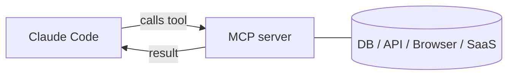

<LevelBadge level="advanced" />

<VerifyNote lastVerified="2026-06-23" source="https://code.claude.com/docs/en/mcp">
Los comandos `claude mcp`, los ámbitos de configuración y los transportes evolucionan: confírmalo en la documentación oficial de MCP de Claude Code y en modelcontextprotocol.io.
</VerifyNote>

El **Model Context Protocol (MCP)** es un estándar abierto para conectar la IA con herramientas y datos externos. Un **servidor MCP** expone capacidades (consultar una base de datos, abrir un PR de GitHub, controlar un navegador); Claude Code se conecta a él y puede **llamar a esas herramientas** durante una sesión. Es la forma de extender Claude más allá de tu sistema de archivos y tu shell.

<Callout type="objectives" items={["Explicar qué es un servidor MCP y cómo Claude Code llama a sus herramientas", "Distinguir los dos transportes: stdio local frente a HTTP/SSE remoto", "Añadir un servidor con claude mcp add y leer el JSON que escribe", "Elegir el ámbito correcto (local, project, user) según quién debe ver un servidor", "Conectar una base de datos real a Claude de principio a fin", "Evitar las trampas de seguridad y configuración que afectan a la mayoría de la gente"]} />

## Cómo es por dentro



Declaras los servidores que Claude puede usar; cada servidor publica un conjunto de herramientas con esquemas; Claude las elige y las llama como cualquier otra herramienta.

<Flashcards title="Vocabulario de MCP" cards={[{front: "Model Context Protocol (MCP)", back: "Un estándar abierto para conectar la IA con herramientas y datos externos."}, {front: "Servidor MCP", back: "Un programa que expone capacidades —consultar una base de datos, abrir un PR de GitHub, controlar un navegador— como herramientas que se pueden llamar."}, {front: "Herramienta", back: "Una capacidad que un servidor MCP publica con un esquema; Claude la elige y la llama como cualquier otra herramienta."}, {front: "Transporte", back: "Cómo Claude llega a un servidor: stdio (proceso local) o HTTP/SSE remoto (alojado, a menudo con OAuth)."}, {front: "Ámbito", back: "Quién ve un servidor: local (tú, este proyecto), project (el equipo, subido al control de versiones) o user (tú, en todas partes)."}]} />

## Transportes

Hay dos formas en que Claude llega a un servidor. Elige según dónde se ejecute el servidor.

- **stdio** — un proceso local que Claude lanza (genial para herramientas/CLIs locales).
- **Remoto (HTTP/SSE)** — un servidor alojado, a menudo con OAuth.

## Configurar servidores

La vía más rápida es el comando `claude mcp add`: escribe la configuración por ti. Sigue esta secuencia para pasar de cero a un servidor conectado.

<Steps items={[{title: "Añade un servidor stdio local", body: "Ejecuta claude mcp add: todo lo que sigue a -- es el comando de inicio que Claude ejecuta por ti."}, {title: "O añade un servidor HTTP remoto", body: "Pasa --transport http y un ámbito, y luego la URL del servidor. Los servidores remotos suelen estar alojados y usan OAuth."}, {title: "Comprueba qué hay conectado", body: "Ejecuta claude mcp list para ver los servidores configurados y su estado de conexión."}, {title: "Inspecciona y autentica", body: "Usa /mcp dentro de una sesión para inspeccionar las herramientas de un servidor y autenticarte en servidores remotos."}]} />

<PromptCard title="Añade un servidor stdio local">{`# A local stdio server (everything after -- is the launch command)
claude mcp add github -- npx -y @modelcontextprotocol/server-github`}</PromptCard>

<PromptCard title="Añade un servidor HTTP remoto (compartido con el proyecto)">{`# A remote HTTP server, shared with everyone on the project
claude mcp add --transport http --scope project linear https://mcp.linear.app/mcp`}</PromptCard>

Por debajo, eso no es más que JSON. Un servidor con ámbito **project** acaba en un `.mcp.json` en la raíz del repositorio: súbelo al control de versiones y todo tu equipo obtendrá las mismas herramientas:

```json
{
  "mcpServers": {
    "github": { "command": "npx", "args": ["-y", "@modelcontextprotocol/server-github"] }
  }
}
```

### El ámbito decide quién ve el servidor

| Ámbito | Vive en | Úsalo para |
|---|---|---|
| `local` (predeterminado) | tus ajustes de usuario, solo este proyecto | experimentos personales, secretos |
| `project` | `.mcp.json` en el repositorio (subido al control de versiones) | herramientas que todo el equipo debería compartir |
| `user` | tus ajustes de usuario, todos los proyectos | servidores que quieres en todas partes |

Ejecuta `claude mcp list` para ver qué hay conectado y `/mcp` dentro de una sesión para inspeccionar las herramientas y autenticarte en servidores remotos. Consulta [Configuración de MCP y scaffolds de servidor](/docs/templates/mcp-config) para plantillas listas para copiar y pegar.

## Ejemplo práctico: dale a Claude tu base de datos

Supón que quieres que Claude responda preguntas contra un Postgres local en lugar de que tú pegues los resultados de las consultas. Añade el servidor (ámbito project, para que tus compañeros lo hereden):

<PromptCard title="Añade un servidor Postgres con ámbito project">{`claude mcp add --scope project db -- npx -y @modelcontextprotocol/server-postgres "postgresql://localhost/app"`}</PromptCard>

Ahora, en una sesión, puedes formular la pregunta en lenguaje natural y dejar que Claude haga el bucle de consulta por ti:

<PromptCard title="Haz una pregunta contra la base de datos">{`How many users signed up last week? Check the DB.`}</PromptCard>

Claude llama a la herramienta `query` del servidor, recibe las filas de vuelta y responde, sin el bucle de copiar y pegar. Como tiene ámbito project, un compañero que clone el repositorio obtiene la misma capacidad en el momento en que abre Claude Code. Mantén la cadena de conexión en solo lectura si únicamente quieres lecturas.

## Confianza y seguridad

<Callout type="warning" items={["Un servidor MCP ejecuta código y puede leer datos y realizar acciones — conecta solo servidores en los que confíes.", "Dale a cada servidor el mínimo privilegio que necesita.", "Cualquier contenido externo que un servidor devuelva puede transportar inyección de prompts.", "Revisa los servidores de terceros antes de conectarlos."]} />

:::warning Trata los servidores MCP como instalar software
Un servidor MCP ejecuta código y puede leer datos y realizar acciones. Conecta solo servidores en los que confíes, dales el **mínimo privilegio** necesario y recuerda que cualquier contenido externo que devuelvan puede transportar [inyección de prompts](/docs/security/prompt-injection). Revisa primero los servidores de terceros — consulta [Revisar código de terceros](/docs/security/reviewing-third-party-code).
:::

## MCP también en las apps

MCP también impulsa los **Conectores** en las apps de Claude — mismo estándar, distinta superficie. Consulta [Conectores (MCP) en las apps](/docs/claude-app/connectors) y, para la API, [MCP y conexión a herramientas](/docs/api/mcp).

## Errores comunes

- **Ámbito incorrecto.** Un servidor añadido con ámbito `local` no aparecerá para tus compañeros; uno que solo querías para ti no debería subirse al control de versiones con ámbito `project`. Elige de forma deliberada.
- **Demasiados servidores, demasiadas herramientas.** Cada servidor conectado añade sus esquemas de herramientas al contexto. Conecta lo que la tarea necesita, no todo tu catálogo.
- **Conexiones con privilegios excesivos.** Dale a un servidor de base de datos un rol de solo lectura a menos que Claude realmente necesite escribir. MCP hace que las capacidades sean reales: redúcelas al mínimo.
- **Olvidar el riesgo de inyección.** Cualquier cosa que un servidor devuelva (una página web, el cuerpo de una incidencia, una fila) es texto no confiable que puede transportar [inyección de prompts](/docs/security/prompt-injection). No conectes un servidor potente con capacidad de escritura junto a uno con capacidad de lectura no confiable sin pensarlo bien.

<Quiz title="Ponte a prueba" questions={[{q: "¿Qué transporte es un proceso local que Claude lanza por sí mismo?", options: ["HTTP/SSE remoto", "stdio", "OAuth"], answer: 1, explain: "stdio es un proceso local que Claude lanza, ideal para herramientas y CLIs locales. HTTP/SSE remoto es un servidor alojado, a menudo con OAuth."}, {q: "¿Dónde se escribe un servidor con ámbito project y cuál es el beneficio?", options: ["En tus ajustes de usuario; solo tú lo ves", "En un .mcp.json en la raíz del repositorio; súbelo al control de versiones y todo el equipo obtiene las mismas herramientas", "En una caché global oculta; nadie puede editarla"], answer: 1, explain: "El ámbito project acaba en un .mcp.json subido al control de versiones en la raíz del repositorio, así que los compañeros que clonan el repositorio heredan las mismas herramientas."}, {q: "¿Por qué mantener una conexión de base de datos en solo lectura cuando Claude solo necesita leer?", options: ["Hace que las consultas se ejecuten más rápido", "Mínimo privilegio: MCP hace que las capacidades sean reales, así que no concedas acceso de escritura salvo que sea realmente necesario", "El protocolo exige solo lectura"], answer: 1, explain: "Dale a los servidores el mínimo privilegio que necesitan. MCP hace que las capacidades sean reales, así que un rol de solo lectura evita escrituras no deseadas."}]} />

<Callout type="takeaways" items={["MCP es un estándar abierto; un servidor MCP expone herramientas que Claude Code llama como cualquier otra herramienta.", "Dos transportes: stdio local (un proceso que Claude lanza) y HTTP/SSE remoto (alojado, a menudo OAuth).", "claude mcp add escribe la configuración por ti; por debajo es JSON, y el ámbito project vive en un .mcp.json subido al control de versiones.", "El ámbito controla la visibilidad: local (tú, este proyecto), project (subido al control de versiones para el equipo), user (tú, en todas partes).", "Trata los servidores como instalar software: confianza, mínimo privilegio y atención a la inyección de prompts en todo lo que devuelvan."]} />

## Siguiente

- [Construye y conecta tu primer servidor MCP (tutorial)](/docs/walkthroughs/first-mcp-server)
- [Configuración de MCP y scaffolds de servidor](/docs/templates/mcp-config)
- [Asegurar agentes y herramientas](/docs/security/securing-agents)
