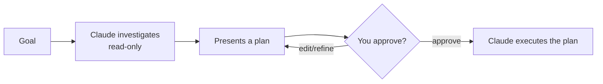

<LevelBadge level="beginner" />

<Callout type="objectives" items={["Explicar qué hace el Modo Plan y por qué es de solo lectura", "Decidir cuándo planificar primero y cuándo puedes saltártelo", "Recorrer el ciclo investigar-proponer-aprobar-ejecutar", "Distinguir el Modo Plan de los Permisos y usarlos juntos"]} />

<VerifyNote lastVerified="2026-06-20" source="https://code.claude.com/docs/en">
La forma de entrar al Modo Plan (atajo/flag) puede cambiar entre versiones: consulta la documentación oficial de Claude Code.
</VerifyNote>

## La idea principal

Imagina darle a un contratista las llaves de tu casa frente a pedirle primero que la recorra y anote *qué* cambiaría. El Modo Plan es ese recorrido.

El **Modo Plan** pone a Claude Code en **solo lectura**: puede explorar tu base de código, ejecutar búsquedas y razonar, pero **no editará archivos ni ejecutará comandos que cambien el estado**. En su lugar, produce un plan y espera tu aprobación.

<Callout type="tip" items={["Solo lectura significa que Claude PIENSA pero no ACTÚA: sin ediciones de archivos, sin comandos que cambien el estado, hasta que tú des la orden."]} />

## Por qué es la forma más segura de empezar

Para cualquier cosa grande, arriesgada o desconocida, quieres ver *qué* pretende hacer Claude antes de que toque tu repositorio. El Modo Plan separa el **pensar** del **hacer**:

La recompensa: detectas suposiciones equivocadas *antes* de que se conviertan en código equivocado.

## Cuándo usarlo

<Callout type="tip" items={["SIEMPRE para cambios grandes o multiarchivo, migraciones o refactorizaciones", "Cuando trabajas en una base de código que aún no conoces del todo", "Cuando quieres un plan revisable para compartir con un compañero de equipo"]} />

Para ediciones pequeñas y obvias puedes saltártelo, pero en caso de duda, planifica primero.

## Cómo funciona en la práctica

Sigue el ciclo. Cada paso habilita el siguiente: Claude solo pasa a editar *después* de que apruebes.

<Steps items={[{title: "Entra al Modo Plan y expón tu objetivo", body: "Cambia al modo de solo lectura y luego describe lo que quieres lograr."}, {title: "Claude investiga", body: "Lee los archivos relevantes y hace preguntas aclaratorias."}, {title: "Claude devuelve un plan paso a paso", body: "Archivos a cambiar, el enfoque y cómo verificar el resultado."}, {title: "Apruebas o refinas", body: "Solo después de la aprobación Claude pasa a hacer cambios."}]} />

### Pruébalo tú mismo

Copia esto en una sesión de planificación real y observa cómo se desarrolla el ciclo:

<PromptCard title="Inicia una sesión de planificación">{`I want to migrate our auth from sessions to JWT. Stay in Plan Mode: investigate the current setup, ask anything you need, then propose a step-by-step plan with files to change and how to verify — don't edit anything yet.`}</PromptCard>

:::tip Combínalo con CLAUDE.md
Un buen [CLAUDE.md](/docs/claude-code/claude-md) hace que los planes sean más precisos: Claude planifica teniendo ya en cuenta tus convenciones y salvaguardas.
:::

## Modo Plan frente a Permisos

Una confusión clásica. Resuelven problemas distintos y funcionan juntos:

- **Modo Plan** = "investiga y propón, no actúes todavía." (Esta página.)
- **[Permisos](/docs/claude-code/permissions)** = una vez actuando, *qué* acciones están permitidas sin preguntar.

Piénsalo como **si actuar ahora** (Modo Plan) frente a **qué acciones están permitidas una vez actuando** (Permisos).

<Flashcards cards={[{front: "¿En qué estado pone el Modo Plan a Claude Code?", back: "Solo lectura: puede explorar, buscar y razonar, pero no editará archivos ni ejecutará comandos que cambien el estado hasta que apruebes."}, {front: "¿Cuál es el ciclo del Modo Plan?", back: "Investigar (solo lectura) → presentar un plan → apruebas o refinas → Claude ejecuta."}, {front: "¿Cuándo deberías recurrir al Modo Plan?", back: "Por defecto para trabajo grande, arriesgado o desconocido (cambios multiarchivo, migraciones, refactorizaciones, bases de código desconocidas). Sáltatelo solo para ediciones pequeñas y obvias."}, {front: "¿Modo Plan frente a Permisos?", back: "El Modo Plan gobierna SI actuar ahora; los Permisos gobiernan QUÉ acciones están permitidas una vez actuando."}]} />

<Callout type="takeaways" items={["El Modo Plan es de solo lectura: Claude explora y propone pero nunca edita ni ejecuta comandos que cambien el estado hasta que apruebes", "Úsalo por defecto para trabajo grande, arriesgado o desconocido; sáltatelo solo para ediciones pequeñas y obvias", "El ciclo es investigar, proponer, aprobar/refinar, ejecutar", "El Modo Plan gobierna SI actuar ahora; los Permisos gobiernan QUÉ acciones están permitidas una vez actuando"]} />

<Quiz title="Ponte a prueba" questions={[{q: "¿Qué puede hacer Claude Code mientras está en Modo Plan?", options: ["Editar archivos y ejecutar cualquier comando", "Explorar, buscar y razonar, pero no editar archivos ni ejecutar comandos que cambien el estado", "Solo responder preguntas, sin ningún acceso a archivos"], answer: 1, explain: "El Modo Plan es de solo lectura: Claude puede explorar la base de código, ejecutar búsquedas y razonar, pero no editará archivos ni ejecutará comandos que cambien el estado."}, {q: "¿Cuándo deberías recurrir al Modo Plan?", options: ["Solo para corregir erratas de una línea", "Para cambios grandes o multiarchivo, migraciones, refactorizaciones o bases de código desconocidas", "Nunca: solo te ralentiza"], answer: 1, explain: "Úsalo siempre para cambios grandes o multiarchivo, migraciones o refactorizaciones, y cuando trabajas en una base de código que aún no conoces del todo. Las ediciones pequeñas y obvias pueden saltárselo."}, {q: "¿Cuál es el orden correcto del ciclo del Modo Plan?", options: ["Ejecutar, luego investigar, luego aprobar", "Investigar (solo lectura), presentar un plan, apruebas o refinas, y luego Claude ejecuta", "Aprobar primero, luego Claude investiga y edita"], answer: 1, explain: "Claude investiga en solo lectura, presenta un plan, apruebas o refinas, y solo entonces pasa a ejecutar el plan."}, {q: "¿En qué se diferencian el Modo Plan y los Permisos?", options: ["Son dos nombres para la misma función", "Modo Plan = investigar y proponer, no actuar todavía; Permisos = una vez actuando, qué acciones están permitidas sin preguntar", "Los Permisos deciden si planificar; el Modo Plan decide qué archivos editar"], answer: 1, explain: "El Modo Plan separa el pensar del hacer. Los Permisos controlan qué acciones están permitidas sin preguntar una vez que Claude está actuando. Funcionan juntos."}]} />

## Siguiente

- [Permisos y modos de permiso](/docs/claude-code/permissions)
- [Gestión del contexto](/docs/claude-code/context-management) — mantén efectivas las sesiones largas
- [Tutorial: Personaliza Claude Code para un repo real](/docs/walkthroughs/customize-claude-code)
