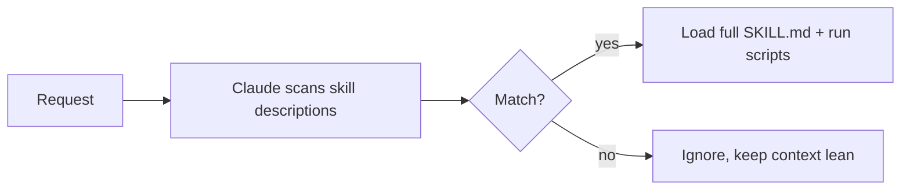

<LevelBadge level="advanced" />

<VerifyNote lastVerified="2026-06-23" source="https://code.claude.com/docs/en/skills">
La estructura de los archivos de Skill, la divulgación progresiva y dónde se ejecutan las skills (Claude Code, Claude.ai, Cowork) están evolucionando — confírmalo en la documentación oficial de Skills.
</VerifyNote>

<Callout type="objectives" items={["Definir qué es una Skill y en qué se diferencia de meterlo todo en CLAUDE.md", "Leer y escribir un SKILL.md — frontmatter más instrucciones — y entender por qué la descripción es el disparador", "Explicar la divulgación progresiva y por qué permite escalar muchas skills sin saturar el contexto", "Conocer los tres lugares donde viven las skills: personal, de proyecto e incluidas en un plugin", "Elegir correctamente entre Skill, comando slash, subagente y MCP", "Evitar los cuatro errores comunes que impiden que las skills se disparen"]} />

Una **Skill** empaqueta experiencia — instrucciones más scripts y recursos opcionales — que Claude carga **solo cuando es relevante**. En lugar de meterlo todo en [CLAUDE.md](/docs/claude-code/claude-md), le das a Claude una biblioteca de capacidades que incorpora bajo demanda.

## Anatomía

Una skill es una carpeta con un `SKILL.md`: frontmatter YAML + instrucciones.

```markdown
---
name: pdf-forms
description: Use when the user needs to fill, read, or generate PDF forms.
---

# PDF Forms
Steps and rules for working with PDF forms…
(optionally reference scripts/ or resources/ in this folder)
```

<Callout type="tip" items={["La descripción es el disparador — Claude la lee para decidir cuándo activar la skill. Escríbela como \"Use when…\", lo bastante específica para que se cargue en el momento adecuado y no en otros."]} />

## Divulgación progresiva (por qué las skills escalan)

Claude no carga por adelantado el cuerpo completo de cada skill — ve el ligero `name` + `description`, y solo incorpora las instrucciones completas (y ejecuta los scripts) cuando una petición coincide. Eso mantiene el contexto ligero incluso con muchas skills instaladas.



## Dónde viven

<Steps items={[{title:"Personal", body:"~/.claude/skills/<name>/SKILL.md — sigue siendo tuya, disponible en todos tus proyectos."},{title:"Proyecto (compartible)", body:".claude/skills/<name>/SKILL.md — regístrala en git y todo el equipo obtiene la capacidad."},{title:"Incluida en un plugin", body:"Empaqueta skills dentro de un plugin para distribuirlas al equipo. Consulta Plugins y marketplaces."}]} />

AILmanac incluye [7 packs de skills listos para usar](/docs/templates/skills) — copia uno para probarlo.

## Ejemplo práctico: una skill que se dispara sola

Crea `~/.claude/skills/release-notes/SKILL.md`:

```markdown
---
name: release-notes
description: Use when the user asks to write release notes or a changelog from git history.
---

# Release Notes
1. Run `git log <last-tag>..HEAD --oneline` to get the commits.
2. Group them into Features / Fixes / Breaking changes.
3. Write user-facing notes — what changed for *users*, not commit messages.
4. Output Markdown ready to paste into a GitHub release.
```

Más tarde escribes el prompt de abajo. Claude nunca tuvo estos pasos en el contexto — pero la petición coincide con la `description`, así que incorpora el `SKILL.md` completo, ejecuta el `git log` y produce notas agrupadas. No invocaste nada por su nombre; la **description hizo el enrutamiento**. Añade un archivo `scripts/` en la misma carpeta y la skill puede ejecutarlo como parte del paso 1.

<PromptCard title="Dispara la skill por intención — sin necesidad de nombre">{`Draft release notes since v1.4.`}</PromptCard>

## Skill frente a comando frente a subagente frente a MCP

| Herramienta | Qué es | Quién la dispara: tú o Claude |
|---|---|---|
| [Comando slash](/docs/claude-code/slash-commands) | Un prompt guardado | **Tú** lo invocas |
| **Skill** | Experiencia bajo demanda + scripts | **Claude** la carga cuando es relevante |
| [Subagente](/docs/claude-code/subagents) | Un agente delegado con su propio contexto | Claude delega |
| [MCP](/docs/claude-code/mcp) | Una conexión a herramientas/datos externos | Proporciona herramientas que llamar |

<Callout type="takeaways" items={["Quieres dispararlo bajo demanda → comando slash.", "Claude debería conocer el procedimiento y aplicarlo cuando sea relevante → skill.", "El trabajo debería ocurrir en un contexto separado → subagente.", "Necesitas alcanzar un sistema externo → MCP."]} />

## Errores comunes

<Callout type="warning" items={["Una descripción que no se dispara. \"Helps with PDFs\" es demasiado vago; \"Use when the user needs to fill, read, or generate PDF forms\" le dice a Claude exactamente cuándo cargarla. La descripción es todo el mecanismo de activación — escríbela para que coincida, no para humanos.", "Poner todo en CLAUDE.md en su lugar. CLAUDE.md se carga en cada sesión y cuesta contexto siempre; una skill se carga solo cuando es relevante. Mueve los procedimientos situacionales a skills y deja CLAUDE.md para las reglas de proyecto siempre verdaderas.", "Una única skill gigante. Muchas skills pequeñas y descritas con precisión se enrutan mejor que una que lo abarca todo — la divulgación progresiva solo ayuda si cada descripción es específica.", "Olvidar que es compartible. Una skill de proyecto en .claude/skills/ registrada en git le da la capacidad a todo el equipo; una personal en ~/.claude/skills/ se queda contigo."]} />

## Repasa los términos

<Flashcards cards={[{front:"¿Qué es una Skill?", back:"Una carpeta con un SKILL.md que empaqueta instrucciones más scripts y recursos opcionales, que Claude carga solo cuando es relevante."},{front:"¿Cuál es el disparador de una skill?", back:"El campo description — Claude lo lee para decidir cuándo activar la skill. Escríbelo como \"Use when…\", lo bastante específico para que se cargue en el momento adecuado y no en otros."},{front:"¿Qué es la divulgación progresiva?", back:"Claude ve por adelantado solo el ligero name + description, e incorpora el SKILL.md completo (y ejecuta los scripts) solo cuando una petición coincide — manteniendo el contexto ligero incluso con muchas skills."},{front:"¿Ubicación de una skill personal frente a una de proyecto?", back:"Personal: ~/.claude/skills/<name>/SKILL.md (sigue siendo tuya). Proyecto: .claude/skills/<name>/SKILL.md (regístrala en git para compartirla con el equipo)."},{front:"¿Skill frente a comando slash?", back:"Tú invocas un comando slash bajo demanda; Claude carga una skill automáticamente cuando la petición coincide con su descripción."},{front:"¿Skill frente a CLAUDE.md?", back:"CLAUDE.md se carga en cada sesión y siempre cuesta contexto; una skill se carga solo cuando es relevante. Mantén las reglas siempre verdaderas en CLAUDE.md y los procedimientos situacionales en skills."}]} />

## Compruébalo tú mismo

<Quiz title="Compruébalo tú mismo" questions={[{q:"En un SKILL.md, ¿qué decide en realidad cuándo Claude activa la skill?", options:["El nombre de la carpeta","El campo description en el frontmatter","El primer encabezado del cuerpo","La invocación manual por parte del usuario"], answer:1, explain:"La descripción es el disparador — Claude la lee para decidir cuándo activar la skill. Escríbela como \"Use when…\", lo bastante específica para que se cargue en el momento adecuado."},{q:"¿Qué es la divulgación progresiva?", options:["Claude carga por adelantado el cuerpo completo de cada skill","Claude ve solo name + description, y carga el SKILL.md completo solo cuando una petición coincide","Las skills revelan sus pasos línea a línea al usuario","CLAUDE.md se carga gradualmente a lo largo de una sesión"], answer:1, explain:"La divulgación progresiva significa que Claude ve el ligero name + description y solo incorpora las instrucciones completas (y ejecuta los scripts) cuando una petición coincide — manteniendo el contexto ligero incluso con muchas skills instaladas."},{q:"Quieres que TODO EL EQUIPO obtenga una capacidad vía git. ¿Dónde pones la skill?", options:["~/.claude/skills/<name>/SKILL.md","/etc/claude/skills/","\.claude/skills/<name>/SKILL.md registrado en git","Dentro de CLAUDE.md"], answer:2, explain:"Una skill de proyecto en .claude/skills/ registrada en git le da la capacidad a todo el equipo; una personal en ~/.claude/skills/ se queda contigo."},{q:"Quieres disparar algo tú mismo, bajo demanda, por su nombre. ¿Qué herramienta encaja?", options:["Skill","Comando slash","Subagente","MCP"], answer:1, explain:"Regla general: quieres dispararlo bajo demanda → comando slash. Claude carga un procedimiento cuando es relevante → skill; contexto separado → subagente; alcanzar un sistema externo → MCP."},{q:"¿Por qué preferir una skill antes que poner un procedimiento situacional en CLAUDE.md?", options:["CLAUDE.md no puede contener procedimientos","CLAUDE.md se carga en cada sesión y siempre cuesta contexto, mientras que una skill se carga solo cuando es relevante","Las skills se ejecutan más rápido que CLAUDE.md","CLAUDE.md no se puede compartir vía git"], answer:1, explain:"CLAUDE.md se carga en cada sesión y cuesta contexto siempre; una skill se carga solo cuando es relevante. Mueve los procedimientos situacionales a skills y deja CLAUDE.md para las reglas de proyecto siempre verdaderas."}]} />

## Siguiente

- [Escribe tu primera Skill (tutorial)](/docs/walkthroughs/first-skill)
- [Plantillas de SKILL.md](/docs/templates/skills)
- [Plugins y marketplaces](/docs/claude-code/plugins-marketplaces)
