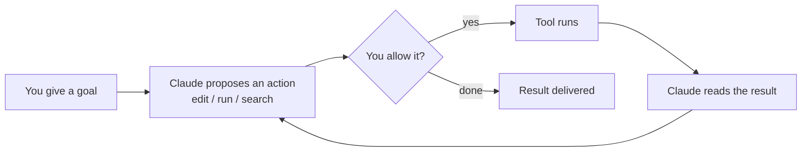

<LevelBadge level="beginner" />

<VerifyNote lastVerified="2026-06-20" source="https://code.claude.com/docs/en/overview">
Los comandos de instalación y el conjunto exacto de funciones cambian a menudo. Considera la documentación oficial de Claude Code como la fuente de verdad para la configuración.
</VerifyNote>

<Callout type="objectives" items={["Explicar qué hace que Claude Code sea agéntico, no solo una ventana de chat", "Imaginar el bucle agéntico: objetivo, acción, permiso, observar, repetir", "Nombrar las superficies donde se ejecuta Claude Code y cómo tus ajustes viajan contigo", "Ordenar lo que configuras por impacto, empezando por CLAUDE.md", "Recorrer la forma de una primera sesión segura usando el Modo Plan"]} />

**Claude Code** es la herramienta de programación *agéntica* de Anthropic. A diferencia de una ventana de chat, puede realmente **hacer cosas en tu proyecto**: leer y editar archivos, ejecutar comandos de shell, buscar en el código y llamar a herramientas externas — todo con tu permiso.

## El modelo mental: un bucle agéntico

Esta es la única idea que hace que todo lo demás tenga sentido. Das un objetivo en lenguaje natural ("añade tests para el módulo de autenticación y arregla lo que falle"). Claude **planifica, actúa, observa el resultado y repite** hasta cumplir el objetivo. Tú mantienes el control mediante [permisos](/docs/claude-code) y el [Modo Plan](/docs/claude-code).

<Callout type="tip" items={["El bucle solo avanza con las acciones que permites. Nada se edita ni se ejecuta sin pasar por esa puerta de permisos — que es exactamente por lo que importan las próximas secciones."]} />

## Dónde puedes ejecutarlo

El mismo Claude Code te acompaña entre superficies — **comparte tus ajustes, hooks y permisos** dondequiera que trabajes.

- **Terminal (CLI)** — la superficie original; funciona en cualquier shell.
- **Extensiones de IDE** — VS Code y JetBrains, con diffs en línea.
- **Escritorio y web** — y comparte tus ajustes, hooks y permisos entre superficies.

## Lo que configurarás (en orden aproximado de impacto)

Piensa en esto como una escalera: domina primero los peldaños de arriba y, después, añade funciones avanzadas solo cuando surja una necesidad real.

<Steps items={[{title: "CLAUDE.md", body: "Instrucciones persistentes del proyecto. Máximo impacto, mínimo esfuerzo — empieza aquí."}, {title: "Modo Plan", body: "Investiga y propone antes de que se ejecute cualquier edición."}, {title: "Permisos", body: "Decide qué puede hacer Claude sin preguntar."}, {title: "settings.json", body: "El sistema de configuración completo que hay debajo de todo."}, {title: "Funciones avanzadas", body: "Comandos slash, hooks, skills, subagentes y servidores MCP — añadidos por capas según los necesites."}]} />

Cada peldaño enlaza con su propia lección: [CLAUDE.md](/docs/claude-code), [Modo Plan](/docs/claude-code), [Permisos](/docs/claude-code), [settings.json](/docs/claude-code), [Comandos slash](/docs/claude-code), [hooks](/docs/claude-code), [skills](/docs/claude-code), [subagentes](/docs/claude-code) y [servidores MCP](/docs/claude-code).

## Tu primera sesión (cómo es)

<Steps items={[{title: "Instala y autentícate", body: "Consulta la documentación oficial para los comandos actuales."}, {title: "Abre un proyecto", body: "Haz cd a un proyecto e inicia Claude Code."}, {title: "Genera un CLAUDE.md inicial", body: "Ejecuta /init para generar tus instrucciones del proyecto."}, {title: "Pide algo pequeño y concreto", body: "Prueba: Explica cómo funciona el enrutamiento en esta app."}, {title: "Haz un cambio primero en Modo Plan", body: "Revisa el plan propuesto y luego deja que se ejecute."}]} />

Dos comandos que vale la pena memorizar de esa primera sesión:

<PromptCard title="Generar instrucciones del proyecto">{`/init`}</PromptCard>

<PromptCard title="Una primera petición segura, de solo lectura">{`Explain how routing works in this app.`}</PromptCard>

Para los comandos actuales de instalación y autenticación, consulta la [documentación oficial](https://code.claude.com/docs/en/overview).

<Callout type="tip" items={["Empieza en solo lectura. Para tu primera tarea real, usa el Modo Plan — Claude investiga y te muestra un plan sin tocar archivos. Es la forma más segura de generar confianza."]} />

## Términos clave de un vistazo

<Flashcards title="Vocabulario de Claude Code" cards={[{front: "Herramienta agéntica", back: "Una herramienta que realiza acciones en tu proyecto — lee/edita archivos, ejecuta comandos, busca en el código, llama a herramientas externas — no solo una ventana de chat."}, {front: "Bucle agéntico", back: "Objetivo en lenguaje natural y, después, Claude planifica, actúa, observa el resultado y repite hasta cumplir el objetivo."}, {front: "Modo Plan", back: "Claude investiga y propone un plan antes de que se ejecute cualquier edición — la forma más segura de empezar."}, {front: "CLAUDE.md", back: "Instrucciones persistentes del proyecto. Máximo impacto, mínimo esfuerzo; se genera con /init."}, {front: "Permisos", back: "La puerta de control: lo que Claude puede hacer sin preguntarte primero."}]} />

<Quiz title="Compruébalo tú mismo" questions={[{q: "¿Qué diferencia a Claude Code de una ventana de chat?", options: ["Escribe respuestas más largas", "Puede realizar acciones en tu proyecto — editar archivos, ejecutar comandos, buscar en el código — con tu permiso", "Solo funciona en la terminal"], answer: 1, explain: "Claude Code es agéntico: actúa en tu proyecto (lee/edita archivos, ejecuta comandos de shell, busca, llama a herramientas), todo con tu permiso."}, {q: "En el bucle agéntico, ¿qué ocurre justo después de que Claude propone una acción?", options: ["La herramienta se ejecuta automáticamente", "Tú decides si la permites", "Se entrega el resultado"], answer: 1, explain: "Cada acción propuesta pasa por una puerta de permisos — la herramienta solo se ejecuta si la permites."}, {q: "¿Qué paso de configuración tiene el mayor impacto con el menor esfuerzo?", options: ["Servidores MCP", "Hooks", "CLAUDE.md"], answer: 2, explain: "CLAUDE.md — instrucciones persistentes del proyecto — aparece primero porque tiene el mayor impacto con el menor esfuerzo."}]} />

<Callout type="takeaways" items={["Claude Code es agéntico: actúa en tu proyecto con tu permiso, no solo conversa.", "El bucle es objetivo, proponer, permitir, ejecutar, observar, repetir — tú lo controlas mediante los permisos y el Modo Plan.", "Se ejecuta en la terminal, en VS Code/JetBrains y en escritorio y web, compartiendo ajustes, hooks y permisos entre superficies.", "Configura por impacto: primero CLAUDE.md, luego Modo Plan, Permisos, settings.json y después las funciones avanzadas.", "Empieza una primera sesión en solo lectura en Modo Plan para generar confianza antes de dejar que se ejecuten ediciones."]} />

## Siguiente

- La configuración de mayor impacto → [CLAUDE.md y archivos de memoria](/docs/claude-code)
- Hazlo de principio a fin → [Tutorial: Personaliza Claude Code para un repo real](/docs/walkthroughs)
- Crea tus propias automatizaciones → [Plantillas y recetas](/docs/templates)
