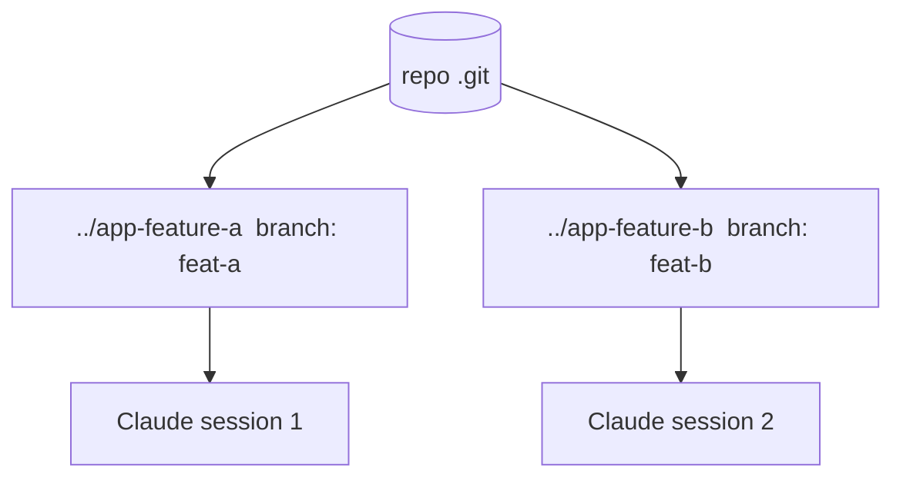

<LevelBadge level="advanced" />

<Callout type="objectives" items={["Qué es un git worktree — un repositorio, varios directorios de trabajo, cada uno en su propia rama","El problema exacto que resuelve: evitar que las sesiones paralelas de Claude colisionen sobre los mismos archivos","Los cuatro comandos para añadir, listar y eliminar worktrees","Cuándo merece la pena la técnica — y las tres trampas que muerden a la hora del merge","Cómo se combinan los worktrees con los subagentes: paralelismo entre sesiones frente a dentro de una sola"]} />

Un **git worktree** permite que un repositorio tenga **varios directorios de trabajo**, cada uno con una rama distinta. Combina eso con Claude Code y podrás ejecutar **varias sesiones en paralelo** sobre el mismo proyecto — cada una editando sus propios archivos, sin colisiones.

## El problema que resuelve

Si dos sesiones de Claude editan el mismo directorio de trabajo a la vez, se pisan los cambios mutuamente. Los worktrees dan a cada sesión su **propio directorio y rama**, de modo que el trabajo paralelo se mantiene aislado hasta que haces el merge.

## Lo básico

Cuatro comandos sostienen todo el flujo de trabajo: añadir un worktree (nuevo directorio + nueva rama), listar lo que existe y eliminar uno cuando hayas terminado.

<Steps items={[{title: "Añade un worktree para una función", body: "Desde tu repositorio, git worktree add ../app-feature-a -b feat-a crea un nuevo directorio Y una nueva rama de una sola vez."},{title: "Añade otro para una corrección", body: "git worktree add ../app-fix-123 -b fix-123 — un segundo directorio/rama aislado, en paralelo con el primero."},{title: "Mira lo que tienes", body: "git worktree list muestra cada directorio de trabajo y la rama en la que está."},{title: "Limpia cuando termines", body: "git worktree remove ../app-feature-a desmonta un worktree para que no se acumulen directorios obsoletos."}]} />

<PromptCard title="El flujo de trabajo de cuatro comandos">{`# from your repo
git worktree add ../app-feature-a -b feat-a   # new dir + new branch
git worktree add ../app-fix-123 -b fix-123
git worktree list
# when done with one:
git worktree remove ../app-feature-a`}</PromptCard>

Abre una sesión de Claude Code en el directorio de cada worktree y deja que trabajen de forma independiente.

## Cuándo merece la pena

- **Funciones/correcciones paralelas** que quieres avanzar a la vez.
- **Una tarea larga en ejecución** en un worktree mientras sigues trabajando en otro.
- **Experimentos arriesgados** aislados de tu checkout principal.

## Trampas

<Callout type="warning" items={["Cuidado con el merge de vuelta: las ramas acabarán fusionándose — los conflictos aparecen entonces, no durante. Mantén los worktrees enfocados y de corta vida.","No ejecutes recursos compartidos con estado (una BD de desarrollo, un puerto) desde dos worktrees sin separarlos.","Limpia con git worktree remove para que no se acumulen directorios obsoletos."]} />

## Worktrees frente a subagentes

Dos ejes distintos de paralelismo — no compiten, se apilan.

| | Qué paraleliza | Aislamiento |
| --- | --- | --- |
| **[Subagentes](/docs/claude-code/subagents)** | Trabajo *dentro* de una sesión (delegación) | Contexto aislado |
| **Worktrees** | Trabajo *entre* sesiones en disco | Ramas/archivos aislados |

Se combinan bien: una sesión en un worktree puede a su vez lanzar subagentes.

<Callout type="tip" items={["Usa un worktree cuando necesites dos sesiones de Claude tocando el mismo repositorio a la vez; usa un subagente cuando una sesión necesite descargar una parte del trabajo en un contexto aislado."]} />

<Quiz title="Ponte a prueba" questions={[{q: "¿Qué te da un git worktree?", options: ["Varias ramas en un único directorio de trabajo", "Varios directorios de trabajo para un repositorio, cada uno en su propia rama", "Una copia de seguridad de tu carpeta .git"], answer: 1, explain: "Un git worktree permite que un repositorio tenga varios directorios de trabajo, cada uno con una rama distinta — de modo que las sesiones paralelas no colisionen."}, {q: "¿Qué comando crea un nuevo directorio Y una nueva rama en un solo paso?", options: ["git worktree list", "git worktree add ../app-feature-a -b feat-a", "git worktree remove ../app-feature-a"], answer: 1, explain: "git worktree add ../app-feature-a -b feat-a crea el nuevo directorio y la nueva rama juntos. list muestra los worktrees existentes; remove desmonta uno."}, {q: "¿Cuándo aparecen realmente los conflictos de merge de los worktrees paralelos?", options: ["Continuamente mientras ambas sesiones editan", "A la hora del merge de vuelta, no durante", "Nunca, porque las ramas están aisladas"], answer: 1, explain: "Las ramas se mantienen aisladas mientras trabajas, así que los conflictos no aparecen durante — afloran en el merge de vuelta. Mantén los worktrees enfocados y de corta vida para limitarlos."}, {q: "¿Cómo se relacionan los worktrees y los subagentes?", options: ["Son la misma función con dos nombres", "Los worktrees paralelizan entre sesiones en disco; los subagentes paralelizan dentro de una sola sesión — y se combinan", "Debes elegir uno; usar ambos rompe el aislamiento"], answer: 1, explain: "Los subagentes son paralelismo dentro de una sola sesión (contexto aislado); los worktrees son paralelismo entre sesiones en disco (ramas/archivos aislados). Una sesión en un worktree puede a su vez lanzar subagentes."}]} />

<Callout type="takeaways" items={["Un git worktree = un repositorio, varios directorios de trabajo, cada uno en su propia rama — la base para sesiones paralelas de Claude sin colisiones.","Dos sesiones sobre un mismo directorio de trabajo se pisan; un worktree por sesión mantiene los archivos y las ramas aislados hasta que haces el merge.","git worktree add ../dir -b branch crea directorio + rama; list los muestra; remove limpia.","Merece la pena para funciones/correcciones paralelas, tareas de larga duración junto a otro trabajo y experimentos arriesgados aislados.","Cuidado con el merge de vuelta, no compartas recursos con estado (BD, puerto) entre worktrees y limpia siempre — y recuerda que los worktrees se combinan con los subagentes."]} />

## Siguiente

- [Subagentes y agentes paralelos](/docs/claude-code/subagents)
- [Modo Headless y el Agent SDK](/docs/claude-code/headless-and-agent-sdk)
- [Gestión del contexto](/docs/claude-code/context-management)
