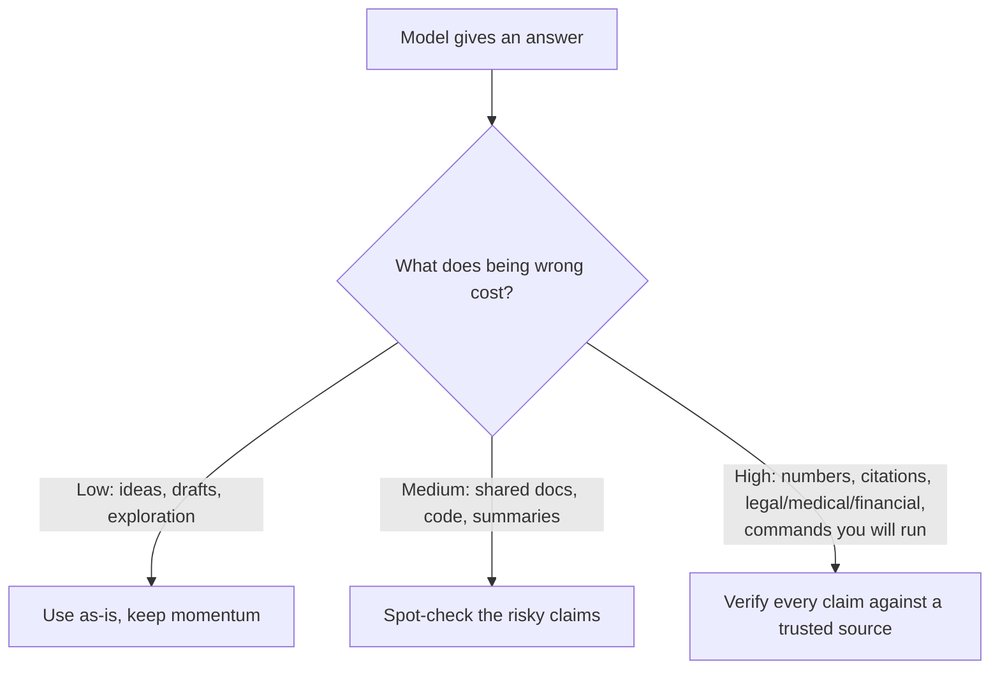

<LevelBadge level="intermediate" />

<Callout type="objectives" items={["Entender POR QUÉ los modelos fabrican respuestas seguras y bien formadas", "Reconocer las 5 zonas de alto riesgo en las que deberías ser más escéptico", "Aplicar un kit de 6 partes para reducir drásticamente las alucinaciones", "Usar un único prompt anti-alucinaciones para copiar y pegar que fundamenta, da una salida y obliga a citar", "Adoptar la mentalidad que ajusta el esfuerzo de verificación al coste de equivocarse"]} />

Una **alucinación** ocurre cuando un modelo afirma algo falso con total seguridad. No está mintiendo ni está roto — es la otra cara de cómo funcionan los LLM: generan texto *plausible*, y lo plausible no siempre es cierto (consulta [¿Qué es un LLM?](/docs/foundations/what-is-an-llm)). No puedes eliminarlo del todo con prompts, pero puedes reducirlo drásticamente y atrapar el resto.

## Por qué sucede

El modelo predice una continuación probable. Cuando no "sabe" algo, la continuación *que parece más probable* suele ser una respuesta segura, bien formada — y errónea. No hay una señal incorporada de "no estoy seguro" a menos que crees espacio para una.

<Callout type="tip" items={["La solución para la mayoría de las alucinaciones es crear deliberadamente espacio para la incertidumbre — darle al modelo permiso para decir que no lo sabe."]} />

## Las zonas de alto riesgo

Sé más escéptico cuando la salida implique:

- **Citas, referencias y atribuciones** — artículos fabricados, URLs falsas, citas mal atribuidas.
- **Números, fechas y estadísticas específicas** — cifras plausibles pero inventadas.
- **Datos nicho o muy recientes** — más allá de lo que el modelo aprendió de forma fiable.
- **Detalles de APIs y librerías** — métodos o parámetros que no existen.
- **Personas y detalles legales/médicos** — alto riesgo, fáciles de equivocar sutilmente.

## El kit de reducción

Combínalos — cada uno ayuda:

<Steps items={[
  {title: "Fundaméntalo en fuentes", body: "Pega el texto de origen y di \"responde solo a partir del texto anterior; si no está ahí, dilo\". Esta es la idea central detrás de RAG (/docs/foundations/rag)."},
  {title: "Dale una salida", body: "Permite explícitamente \"Si no estás seguro, di 'no lo sé'\" — reduce drásticamente las conjeturas hechas con seguridad."},
  {title: "Pide razonamiento y citas", body: "\"Cita la frase exacta que respalda cada afirmación.\" Las afirmaciones sin respaldo se vuelven obvias."},
  {title: "Baja la creatividad", body: "Para tareas factuales en las que el modelo expone un control de temperatura, redúcela (consulta Controles de muestreo en /docs/foundations/sampling-controls)."},
  {title: "Usa herramientas", body: "Para matemáticas, datos actuales o consultas, dale al modelo una calculadora/búsqueda/herramienta (/docs/api/tool-use) en lugar de confiar en su memoria."},
  {title: "Verifica de forma cruzada", body: "Haz la misma pregunta de dos maneras, o haz que una segunda pasada critique la primera."}
]} />

## Un prompt anti-alucinaciones para copiar y pegar

La mayor parte del kit anterior se condensa en un único envoltorio reutilizable. Pega tu fuente donde se indica y formula tu pregunta — fundamenta la respuesta, le da al modelo una salida y obliga a citar, todo de una sola vez:

<PromptCard title="Envoltorio anti-alucinaciones">{`You answer ONLY from the SOURCE below.
Rules:
- If the answer is not in the SOURCE, reply exactly: "Not stated in the source."
- After every claim, quote the exact sentence from the SOURCE that supports it.
- Do not add outside knowledge, estimates, or assumptions.

SOURCE:
"""
[paste the document, transcript, or data here]
"""

QUESTION: [your question]`}</PromptCard>

Por qué funciona: la salida de emergencia "Not stated in the source" elimina la presión de adivinar, y la regla de citar la frase hace imposible ocultar cualquier afirmación sin respaldo. Quita el bloque SOURCE cuando de verdad quieras el conocimiento propio del modelo — pero entonces la verificación vuelve a recaer en ti.

## La mentalidad que de verdad te protege

<Callout type="warning" items={["Ningún prompt hace que la salida sea 100% fiable. Para cualquier cosa de consecuencia — un número en un informe, una cita, un comando que vas a ejecutar, un detalle médico/legal/financiero — compáralo con una fuente de confianza. Trata a la IA como un primer borrador rápido, no como una autoridad final. Este es el corazón del Uso responsable (/docs/security/responsible-use)."]} />

Una regla simple: **el coste de equivocarse determina la cantidad de verificación.** ¿Lluvia de ideas? Confía libremente. ¿Publicar una estadística? Verifica siempre.

<Callout type="takeaways" items={["Las alucinaciones son un subproducto de la generación basada en plausibilidad, no un fallo que puedas eliminar por completo con prompts.", "Sé más escéptico con citas, números/fechas, datos nicho o recientes, detalles de APIs y especificidades sobre personas/legales/médicas.", "Combina el kit: fundaméntalo en fuentes, da una salida, exige citas, baja la temperatura, usa herramientas, verifica de forma cruzada.", "Un único prompt envoltorio fundamenta + da una salida + obliga a citar de una sola vez.", "Ajusta el esfuerzo de verificación al coste de equivocarse — confía libremente cuando es barato, verifica cada afirmación cuando es de consecuencia."]} />

<Quiz title="Ponte a prueba" questions={[
  {
    q: "¿Por qué alucinan los modelos?",
    options: [
      "Le mienten al usuario de forma deliberada",
      "Predicen la continuación que parece más plausible, que no siempre es cierta",
      "Están rotos y necesitan reentrenarse",
      "Siempre se quedan sin memoria a mitad de la respuesta"
    ],
    answer: 1,
    explain: "La alucinación es la otra cara de cómo funcionan los LLM: generan texto plausible, y lo plausible no siempre es cierto. Cuando el modelo no sabe algo, la continuación que parece más probable suele ser segura, bien formada y errónea."
  },
  {
    q: "¿Cuál de estas es una zona de alto riesgo en la que deberías ser más escéptico?",
    options: [
      "Lluvia de ideas abierta para generar ideas",
      "Reformular una frase que ya escribiste",
      "Números, fechas y estadísticas específicas",
      "Pedir una definición simple que puedes comprobar"
    ],
    answer: 2,
    explain: "Los números, las fechas y las estadísticas específicas son una zona de alto riesgo — pueden ser plausibles pero inventados. Otras zonas de alto riesgo incluyen citas/referencias, datos nicho o recientes, detalles de APIs y especificidades sobre personas/legales/médicas."
  },
  {
    q: "¿Cuál es el efecto más directo de darle al modelo una salida explícita como \"Si no estás seguro, di 'no lo sé'\"?",
    options: [
      "Hace que el modelo sea más rápido",
      "Reduce drásticamente las conjeturas hechas con seguridad",
      "Aumenta la temperatura automáticamente",
      "Conecta el modelo a una búsqueda en vivo"
    ],
    answer: 1,
    explain: "Permitir explícitamente que el modelo diga que no lo sabe elimina la presión de producir una conjetura segura, lo que reduce drásticamente las respuestas alucinadas."
  },
  {
    q: "¿Qué regla decide cuánta verificación necesita una respuesta?",
    options: [
      "La longitud de la respuesta",
      "El nivel de confianza declarado por el modelo",
      "El coste de equivocarse",
      "Cuánto tardaste en escribir el prompt"
    ],
    answer: 2,
    explain: "El coste de equivocarse determina la cantidad de verificación. ¿Lluvia de ideas? Confía libremente. ¿Publicar una estadística? Verifica siempre."
  },
  {
    q: "En el prompt envoltorio anti-alucinaciones, ¿qué hace imposible ocultar cualquier afirmación sin respaldo?",
    options: [
      "Bajar la temperatura a cero",
      "La regla de citar la frase exacta de la FUENTE que respalda cada afirmación",
      "Hacer la pregunta dos veces",
      "Quitar el bloque FUENTE"
    ],
    answer: 1,
    explain: "La regla de citar la frase obliga al modelo a respaldar cada afirmación con una frase exacta de la FUENTE, de modo que cualquier afirmación que no esté realmente respaldada se vuelve obvia. La salida de emergencia \"Not stated in the source\" elimina la presión de adivinar."
  }
]} />

## Siguiente

- [Generación aumentada por recuperación (RAG)](/docs/foundations/rag)
- [Evaluar la calidad de la IA (Evals)](/docs/foundations/evals)
- [Uso responsable, ética y verificación](/docs/security/responsible-use)
