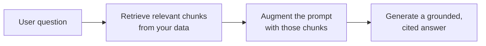

<LevelBadge level="intermediate" />

<Callout type="objectives" items={[
  "Qué es RAG y el bucle recuperar-aumentar-generar",
  "Cómo indexar, recuperar, aumentar y generar con citas",
  "Por qué RAG supera al fine-tuning para necesidades de 'responder sobre mis documentos'",
  "Los cinco modos de fallo que matan la calidad de RAG",
  "Un prompt de fundamentación listo para copiar y pegar que cierra las dos mayores brechas"
]} />

**RAG** hace que un modelo responda preguntas sobre **tus** datos — documentos, una base de conocimiento, una base de código — con los que nunca fue entrenado. La idea es simple: **recuperar** las piezas relevantes, **aumentar** el prompt con ellas y luego **generar** una respuesta fundamentada en esas piezas.

## El bucle

<Steps items={[
  {title: "Indexa tus datos", body: "Divídelos en fragmentos, embébelos (consulta /docs/foundations/embeddings) y almacénalos en un índice vectorial (y/o de palabras clave)."},
  {title: "Recupera", body: "Extrae los principales fragmentos más relevantes para la pregunta."},
  {title: "Aumenta", body: "Pon esos fragmentos en el prompt con una instrucción como \"Responde solo a partir del contexto siguiente; si no está ahí, dilo.\""},
  {title: "Genera", body: "Produce la respuesta — e idealmente cita de qué fragmento proviene cada afirmación."}
]} />

Para el paso de embedding dentro de la indexación, consulta [Embeddings y búsqueda vectorial](/docs/foundations/embeddings).

## ¿Por qué RAG en lugar de fine-tuning?

<Callout type="tip" items={[
  "Fresco: actualizas los datos, no el modelo",
  "Verificable: proporciona citas",
  "Barato: mucho más barato que reentrenar"
]} />

Para la mayoría de las necesidades de "responder sobre mis documentos", RAG es la herramienta correcta para empezar — consulta [Fine-tuning vs prompting vs RAG](/docs/foundations/finetune-vs-prompt-vs-rag).

## Los modos de fallo (donde muere la calidad de RAG)

<Callout type="warning" items={[
  "Mala recuperación = mala respuesta. Si el fragmento correcto no se recupera, el modelo no puede usarlo. La mayoría de los problemas de 'RAG se equivoca' son problemas de recuperación.",
  "Fragmentar demasiado grueso/fino arruina la relevancia (consulta embeddings).",
  "Sin instrucción de fundamentación: el modelo mezcla los hechos recuperados con sus propias conjeturas. Dile que responda solo a partir del contexto y que admita las lagunas.",
  "Meter demasiado: los fragmentos irrelevantes diluyen la señal y cuestan tokens. Recupera pocos fragmentos, de alta calidad.",
  "Sin citas: no puedes verificar, así que no puedes confiar."
]} />

El fallo de fragmentación se remonta a los [embeddings](/docs/foundations/embeddings), y meter de más cuesta [tokens](/docs/foundations/tokens-and-context).

<Callout type="tip" items={[
  "Evalúa la recuperación por separado: mide '¿recuperamos el fragmento correcto?' aparte de '¿respondió bien el modelo?'. Localiza el problema rápidamente. Consulta Evals (/docs/foundations/evals)."
]} />

## Copiar y pegar: un prompt de fundamentación

La solución de mayor impacto individual es una instrucción de fundamentación. Coloca tus fragmentos recuperados en una plantilla como esta — obliga al modelo a responder *solo* a partir del contexto, citar cada afirmación y admitir las lagunas en lugar de adivinar:

<PromptCard title="Prompt de fundamentación">{`You are answering strictly from the context below.

Rules:
- Use ONLY the context to answer. Do not use outside knowledge.
- Cite the source after each claim, like [chunk 2].
- If the answer is not in the context, reply exactly:
  "I don't have that in the provided sources."
- Quote numbers and names verbatim — never paraphrase a figure.

Context:
[chunk 1] ...
[chunk 2] ...
[chunk 3] ...

Question: <the user's question>`}</PromptCard>

Combínalo con *unos pocos* fragmentos de alta calidad (no todo lo que recuperaste) y cerrarás las dos mayores brechas a la vez: la mezcla alucinada y las respuestas no verificables. Luego [evalúa](/docs/foundations/evals) la recuperación y la generación por separado para saber qué mitad ajustar.

## Domina los términos

<Flashcards cards={[
  {front: "RAG", back: "Recupera las piezas relevantes de tus datos, aumenta el prompt con ellas y luego genera una respuesta fundamentada en esas piezas."},
  {front: "Paso de indexación", back: "Divide los datos en fragmentos, embébelos y almacénalos en un índice vectorial y/o de palabras clave."},
  {front: "Paso de aumento", back: "Pon los fragmentos recuperados en el prompt con una instrucción de fundamentación: responde solo a partir del contexto, admite las lagunas."},
  {front: "Por qué RAG en lugar de fine-tuning", back: "Fresco (actualizas los datos, no el modelo), proporciona citas, mucho más barato que reentrenar."},
  {front: "Modo de fallo #1 de RAG", back: "Mala recuperación. Si el fragmento correcto no se recupera, el modelo no puede usarlo — la mayoría de los problemas de 'RAG se equivoca' son problemas de recuperación."},
  {front: "Instrucción de fundamentación", back: "Dile al modelo que responda SOLO a partir del contexto, cite cada afirmación y lo diga cuando la respuesta no esté ahí."}
]} />

<Quiz title="Ponte a prueba" questions={[
  {
    q: "¿Qué significan las tres letras de RAG, en orden?",
    options: ["Leer, Analizar, Generar", "Recuperar, Aumentar, Generar", "Clasificar, Agregar, Agrupar", "Reducir, Anexar, Generar"],
    answer: 1,
    explain: "RAG = Recuperar los fragmentos relevantes, Aumentar el prompt con ellos y luego Generar una respuesta fundamentada."
  },
  {
    q: "Cuando 'RAG se equivoca', ¿cuál es a menudo el verdadero problema?",
    options: ["El modelo es demasiado pequeño", "La recuperación — no se extrajo el fragmento correcto", "Muy pocos tokens en la ventana de contexto", "Los embeddings están mal ajustados con fine-tuning"],
    answer: 1,
    explain: "Mala recuperación = mala respuesta. Si el fragmento correcto no se recupera, el modelo no puede usarlo. La mayoría de los problemas de 'RAG se equivoca' son problemas de recuperación."
  },
  {
    q: "¿Por qué normalmente se prefiere RAG al fine-tuning para 'responder sobre mis documentos'?",
    options: ["Hace el modelo más grande", "Mantiene el conocimiento fresco, da citas y es más barato que reentrenar", "Elimina la necesidad de cualquier prompt", "Garantiza que el modelo nunca alucine"],
    answer: 1,
    explain: "RAG mantiene el conocimiento fresco (actualizas los datos, no el modelo), proporciona citas y es mucho más barato que reentrenar."
  },
  {
    q: "¿Cuál es la solución de mayor impacto individual para evitar que el modelo mezcle hechos con conjeturas?",
    options: ["Recuperar todos los fragmentos posibles", "Una instrucción de fundamentación que obligue a responder solo a partir del contexto", "Aumentar la temperatura", "Omitir las citas para ahorrar tokens"],
    answer: 1,
    explain: "Una instrucción de fundamentación obliga al modelo a responder solo a partir del contexto, citar cada afirmación y admitir las lagunas en lugar de adivinar."
  },
  {
    q: "¿Por qué evaluar la recuperación por separado de la generación?",
    options: ["Lo exige el proveedor del modelo", "Localiza el problema rápidamente — sabes qué mitad ajustar", "Reduce el costo de tokens automáticamente", "La generación no puede medirse de otra forma"],
    answer: 1,
    explain: "Medir '¿recuperamos el fragmento correcto?' aparte de '¿respondió bien el modelo?' localiza el problema rápidamente y te dice qué mitad ajustar."
  }
]} />

<Callout type="takeaways" items={[
  "RAG = recuperar los fragmentos relevantes, aumentar el prompt, generar una respuesta fundamentada y con citas.",
  "Indexa (fragmenta + embebe + almacena), recupera los principales fragmentos, aumenta con una instrucción de fundamentación, genera con citas.",
  "Prefiere RAG al fine-tuning para preguntas y respuestas sobre documentos: fresco, citado, más barato.",
  "La mayoría de los fallos son fallos de recuperación — recupera pocos fragmentos de alta calidad, no todo.",
  "Añade siempre una instrucción de fundamentación y cita; evalúa la recuperación y la generación por separado."
]} />

## Siguiente

- [Embeddings y búsqueda vectorial](/docs/foundations/embeddings)
- [Fine-tuning vs prompting vs RAG](/docs/foundations/finetune-vs-prompt-vs-rag)
- [Manual de investigación y síntesis](/docs/playbooks/research)
