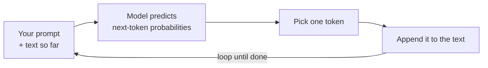

<LevelBadge level="beginner" />

Un **Gran Modelo de Lenguaje** (LLM, por sus siglas en inglés) — la tecnología detrás de Claude — hace una sola cosa engañosamente simple: lee texto y **predice lo que viene a continuación**, un fragmento a la vez. Eso es todo. Todo lo demás surge de hacerlo asombrosamente bien.

<Callout
  type="objectives"
  items={[
    "Capta el modelo mental en una frase: un LLM es un autocompletado muy sofisticado",
    "Observa cómo el modelo construye una respuesta un token a la vez, en un bucle",
    "Comprende por qué este mecanismo explica tanto sus fortalezas como sus rarezas",
    "Conoce lo que un LLM NO es — y cómo eso cambia la forma en que lo usas"
  ]}
/>

## El modelo mental en una frase

> Un LLM es un autocompletado muy sofisticado que ha leído una cantidad enorme de texto y ha aprendido los patrones de cómo el lenguaje — y las ideas que contiene — tienden a continuar.

Cuando le haces una pregunta, el modelo no está "buscando" una respuesta. Está generando la continuación más plausible de tu texto, token a token (consulta [Tokens y contexto](/docs/foundations/tokens-and-context)). Las continuaciones plausibles de una buena pregunta suelen ser buenas respuestas — por eso esto funciona en absoluto.

:::tip Analogía: un teclado predictivo con esteroides
Piensa en el autocompletado de tu teléfono que sugiere la siguiente palabra. Ahora imagina que hubiera leído la mayoría de los libros, artículos y código de internet — y sugiriera no solo la siguiente palabra, sino todo un ensayo, traducción o programa que encaje. Esa es la intuición detrás de un LLM.
:::

## Un token a la vez

Todo el motor es un bucle: lee todo lo que hay hasta ahora, predice el siguiente fragmento, añádelo, repite.

<Steps
  items={[
    {title: "Leer", body: "El modelo toma tu prompt más todo lo generado hasta ahora como un único bloque de texto."},
    {title: "Predecir", body: "Calcula las probabilidades de cuál podría ser el siguiente token."},
    {title: "Elegir", body: "Selecciona un token. Si esto es determinista o un poco aleatorio es lo que ajustan los controles de muestreo como la temperatura."},
    {title: "Añadir y repetir", body: "El token elegido se añade al texto, y el texto ligeramente más largo se vuelve a introducir — formando un bucle hasta que la respuesta está terminada."}
  ]}
/>

Cada paso solo predice **un** token, y luego vuelve a introducir el texto ligeramente más largo. El modelo no tiene un plan para toda la respuesta de antemano — la coherencia surge de hacer esta predicción extremadamente bien, miles de veces. Cómo se comporta el paso de "elegir un token" (codicioso vs. un poco aleatorio) es lo que ajustan los [controles de muestreo](/docs/foundations/sampling-controls) como la temperatura.

## Por qué esto explica sus fortalezas

Como aprendió patrones a través de la escritura, el código y el razonamiento, un LLM puede **escribir, resumir, traducir, explicar y programar** con fluidez — tareas que son todas "continúa este texto con sentido". Dale una configuración clara y producirá una continuación sólida. Por eso el [prompting](/docs/prompting/basics) importa tanto: estás dando forma al inicio del texto que continúa.

## Por qué esto explica sus rarezas

El mismo mecanismo explica las asperezas:

- **Puede equivocarse con total seguridad.** Una continuación que suena fluida no siempre es verdadera — eso es la [alucinación](/docs/foundations/hallucinations).
- **No "conoce" realmente los hechos de hoy** a menos que se los proporciones o tenga una herramienta para consultarlos.
- **No tiene memoria** entre conversaciones a menos que le des una.

## Lo que un LLM **no** es

:::warning Ajusta tus expectativas y obtendrás mejores resultados
- ❌ **No es una base de datos ni un motor de búsqueda.** Genera, no recupera registros verificados.
- ❌ **No es una calculadora.** Puede razonar sobre matemáticas, pero no se garantiza que sea exacto — dale herramientas para eso.
- ❌ **No es una persona.** Sin sentimientos, intenciones ni memoria continua. Es un potente motor de texto.
:::

Trátalo como un asistente brillante, rápido y muy leído que de vez en cuando recuerda mal — y **verifica** lo que importa.

## Términos clave

<Flashcards
  title="Repasa los conceptos fundamentales"
  cards={[
    {front: "LLM (Gran Modelo de Lenguaje)", back: "La tecnología detrás de Claude. Lee texto y predice lo que viene a continuación, un fragmento a la vez."},
    {front: "Predicción del siguiente token", back: "El bucle central: lee el texto hasta ahora, predice el siguiente token, añádelo, repite hasta terminar."},
    {front: "Token", back: "El fragmento de texto que el modelo predice en cada paso. El modelo solo predice uno a la vez."},
    {front: "Alucinación", back: "Una continuación que suena fluida pero que en realidad no es verdadera — un efecto secundario de generar, no de recuperar."},
    {front: "Muestreo / temperatura", back: "Controla cómo se comporta el paso de 'elegir un token' — codicioso vs. un poco aleatorio."}
  ]}
/>

<Callout
  type="takeaways"
  items={[
    "Un LLM es un autocompletado muy sofisticado — predice el siguiente token, no busca una respuesta",
    "La coherencia surge de ejecutar ese bucle de predicción un token a la vez, miles de veces",
    "El mismo mecanismo explica sus fortalezas (escribir, resumir, traducir, explicar, programar) y sus rarezas (equivocarse con seguridad, sin hechos en vivo, sin memoria)",
    "No es una base de datos, ni una calculadora, ni una persona — verifica lo que importa"
  ]}
/>

## Compruébalo tú mismo

<Quiz
  title="Compruébalo tú mismo"
  questions={[
    {
      q: "¿Qué hace fundamentalmente un LLM cuando le haces una pregunta?",
      options: [
        "Busca la respuesta en una base de datos de hechos verificados",
        "Genera la continuación más plausible de tu texto, un token a la vez",
        "Busca en la web en vivo la respuesta más reciente"
      ],
      answer: 1,
      explain: "Un LLM no está buscando nada — genera la continuación más plausible de tu texto, token a token."
    },
    {
      q: "¿Por qué un LLM puede equivocarse con total seguridad?",
      options: [
        "Una continuación que suena fluida no siempre es verdadera — eso es la alucinación",
        "Se queda sin memoria a mitad de la respuesta",
        "Se niega a responder preguntas que no conoce"
      ],
      answer: 0,
      explain: "Genera texto que suena plausible en lugar de recuperar registros verificados, así que una continuación fluida puede ser falsa de todos modos — eso es la alucinación."
    },
    {
      q: "¿Cuál afirmación sobre un LLM es correcta?",
      options: [
        "Es un motor de búsqueda que recupera registros verificados",
        "Es una calculadora con exactitud garantizada",
        "No es una persona y no tiene memoria continua entre conversaciones a menos que le des una"
      ],
      answer: 2,
      explain: "Un LLM es un potente motor de texto — no una base de datos, ni una calculadora, ni una persona. No tiene memoria entre conversaciones a menos que se la proporciones."
    }
  ]}
/>

## Siguiente

- [Tokens, contexto y memoria](/docs/foundations/tokens-and-context)
- [Alucinaciones y cómo reducirlas](/docs/foundations/hallucinations)
- [Fundamentos del prompting](/docs/prompting/basics)
