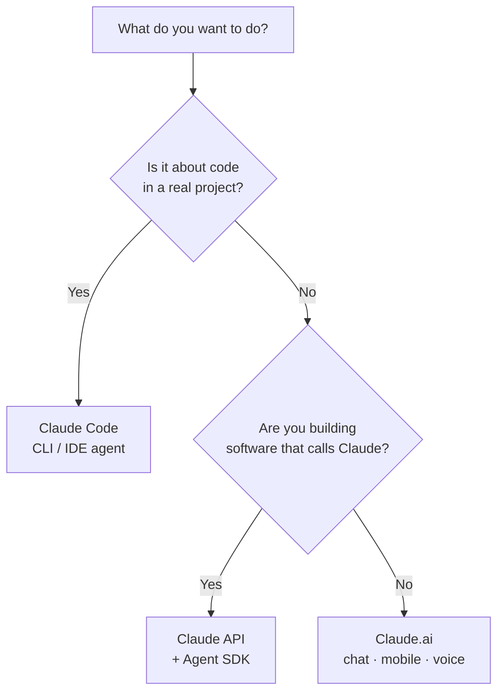

<LevelBadge level="beginner" />

"Claude" viene en unas cuantas variantes. Elige según **lo que intentas hacer**, no según cuál hayas oído mencionar.

<Callout type="objectives" items={[
  "Asocia tu objetivo a la superficie de Claude adecuada: chat, Claude Code o la API",
  "Sabe cuándo el móvil y la voz encajan en el panorama",
  "Entiende cómo las tres superficies funcionan juntas a medida que avanzas de nivel",
  "Hazte una idea rápida de qué modelo elegir una vez que empieces a construir"
]} />

## La decisión en 30 segundos

## Las tres superficies de un vistazo

| Superficie | Mejor para | Quién | Empieza aquí |
|---|---|---|---|
| **Claude.ai** | Redacción, investigación, análisis, aprendizaje, planificación, preguntas del día a día | Todo el mundo, sin configuración | [Primeros pasos con Claude.ai](/docs/claude-app/getting-started) |
| **Claude Code** | Trabajar *en una base de código*: leer, editar, ejecutar comandos, arreglar pruebas | Desarrolladores (y los técnicamente curiosos) | [Qué es Claude Code](/docs/claude-code/what-is-claude-code) |
| **API y Agent SDK** | Apps, automatizaciones y agentes que llaman a Claude de manera programática | Desarrolladores que lanzan un producto o un pipeline | [Tu primera llamada a la API](/docs/api/first-call) |

### Claude.ai — las apps de chat

Claude.ai es el punto de partida sin configuración para todo el mundo. También lo tienes en **móvil** ([iOS/Android](/docs/claude-app/mobile)) y por **[voz](/docs/claude-app/voice-mode)**: ideal para captar ideas sobre la marcha. Potencíalo con [Proyectos](/docs/claude-app/projects), [instrucciones personalizadas](/docs/claude-app/custom-instructions) y [Artefactos](/docs/claude-app/artifacts).

### Claude Code — la herramienta de programación agéntica

Claude Code funciona *dentro* de tu proyecto. Lee, edita, ejecuta comandos y arregla pruebas, actuando sobre tus archivos con tu permiso.

### La API y el Agent SDK — integra Claude en tu propio software

La API y el Agent SDK permiten que tu propio software llame a Claude de manera programática, para que puedas lanzar funciones de IA, automatizaciones y agentes.

## Funcionan juntos

No son productos rivales: la mayoría de la gente va graduándose entre ellos:

| Quieres… | Usa |
|---|---|
| Redactar un correo, resumir un PDF, hacer una lluvia de ideas | Claude.ai (o voz/móvil) |
| Refactorizar un módulo, añadir pruebas, arreglar un bug | Claude Code |
| Añadir una función de IA a *tu* app | La API / Agent SDK |

:::tip ¿No estás seguro? Empieza por el chat
[Claude.ai](/docs/claude-app/getting-started) no necesita configuración y te enseña cómo "piensa" Claude. Las habilidades se transfieren a todo lo demás.
:::

## ¿Qué modelo, una vez que empieces a construir?

Elegir una *superficie* es el primer paso. Cuando pases a Claude Code o a la API, también eliges un *modelo*: Haiku, Sonnet u Opus. Responde tres preguntas rápidas y este selector te sugiere un punto de partida:

<ModelPicker />

:::note No fijes los nombres en el código
Las líneas de modelos y los precios cambian. Confirma siempre los IDs de modelo actuales en la página [Elegir un modelo de Claude](/docs/api/choosing-a-model) antes de lanzar.
:::

## Ponte a prueba

<Quiz title="Ponte a prueba" questions={[
  {
    q: "Quieres redactar un correo y resumir un PDF, sin configuración. ¿Qué superficie?",
    options: ["Claude Code", "Claude.ai (chat / móvil / voz)", "La API y el Agent SDK"],
    answer: 1,
    explain: "Claude.ai es la superficie de chat sin configuración para redacción, investigación y preguntas del día a día, disponible en web, móvil y por voz."
  },
  {
    q: "Necesitas refactorizar un módulo y arreglar pruebas que fallan dentro de un proyecto real. ¿Qué superficie?",
    options: ["Claude.ai", "Claude Code", "La API y el Agent SDK"],
    answer: 1,
    explain: "Claude Code funciona dentro de tu base de código: lee, edita, ejecuta comandos y arregla pruebas con tu permiso."
  },
  {
    q: "¿Dónde deberías confirmar los nombres y precios actuales de los modelos?",
    options: ["Esta página", "La página Elegir un modelo de Claude", "El diagrama de Mermaid de arriba"],
    answer: 1,
    explain: "Las líneas de modelos cambian, así que esta página no las fija en el código: consulta la página Elegir un modelo de Claude para conocer los IDs y precios actuales."
  }
]} />

<Callout type="takeaways" items={[
  "Claude.ai: chat sin configuración para redacción, investigación y trabajo del día a día, también en móvil y por voz",
  "Claude Code: un agente que actúa dentro de tu base de código",
  "API y Agent SDK: integra Claude en tu propio software",
  "Se combinan: la mayoría empieza con el chat y se gradúa a Code y a la API",
  "Elige un modelo (Haiku / Sonnet / Opus) solo cuando estés construyendo, y verifica los IDs actuales antes de lanzar"
]} />

## Siguiente

- [Tus primeros 5 minutos](/docs/start-here/your-first-5-minutes)
- [Rutas de aprendizaje](/docs/start-here/learning-paths)
- [Elegir un modelo de Claude](/docs/api/choosing-a-model) (cuando ya estés construyendo)
