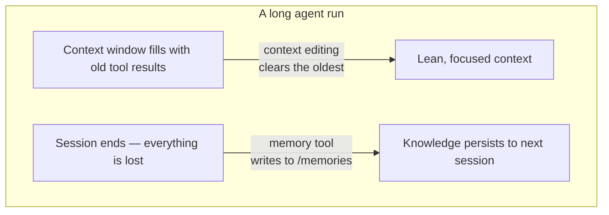

import Tabs from '@theme/Tabs';
import TabItem from '@theme/TabItem';

<LevelBadge level="advanced" />

<VerifyNote lastVerified="2026-06-26" source="https://platform.claude.com/docs/en/agents-and-tools/tool-use/memory-tool">
Les deux fonctionnalités sont en bêta. Les chaînes de type d'outil, l'en-tête bêta, les valeurs par défaut et les gains de benchmark annoncés changent — vérifiez dans la documentation officielle memory-tool et context-editing avant de bâtir dessus.
</VerifyNote>

Un agent à exécution longue a deux ennemis : il **oublie** ce qu'il a appris à l'instant où la conversation se termine, et sa fenêtre de contexte **se remplit** de sorties d'outils périmées jusqu'à déborder. Anthropic livre une primitive pour chacun — l'**outil memory** (persistance) et l'**édition du contexte** (élagage) — et ils sont conçus pour être utilisés ensemble.

<Callout type="objectives" items={["Ce qu'est l'outil memory — un stockage de fichiers côté client à /memories que vous implémentez, pas Anthropic", "Les six commandes auxquelles votre gestionnaire doit répondre : view, create, str_replace, insert, delete, rename", "Pourquoi la validation contre la traversée de chemins est non négociable quand vous le câblez", "Comment l'édition du contexte efface automatiquement les anciens résultats d'outils une fois que le contexte franchit un seuil de tokens", "Comment combiner les deux sous un même en-tête bêta, et les pièges liés au cache et à l'ordre"]} />

## Deux problèmes, deux outils



Gardez les deux idées séparées dans votre tête :

- **Outil memory** = *persistance entre les sessions*. Claude lit et écrit des fichiers ; **vous** les stockez.
- **Édition du contexte** = *élagage au sein d'une session*. L'API supprime les résultats d'outils périmés du prompt avant qu'il n'atteigne Claude.

Cette page va de pair avec [Mise en cache des prompts](/docs/api/prompt-caching) et [l'économie des tokens](/docs/power-user/token-economy) pour le volet coût, et avec [l'ingénierie du contexte](/docs/frontiers/context-engineering) et les [harnais d'agents à exécution longue](/docs/frontiers/long-running-agent-harnesses) pour le *pourquoi*.

<Flashcards title="Vocabulaire de la mémoire et du contexte" cards={[{front:"Outil memory","back":"Un outil côté client (type memory_20250818) qui permet à Claude de créer/lire/mettre à jour/supprimer des fichiers dans un répertoire /memories. Vous implémentez le backend de stockage."},{front:"/memories","back":"Le répertoire unique auquel toutes les opérations de mémoire sont confinées. Chaque chemin doit être validé pour rester à l'intérieur."},{front:"Édition du contexte","back":"Une stratégie côté serveur qui efface les anciens résultats d'outils du prompt une fois qu'un seuil de tokens est franchi — l'historique complet vit toujours sur votre client."},{front:"clear_tool_uses_20250919","back":"La stratégie d'édition du contexte qui supprime les résultats d'outils les plus anciens, en les remplaçant par un espace réservé pour que Claude sache qu'ils ont été élagués."},{front:"Compaction","back":"Une fonctionnalité côté serveur distincte qui résume toute la conversation près de la limite de contexte — complémentaire de l'édition du contexte côté client."}]} />

## L'outil memory est un outil que *vous* implémentez

C'est ce qui fait trébucher les gens : activer l'outil memory ne vous donne **pas** un stockage hébergé par Anthropic. C'est un outil **côté client**. Claude émet des appels d'outils comme `view` ou `create` ; votre application les exécute contre le backend de votre choix — fichiers locaux, base de données, blobs chiffrés, stockage cloud — et renvoie le résultat. Vous décidez où vivent les octets (c'est aussi pourquoi c'est éligible au [Zero-Data-Retention](/docs/foundations/privacy)).

Quand l'outil est activé, Anthropic injecte une instruction système indiquant à Claude de **vérifier son répertoire de mémoire avant toute autre chose**, et d'enregistrer sa progression au fil du travail afin que rien ne soit perdu si le contexte est réinitialisé.

### Étape 1 — activer l'outil

Ajoutez l'outil à votre requête. La chaîne de type est la version datée `memory_20250818`.

<Tabs groupId="lang">
<TabItem value="python" label="Python">

```python
import anthropic

client = anthropic.Anthropic()

message = client.messages.create(
    model="claude-opus-4-8",
    max_tokens=2048,
    messages=[{"role": "user", "content": "Help me respond to this support ticket."}],
    tools=[{"type": "memory_20250818", "name": "memory"}],
)

print(message)
```

</TabItem>
<TabItem value="typescript" label="TypeScript">

```typescript
import Anthropic from "@anthropic-ai/sdk";

const anthropic = new Anthropic();

const message = await anthropic.messages.create({
  model: "claude-opus-4-8",
  max_tokens: 2048,
  messages: [{ role: "user", content: "Help me respond to this support ticket." }],
  tools: [{ type: "memory_20250818", name: "memory" }],
});

console.log(message);
```

</TabItem>
</Tabs>

Les SDK officiels livrent des helpers de mémoire pour que vous n'ayez pas à coder à la main l'interface de l'outil — dérivez `BetaAbstractMemoryTool` (Python, C#), utilisez `betaMemoryTool` (TypeScript), ou implémentez `BetaMemoryToolHandler` (Java). Ils vous offrent un point d'accroche propre où brancher votre stockage.

### Étape 2 — répondre aux six commandes

Votre gestionnaire doit les implémenter. Les chaînes que Claude attend en retour sont spécifiques — respectez-les pour que le modèle interprète correctement les résultats.

<Steps items={[{title: "view", body: "Lister un répertoire (fichiers jusqu'à 2 niveaux de profondeur, avec des tailles lisibles par l'humain) ou renvoyer le contenu d'un fichier avec des numéros de ligne indexés à partir de 1. view_range optionnel pour lire une tranche."},{title: "create", body: "Écrire un nouveau fichier à partir de file_text. Renvoyer une erreur s'il existe déjà plutôt que de l'écraser silencieusement."},{title: "str_replace", body: "Remplacer un old_str exact par new_str. Refuser si old_str est absent, ou apparaît plus d'une fois (ambigu) — signaler les numéros de ligne."},{title: "insert", body: "Insérer insert_text à insert_line. Valider que la ligne est dans [0, n_lines]."},{title: "delete", body: "Supprimer un fichier, ou un répertoire et son contenu de manière récursive."},{title: "rename", body: "Déplacer/renommer un chemin. Refuser si la destination existe déjà — ne jamais écraser."}]} />

Un vrai `view` du répertoire renvoie quelque chose comme ceci — notez l'en-tête littéral et les tailles séparées par des tabulations, que le modèle est entraîné à analyser :

```text
Here're the files and directories up to 2 levels deep in /memories, excluding hidden items and node_modules:
4.0K	/memories
1.5K	/memories/customer_service_guidelines.xml
2.0K	/memories/refund_policies.xml
```

### Étape 3 — verrouiller les chemins (ne sautez pas cette étape)

L'outil memory permet à un modèle d'émettre des chaînes de chemin arbitraires. Une conversation empoisonnée ou une charge utile d'injection de prompt peut tenter de s'échapper de `/memories` et de lire ou d'écraser des fichiers ailleurs sur votre machine. Traitez chaque chemin entrant comme hostile.

<Callout type="warning" items={["Rejetez tout chemin qui ne se résout pas à l'intérieur de /memories.","Canonicalisez avant de vérifier — en Python, Path(p).resolve() puis vérifiez que .relative_to(memories_root) ne lève pas d'exception.","Bloquez ../, ..\\, et la traversée encodée en URL comme %2e%2e%2f.","Plafonnez la taille des fichiers et la longueur de lecture pour qu'un agent emballé ne puisse pas épuiser le disque ou faire exploser le prompt suivant."]} />

Ce validateur, c'est tout l'enjeu — verrouillez-le et testez-le avant que quoi que ce soit d'autre ne soit livré :

<PromptCard title="Garde contre la traversée de chemins (Python)">{`from pathlib import Path

MEMORY_ROOT = Path("/srv/agent/memories").resolve()

def safe_path(requested: str) -> Path:
    # Map the model's /memories/... onto your real root, then prove containment.
    rel = requested.removeprefix("/memories").lstrip("/")
    candidate = (MEMORY_ROOT / rel).resolve()
    candidate.relative_to(MEMORY_ROOT)  # raises ValueError if it escaped
    return candidate`}</PromptCard>

## L'édition du contexte empêche la fenêtre de déborder

La mémoire résout *l'oubli*. Le problème inverse — une fenêtre de contexte bourrée de vieux blocs `tool_result` provenant de 40 recherches web en arrière — est ce que résout l'**édition du contexte**. Une fois que le prompt franchit un seuil de tokens, l'API efface les résultats d'outils les **plus anciens** (en les remplaçant par un court espace réservé pour que Claude sache qu'ils ont été supprimés) avant que le prompt ne soit envoyé au modèle. Votre client conserve l'historique complet et non édité ; seul ce qui atteint le modèle est rogné.

Cela s'appuie sur un en-tête bêta :

```text
anthropic-beta: context-management-2025-06-27
```

Vous le configurez avec un tableau `context_management.edits`. La stratégie principale est `clear_tool_uses_20250919` :

<Tabs groupId="lang">
<TabItem value="python" label="Python">

```python
message = client.beta.messages.create(
    model="claude-opus-4-8",
    max_tokens=2048,
    betas=["context-management-2025-06-27"],
    messages=[...],
    tools=[{"type": "memory_20250818", "name": "memory"}],
    context_management={
        "edits": [
            {
                "type": "clear_tool_uses_20250919",
                "trigger": {"type": "input_tokens", "value": 30000},  # start clearing past 30k
                "keep": {"type": "tool_uses", "value": 3},            # always keep the last 3
                "clear_at_least": {"type": "input_tokens", "value": 5000},
                "exclude_tools": ["memory"],                          # never clear memory calls
                "clear_tool_inputs": False,                           # keep the call args, drop results
            }
        ]
    },
)
```

</TabItem>
<TabItem value="typescript" label="TypeScript">

```typescript
const message = await anthropic.beta.messages.create({
  model: "claude-opus-4-8",
  max_tokens: 2048,
  betas: ["context-management-2025-06-27"],
  messages: [...],
  tools: [{ type: "memory_20250818", name: "memory" }],
  context_management: {
    edits: [
      {
        type: "clear_tool_uses_20250919",
        trigger: { type: "input_tokens", value: 30000 },
        keep: { type: "tool_uses", value: 3 },
        clear_at_least: { type: "input_tokens", value: 5000 },
        exclude_tools: ["memory"],
        clear_tool_inputs: false,
      },
    ],
  },
});
```

</TabItem>
</Tabs>

Ce que signifient les réglages :

| Paramètre | Valeur par défaut | Ce qu'il contrôle |
|-----------|---------|------------------|
| `trigger` | 100 000 tokens d'entrée | Quand l'effacement se déclenche |
| `keep` | 3 utilisations d'outils | Combien de paires récentes utilisation/résultat d'outil sont toujours préservées |
| `clear_at_least` | aucune | Minimum de tokens libérés par activation — utilisez-le pour qu'une invalidation de cache en vaille réellement la peine |
| `exclude_tools` | aucun | Outils jamais effacés (p. ex. `memory`, `web_search`) |
| `clear_tool_inputs` | `false` | S'il faut aussi supprimer les *arguments d'appel* de l'outil, pas seulement le résultat |

La réponse vous indique ce qu'elle a fait, sous `context_management.applied_edits` — p. ex. `cleared_tool_uses` et `cleared_input_tokens` — pour que vous puissiez journaliser combien a été récupéré.

Il existe une stratégie sœur, `clear_thinking_20251015`, qui élague les anciens blocs de [réflexion étendue](/docs/api/thinking-and-effort). Si vous utilisez les deux, **listez `clear_thinking_20251015` en premier** dans le tableau `edits`.

<Callout type="tip" items={["Effacer les résultats d'outils invalide tout préfixe de cache de prompt au point d'effacement — associez-le à clear_at_least pour ne payer cette invalidation que lorsque vous libérez un volume significatif.","exclude_tools: [\"memory\"] est le réflexe habituel : vous voulez que les propres notes de l'agent persistent, et non qu'elles soient balayées avec les résultats de recherche périmés.","L'édition du contexte (rognage côté client) et la compaction (résumé côté serveur) sont des fonctionnalités différentes — pour les exécutions très longues, vous pouvez superposer les deux."]} />

## Pourquoi les associer — les chiffres

Utilisées ensemble, les deux fonctionnalités permettent à un agent de fonctionner bien au-delà d'une seule fenêtre de contexte : l'édition du contexte garde la fenêtre active légère, et tout ce qui compte est écrit en mémoire avant d'être effacé. Anthropic rapporte que combiner la mémoire avec l'édition du contexte a donné une **amélioration de 39 %** sur une évaluation de recherche agentique, et que l'édition du contexte à elle seule a réduit l'utilisation de tokens de **84 %** dans un test de recherche web sur 100 tours.

<VerifyNote lastVerified="2026-06-26" source="https://www.anthropic.com/news/context-management">
Ces pourcentages sont les propres chiffres de benchmark d'Anthropic et reflètent des configurations d'évaluation spécifiques — considérez-les comme indicatifs, pas comme des garanties pour votre charge de travail. Vérifiez dans l'annonce context-management.
</VerifyNote>

## Un modèle qui fonctionne : le journal de projet multi-session

L'usage le plus propre de la mémoire consiste à l'amorcer délibérément plutôt qu'à écrire des fichiers de manière ad hoc :

<Steps items={[{title: "Session d'initialisation", body: "Avant tout travail réel, écrivez un journal de progression, une liste de contrôle des fonctionnalités, et une note pointant vers tout script de démarrage dont le projet a besoin."},{title: "Chaque session ultérieure s'ouvre en lisant ces fichiers", body: "Elle récupère l'état complet du projet en quelques secondes — pas besoin de réexplorer le code ou de retracer les décisions."},{title: "Chaque session se clôt en mettant à jour le journal", body: "Notez ce qui a été fait et ce qui vient ensuite, pour que la session suivante dispose d'un point de départ précis."},{title: "Une fonctionnalité à la fois, vérifiée", body: "Ne marquez une fonctionnalité comme terminée qu'après une vérification de bout en bout — pas seulement après que le code est écrit — pour que le journal reste digne de confiance."}]} />

## Testez votre compréhension

<Quiz questions={[{q:"Où sont réellement stockées les données de l'outil memory ?",options:["Sur les serveurs d'Anthropic, gérés pour vous","Dans votre propre infrastructure — l'outil est côté client et vous implémentez le backend","Dans les poids du modèle","Dans le cache de prompt"],answer:1,explain:"L'outil memory est côté client. Claude émet des appels d'outils ; votre application les exécute contre un stockage que vous contrôlez, confiné à /memories."},{q:"Que supprime la stratégie clear_tool_uses_20250919 de l'édition du contexte ?",options:["Le prompt système","Les résultats d'outils les plus récents","Les résultats d'outils les plus anciens une fois qu'un seuil de tokens est franchi","Tous les messages utilisateur"],answer:2,explain:"Elle efface d'abord les résultats d'outils les plus anciens, après le seuil de déclenchement, tout en conservant les plus récents (par défaut : les 3 derniers) et en laissant l'historique complet sur votre client."},{q:"Pourquoi devez-vous valider chaque chemin que reçoit l'outil memory ?",options:["Pour économiser de l'espace disque","Pour empêcher les évasions par traversée de répertoire hors de /memories via des entrées comme ../","Pour accélérer le modèle","Parce qu'Anthropic rejette les chemins longs"],answer:1,explain:"Un chemin malveillant ou injecté pourrait tenter de lire ou d'écraser des fichiers hors de /memories. Canonicalisez le chemin et prouvez qu'il reste à l'intérieur de la racine de mémoire avant d'agir."}]} />

## Sources et lectures complémentaires

- [Outil memory — documentation API Claude](https://platform.claude.com/docs/en/agents-and-tools/tool-use/memory-tool) — type d'outil `memory_20250818`, les six commandes, et les conseils de sécurité.
- [Édition du contexte — documentation API Claude](https://platform.claude.com/docs/en/build-with-claude/context-editing) — la bêta `context-management-2025-06-27`, les champs de stratégie, et les valeurs par défaut.
- [Gérer le contexte sur la Claude Developer Platform](https://www.anthropic.com/news/context-management) — l'annonce avec les chiffres de benchmark 39 % / 84 %.
- [Ingénierie efficace du contexte pour les agents IA](https://www.anthropic.com/engineering/effective-context-engineering-for-ai-agents) — le modèle de récupération juste-à-temps pour lequel la mémoire est conçue.
- [Harnais efficaces pour les agents à exécution longue](https://www.anthropic.com/engineering/effective-harnesses-for-long-running-agents) — l'étude de cas du journal de projet multi-session.
- En lien sur AILmanac : [Ingénierie du contexte](/docs/frontiers/context-engineering) · [Harnais d'agents à exécution longue](/docs/frontiers/long-running-agent-harnesses) · [Mise en cache des prompts](/docs/api/prompt-caching) · [Utilisation des outils](/docs/api/tool-use)
