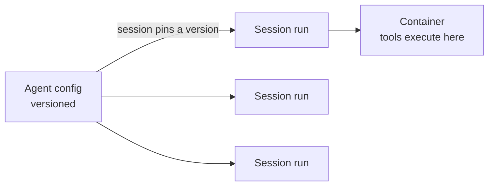

<LevelBadge level="advanced" />

<VerifyNote lastVerified="2026-06-26" source="https://docs.anthropic.com/en/docs/agents-and-tools">
प्रबंधित एजेंट की क्षमताएं और उपलब्धता बदलती रहती हैं — यह API बीटा में है। इस पर कुछ भी बनाने से पहले आधिकारिक डॉक्स में एंडपॉइंट, फील्ड नाम, और एक्सेस की पुष्टि करें।
</VerifyNote>

<Callout type="objectives" items={["समझें कि एक प्रबंधित (Anthropic-होस्टेड) एजेंट लूप आपके लिए क्या संभालता है", "दो मुख्य ऑब्जेक्ट्स को अलग करें: एक वर्शन्ड Agent बनाम प्रति-रन Session", "Vaults के साथ सीक्रेट्स को सुरक्षित रूप से इंजेक्ट करें — मॉडल को कभी देखे बिना", "Scheduled Deployments के साथ एक एजेंट को cron शेड्यूल पर रखें — होस्ट करने के लिए कोई शेड्यूलर नहीं", "जानें कि प्रबंधित कब एक कस्टम लूप से बेहतर होता है, और कौन से गार्डरेल अब भी लागू होते हैं"]} />

अगर [अपना खुद का एजेंट लूप बनाना](/docs/api/building-agents) उससे ज्यादा इन्फ्रास्ट्रक्चर है जितना आप खुद संभालना चाहते हैं, तो एक **प्रबंधित** (Anthropic-होस्टेड) एजेंट लूप आपके लिए चलाता है — ताकि आप एजेंट के *काम* पर ध्यान केंद्रित करें, न कि सेशन प्लंबिंग, रिट्राई, स्टेट, और शेड्यूलिंग पर।

## दो ऑब्जेक्ट: Agent बनाम Session

यही वह मानसिक मॉडल है जिस पर बाकी सब कुछ टिका है। ये जानबूझकर अलग हैं।

- एक **Agent** एक *परसिस्टेड, वर्शन्ड कॉन्फ़िगरेशन* है — मॉडल, सिस्टम प्रॉम्प्ट, टूल्स, MCP सर्वर, और स्किल्स। आप इसे एक बार बनाते हैं। हर अपडेट एक नया अपरिवर्तनीय वर्शन बनाता है।
- एक **Session** एक *रनटाइम इंस्टेंस* है — एक एक्ज़ीक्यूशन जो ID द्वारा एक एजेंट की ओर इशारा करता है। कॉन्फ़िगरेशन एजेंट पर रहता है, कभी सेशन पर नहीं।

<Callout type="tip">
सेशन उस एजेंट वर्शन से **पिन** होते हैं जिसके साथ वे बनाए गए थे: चल रहे सेशन अपना वर्शन रखते हैं, नए सेशन को नवीनतम मिलता है। इसी तरह आप इन-फ़्लाइट काम को तोड़े बिना कॉन्फ़िग बदलाव शिप करते हैं।
</Callout>

## "प्रबंधित" आपको क्या देता है

लूप को हाथ से बनाने और होस्ट करने के बजाय, आपको होस्टेड बिल्डिंग ब्लॉक्स मिलते हैं:

- **Sessions** — परसिस्टेंट रन जिन्हें आप प्रति एक्ज़ीक्यूशन बनाते हैं और रिज़्यूम करते हैं; SSE पर इवेंट स्ट्रीम करते हैं।
- **Environments** — कंटेनर इन्फ्रास्ट्रक्चर, या तो `cloud` (Anthropic-होस्टेड) या `self_hosted` (टूल्स आपके अपने VPC में चलते हैं)। प्रति सेशन एक कंटेनर एजेंट का वर्कस्पेस होता है।
- **Memory stores** — सेशन के बीच परसिस्टेंट स्टेट, वर्शनिंग और रिडैक्शन के साथ, बिना आपको डेटाबेस वायर किए।
- **Vaults** — MCP ऑथ और अन्य सेवाओं के लिए सीक्रेट्स।
- **Scheduled deployments** — एजेंट जो cron शेड्यूल पर, बिना देखरेख के चलते हैं।

<PromptCard title="एक एजेंट बनाएं (वर्शन्ड कॉन्फ़िग), फिर उसके खिलाफ़ एक सेशन चलाएं">{`# 1. Create the agent once
POST /v1/agents        -> returns $AGENT_ID
# 2. Each execution is a session pinned to that agent
POST /v1/sessions      { "agent": "$AGENT_ID" }`}</PromptCard>

## Vaults: सीक्रेट्स जिन्हें मॉडल कभी नहीं देखता

एक स्वायत्त एजेंट को अक्सर एक API key की जरूरत होती है — लेकिन *मॉडल* को इसे कभी नहीं पढ़ना चाहिए। Vault क्रेडेंशियल (`mcp_oauth`, `static_bearer`, `environment_variable`) एग्रेस पर प्रतिस्थापित किए जाते हैं: एक `environment_variable` क्रेडेंशियल एक्ज़ीक्यूशन के समय सैंडबॉक्स में इंजेक्ट किया जाता है और मॉडल को *कभी दिखाई नहीं देता*।

<Callout type="warning">
किसी एजेंट को शक्तिशाली एक्सेस देने के लिए यही सुरक्षित पैटर्न है। keys को सिस्टम प्रॉम्प्ट या किसी मैसेज में पेस्ट न करें — वे उस कॉन्टेक्स्ट का हिस्सा बन जाती हैं जिसे मॉडल (और आपके लॉग) देख सकते हैं। उन्हें एक वॉल्ट में रखें।
</Callout>

## Scheduled deployments: एक cron पर एक एजेंट

एक **deployment** एक एजेंट से एक cron शेड्यूल जोड़ता है। जब शेड्यूल फायर होता है, तो यह एक नया सेशन शुरू करता है और अपना काम पूरा करता है — आपके लिए बनाने या होस्ट करने को कोई शेड्यूलर नहीं। एक रात्रिकालीन डेटा सिंक, एक साप्ताहिक कंप्लायंस स्कैन, या एक दैनिक डाइजेस्ट के लिए अच्छा।

<Steps items={[
  {title: "शेड्यूल परिभाषित करें", body: "POST /v1/deployments के साथ agent, environment_id, initial_events (जिसमें एक user.message शामिल होना चाहिए), और एक schedule: एक POSIX cron एक्सप्रेशन प्लस एक IANA timezone।"},
  {title: "हर फायर = एक रन", body: "हर ट्रिगर प्रयास एक रन रिकॉर्ड बनाता है (drun_ प्रिफ़िक्स)। सफलता एक session_id ले जाती है; विफलता एक error.type ले जाती है (जैसे environment_archived, session_rate_limited)। GET /v1/deployment_runs?deployment_id=... के माध्यम से रन की सूची बनाएं।"},
  {title: "लाइफसाइकल नियंत्रित करें", body: "Pause भविष्य के ट्रिगर्स को दबाता है (मैन्युअल रन अब भी काम करते हैं); unpause अगली घटना पर फिर से शुरू होता है और छूटे हुए ट्रिगर्स को बैकफिल नहीं करता; archive अंतिम है।"},
  {title: "मांग पर ट्रिगर करें", body: "POST /v1/deployments/{id}/run तुरंत एक सेशन शुरू करता है — पॉज़ किए रहते हुए भी — trigger_context.type: manual के साथ।"}
]} />

<PromptCard title="एक साप्ताहिक कंप्लायंस स्कैन, शुक्रवार को 20:00 न्यूयॉर्क समय पर">{`POST /v1/deployments
{
  "name": "Weekly compliance scan",
  "agent": "$AGENT_ID",
  "environment_id": "$ENVIRONMENT_ID",
  "initial_events": [
    {"type": "user.message", "content": [{"type": "text", "text": "Run the compliance scan and summarize findings."}]}
  ],
  "schedule": {"type": "cron", "expression": "0 20 * * 5", "timezone": "America/New_York"}
}`}</PromptCard>

<Callout type="tip">
Cron है `minute hour day-of-month month day-of-week`, मिनट-स्तरीय ग्रैन्युलैरिटी। DST वॉल-क्लॉक सेमेंटिक्स का उपयोग करता है: एक समय जो स्प्रिंग-फ़ॉरवर्ड पर मौजूद नहीं होता उसे छोड़ दिया जाता है; एक समय जो फ़ॉल-बैक पर दो बार आता है वह दो बार फायर होता है। किसी भी संवेदनशील चीज़ के लिए एक ऐसा timezone और घंटा चुनें जो उन किनारों से बचे।
</Callout>

## प्रबंधित बनाम कस्टम कब चुनें

| **प्रबंधित** चुनें जब… | एक **कस्टम लूप / SDK** चुनें जब… |
|---|---|
| आप चाहते हैं कि होस्टिंग, स्टेट, शेड्यूलिंग, और सीक्रेट्स संभाले जाएं | आपको लूप और टूल्स पर पूर्ण नियंत्रण चाहिए |
| आप जल्दी से प्रोटोटाइप बना रहे हैं | आपकी सख्त कस्टम इन्फ्रा/कंप्लायंस ज़रूरतें हैं |
| ऑप्स की सरलता नियंत्रण से ज्यादा मायने रखती है | आप अपने खुद के स्टैक में गहराई से एम्बेड कर रहे हैं |

यह एक स्पेक्ट्रम है — सिंगल कॉल → वर्कफ़्लो → कस्टम एजेंट (SDK) → प्रबंधित। काम जितना अनुमति दे उतना सरल शुरू करें; ऊपर तभी जाएं जब आपको जरूरत हो।

## वही गार्डरेल लागू होते हैं

होस्टेड हो या न हो, एक स्वायत्त एजेंट अब भी एक्शन लेता है। **न्यूनतम विशेषाधिकार**, **सीमित लागत/इटरेशन**, और **जोखिम भरे चरणों के लिए मानवीय अनुमोदन** बनाए रखें — देखें [एजेंट सुरक्षित करना](/docs/security/securing-agents) और [स्वायत्त रन को मज़बूत करना](/docs/security/hardening-autonomous-runs)।

<Callout type="takeaways" items={["प्रबंधित एजेंट लूप, सेशन, एनवायरनमेंट, मेमोरी, वॉल्ट, और शेड्यूलिंग को संभालते हैं ताकि आप काम पर ध्यान केंद्रित करें", "एक Agent वर्शन्ड कॉन्फ़िग है; एक Session एक रन है जो एक वर्शन से पिन होता है — कॉन्फ़िग एजेंट पर रहता है, सेशन पर नहीं", "Vault environment_variable क्रेडेंशियल एक्ज़ीक्यूशन पर इंजेक्ट किए जाते हैं और मॉडल को कभी दिखाई नहीं देते — एजेंट को सीक्रेट्स देने का सुरक्षित तरीका", "एक शेड्यूल्ड डिप्लॉयमेंट एक cron एक्सप्रेशन + IANA timezone है; हर फायर एक रन बनाता है, और unpause छूटे हुए ट्रिगर्स को बैकफिल नहीं करता", "प्रबंधित सिंगल कॉल -> वर्कफ़्लो -> कस्टम -> प्रबंधित के होस्टेड छोर पर बैठता है; स्वायत्तता के गार्डरेल अब भी लागू होते हैं"]} />

## खुद को परखें

<Quiz title="खुद को परखें" questions={[
  {
    q: "एक Agent और एक Session के बीच क्या अंतर है?",
    options: [
      "वे एक ही ऑब्जेक्ट के दो नाम हैं",
      "एक Agent वर्शन्ड कॉन्फ़िगरेशन है; एक Session एक रनटाइम एक्ज़ीक्यूशन है जो एक एजेंट वर्शन से पिन होता है",
      "एक Session मॉडल और सिस्टम प्रॉम्प्ट रखता है; एक Agent बस एक ID है",
      "एक Agent टूल्स चलाता है; एक Session सीक्रेट्स स्टोर करता है"
    ],
    answer: 1,
    explain: "एक Agent परसिस्टेड, वर्शन्ड कॉन्फ़िग है (मॉडल, प्रॉम्प्ट, टूल्स, MCP, स्किल्स)। एक Session एक प्रति-एक्ज़ीक्यूशन इंस्टेंस है जो एजेंट को संदर्भित करता है और निर्माण के समय उसके वर्शन से पिन होता है।"
  },
  {
    q: "किसी प्रबंधित एजेंट को उसकी ज़रूरत की एक API key आपको कैसे देनी चाहिए?",
    options: [
      "इसे सिस्टम प्रॉम्प्ट में रखें ताकि एजेंट इसे पढ़ सके",
      "इसे सेशन के पहले यूज़र मैसेज में पास करें",
      "इसे एक वॉल्ट क्रेडेंशियल के रूप में स्टोर करें, जो एक्ज़ीक्यूशन पर इंजेक्ट किया जाता है और मॉडल को कभी दिखाई नहीं देता",
      "इसे टूल डेफ़िनिशन में हार्ड-कोड करें"
    ],
    answer: 2,
    explain: "Vault क्रेडेंशियल (जैसे एक environment_variable टाइप) एग्रेस पर प्रतिस्थापित किए जाते हैं और मॉडल को कभी दिखाई नहीं देते — प्रॉम्प्ट या मैसेज में keys दृश्यमान कॉन्टेक्स्ट का हिस्सा बन जाती हैं।"
  },
  {
    q: "एक शेड्यूल्ड डिप्लॉयमेंट दो दिनों के लिए पॉज़ किया गया और फिर अनपॉज़ किया गया। पॉज़ रहते हुए जो ट्रिगर्स फायर होते उनका क्या होता है?",
    options: [
      "उन्हें बैकफिल किया जाता है — हर छूटा हुआ रन अनपॉज़ पर एक्ज़ीक्यूट होता है",
      "उन्हें बैकफिल नहीं किया जाता; डिप्लॉयमेंट बस अगली शेड्यूल्ड घटना पर फिर से शुरू होता है",
      "डिप्लॉयमेंट स्वचालित रूप से आर्काइव हो जाता है",
      "सभी छूटे हुए रन कतारबद्ध होते हैं और एक मिनट के अंतराल पर चलते हैं"
    ],
    answer: 1,
    explain: "Unpause अगली घटना पर फिर से शुरू होता है और छूटे हुए ट्रिगर्स को बैकफिल नहीं करता। (आप अब भी मैन्युअल ट्रिगर के साथ किसी भी समय एक रन को मजबूर कर सकते हैं, पॉज़ रहते हुए भी।)"
  }
]} />

## आगे

- [API पर एजेंट बनाना](/docs/api/building-agents)
- [Cowork और एजेंट टीमें](/docs/api/cowork-and-agent-teams)
- [हेडलेस मोड और Agent SDK](/docs/claude-code/headless-and-agent-sdk)
- [एजेंट सुरक्षित करना](/docs/security/securing-agents)
