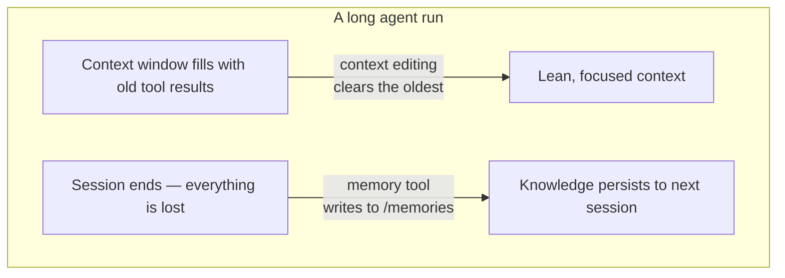

import Tabs from '@theme/Tabs';
import TabItem from '@theme/TabItem';

<LevelBadge level="advanced" />

<VerifyNote lastVerified="2026-06-26" source="https://platform.claude.com/docs/en/agents-and-tools/tool-use/memory-tool">
दोनों फीचर बीटा में हैं। Tool type स्ट्रिंग्स, beta header, डिफ़ॉल्ट्स, और रिपोर्ट किए गए बेंचमार्क लाभ बदलते रहते हैं — उन पर निर्माण करने से पहले आधिकारिक memory-tool और context-editing दस्तावेज़ों में पुष्टि करें।
</VerifyNote>

एक लंबे समय तक चलने वाले एजेंट के दो दुश्मन होते हैं: जैसे ही बातचीत समाप्त होती है वह जो सीखा था उसे **भूल** जाता है, और इसका कॉन्टेक्स्ट विंडो पुराने टूल आउटपुट से **भर** जाता है जब तक कि वह ओवरफ्लो न हो जाए। Anthropic प्रत्येक के लिए एक primitive भेजता है — **memory tool** (स्थायित्व) और **कॉन्टेक्स्ट एडिटिंग** (छंटनी) — और इन्हें एक साथ उपयोग के लिए डिज़ाइन किया गया है।

<Callout type="objectives" items={["memory tool क्या है — /memories पर एक क्लाइंट-साइड फ़ाइल स्टोर जिसे आप लागू करते हैं, Anthropic नहीं", "छह कमांड जिनका आपके handler को उत्तर देना चाहिए: view, create, str_replace, insert, delete, rename", "जब आप इसे जोड़ते हैं तो path-traversal सत्यापन गैर-परक्राम्य क्यों है", "कॉन्टेक्स्ट एडिटिंग पुराने टूल परिणामों को स्वतः कैसे साफ करती है जब कॉन्टेक्स्ट एक token सीमा पार कर जाता है", "दोनों को एक beta header के तहत कैसे संयोजित करें, और caching तथा ordering के साथ जुड़े नुकसान"]} />

## दो समस्याएँ, दो टूल



दोनों विचारों को अपने दिमाग में अलग रखें:

- **Memory tool** = *सत्रों के पार स्थायित्व*। Claude फ़ाइलें पढ़ता और लिखता है; **आप** उन्हें संग्रहीत करते हैं।
- **कॉन्टेक्स्ट एडिटिंग** = *एक सत्र के भीतर छंटनी*। API पुराने टूल परिणामों को prompt से हटा देती है इससे पहले कि वह Claude तक पहुँचे।

यह पृष्ठ लागत पक्ष के लिए [Prompt Caching](/docs/api/prompt-caching) और [token economy](/docs/power-user/token-economy) के साथ जुड़ता है, और *क्यों* के लिए [Context Engineering](/docs/frontiers/context-engineering) तथा [long-running agent harnesses](/docs/frontiers/long-running-agent-harnesses) के साथ।

<Flashcards title="मेमोरी और कॉन्टेक्स्ट शब्दावली" cards={[{front:"Memory tool","back":"एक क्लाइंट-साइड टूल (type memory_20250818) जो Claude को /memories निर्देशिका में फ़ाइलें create/read/update/delete करने देता है। आप स्टोरेज बैकएंड लागू करते हैं।"},{front:"/memories","back":"वह एकल निर्देशिका जिसमें सभी मेमोरी ऑपरेशन सीमित होते हैं। हर path को इसके अंदर बने रहने के लिए सत्यापित किया जाना चाहिए।"},{front:"कॉन्टेक्स्ट एडिटिंग","back":"एक सर्वर-साइड रणनीति जो एक token सीमा पार होने पर prompt से पुराने टूल परिणाम साफ कर देती है — पूरा इतिहास अभी भी आपके क्लाइंट पर रहता है।"},{front:"clear_tool_uses_20250919","back":"वह कॉन्टेक्स्ट-एडिटिंग रणनीति जो सबसे पुराने टूल परिणामों को हटाती है, उन्हें एक placeholder से बदलते हुए ताकि Claude को पता रहे कि उनकी छंटनी की गई थी।"},{front:"Compaction","back":"एक अलग सर्वर-साइड फीचर जो कॉन्टेक्स्ट सीमा के पास पूरी बातचीत का सारांश बनाता है — क्लाइंट-साइड कॉन्टेक्स्ट एडिटिंग का पूरक।"}]} />

## memory tool एक ऐसा टूल है जिसे *आप* लागू करते हैं

यह लोगों को उलझा देता है: memory tool को सक्षम करना आपको Anthropic-होस्टेड स्टोरेज **नहीं** देता। यह एक **क्लाइंट-साइड** टूल है। Claude `view` या `create` जैसे टूल कॉल उत्सर्जित करता है; आपका एप्लिकेशन उन्हें आपके चुने हुए किसी भी बैकएंड के विरुद्ध निष्पादित करता है — स्थानीय फ़ाइलें, एक डेटाबेस, एन्क्रिप्टेड blobs, क्लाउड स्टोरेज — और परिणाम लौटाता है। आप तय करते हैं कि bytes कहाँ रहते हैं (यही कारण है कि यह [Zero-Data-Retention](/docs/foundations/privacy)-योग्य भी है)।

जब टूल सक्षम होता है, Anthropic एक सिस्टम निर्देश इंजेक्ट करता है जो Claude को बताता है कि **कुछ भी करने से पहले अपनी मेमोरी निर्देशिका जाँचे**, और काम करते समय प्रगति दर्ज करे ताकि कॉन्टेक्स्ट रीसेट होने पर कुछ भी न खोए।

### चरण 1 — टूल सक्षम करें

अपने अनुरोध में टूल जोड़ें। Type स्ट्रिंग दिनांकित संस्करण `memory_20250818` है।

<Tabs groupId="lang">
<TabItem value="python" label="Python">

```python
import anthropic

client = anthropic.Anthropic()

message = client.messages.create(
    model="claude-opus-4-8",
    max_tokens=2048,
    messages=[{"role": "user", "content": "Help me respond to this support ticket."}],
    tools=[{"type": "memory_20250818", "name": "memory"}],
)

print(message)
```

</TabItem>
<TabItem value="typescript" label="TypeScript">

```typescript
import Anthropic from "@anthropic-ai/sdk";

const anthropic = new Anthropic();

const message = await anthropic.messages.create({
  model: "claude-opus-4-8",
  max_tokens: 2048,
  messages: [{ role: "user", content: "Help me respond to this support ticket." }],
  tools: [{ type: "memory_20250818", name: "memory" }],
});

console.log(message);
```

</TabItem>
</Tabs>

आधिकारिक SDKs मेमोरी हेल्पर्स भेजते हैं ताकि आपको टूल इंटरफ़ेस को हाथ से न बनाना पड़े — `BetaAbstractMemoryTool` (Python, C#) को subclass करें, `betaMemoryTool` (TypeScript) का उपयोग करें, या `BetaMemoryToolHandler` (Java) लागू करें। ये आपको एक साफ़ hook देते हैं जहाँ आप अपना स्टोरेज प्लग करते हैं।

### चरण 2 — छह कमांड का उत्तर दें

आपके handler को इन्हें लागू करना चाहिए। Claude जो स्ट्रिंग्स वापस अपेक्षा करता है वे विशिष्ट हैं — उनसे मिलान करें ताकि मॉडल परिणामों की सही व्याख्या करे।

<Steps items={[{title: "view", body: "एक निर्देशिका सूचीबद्ध करें (मानव-पठनीय आकारों के साथ 2 स्तर तक गहराई की फ़ाइलें) या किसी फ़ाइल की सामग्री 1-अनुक्रमित पंक्ति संख्याओं के साथ लौटाएँ। एक स्लाइस पढ़ने के लिए वैकल्पिक view_range।"},{title: "create", body: "file_text से एक नई फ़ाइल लिखें। यदि यह पहले से मौजूद है तो चुपचाप अधिलेखित करने के बजाय त्रुटि दें।"},{title: "str_replace", body: "एक सटीक old_str को new_str से बदलें। यदि old_str गायब है, या एक से अधिक बार दिखाई देता है (अस्पष्ट) तो मना करें — पंक्ति संख्याएँ रिपोर्ट करें।"},{title: "insert", body: "insert_line पर insert_text डालें। सत्यापित करें कि पंक्ति [0, n_lines] के भीतर है।"},{title: "delete", body: "एक फ़ाइल हटाएँ, या एक निर्देशिका और उसकी सामग्री को पुनरावर्ती रूप से हटाएँ।"},{title: "rename", body: "एक path को स्थानांतरित/नाम बदलें। यदि गंतव्य पहले से मौजूद है तो मना करें — कभी अधिलेखित न करें।"}]} />

निर्देशिका का एक वास्तविक `view` कुछ इस तरह लौटाता है — शाब्दिक header और tab-पृथक आकारों पर ध्यान दें, जिन्हें मॉडल पार्स करने के लिए प्रशिक्षित है:

```text
Here're the files and directories up to 2 levels deep in /memories, excluding hidden items and node_modules:
4.0K	/memories
1.5K	/memories/customer_service_guidelines.xml
2.0K	/memories/refund_policies.xml
```

### चरण 3 — paths लॉक करें (इसे न छोड़ें)

memory tool एक मॉडल को मनमाने path स्ट्रिंग्स उत्सर्जित करने देता है। एक विषाक्त बातचीत या prompt-injection payload `/memories` से बचने और आपके बॉक्स पर कहीं और की फ़ाइलें पढ़ने या अधिलेखित करने की कोशिश कर सकता है। हर आने वाले path को शत्रुतापूर्ण मानें।

<Callout type="warning" items={["किसी भी ऐसे path को अस्वीकार करें जो /memories के अंदर resolve नहीं होता।","जाँच से पहले canonicalize करें — Python में, Path(p).resolve() फिर सत्यापित करें कि .relative_to(memories_root) कोई अपवाद नहीं उठाता।","../, ..\\, और %2e%2e%2f जैसे URL-encoded traversal को ब्लॉक करें।","फ़ाइल आकार और पढ़ने की लंबाई सीमित करें ताकि एक बेकाबू एजेंट डिस्क खत्म न कर सके या अगला prompt फुला न दे।"]} />

यह validator ही पूरा खेल है — कुछ भी और भेजने से पहले इसे पिन करें और परीक्षण करें:

<PromptCard title="Path-traversal गार्ड (Python)">{`from pathlib import Path

MEMORY_ROOT = Path("/srv/agent/memories").resolve()

def safe_path(requested: str) -> Path:
    # Map the model's /memories/... onto your real root, then prove containment.
    rel = requested.removeprefix("/memories").lstrip("/")
    candidate = (MEMORY_ROOT / rel).resolve()
    candidate.relative_to(MEMORY_ROOT)  # raises ValueError if it escaped
    return candidate`}</PromptCard>

## कॉन्टेक्स्ट एडिटिंग विंडो को ओवरफ्लो होने से बचाती है

मेमोरी *भूलने* को हल करती है। विपरीत समस्या — 40 web searches पहले के पुराने `tool_result` blocks से ठूँसा हुआ एक कॉन्टेक्स्ट विंडो — वही है जिसे **कॉन्टेक्स्ट एडिटिंग** हल करती है। एक बार prompt एक token सीमा पार कर जाता है, API **सबसे पुराने** टूल परिणामों को साफ कर देती है (उन्हें एक छोटे placeholder से बदलते हुए ताकि Claude को पता रहे कि उन्हें हटाया गया था) इससे पहले कि prompt मॉडल को भेजा जाए। आपका क्लाइंट पूरा, असंपादित इतिहास रखता है; केवल वही छँटा जाता है जो मॉडल तक पहुँचता है।

यह एक beta header पर सवार होता है:

```text
anthropic-beta: context-management-2025-06-27
```

आप इसे एक `context_management.edits` array से कॉन्फ़िगर करते हैं। मुख्य रणनीति `clear_tool_uses_20250919` है:

<Tabs groupId="lang">
<TabItem value="python" label="Python">

```python
message = client.beta.messages.create(
    model="claude-opus-4-8",
    max_tokens=2048,
    betas=["context-management-2025-06-27"],
    messages=[...],
    tools=[{"type": "memory_20250818", "name": "memory"}],
    context_management={
        "edits": [
            {
                "type": "clear_tool_uses_20250919",
                "trigger": {"type": "input_tokens", "value": 30000},  # start clearing past 30k
                "keep": {"type": "tool_uses", "value": 3},            # always keep the last 3
                "clear_at_least": {"type": "input_tokens", "value": 5000},
                "exclude_tools": ["memory"],                          # never clear memory calls
                "clear_tool_inputs": False,                           # keep the call args, drop results
            }
        ]
    },
)
```

</TabItem>
<TabItem value="typescript" label="TypeScript">

```typescript
const message = await anthropic.beta.messages.create({
  model: "claude-opus-4-8",
  max_tokens: 2048,
  betas: ["context-management-2025-06-27"],
  messages: [...],
  tools: [{ type: "memory_20250818", name: "memory" }],
  context_management: {
    edits: [
      {
        type: "clear_tool_uses_20250919",
        trigger: { type: "input_tokens", value: 30000 },
        keep: { type: "tool_uses", value: 3 },
        clear_at_least: { type: "input_tokens", value: 5000 },
        exclude_tools: ["memory"],
        clear_tool_inputs: false,
      },
    ],
  },
});
```

</TabItem>
</Tabs>

नॉब्स का क्या अर्थ है:

| Parameter | डिफ़ॉल्ट | यह क्या नियंत्रित करता है |
|-----------|---------|------------------|
| `trigger` | 100,000 input tokens | साफ़ करना कब शुरू होता है |
| `keep` | 3 tool uses | कितने हालिया tool use/result जोड़े हमेशा संरक्षित रहते हैं |
| `clear_at_least` | कोई नहीं | प्रति सक्रियण मुक्त किए गए न्यूनतम tokens — इसे उपयोग करें ताकि एक cache अमान्यता वास्तव में सार्थक हो |
| `exclude_tools` | कोई नहीं | कभी साफ़ न किए जाने वाले टूल (जैसे `memory`, `web_search`) |
| `clear_tool_inputs` | `false` | क्या केवल परिणाम नहीं, बल्कि tool *कॉल args* भी हटाने हैं |

प्रतिक्रिया आपको बताती है कि उसने क्या किया, `context_management.applied_edits` के तहत — जैसे `cleared_tool_uses` और `cleared_input_tokens` — ताकि आप लॉग कर सकें कि कितना पुनः प्राप्त हुआ।

एक सहोदर रणनीति है, `clear_thinking_20251015`, जो पुराने [extended-thinking](/docs/api/thinking-and-effort) blocks की छंटनी करती है। यदि आप दोनों का उपयोग करते हैं, तो `edits` array में **`clear_thinking_20251015` को पहले सूचीबद्ध करें**।

<Callout type="tip" items={["टूल परिणामों को साफ़ करना साफ़ बिंदु पर किसी भी prompt-cache उपसर्ग को अमान्य कर देता है — इसे clear_at_least के साथ जोड़ें ताकि आप वह अमान्यता तभी चुकाएँ जब आप एक सार्थक हिस्सा मुक्त कर रहे हों।","exclude_tools: [\"memory\"] सामान्य कदम है: आप चाहते हैं कि एजेंट के अपने नोट्स बने रहें, पुराने search परिणामों के साथ बह न जाएँ।","कॉन्टेक्स्ट एडिटिंग (क्लाइंट-साइड छँटाई) और compaction (सर्वर-साइड सारांश) अलग फीचर हैं — बहुत लंबे रन के लिए आप दोनों को परत-दर-परत लगा सकते हैं।"]} />

## इन्हें क्यों जोड़ें — आँकड़े

एक साथ उपयोग किए जाने पर, दोनों फीचर एक एजेंट को एक एकल कॉन्टेक्स्ट विंडो से कहीं आगे चलने देते हैं: कॉन्टेक्स्ट एडिटिंग लाइव विंडो को दुबला रखती है, और जो कुछ मायने रखता है वह साफ़ होने से पहले मेमोरी में लिख दिया जाता है। Anthropic रिपोर्ट करता है कि मेमोरी को कॉन्टेक्स्ट एडिटिंग के साथ जोड़ने से एक agentic-search मूल्यांकन पर **39% सुधार** मिला, और कि कॉन्टेक्स्ट एडिटिंग अकेले ने 100-turn web-search परीक्षण में token उपयोग **84% तक** कम कर दिया।

<VerifyNote lastVerified="2026-06-26" source="https://www.anthropic.com/news/context-management">
ये प्रतिशत Anthropic के अपने बेंचमार्क आँकड़े हैं और विशिष्ट eval सेटअप दर्शाते हैं — इन्हें दिशासूचक मानें, अपने workload के लिए गारंटी नहीं। context-management घोषणा में पुष्टि करें।
</VerifyNote>

## एक पैटर्न जो काम करता है: बहु-सत्र प्रोजेक्ट लॉग

मेमोरी का सबसे स्वच्छ उपयोग इसे यादृच्छिक रूप से फ़ाइलें लिखने के बजाय जानबूझकर bootstrap करना है:

<Steps items={[{title: "Initializer सत्र", body: "किसी भी वास्तविक काम से पहले, एक प्रगति लॉग, एक फीचर चेकलिस्ट, और प्रोजेक्ट को जिस भी startup script की ज़रूरत है उसकी ओर इशारा करता एक नोट लिखें।"},{title: "हर बाद का सत्र उन फ़ाइलों को पढ़कर खुलता है", body: "यह सेकंडों में पूरी प्रोजेक्ट स्थिति पुनर्प्राप्त कर लेता है — codebase को फिर से खोजने या निर्णयों को फिर से पता लगाने की ज़रूरत नहीं।"},{title: "हर सत्र लॉग अपडेट करके बंद होता है", body: "रिकॉर्ड करें कि क्या हुआ और आगे क्या है, ताकि अगले सत्र के पास एक सटीक शुरुआती बिंदु हो।"},{title: "एक बार में एक फीचर, सत्यापित", body: "किसी फीचर को केवल end-to-end सत्यापन के बाद ही पूर्ण चिह्नित करें — केवल कोड लिखे जाने के बाद नहीं — ताकि लॉग भरोसेमंद बना रहे।"}]} />

## अपनी समझ का परीक्षण करें

<Quiz questions={[{q:"memory-tool डेटा वास्तव में कहाँ संग्रहीत होता है?",options:["Anthropic के सर्वर पर, आपके लिए प्रबंधित","आपके अपने बुनियादी ढाँचे में — टूल क्लाइंट-साइड है और आप बैकएंड लागू करते हैं","मॉडल के weights में","prompt cache में"],answer:1,explain:"memory tool क्लाइंट-साइड है। Claude टूल कॉल उत्सर्जित करता है; आपका ऐप उन्हें आपके नियंत्रित स्टोरेज के विरुद्ध निष्पादित करता है, /memories तक सीमित।"},{q:"कॉन्टेक्स्ट एडिटिंग की clear_tool_uses_20250919 रणनीति क्या हटाती है?",options:["system prompt","सबसे हालिया टूल परिणाम","एक token सीमा पार होने पर सबसे पुराने टूल परिणाम","सभी user संदेश"],answer:2,explain:"यह trigger सीमा के बाद सबसे पुराने टूल परिणामों को पहले साफ़ करती है, जबकि सबसे हालिया (डिफ़ॉल्ट: अंतिम 3) रखती है और पूरा इतिहास आपके क्लाइंट पर छोड़ देती है।"},{q:"आपको memory tool द्वारा प्राप्त हर path को सत्यापित क्यों करना चाहिए?",options:["डिस्क स्थान बचाने के लिए","../ जैसे inputs के माध्यम से /memories से बाहर directory-traversal escapes रोकने के लिए","मॉडल को तेज़ करने के लिए","क्योंकि Anthropic लंबे paths अस्वीकार करता है"],answer:1,explain:"एक दुर्भावनापूर्ण या injected path /memories के बाहर की फ़ाइलें पढ़ने या अधिलेखित करने की कोशिश कर सकता है। कार्य करने से पहले path को canonicalize करें और सिद्ध करें कि वह मेमोरी रूट के अंदर रहता है।"}]} />

## स्रोत और आगे पढ़ने के लिए

- [Memory tool — Claude API docs](https://platform.claude.com/docs/en/agents-and-tools/tool-use/memory-tool) — tool type `memory_20250818`, छह कमांड, और सुरक्षा मार्गदर्शन।
- [Context editing — Claude API docs](https://platform.claude.com/docs/en/build-with-claude/context-editing) — `context-management-2025-06-27` beta, रणनीति फ़ील्ड, और डिफ़ॉल्ट्स।
- [Claude Developer Platform पर कॉन्टेक्स्ट प्रबंधन](https://www.anthropic.com/news/context-management) — 39% / 84% बेंचमार्क आँकड़ों के साथ घोषणा।
- [AI एजेंट्स के लिए प्रभावी context engineering](https://www.anthropic.com/engineering/effective-context-engineering-for-ai-agents) — just-in-time retrieval पैटर्न जिसके लिए मेमोरी बनी है।
- [लंबे समय तक चलने वाले एजेंट्स के लिए प्रभावी harnesses](https://www.anthropic.com/engineering/effective-harnesses-for-long-running-agents) — बहु-सत्र प्रोजेक्ट-लॉग केस स्टडी।
- AILmanac पर संबंधित: [Context Engineering](/docs/frontiers/context-engineering) · [Long-running agent harnesses](/docs/frontiers/long-running-agent-harnesses) · [Prompt Caching](/docs/api/prompt-caching) · [Tool Use](/docs/api/tool-use)
