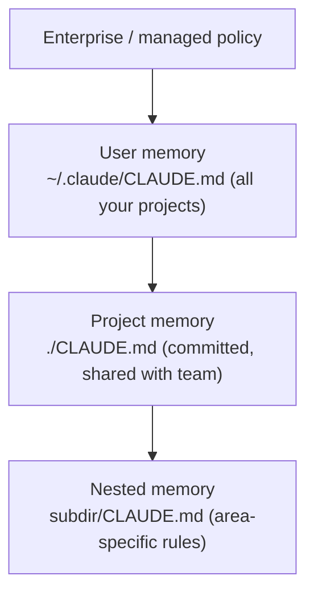

<LevelBadge level="beginner" />

<VerifyNote lastVerified="2026-06-20" source="https://code.claude.com/docs/en/memory">
मेमोरी फ़ाइल के स्थान और इम्पोर्ट सिंटैक्स बदल सकते हैं — आधिकारिक Claude Code मेमोरी डॉक्स में विशिष्ट बातों की पुष्टि करें।
</VerifyNote>

अगर आप [Claude Code](/docs/claude-code/what-is-claude-code) को बेहतर बनाने के लिए **एक** काम करें, तो यह करें। `CLAUDE.md` एक सादा-टेक्स्ट फ़ाइल है जिसे Claude हर सत्र की शुरुआत में पढ़ता है — आपके प्रोजेक्ट की स्थायी ब्रीफ़िंग।

<Callout type="objectives" items={["CLAUDE.md क्यों एकमात्र सबसे अधिक प्रभाव वाली Claude Code सेटिंग है", "मेमोरी पदानुक्रम कैसे वैश्विक से लेकर प्रोजेक्ट-विशिष्ट तक मर्ज होता है", "/init से एक शुरुआती फ़ाइल कैसे तैयार करें और उसे छोटा कैसे करें", "CLAUDE.md में क्या होना चाहिए — और क्या बाहर रखना चाहिए", "@imports आपको डॉक्स को डुप्लिकेट किए बिना उन्हें संदर्भित करने कैसे देते हैं"]} />

## यह सबसे अधिक प्रभाव वाली सेटिंग क्यों है

इसके बिना, आप हर सत्र में अपना प्रोजेक्ट दोबारा समझाते हैं ("हम pnpm उपयोग करते हैं, टेस्ट `__tests__` में हैं, `/generated` को मत छुएँ…")। इसके साथ, Claude पहले से ही जानता है। यहाँ अच्छे निर्देश एक ही बार में *हर* भविष्य की बातचीत को बेहतर बनाते हैं।

## मेमोरी पदानुक्रम

Claude Code कई स्थानों से मेमोरी पढ़ता है और उन्हें मर्ज करता है, मोटे तौर पर सबसे-वैश्विक से सबसे-विशिष्ट तक:

- **यूज़र मेमोरी** — हर प्रोजेक्ट में आपकी व्यक्तिगत प्राथमिकताएँ।
- **प्रोजेक्ट मेमोरी** (`./CLAUDE.md`, कमिट की गई) — *यह* रेपो कैसे काम करता है। आपकी टीम के साथ साझा।
- **नेस्टेड** — ऐसे नियमों के लिए किसी सबफ़ोल्डर में `CLAUDE.md` रखें जो केवल वहीं लागू होते हैं।

<Flashcards title="अपनी मेमोरी परतों को जानें" cards={[{front: "यूज़र मेमोरी", back: "~/.claude/CLAUDE.md — आपकी व्यक्तिगत प्राथमिकताएँ जो हर प्रोजेक्ट में लागू होती हैं।"}, {front: "प्रोजेक्ट मेमोरी", back: "./CLAUDE.md — कमिट की गई और टीम के साथ साझा; बताती है कि यह रेपो कैसे काम करता है।"}, {front: "नेस्टेड मेमोरी", back: "subdir/CLAUDE.md — क्षेत्र-विशिष्ट नियम जो केवल उसी सबफ़ोल्डर के अंदर लागू होते हैं।"}, {front: "Enterprise / managed policy", back: "सबसे वैश्विक परत; संगठन-स्तरीय नीति जो आपकी यूज़र मेमोरी से ऊपर बैठती है।"}]} />

## एक शुरुआती बिंदु तैयार करें

<Steps items={[{title: "प्रोजेक्ट में /init चलाएँ", body: "Claude कोड का निरीक्षण करता है और आपके लिए स्वचालित रूप से एक CLAUDE.md का मसौदा तैयार करता है।"}, {title: "इसे संपादित करके छोटा करें", body: "मसौदा एक शुरुआती बिंदु है, अंतिम पड़ाव नहीं। इसे उसी तक सीमित करें जो सत्य और उपयोगी है।"}, {title: "एक टेम्पलेट उधार लें", body: "CLAUDE.md टेम्पलेट्स पेज से तैयार स्टार्टर लें और इसे अपने रेपो के अनुसार अनुकूलित करें।"}]} />

<PromptCard title="एक CLAUDE.md मसौदा तैयार करें">{`/init`}</PromptCard>

[CLAUDE.md टेम्पलेट्स](/docs/templates/claude-md) से तैयार स्टार्टर लें।

## इसमें क्या डालें

- प्रोजेक्ट क्या है, दो वाक्यों में।
- टेक स्टैक और **रन / टेस्ट / लिंट** कैसे करें।
- ऐसे नियम जिनका Claude अनुमान नहीं लगा सकता (नामकरण, संरचना, कमिट शैली)।
- **सुरक्षा कवच**: "पूर्ण घोषित करने से पहले टेस्ट चलाएँ", "`/vendor` को कभी संपादित न करें", "सीक्रेट्स को कभी कमिट न करें"।

## इसमें क्या न डालें

<Callout type="warning" items={["Claude CLAUDE.md का अक्षरशः पालन करता है — बासी, अस्पष्ट, या इच्छाधारी निर्देश वास्तव में नुकसान पहुँचाते हैं।", "बताएँ कि प्रोजेक्ट आज वास्तव में कैसे काम करता है; छोटा और सत्य, लंबा और आकांक्षात्मक से बेहतर है।", "विशाल पेस्ट किए गए डॉक्स (इसके बजाय @imports उपयोग करें), सीक्रेट्स, और ऐसे नियम जिनका आप वास्तव में पालन नहीं करते, से बचें।", "इसकी समय-समय पर समीक्षा करें ताकि यह प्रोजेक्ट के विकसित होने के साथ सटीक बना रहे।"]} />

## इम्पोर्ट्स

मौजूदा डॉक्स को डुप्लिकेट करने के बजाय उन्हें खींचें — जैसे, अपनी स्टाइल गाइड को `@path/to/file` इम्पोर्ट के साथ संदर्भित करें ताकि सत्य का एक ही स्रोत रहे। सटीक सिंटैक्स के लिए [आधिकारिक मेमोरी डॉक्स](https://code.claude.com/docs/en/memory) देखें।

<Callout type="tip" items={["सत्य का एक ही स्रोत: किसी फ़ाइल की सामग्री को CLAUDE.md में पेस्ट करने के बजाय उसे @imports से संदर्भित करें।", "अगर कोई डॉक पहले से मौजूद है, तो उसे लिंक करें — उसे कॉपी न करें। कॉपियाँ समय के साथ पुरानी हो जाती हैं।"]} />

## स्वयं जाँचें

<Quiz title="स्वयं जाँचें" questions={[{q: "Claude Code आपके प्रोजेक्ट की स्थायी ब्रीफ़िंग के रूप में हर सत्र की शुरुआत में कौन-सी फ़ाइल पढ़ता है?", options: ["README.md", "CLAUDE.md", "package.json"], answer: 1, explain: "CLAUDE.md वह सादा-टेक्स्ट मेमोरी फ़ाइल है जिसे Claude हर सत्र की शुरुआत में पढ़ता है।"}, {q: "किसी प्रोजेक्ट में /init चलाने से क्या होता है?", options: ["यह CLAUDE.md को आपकी टीम के रेपो में कमिट करता है", "यह कोड का निरीक्षण करके एक CLAUDE.md का मसौदा तैयार करता है, जिसे फिर आप संपादित करके छोटा करते हैं", "यह बासी मेमोरी फ़ाइलों को हटा देता है"], answer: 1, explain: "/init कोड से एक शुरुआती CLAUDE.md का मसौदा तैयार करता है — मसौदा एक शुरुआती बिंदु है, इसलिए आप बाद में उसे संपादित करके छोटा करते हैं।"}, {q: "स्टाइल गाइड जैसे किसी बड़े मौजूदा डॉक को शामिल करने का अनुशंसित तरीका क्या है?", options: ["पूरे दस्तावेज़ को CLAUDE.md में पेस्ट करें", "इसे @path/to/file इम्पोर्ट के साथ संदर्भित करें", "इसे एक सीक्रेट के रूप में संग्रहीत करें"], answer: 1, explain: "@imports का उपयोग फ़ाइल की ओर इंगित करने के लिए करें ताकि एक डुप्लिकेट, पुरानी होती कॉपी के बजाय सत्य का एक ही स्रोत रहे।"}]} />

<Callout type="takeaways" items={["CLAUDE.md सबसे अधिक प्रभाव वाली सेटिंग है: यह एक ही बार में हर भविष्य के सत्र को बेहतर बनाती है।", "मेमोरी वैश्विक से विशिष्ट तक मर्ज होती है: enterprise policy, फिर यूज़र, प्रोजेक्ट, और नेस्टेड CLAUDE.md फ़ाइलें।", "/init से शुरू करें, फिर मसौदे को संपादित करके उसी तक सीमित करें जो वास्तव में सत्य है।", "प्रोजेक्ट सारांश, रन/टेस्ट/लिंट कमांड, परंपराएँ, और सुरक्षा कवच शामिल करें।", "इसे छोटा और सत्य रखें — बड़े डॉक्स के लिए @imports उपयोग करें, और सीक्रेट्स को कभी कमिट न करें।"]} />

## आगे

- [Plan Mode](/docs/claude-code/plan-mode) — सुरक्षित पहले बदलाव
- [अनुमतियाँ और मोड](/docs/claude-code/permissions) — Claude बिना निगरानी के क्या कर सकता है
- [वॉकथ्रू: एक वास्तविक रेपो के लिए Claude Code को कस्टमाइज़ करें](/docs/walkthroughs/customize-claude-code)
