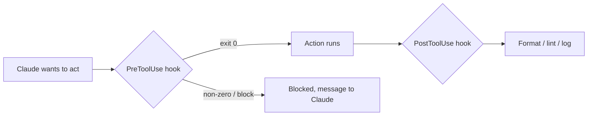

<LevelBadge level="advanced" />

<VerifyNote lastVerified="2026-06-23" source="https://code.claude.com/docs/en/hooks">
सटीक hook इवेंट नाम, stdin पेलोड, और blocking प्रोटोकॉल विकसित होते रहते हैं — किसी विशिष्ट इवेंट या फ़ील्ड पर निर्भर होने से पहले आधिकारिक hooks डॉक्स से पुष्टि कर लें।
</VerifyNote>

Hooks ऐसे **शेल कमांड हैं जिन्हें Claude Code अपने जीवनचक्र के परिभाषित बिंदुओं पर स्वचालित रूप से चलाता है**। जहाँ [permissions](/docs/claude-code/permissions) यह तय करती हैं कि कोई क्रिया अनुमत है *या नहीं*, वहीं hooks *आपको* उसके आसपास नियतात्मक तर्क चलाने देते हैं — फ़ॉर्मेटिंग, सत्यापन, लॉगिंग, गेट्स। यही वह तरीका है जिससे आप व्यवहार को "कृपया याद रखें" के बजाय गारंटीशुदा बनाते हैं।

<Callout type="objectives" items={["किसी निर्देश या permission के बजाय hook का सहारा कब लें", "एक hook कैसे जुड़ा होता है: इवेंट, matcher, और stdin पर JSON पेलोड", "एक hook किसी क्रिया को block करने के दो तरीके — exit code 2 बनाम stdout पर JSON", "वे अच्छी प्रथाएँ और आम गलतियाँ जो तेज़, सुरक्षित hooks को सुस्त, मौन hooks से अलग करती हैं"]} />

## hook का सहारा कब लें

किसी hook का सहारा तब लें जब आप चाहते हों कि कोई व्यवहार केवल अनुरोधित नहीं, बल्कि *गारंटीशुदा* हो। हर आम काम किसी लाइफ़साइकल इवेंट से मेल खाता है:

- हर फ़ाइल संपादन के बाद **ऑटो-फ़ॉर्मेट / lint** (`PostToolUse`)।
- किसी नियम का उल्लंघन करने वाली क्रिया को उसके चलने से पहले **block** करें (`PreToolUse`)।
- सत्र समाप्त होने या कोई कार्य पूरा होने पर **सूचित या लॉग करें** (`Stop`)।
- सत्र की शुरुआत में **संदर्भ इंजेक्ट करें**।

<Flashcards title="एक नज़र में hook इवेंट्स" cards={[{front: "PreToolUse", back: "किसी क्रिया के चलने से पहले ट्रिगर होता है। इसका उपयोग block या gate करने के लिए करें — उदाहरण के लिए किसी विनाशकारी कमांड को उसके चलने से पहले अस्वीकार करना।"}, {front: "PostToolUse", back: "किसी मिलान करने वाली क्रिया के बाद ट्रिगर होता है। इसका उपयोग अभी-अभी बदली हुई चीज़ को फ़ॉर्मेट, lint, या लॉग करने के लिए करें।"}, {front: "Stop", back: "जब कोई सत्र समाप्त होता है या कोई कार्य पूरा होता है तब ट्रिगर होता है। इसका उपयोग सूचित या लॉग करने के लिए करें।"}, {front: "सत्र की शुरुआत", back: "सत्र की शुरुआत में ट्रिगर होता है। इसका उपयोग संदर्भ इंजेक्ट करने के लिए करें।"}]} />

## ये कैसे काम करते हैं

आप [`settings.json`](/docs/claude-code/settings) में hooks रजिस्टर करते हैं, किसी **इवेंट** (और अक्सर एक tool matcher) से मिलान करते हुए। जब इवेंट ट्रिगर होता है, तो Claude आपका कमांड चलाता है और **stdin पर एक JSON पेलोड** पास करता है (tool का नाम, उसके इनपुट, सत्र)। आपके कमांड का exit code और आउटपुट तय करते हैं कि आगे क्या होगा।

<Steps items={[{title: "किसी इवेंट से मिलान करें", body: "जिस लाइफ़साइकल इवेंट की आपको परवाह है, उसके तहत settings.json में hook रजिस्टर करें — उदाहरण के लिए PostToolUse।"}, {title: "matcher से संकीर्ण करें", body: "एक tool matcher जोड़ें ताकि hook केवल प्रासंगिक tools पर ट्रिगर हो, उदा. फ़ाइल संपादनों के लिए matcher \"Edit|Write\"।"}, {title: "stdin से पेलोड पढ़ें", body: "जब इवेंट ट्रिगर होता है, तो Claude आपका कमांड चलाता है और stdin पर एक JSON पेलोड pipe करता है — tool का नाम, उसके इनपुट, सत्र।"}, {title: "तय करें कि आगे क्या होगा", body: "आपके कमांड का exit code और आउटपुट परिणाम तय करते हैं: क्रिया को आगे बढ़ने दें, अपना तर्क चलाएँ, या उसे block करें।"}]} />

```json
{
  "hooks": {
    "PostToolUse": [
      {
        "matcher": "Edit|Write",
        "hooks": [
          { "type": "command", "command": "jq -r '.tool_input.file_path' | xargs npx prettier --write" }
        ]
      }
    ]
  }
}
```

ऊपर दिया गया hook stdin JSON में से संपादित फ़ाइल का पथ (`.tool_input.file_path`) पढ़ता है और उसे फ़ॉर्मेट करता है। यह न मानें कि कोई env var पथ को रखता है — **इसे stdin से पढ़ें।** स्क्रिप्ट्स को खोजने के लिए `${CLAUDE_PROJECT_DIR}` जैसे उपयोगी पथ प्लेसहोल्डर्स *उपलब्ध हैं*।

## hook कैसे block करता है

इवेंट के आधार पर दो तरीके हैं:

- **Exit code 2** — hook क्रिया को विफल कर देता है और जो कुछ भी उसने **stderr** पर लिखा है वह Claude को दिखने वाला संदेश बन जाता है। सरल है और कमांड hooks के लिए काम करता है।
- **stdout पर JSON (exit 0)** — एक संरचित निर्णय लौटाएँ। `PreToolUse` के लिए, यह `deny` का एक `permissionDecision` होता है; `PostToolUse`/`Stop`/इत्यादि के लिए यह `{"decision": "block", "reason": "…"}` होता है।

नीचे दी गई स्क्रिप्ट Bash tool पर एक `PreToolUse` hook है। इसे ऊपर से नीचे पढ़ें: यह stdin से कमांड निकालती है, और यदि वह विनाशकारी दिखती है, तो stderr पर एक कारण लिखती है और block करने के लिए exit 2 करती है।

```bash
#!/usr/bin/env bash
# PreToolUse hook on the Bash tool: refuse to delete things.
command=$(jq -r '.tool_input.command' < /dev/stdin)
if [[ "$command" == rm\ * || "$command" == *"rm -rf"* ]]; then
  echo "Blocked: destructive 'rm' is not allowed by policy." >&2
  exit 2
fi
exit 0
```

## मानसिक मॉडल

एक `PreToolUse` hook क्रिया से *पहले* चलता है और उसे block कर सकता है; एक `PostToolUse` hook उसके सफल होने के *बाद* चलता है और परिणाम पर प्रतिक्रिया देता है।



## अच्छी प्रथाएँ

- **hooks को तेज़ और idempotent रखें** — ये बहुत बार चलते हैं।
- **वास्तविक समस्याओं पर ज़ोर-शोर से विफल हों**, लेकिन सतही मुद्दों पर block न करें।
- **hook आउटपुट को Claude के लिए फ़ीडबैक मानें** — एक स्पष्ट संदेश इसे स्वयं सुधार करने में मदद करता है।
- hooks आपके शेल के विशेषाधिकारों के साथ चलते हैं — किसी भी ऐसे hook की समीक्षा करें जिसे आपने नहीं लिखा ([तृतीय-पक्ष कोड की समीक्षा करना](/docs/security/reviewing-third-party-code))।

## आम गलतियाँ

- **फ़ाइल पथ को किसी env var से पढ़ना।** पथ stdin JSON (`.tool_input.file_path`) में रहता है, `$CLAUDE_FILE_PATH` में नहीं। stdin को `jq` के माध्यम से pipe करें।
- **मौन blocks।** यदि कोई `PreToolUse` hook stderr पर कुछ भी लिखे बिना exit 2 करता है, तो Claude block हो जाता है पर उसे *कारण* पता नहीं चलता और वह अनुकूलन नहीं कर सकता। हमेशा एक स्पष्ट कारण लिखें।
- **धीमे hooks।** कोई `PostToolUse` hook *हर* मिलान करने वाले संपादन के बाद चलता है। 3-सेकंड का linter पूरे सत्र को सुस्त महसूस कराता है — hooks को तेज़ रखें और, आदर्श रूप से, केवल उसी पर कार्य करें जो बदला है।
- **अति-व्यापक matchers।** `matcher: ".*"` हर tool पर ट्रिगर होता है। एक सटीक नाम, एक `Edit|Write` सूची, या प्रति-handler `if` फ़ील्ड (उदाहरण के लिए `"if": "Bash(git push *)"`) के साथ इसे संकीर्ण करें।
- **उन hooks पर भरोसा करना जिन्हें आपने नहीं लिखा।** एक hook आपके विशेषाधिकारों के साथ मनमाना शेल चलाता है। किसी plugin या template से आए किसी भी hook की पहले समीक्षा करें — देखें [तृतीय-पक्ष कोड की समीक्षा करना](/docs/security/reviewing-third-party-code)।

<Callout type="warning" items={["एक hook आपके विशेषाधिकारों के साथ मनमाना शेल चलाता है — किसी plugin या template से आए किसी hook को पहले पढ़े बिना कभी न जोड़ें।"]} />

कॉपी-पेस्ट स्टार्टर्स [Hooks & settings.json Recipes](/docs/templates/hooks-settings) में हैं।

<PromptCard title="संपादित फ़ाइलों को ऑटो-फ़ॉर्मेट करें (Edit|Write पर PostToolUse)">{`{
  "hooks": {
    "PostToolUse": [
      {
        "matcher": "Edit|Write",
        "hooks": [
          { "type": "command", "command": "jq -r '.tool_input.file_path' | xargs npx prettier --write" }
        ]
      }
    ]
  }
}`}</PromptCard>

<Quiz title="खुद को परखें" questions={[{q: "जो फ़ाइल अभी-अभी संपादित हुई है, उसका पथ hook कहाँ पाता है?", options: ["$CLAUDE_FILE_PATH एनवायरनमेंट वेरिएबल में", "stdin पर JSON पेलोड में, .tool_input.file_path पर", "Claude द्वारा पास किए गए एक कमांड-लाइन आर्ग्युमेंट में"], answer: 1, explain: "पथ stdin JSON (.tool_input.file_path) में रहता है, किसी env var में नहीं। इसे पढ़ने के लिए stdin को jq के माध्यम से pipe करें।"}, {q: "एक PreToolUse hook code 2 के साथ बाहर निकलता है। क्या होता है?", options: ["क्रिया अनुमत हो जाती है और stdout लॉग हो जाता है", "क्रिया block हो जाती है, और hook ने stderr पर जो कुछ भी लिखा है वह Claude को दिखने वाला संदेश बन जाता है", "Claude परिणाम की अनदेखी कर देता है क्योंकि exit 2 आरक्षित है"], answer: 1, explain: "Exit code 2 क्रिया को विफल कर देता है; stderr Claude को दिखने वाला संदेश बन जाता है। हमेशा एक स्पष्ट कारण लिखें ताकि Claude अनुकूलन कर सके।"}, {q: "matcher \".*\" को एक आम गलती क्यों माना जाता है?", options: ["यह अमान्य JSON है और settings.json को तोड़ देता है", "यह हर tool पर ट्रिगर होता है, इसलिए hook इरादे से कहीं अधिक चलता है — इसे एक सटीक नाम, एक Edit|Write सूची, या if फ़ील्ड के साथ संकीर्ण करें", "यह केवल Bash tool से मिलान करता है"], answer: 1, explain: "एक अति-व्यापक matcher हर tool पर ट्रिगर होता है। hooks को तेज़ और लक्षित रखने के लिए इसे संकीर्ण करें।"}]} />

<Callout type="takeaways" items={["Hooks व्यवहार को अनुरोधित नहीं, बल्कि गारंटीशुदा बनाते हैं — वे उन क्रियाओं के आसपास नियतात्मक तर्क चलाते हैं जिन्हें permissions केवल अनुमत या अस्वीकार करती हैं।", "किसी इवेंट और एक matcher के विरुद्ध settings.json में एक hook रजिस्टर करें; Claude stdin पर एक JSON पेलोड pipe करता है और आपके exit code तथा आउटपुट को पढ़ता है।", "फ़ाइल पथ stdin से पढ़ें (.tool_input.file_path) — किसी env var से नहीं।", "exit code 2 (stderr संदेश बन जाता है) या stdout पर संरचित JSON (exit 0) के साथ block करें; हमेशा एक स्पष्ट कारण शामिल करें।", "hooks को तेज़, idempotent, और संकीर्ण रूप से मिलान किया हुआ रखें — और किसी भी ऐसे hook की समीक्षा करें जिसे आपने नहीं लिखा, क्योंकि वह आपके शेल के विशेषाधिकारों के साथ चलता है।"]} />

## आगे

- [settings.json](/docs/claude-code/settings) · [Permissions](/docs/claude-code/permissions)
- [Skills](/docs/claude-code/skills) — विशेषज्ञता बनाम स्वचालन
- [Hardening Autonomous Runs](/docs/security/hardening-autonomous-runs)
