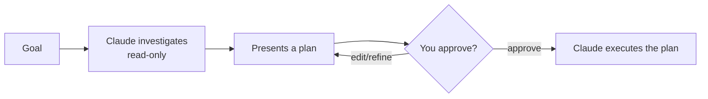

<LevelBadge level="beginner" />

<Callout type="objectives" items={["समझाएँ कि Plan Mode क्या करता है और यह केवल-पठन क्यों है", "तय करें कि कब पहले योजना बनानी है और कब आप इसे छोड़ सकते हैं", "जाँच-प्रस्ताव-मंज़ूरी-निष्पादन लूप से गुज़रें", "Plan Mode और अनुमतियों को अलग पहचानें और उन्हें साथ में इस्तेमाल करें"]} />

<VerifyNote lastVerified="2026-06-20" source="https://code.claude.com/docs/en">
आप Plan Mode में कैसे प्रवेश करते हैं (शॉर्टकट/फ़्लैग) यह रिलीज़ के बीच बदल सकता है — आधिकारिक Claude Code डॉक्स देखें।
</VerifyNote>

## मूल विचार

कल्पना कीजिए कि आप किसी ठेकेदार को अपने घर की चाबियाँ सौंप रहे हैं, बनाम पहले उससे यह कहना कि वह पूरे घर में घूमकर लिखे कि वह *क्या* बदलेगा। Plan Mode वही घूम कर देखना है।

**Plan Mode** Claude Code को **केवल-पठन** बना देता है: यह आपके कोडबेस का अन्वेषण कर सकता है, खोज चला सकता है, और तर्क कर सकता है — लेकिन यह **फ़ाइलों को संपादित नहीं करेगा या स्थिति-बदलने वाले कमांड नहीं चलाएगा**। इसके बजाय यह एक योजना तैयार करता है और आपकी मंज़ूरी की प्रतीक्षा करता है।

<Callout type="tip" items={["केवल-पठन का मतलब है कि Claude सोचता है पर कार्य नहीं करता — जब तक आप आगे बढ़ने को न कहें, कोई फ़ाइल संपादन नहीं, कोई स्थिति-बदलने वाला कमांड नहीं।"]} />

## यह शुरू करने का सबसे सुरक्षित तरीका क्यों है

किसी भी बड़ी, जोखिम भरी, या अपरिचित चीज़ के लिए, आप यह देखना चाहते हैं कि Claude *क्या* करने का इरादा रखता है, इससे पहले कि वह आपके रेपो को छुए। Plan Mode **सोचने** को **करने** से अलग करता है:

इसका फ़ायदा: आप गलत धारणाओं को *उससे पहले* पकड़ लेते हैं जब वे गलत कोड बन जाएँ।

## इसका उपयोग कब करें

<Callout type="tip" items={["बड़े या बहु-फ़ाइल बदलावों, माइग्रेशन, या रिफ़ैक्टर के लिए हमेशा", "जब किसी ऐसे कोडबेस में काम कर रहे हों जिसे आप अभी पूरी तरह नहीं जानते", "जब आप किसी सहकर्मी के साथ साझा करने के लिए एक समीक्षा योग्य योजना चाहते हैं"]} />

छोटे, स्पष्ट संपादनों के लिए आप इसे छोड़ सकते हैं — लेकिन संदेह होने पर, पहले योजना बनाएँ।

## व्यवहार में यह कैसे काम करता है

लूप का पालन करें। हर चरण अगले को अर्जित करता है — Claude केवल आपके अनुमोदन के *बाद* ही संपादन पर स्विच करता है।

<Steps items={[{title: "Plan Mode में प्रवेश करें और अपना लक्ष्य बताएँ", body: "केवल-पठन मोड में स्विच करें, फिर बताएँ कि आप क्या हासिल करना चाहते हैं।"}, {title: "Claude जाँच करता है", body: "यह संबंधित फ़ाइलें पढ़ता है और स्पष्ट करने वाले प्रश्न पूछता है।"}, {title: "Claude एक चरण-दर-चरण योजना लौटाता है", body: "बदलने योग्य फ़ाइलें, दृष्टिकोण, और परिणाम को कैसे सत्यापित करें।"}, {title: "आप अनुमोदित या परिष्कृत करते हैं", body: "केवल अनुमोदन के बाद ही Claude बदलाव करने पर स्विच करता है।"}]} />

### इसे स्वयं आज़माएँ

इसे एक वास्तविक योजना सत्र में कॉपी करें और लूप को चलते हुए देखें:

<PromptCard title="एक योजना सत्र शुरू करें">{`I want to migrate our auth from sessions to JWT. Stay in Plan Mode: investigate the current setup, ask anything you need, then propose a step-by-step plan with files to change and how to verify — don't edit anything yet.`}</PromptCard>

:::tip इसे CLAUDE.md के साथ जोड़ें
एक अच्छा [CLAUDE.md](/docs/claude-code/claude-md) योजनाओं को तेज़ बनाता है — Claude आपकी परंपराओं और सुरक्षा कवच को पहले से ध्यान में रखकर योजना बनाता है।
:::

## Plan Mode बनाम अनुमतियाँ

एक क्लासिक गड़बड़ी। ये अलग-अलग समस्याएँ हल करते हैं और साथ मिलकर काम करते हैं:

- **Plan Mode** = "जाँच करो और प्रस्ताव दो, अभी कार्य मत करो।" (यह पृष्ठ।)
- **[अनुमतियाँ](/docs/claude-code/permissions)** = एक बार कार्य करने पर, *कौन सी* क्रियाएँ बिना पूछे अनुमत हैं।

इसे इस तरह सोचें: **अभी कार्य करना है या नहीं** (Plan Mode) बनाम **एक बार कार्य करने पर कौन सी क्रियाएँ अनुमत हैं** (अनुमतियाँ)।

<Flashcards cards={[{front: "Plan Mode, Claude Code को किस स्थिति में रखता है?", back: "केवल-पठन — यह अन्वेषण कर सकता है, खोज सकता है, और तर्क कर सकता है, लेकिन आपके अनुमोदन तक फ़ाइलों को संपादित नहीं करेगा या स्थिति-बदलने वाले कमांड नहीं चलाएगा।"}, {front: "Plan Mode का लूप क्या है?", back: "जाँच (केवल-पठन) → एक योजना प्रस्तुत करें → आप अनुमोदित या परिष्कृत करते हैं → Claude निष्पादित करता है।"}, {front: "आपको Plan Mode का सहारा कब लेना चाहिए?", back: "बड़े, जोखिम भरे, या अपरिचित काम के लिए डिफ़ॉल्ट रूप से (बहु-फ़ाइल बदलाव, माइग्रेशन, रिफ़ैक्टर, अज्ञात कोडबेस)। केवल छोटे, स्पष्ट संपादन छोड़ें।"}, {front: "Plan Mode बनाम अनुमतियाँ?", back: "Plan Mode तय करता है कि अभी कार्य करना है या नहीं; अनुमतियाँ तय करती हैं कि एक बार कार्य करने पर कौन सी क्रियाएँ अनुमत हैं।"}]} />

<Callout type="takeaways" items={["Plan Mode केवल-पठन है: Claude अन्वेषण करता है और प्रस्ताव देता है पर आपके अनुमोदन तक कभी संपादित नहीं करता या स्थिति-बदलने वाले कमांड नहीं चलाता", "बड़े, जोखिम भरे, या अपरिचित काम के लिए इसे डिफ़ॉल्ट रूप से इस्तेमाल करें; केवल छोटे स्पष्ट संपादन छोड़ें", "लूप है जाँच से प्रस्ताव से अनुमोदन/परिष्करण से निष्पादन", "Plan Mode तय करता है कि अभी कार्य करना है या नहीं; अनुमतियाँ तय करती हैं कि एक बार कार्य करने पर कौन सी क्रियाएँ अनुमत हैं"]} />

<Quiz title="स्वयं को जाँचें" questions={[{q: "Plan Mode में रहते हुए Claude Code क्या कर सकता है?", options: ["फ़ाइलें संपादित करना और कोई भी कमांड चलाना", "अन्वेषण, खोज, और तर्क करना — लेकिन फ़ाइलें संपादित नहीं करना या स्थिति-बदलने वाले कमांड नहीं चलाना", "केवल प्रश्नों का उत्तर देना, बिना किसी फ़ाइल पहुँच के"], answer: 1, explain: "Plan Mode केवल-पठन है: Claude कोडबेस का अन्वेषण कर सकता है, खोज चला सकता है, और तर्क कर सकता है, लेकिन यह फ़ाइलों को संपादित नहीं करेगा या स्थिति-बदलने वाले कमांड नहीं चलाएगा।"}, {q: "आपको Plan Mode का सहारा कब लेना चाहिए?", options: ["केवल एक-पंक्ति वाली टाइपो ठीक करने के लिए", "बड़े या बहु-फ़ाइल बदलावों, माइग्रेशन, रिफ़ैक्टर, या अपरिचित कोडबेस के लिए", "कभी नहीं — यह बस आपको धीमा करता है"], answer: 1, explain: "बड़े या बहु-फ़ाइल बदलावों, माइग्रेशन, या रिफ़ैक्टर के लिए इसे हमेशा इस्तेमाल करें, और जब किसी ऐसे कोडबेस में काम कर रहे हों जिसे आप अभी पूरी तरह नहीं जानते। छोटे स्पष्ट संपादन इसे छोड़ सकते हैं।"}, {q: "Plan Mode लूप का सही क्रम क्या है?", options: ["निष्पादित करें, फिर जाँच करें, फिर अनुमोदित करें", "जाँच (केवल-पठन), एक योजना प्रस्तुत करें, आप अनुमोदित या परिष्कृत करते हैं, फिर Claude निष्पादित करता है", "पहले अनुमोदित करें, फिर Claude जाँच करता है और संपादित करता है"], answer: 1, explain: "Claude केवल-पठन जाँच करता है, एक योजना प्रस्तुत करता है, आप अनुमोदित या परिष्कृत करते हैं, और तभी यह योजना को निष्पादित करने पर स्विच करता है।"}, {q: "Plan Mode और अनुमतियाँ कैसे भिन्न हैं?", options: ["ये एक ही फ़ीचर के दो नाम हैं", "Plan Mode = जाँच करो और प्रस्ताव दो, अभी कार्य मत करो; अनुमतियाँ = एक बार कार्य करने पर, कौन सी क्रियाएँ बिना पूछे अनुमत हैं", "अनुमतियाँ तय करती हैं कि योजना बनानी है या नहीं; Plan Mode तय करता है कि कौन सी फ़ाइलें संपादित करनी हैं"], answer: 1, explain: "Plan Mode सोचने को करने से अलग करता है। अनुमतियाँ नियंत्रित करती हैं कि एक बार Claude के कार्य करने पर कौन सी क्रियाएँ बिना पूछे अनुमत हैं। ये साथ मिलकर काम करते हैं।"}]} />

## आगे

- [अनुमतियाँ और अनुमति मोड](/docs/claude-code/permissions)
- [संदर्भ प्रबंधन](/docs/claude-code/context-management) — लंबे सत्रों को प्रभावी रखें
- [वॉकथ्रू: एक वास्तविक रेपो के लिए Claude Code को कस्टमाइज़ करें](/docs/walkthroughs/customize-claude-code)
